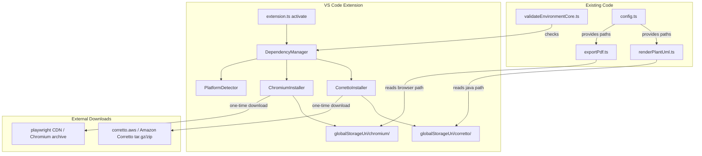
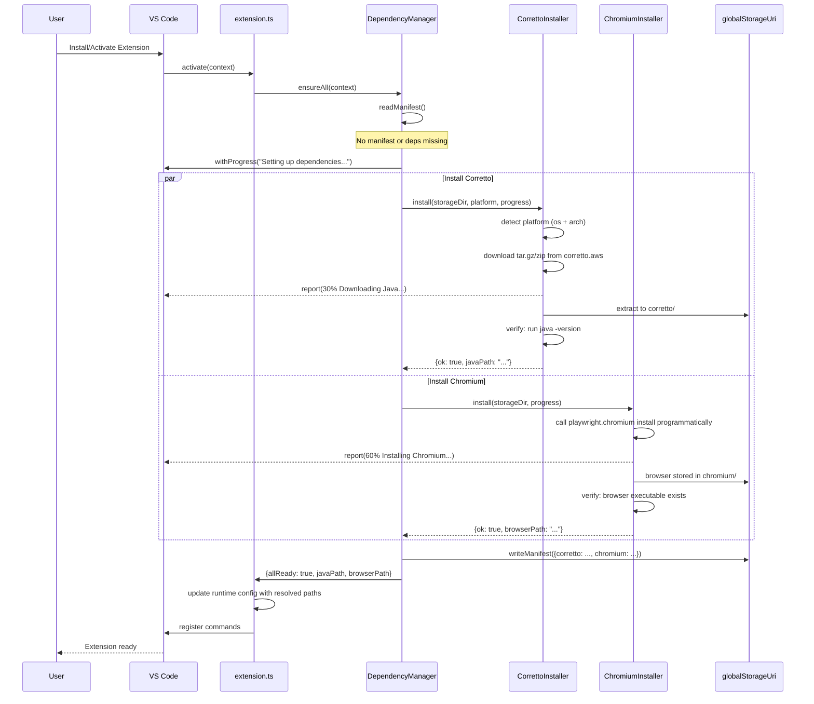
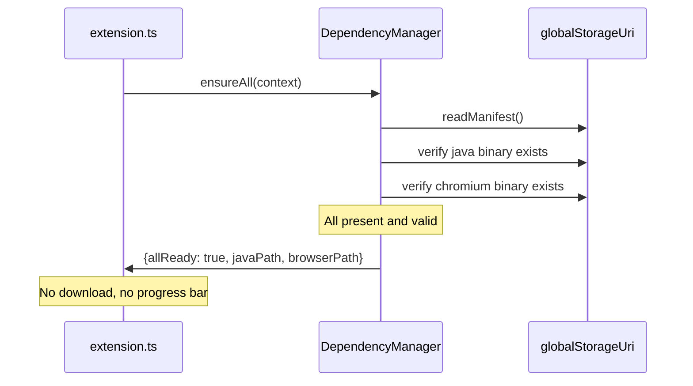

# Design Document: Auto Dependency Setup

## Overview

Markdown Studio requires two external runtime dependencies that users currently install manually: a Java runtime (for PlantUML rendering via the bundled JAR) and a Chromium browser (for Playwright-based PDF export). This feature eliminates that friction by automatically downloading and configuring both dependencies on first activation.

The system downloads Amazon Corretto (AWS's commercially-licensed OpenJDK) and Playwright's Chromium browser into the extension's `globalStorageUri` directory, which persists across extension updates. All downloads are platform-aware (macOS arm64/x64, Linux x64, Windows x64), idempotent (skip if already present and valid), and fully local — no external API calls at runtime, only HTTPS downloads from official distribution endpoints during setup.

A `DependencyManager` orchestrates the process, delegating to per-dependency installers (`CorrettoInstaller`, `ChromiumInstaller`). Setup runs automatically during `activate()` with a VS Code progress notification, and can also be triggered manually via a new command. The existing `validateEnvironment` command is updated to check managed dependencies.

## Architecture



## Sequence Diagrams

### First Activation (Dependencies Missing)



### Subsequent Activation (Dependencies Present)



## Components and Interfaces

### Component 1: PlatformDetector

**Purpose**: Detects the current OS and architecture to select the correct download artifact.

```typescript
interface PlatformInfo {
  os: "darwin" | "linux" | "win32";
  arch: "x64" | "arm64";
  archiveExt: "tar.gz" | "zip";
}

function detectPlatform(): PlatformInfo;
```

**Responsibilities**:
- Map `process.platform` and `process.arch` to supported combinations
- Throw a clear error for unsupported platforms (e.g., Linux arm64)

### Component 2: CorrettoInstaller

**Purpose**: Downloads and extracts Amazon Corretto JDK into the extension's storage directory.

```typescript
interface InstallerResult {
  ok: boolean;
  path?: string;       // absolute path to the java binary
  error?: string;
}

interface CorrettoInstaller {
  install(
    storageDir: string,
    platform: PlatformInfo,
    progress: (message: string, increment: number) => void
  ): Promise<InstallerResult>;

  verify(storageDir: string): Promise<InstallerResult>;

  getJavaPath(storageDir: string): string;
}
```

**Responsibilities**:
- Build the correct Corretto download URL for the detected platform
- Download the archive via Node.js `https` (no external dependencies)
- Extract tar.gz (macOS/Linux) or zip (Windows) into `storageDir/corretto/`
- Verify the extracted `java` binary runs (`java -version`)
- Return the absolute path to the `java` executable

### Component 3: ChromiumInstaller

**Purpose**: Installs Playwright's Chromium browser into the extension's storage directory.

```typescript
interface ChromiumInstaller {
  install(
    storageDir: string,
    progress: (message: string, increment: number) => void
  ): Promise<InstallerResult>;

  verify(storageDir: string): Promise<InstallerResult>;

  getBrowserPath(storageDir: string): string;
}
```

**Responsibilities**:
- Set `PLAYWRIGHT_BROWSERS_PATH` env var to `storageDir/chromium/`
- Run Playwright's programmatic browser install API
- Verify the Chromium executable exists after install
- Return the path for Playwright's `chromium.launch({ executablePath })` usage

### Component 4: DependencyManager

**Purpose**: Orchestrates all dependency installers, manages the manifest, and provides a single entry point for the extension.

```typescript
interface DependencyManifest {
  version: number;                    // manifest schema version
  corretto?: {
    installedAt: string;              // ISO timestamp
    javaPath: string;                 // absolute path to java binary
    correttoVersion: string;          // e.g. "21.0.4.7.1"
  };
  chromium?: {
    installedAt: string;
    browserPath: string;              // absolute path to chromium
    playwrightVersion: string;        // e.g. "1.53.0"
  };
}

interface DependencyStatus {
  allReady: boolean;
  javaPath?: string;
  browserPath?: string;
  errors: string[];
}

interface DependencyManager {
  ensureAll(context: vscode.ExtensionContext): Promise<DependencyStatus>;
  getStatus(context: vscode.ExtensionContext): Promise<DependencyStatus>;
  reinstall(context: vscode.ExtensionContext): Promise<DependencyStatus>;
}
```

**Responsibilities**:
- Read/write the dependency manifest from `globalStorageUri/manifest.json`
- On `ensureAll()`: check manifest, verify binaries exist, install missing ones
- Show `vscode.window.withProgress` during installation
- Update `markdownStudio.java.path` setting to point to managed Corretto
- Provide `getStatus()` for the validate environment command
- Provide `reinstall()` for force-reinstall scenarios

## Data Models

### DependencyManifest

```typescript
interface DependencyManifest {
  version: 1;
  corretto?: {
    installedAt: string;
    javaPath: string;
    correttoVersion: string;
    platform: string;           // e.g. "darwin-arm64"
  };
  chromium?: {
    installedAt: string;
    browserPath: string;
    playwrightVersion: string;
  };
}
```

**Validation Rules**:
- `version` must be `1` (future-proofing for schema migrations)
- `javaPath` and `browserPath` must be absolute paths
- `installedAt` must be valid ISO 8601 timestamp
- If manifest exists but binary is missing on disk, treat as not installed

### PlatformInfo

```typescript
interface PlatformInfo {
  os: "darwin" | "linux" | "win32";
  arch: "x64" | "arm64";
  archiveExt: "tar.gz" | "zip";
}
```

**Validation Rules**:
- Only these OS/arch combinations are supported: darwin-arm64, darwin-x64, linux-x64, win32-x64
- `archiveExt` is `"zip"` for win32, `"tar.gz"` for darwin and linux

### Corretto Download URL Pattern

```typescript
// Amazon Corretto 21 download URLs follow this pattern:
// https://corretto.aws/downloads/latest/amazon-corretto-21-{platform}-{format}
// Examples:
//   macOS arm64: amazon-corretto-21-aarch64-macos-jdk.tar.gz
//   macOS x64:   amazon-corretto-21-x64-macos-jdk.tar.gz
//   Linux x64:   amazon-corretto-21-x64-linux-jdk.tar.gz
//   Windows x64: amazon-corretto-21-x64-windows-jdk.zip

type CorrettoUrlMap = Record<string, string>;
```

## Algorithmic Pseudocode

### Main Setup Algorithm

```typescript
async function ensureAllDependencies(
  context: vscode.ExtensionContext
): Promise<DependencyStatus> {
  const storageDir = context.globalStorageUri.fsPath;
  await fs.mkdir(storageDir, { recursive: true });

  const manifest = await readManifest(storageDir);
  const platform = detectPlatform();
  const errors: string[] = [];

  // Check what needs installing
  const needsCorretto = !manifest.corretto
    || !await fileExists(manifest.corretto.javaPath);
  const needsChromium = !manifest.chromium
    || !await fileExists(manifest.chromium.browserPath);

  if (!needsCorretto && !needsChromium) {
    return {
      allReady: true,
      javaPath: manifest.corretto!.javaPath,
      browserPath: manifest.chromium!.browserPath,
      errors: []
    };
  }

  // Show progress UI only when work is needed
  return vscode.window.withProgress(
    {
      location: vscode.ProgressLocation.Notification,
      title: "Markdown Studio: Setting up dependencies",
      cancellable: false
    },
    async (progress) => {
      if (needsCorretto) {
        progress.report({ message: "Downloading Amazon Corretto JDK..." });
        const result = await correttoInstaller.install(
          storageDir, platform,
          (msg, inc) => progress.report({ message: msg, increment: inc })
        );
        if (result.ok) {
          manifest.corretto = {
            installedAt: new Date().toISOString(),
            javaPath: result.path!,
            correttoVersion: CORRETTO_VERSION,
            platform: `${platform.os}-${platform.arch}`
          };
        } else {
          errors.push(`Corretto: ${result.error}`);
        }
      }

      if (needsChromium) {
        progress.report({ message: "Installing Chromium browser..." });
        const result = await chromiumInstaller.install(
          storageDir,
          (msg, inc) => progress.report({ message: msg, increment: inc })
        );
        if (result.ok) {
          manifest.chromium = {
            installedAt: new Date().toISOString(),
            browserPath: result.path!,
            playwrightVersion: PLAYWRIGHT_VERSION
          };
        } else {
          errors.push(`Chromium: ${result.error}`);
        }
      }

      await writeManifest(storageDir, manifest);

      return {
        allReady: errors.length === 0,
        javaPath: manifest.corretto?.javaPath,
        browserPath: manifest.chromium?.browserPath,
        errors
      };
    }
  );
}
```

**Preconditions:**
- `context.globalStorageUri` is available and writable
- Network access is available for first-time downloads
- Sufficient disk space (~300MB for Corretto + ~300MB for Chromium)

**Postconditions:**
- If successful: both `javaPath` and `browserPath` point to valid executables
- `manifest.json` is written to `globalStorageUri` reflecting installed state
- If any install fails: `errors` array contains descriptive messages, partial installs are recorded

### Corretto Download & Extract Algorithm

```typescript
async function installCorretto(
  storageDir: string,
  platform: PlatformInfo,
  progress: (msg: string, inc: number) => void
): Promise<InstallerResult> {
  const targetDir = path.join(storageDir, "corretto");
  const url = buildCorrettoUrl(platform);
  const archivePath = path.join(storageDir, `corretto-download.${platform.archiveExt}`);

  // Step 1: Download
  progress("Downloading Amazon Corretto JDK...", 10);
  await downloadFile(url, archivePath);

  // Step 2: Extract
  progress("Extracting JDK...", 20);
  await fs.rm(targetDir, { recursive: true, force: true });
  await fs.mkdir(targetDir, { recursive: true });

  if (platform.os === "win32") {
    await extractZip(archivePath, targetDir);
  } else {
    await extractTarGz(archivePath, targetDir);
  }

  // Step 3: Locate java binary within extracted directory
  // Corretto extracts to a versioned subdirectory
  const javaPath = await findJavaBinary(targetDir, platform);

  // Step 4: Verify
  progress("Verifying Java installation...", 5);
  const verification = await runProcess(javaPath, ["-version"], 10000);
  if (verification.exitCode !== 0
      && !verification.stderr.toLowerCase().includes("version")) {
    return { ok: false, error: "Java verification failed after extraction" };
  }

  // Step 5: Cleanup archive
  await fs.unlink(archivePath).catch(() => {});

  return { ok: true, path: javaPath };
}
```

**Preconditions:**
- `storageDir` exists and is writable
- `platform` is a supported combination
- Network is reachable to `corretto.aws`

**Postconditions:**
- `corretto/` directory contains extracted JDK
- Returned `path` points to a working `java` binary
- Download archive is cleaned up

**Loop Invariants:** N/A (no loops; sequential pipeline)

### Chromium Install Algorithm

```typescript
async function installChromium(
  storageDir: string,
  progress: (msg: string, inc: number) => void
): Promise<InstallerResult> {
  const browsersDir = path.join(storageDir, "chromium");
  await fs.mkdir(browsersDir, { recursive: true });

  // Step 1: Set Playwright env to use our storage directory
  process.env.PLAYWRIGHT_BROWSERS_PATH = browsersDir;

  // Step 2: Use Playwright's registry API to install Chromium
  progress("Installing Chromium browser...", 20);
  try {
    // Playwright exposes a programmatic install API
    const { installBrowsersForNpmPackages } =
      await import("playwright-core/lib/server");
    await installBrowsersForNpmPackages(["playwright"]);
  } catch {
    // Fallback: use CLI-based install
    const result = await runProcess(
      process.execPath,
      [
        require.resolve("playwright/cli"),
        "install", "chromium"
      ],
      120000,  // 2 minute timeout for browser download
    );
    if (result.exitCode !== 0) {
      return { ok: false, error: `Chromium install failed: ${result.stderr}` };
    }
  }

  // Step 3: Verify browser executable exists
  progress("Verifying Chromium installation...", 5);
  const { chromium } = await import("playwright");
  try {
    const browser = await chromium.launch({ headless: true });
    await browser.close();
    return { ok: true, path: browsersDir };
  } catch (err) {
    return { ok: false, error: `Chromium verification failed: ${err}` };
  }
}
```

**Preconditions:**
- `storageDir` exists and is writable
- `playwright` package is available in extension's `node_modules`
- Sufficient disk space (~300MB)

**Postconditions:**
- Chromium browser is installed in `storageDir/chromium/`
- `PLAYWRIGHT_BROWSERS_PATH` env var is set for this process
- Browser can be launched headlessly

### Platform Detection Algorithm

```typescript
function detectPlatform(): PlatformInfo {
  const os = process.platform;   // "darwin" | "linux" | "win32"
  const arch = process.arch;     // "x64" | "arm64"

  const supported: Record<string, string[]> = {
    darwin: ["x64", "arm64"],
    linux:  ["x64"],
    win32:  ["x64"]
  };

  if (!supported[os]?.includes(arch)) {
    throw new Error(
      `Unsupported platform: ${os}-${arch}. ` +
      `Supported: ${Object.entries(supported)
        .flatMap(([o, archs]) => archs.map(a => `${o}-${a}`))
        .join(", ")}`
    );
  }

  return {
    os: os as PlatformInfo["os"],
    arch: arch as PlatformInfo["arch"],
    archiveExt: os === "win32" ? "zip" : "tar.gz"
  };
}
```

**Preconditions:**
- `process.platform` and `process.arch` are available

**Postconditions:**
- Returns valid `PlatformInfo` for supported platforms
- Throws descriptive error for unsupported platforms

## Key Functions with Formal Specifications

### `DependencyManager.ensureAll()`

```typescript
async function ensureAll(
  context: vscode.ExtensionContext
): Promise<DependencyStatus>
```

**Preconditions:**
- `context.globalStorageUri` is defined and the directory is writable
- Extension has been activated by VS Code

**Postconditions:**
- If `allReady === true`: `javaPath` and `browserPath` are non-null and point to valid executables on disk
- If `allReady === false`: `errors` is non-empty with descriptive messages
- `manifest.json` in `globalStorageUri` reflects the current state
- Idempotent: calling twice with no changes produces the same result without re-downloading

### `downloadFile()`

```typescript
async function downloadFile(url: string, destPath: string): Promise<void>
```

**Preconditions:**
- `url` is a valid HTTPS URL
- Parent directory of `destPath` exists
- Network is reachable

**Postconditions:**
- File at `destPath` contains the complete downloaded content
- HTTP redirects (301, 302) are followed (Corretto URLs redirect)
- Throws on HTTP errors (4xx, 5xx) or network failures

### `findJavaBinary()`

```typescript
async function findJavaBinary(
  extractDir: string,
  platform: PlatformInfo
): Promise<string>
```

**Preconditions:**
- `extractDir` contains an extracted Corretto JDK
- Corretto extracts into a single versioned subdirectory

**Postconditions:**
- Returns absolute path to `java` (or `java.exe` on Windows)
- Path points to an existing file
- On macOS: path is inside `Contents/Home/bin/` (Corretto macOS layout)
- On Linux/Windows: path is inside `bin/`

## Example Usage

### Extension Activation with Auto-Setup

```typescript
// src/extension.ts (updated)
import * as vscode from "vscode";
import { DependencyManager } from "./deps/dependencyManager";

export async function activate(
  context: vscode.ExtensionContext
): Promise<void> {
  const depManager = new DependencyManager();
  const status = await depManager.ensureAll(context);

  if (!status.allReady) {
    vscode.window.showWarningMessage(
      `Markdown Studio: Some dependencies failed to install. ` +
      `${status.errors.join("; ")}. ` +
      `Run "Markdown Studio: Setup Dependencies" to retry.`
    );
  }

  // Register commands with resolved paths
  context.subscriptions.push(
    vscode.commands.registerCommand(
      "markdownStudio.openPreview",
      () => openPreviewCommand(context)
    ),
    vscode.commands.registerCommand(
      "markdownStudio.exportPdf",
      () => exportPdfCommand(context)
    ),
    vscode.commands.registerCommand(
      "markdownStudio.setupDependencies",
      () => depManager.reinstall(context)
    )
  );
}
```

### PlantUML Using Managed Java Path

```typescript
// In renderPlantUml.ts — use managed java path instead of config
const depManager = new DependencyManager();
const status = await depManager.getStatus(context);

if (status.javaPath) {
  const result = await runProcess(
    status.javaPath,  // managed Corretto path
    ["-Djava.awt.headless=true", "-jar", jarPath, "-tsvg", inputFile],
    15000
  );
}
```

### PDF Export Using Managed Chromium

```typescript
// In exportPdf.ts — set browser path before launching
const depManager = new DependencyManager();
const status = await depManager.getStatus(context);

if (status.browserPath) {
  process.env.PLAYWRIGHT_BROWSERS_PATH = status.browserPath;
}

const { chromium } = await import("playwright");
const browser = await chromium.launch({ headless: true });
```

## Correctness Properties

*A property is a characteristic or behavior that should hold true across all valid executions of a system — essentially, a formal statement about what the system should do. Properties serve as the bridge between human-readable specifications and machine-verifiable correctness guarantees.*

### Property 1: Orchestration correctness (install exactly what is missing)

*For any* manifest state (empty, corretto-only, chromium-only, or both present) and corresponding disk state, `ensureAll()` SHALL invoke installers only for dependencies that are missing or whose binary is absent from disk, and SHALL skip dependencies that are present and verified.

**Validates: Requirements 1.1, 1.2, 5.2, 5.3**

### Property 2: Manifest round-trip after successful installation

*For any* successful installation result (one or both dependencies), the DependencyManager SHALL write a Manifest to disk containing valid absolute paths, a schema version number, and ISO 8601 timestamps, such that reading the Manifest back produces an equivalent object.

**Validates: Requirements 1.4, 5.1, 5.4**

### Property 3: Corrupted or missing manifest triggers fresh installation

*For any* invalid manifest content (missing file, truncated JSON, wrong types, missing required fields), the DependencyManager SHALL treat all dependencies as not installed and proceed with full installation.

**Validates: Requirement 5.5**

### Property 4: Platform-specific Corretto URL construction

*For any* supported PlatformInfo value, `buildCorrettoUrl()` SHALL produce an HTTPS URL on the `corretto.aws` domain that includes the correct platform and architecture tokens and ends with the correct archive extension (`.tar.gz` for macOS/Linux, `.zip` for Windows).

**Validates: Requirements 2.1, 4.2, 4.4, 9.2**

### Property 5: Unsupported platform detection

*For any* OS/architecture combination not in the supported set (darwin-arm64, darwin-x64, linux-x64, win32-x64), `detectPlatform()` SHALL throw an error whose message contains all supported platform names.

**Validates: Requirement 4.3**

### Property 6: Java binary path correctness

*For any* supported PlatformInfo, the java path returned by CorrettoInstaller SHALL be an absolute path ending in `java` (or `java.exe` on Windows) located within the `globalStorageUri/corretto/` directory tree.

**Validates: Requirement 2.4**

### Property 7: Java verification output parsing

*For any* process result from running `java -version`, the verification logic SHALL classify the result as successful if and only if the exit code is 0 or stderr contains the substring "version".

**Validates: Requirement 2.3**

### Property 8: Graceful degradation on install failure

*For any* combination of installer failures (corretto fails, chromium fails, both fail), the Extension SHALL still complete activation and register all commands, and the DependencyStatus SHALL contain descriptive error messages for each failed dependency.

**Validates: Requirements 6.1, 6.2**

### Property 9: Storage isolation

*For any* installation operation performed by the DependencyManager, CorrettoInstaller, or ChromiumInstaller, all file write paths SHALL be within the `globalStorageUri` directory.

**Validates: Requirement 9.1**

### Property 10: Independent parallel failure reporting

*For any* combination of success/failure results from parallel Corretto and Chromium installations, the DependencyManager SHALL report each result independently — a failure in one SHALL NOT prevent the other from completing or being recorded in the Manifest.

**Validates: Requirements 10.1, 10.2**

### Property 11: Unix file permissions

*For any* extraction on macOS or Linux, the java executable's file permissions SHALL be no broader than 0o755.

**Validates: Requirement 9.5**

## Error Handling

### Error Scenario 1: Network Unavailable During First Setup

**Condition**: No internet connectivity when extension activates for the first time
**Response**: `ensureAll()` catches download errors, returns `allReady: false` with descriptive error
**Recovery**: Extension activates normally. Warning message shown with "Setup Dependencies" command suggestion. User can retry when network is available.

### Error Scenario 2: Unsupported Platform

**Condition**: Extension runs on unsupported OS/arch (e.g., Linux arm64)
**Response**: `detectPlatform()` throws with a message listing supported platforms
**Recovery**: Error caught by `ensureAll()`, reported in status. Extension still activates; PlantUML and PDF export show platform-not-supported messages.

### Error Scenario 3: Insufficient Disk Space

**Condition**: Download succeeds but extraction fails due to disk space
**Response**: Extraction throws, caught by installer. Partial extraction cleaned up via `fs.rm(targetDir, { recursive: true })`
**Recovery**: Error reported in status. User frees disk space and runs "Setup Dependencies" command.

### Error Scenario 4: Corrupted Download

**Condition**: Archive downloads but is corrupted (network interruption, CDN issue)
**Response**: Extraction fails (tar/zip error), caught by installer
**Recovery**: Archive file deleted. Next `ensureAll()` re-downloads from scratch.

### Error Scenario 5: Binary Exists But Broken (e.g., After OS Update)

**Condition**: Manifest says installed, binary exists on disk, but `java -version` fails
**Response**: `verify()` detects failure, treats dependency as not installed
**Recovery**: Automatic re-download on next `ensureAll()` call

## Testing Strategy

### Unit Testing Approach

- `PlatformDetector`: Mock `process.platform` and `process.arch`, verify correct `PlatformInfo` and error on unsupported combos
- `CorrettoInstaller.buildCorrettoUrl()`: Verify URL construction for all supported platforms
- `DependencyManager`: Mock both installers and filesystem, verify orchestration logic (skip when present, install when missing, handle partial failures)
- `Manifest read/write`: Verify serialization, schema validation, handling of missing/corrupt manifest files

### Property-Based Testing Approach

**Property Test Library**: fast-check

- For all supported `PlatformInfo` values, `buildCorrettoUrl()` produces a URL matching the expected pattern
- For all manifest states (empty, partial, complete), `ensureAll()` is idempotent when binaries exist on disk
- `detectPlatform()` never returns an unsupported combination

### Integration Testing Approach

- End-to-end download test (can be skipped in CI with env flag): actually download Corretto for current platform, verify `java -version`
- Manifest persistence: write manifest, read it back, verify round-trip
- Verify `renderPlantUml` works with managed Java path
- Verify `exportToPdf` works with managed Chromium path

## Security Considerations

- **Download Integrity**: Downloads use HTTPS only. Consider adding SHA256 checksum verification against known-good hashes published by Amazon and Playwright.
- **No Arbitrary Code Execution**: Only pre-defined URLs from `corretto.aws` and Playwright's CDN are used. No user-supplied URLs.
- **File Permissions**: On macOS/Linux, extracted `java` binary needs execute permission. Use `fs.chmod` after extraction. Do not set permissions broader than necessary (0o755 for binaries).
- **No Elevation**: All operations run as the current user. No `sudo`, no admin prompts. Binaries stored in user-scoped `globalStorageUri`.
- **Commercial Licensing**: Amazon Corretto is distributed under GPLv2 with Classpath Exception — commercially usable. Playwright Chromium is under the Chromium open-source license. Both are safe for corporate environments.

## Performance Considerations

- **First Activation Cost**: ~30-60 seconds for initial download depending on network speed (~300MB Corretto + ~300MB Chromium). Progress bar keeps user informed.
- **Subsequent Activations**: Manifest check + two `fs.access()` calls — sub-millisecond. No perceptible delay.
- **Parallel Downloads**: Corretto and Chromium installs run in parallel (`Promise.all`) to minimize total setup time.
- **Disk Usage**: ~600MB total in `globalStorageUri`. This persists across extension updates (unlike `extensionPath` which is version-specific).
- **No Watch/Polling**: No background processes. Dependencies checked only on activation and manual command.

## Dependencies

- **Amazon Corretto 21 LTS**: Downloaded from `https://corretto.aws/downloads/latest/`. No npm package needed — raw archive download and extraction.
- **Playwright** (already in `package.json`): Used for both Chromium installation API and PDF export. Version `^1.53.0`.
- **Node.js built-ins**: `https` (download), `zlib` + `tar` (extraction on macOS/Linux), `child_process` (verification). No new npm dependencies required.
- **VS Code API**: `globalStorageUri`, `window.withProgress`, `workspace.getConfiguration` — all stable APIs available since engine `^1.92.0`.
