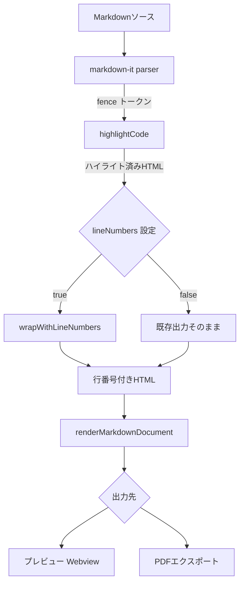

# 設計書: コードブロック行番号表示機能

## 概要

Markdown Studio VS Code拡張機能のプレビューおよびPDFエクスポートにおいて、コードブロックに行番号を表示する機能を追加する。本機能は以下の主要コンポーネントで構成される:

1. **行番号HTML生成**: highlight.jsの出力HTMLに行番号要素を付与する純粋関数
2. **CSS スタイル**: 行番号の表示スタイル（プレビュー・PDF・ダークテーマ対応）
3. **設定統合**: `markdownStudio.codeBlock.lineNumbers` 設定の追加

行番号はCSSの `user-select: none` と `counter-reset`/`counter-increment` を活用し、コピー時に行番号が含まれない実装とする。行番号HTMLの生成は `highlightCode.ts` のパイプライン末尾に純粋関数として追加し、既存のシンタックスハイライト処理を変更しない。

## アーキテクチャ

### データフロー



### 処理フロー詳細

markdown-itの `highlight` コールバック（現在の `highlightCode` 関数）は、コードブロックの `fence` トークンに対して呼び出される。行番号機能は以下の流れで統合する:

1. `highlightCode()` がhighlight.jsでシンタックスハイライトを適用（既存処理、変更なし）
2. 行番号設定が有効な場合、`wrapWithLineNumbers()` がハイライト済みHTMLを行番号付きHTMLに変換
3. markdown-itが `<pre><code>` タグで囲んで最終HTMLに組み込む

### モジュール構成

```
src/parser/
├── highlightCode.ts      # 既存: highlight.jsラッパー（変更あり: 行番号ラッパー呼び出し追加）
├── lineNumbers.ts        # 新規: 行番号HTML生成の純粋関数
media/
├── preview.css           # 既存: 行番号CSSクラス追加
├── hljs-theme.css        # 既存: 変更なし
src/infra/
├── config.ts             # 既存: lineNumbers設定読み取り追加
src/preview/
├── buildHtml.ts          # 既存: buildStyleBlockに行番号用@media print追加
```

### 既存モジュールとの統合ポイント

| 既存モジュール | 変更内容 |
| --- | --- |
| `highlightCode.ts` | 行番号設定が有効な場合に `wrapWithLineNumbers()` を呼び出す |
| `parseMarkdown.ts` | `highlightCode` に設定を渡すためのコールバック変更 |
| `config.ts` | `codeBlock.lineNumbers` 設定の読み取り追加 |
| `buildHtml.ts` | `buildStyleBlock()` に行番号用 `@media print` スタイル追加 |
| `preview.css` | 行番号用CSSクラス（`.ms-line-numbers`）追加 |
| `package.json` | `markdownStudio.codeBlock.lineNumbers` 設定項目追加 |
| `models.ts` | `CodeBlockConfig` 型追加 |

## コンポーネントとインターフェース

### 1. lineNumbers（行番号HTML生成）

`src/parser/lineNumbers.ts` — 新規ファイル

ハイライト済みHTMLコードを受け取り、各行に行番号 `<span>` を付与したHTMLを返す純粋関数。

```typescript
/**
 * ハイライト済みHTMLコードに行番号要素を付与する。
 *
 * 入力: highlight.jsが生成した `<span class="hljs-*">` を含むHTML文字列
 * 出力: 各行を `<span class="ms-code-line">` で囲み、
 *       行番号を `<span class="ms-line-number">` として付与したHTML
 *
 * 空文字列の場合は空文字列を返す（空コードブロック対応）。
 * hljs の <span> タグが行をまたぐ場合も正しく処理する。
 */
export function wrapWithLineNumbers(highlightedHtml: string): string;

/**
 * 行番号付きHTMLからコード部分のみを抽出する。
 * テスト用ユーティリティ（ラウンドトリップ検証）。
 */
export function extractCodeContent(lineNumberedHtml: string): string;
```

**設計判断**:

- 行番号は `<span class="ms-line-number" data-line="N">` として生成し、CSS `::before` 擬似要素で表示する。これにより `user-select: none` でコピー対象から除外できる
- 各行は `<span class="ms-code-line">` で囲む。これにより行単位のスタイリングが可能
- highlight.jsの `<span class="hljs-*">` トークンは一切変更しない。行番号要素はコード行の前に挿入するのみ
- 行分割は `\n` で行い、最終行が空の場合（末尾改行）は行番号を付与しない
- 桁揃えはCSS `min-width` + `text-align: right` で実現し、HTML側では行番号の数値のみを `data-line` 属性に格納する

**HTML出力例**:

```html
<span class="ms-code-line"><span class="ms-line-number" data-line="1"></span>const x: number = 1;</span>
<span class="ms-code-line"><span class="ms-line-number" data-line="2"></span><span class="hljs-keyword">function</span> greet() {}</span>
```

### 2. highlightCode の変更

`src/parser/highlightCode.ts` — 既存ファイル変更

```typescript
/**
 * 変更点: lineNumbers パラメータを追加。
 * true の場合、highlight.js の出力に wrapWithLineNumbers() を適用する。
 */
export function highlightCode(code: string, lang: string, lineNumbers?: boolean): string;
```

**設計判断**: `lineNumbers` パラメータはオプショナルとし、デフォルトは `undefined`（= 行番号なし）。これにより既存の呼び出し元への影響を最小化する。markdown-itの `highlight` コールバックは `(code, lang, attrs)` シグネチャだが、`createMarkdownParser()` 内でクロージャを使って設定値を渡す。

### 3. parseMarkdown の変更

`src/parser/parseMarkdown.ts` — 既存ファイル変更

```typescript
/**
 * 変更点: lineNumbers 設定を受け取り、highlightCode に渡す。
 */
export function createMarkdownParser(options?: { lineNumbers?: boolean }): MarkdownIt;
```

**設計判断**: `createMarkdownParser()` にオプションオブジェクトを追加。`renderMarkdown.ts` でパーサーを生成する際に `getConfig().codeBlock.lineNumbers` を渡す。パーサーはモジュールレベルのシングルトンとして生成されているため、設定変更時にパーサーを再生成する必要がある。既存の `renderMarkdownDocument()` 内でパーサー生成を行うように変更する。

### 4. CSS スタイル

`media/preview.css` に追加するスタイル:

```css
/* ── Code block line numbers ─────────────────────────── */
.ms-code-line {
  display: block;
  line-height: 1.45;
}

.ms-line-number {
  display: inline-block;
  min-width: 2.5em;
  padding-right: 1em;
  text-align: right;
  color: #999;
  border-right: 1px solid #ddd;
  margin-right: 1em;
  user-select: none;
  -webkit-user-select: none;
}

body.vscode-dark .ms-line-number,
body.vscode-high-contrast .ms-line-number {
  color: #666;
  border-right-color: #444;
}
```

`buildHtml.ts` の `buildStyleBlock()` に `@media print` 用スタイルを追加:

```css
@media print {
  .ms-line-number {
    color: #999;
    border-right: 1px solid #ccc;
    user-select: none;
    -webkit-user-select: none;
  }
}
```

### 5. 設定拡張

`src/infra/config.ts` に追加:

```typescript
// MarkdownStudioConfig に追加
codeBlock: {
  lineNumbers: boolean;  // デフォルト: false
}
```

`package.json` の `contributes.configuration.properties` に追加:

```json
{
  "markdownStudio.codeBlock.lineNumbers": {
    "type": "boolean",
    "default": false,
    "description": "コードブロックに行番号を表示する"
  }
}
```

## データモデル

`src/types/models.ts` に追加する型定義:

```typescript
/** コードブロック設定 */
export interface CodeBlockConfig {
  lineNumbers: boolean;
}
```

`MarkdownStudioConfig` への追加:

```typescript
export interface MarkdownStudioConfig {
  // ... 既存フィールド
  codeBlock: CodeBlockConfig;
}
```


## 正確性プロパティ

*プロパティとは、システムのすべての有効な実行において真であるべき特性や振る舞いのことです。プロパティは、人間が読める仕様と機械で検証可能な正確性保証の橋渡しをします。*

### Property 1: 行番号の連番性と数の一致

*For any* 有効なコード文字列（ハイライト済みHTML・プレーンテキストを含む）において、`wrapWithLineNumbers()` が生成する行番号要素の数はコードの行数と一致し、各行番号は1からNまでの連番である。

**Validates: Requirements 1.1, 1.5, 2.3**

### Property 2: 無効時の出力不変性

*For any* コード文字列において、行番号表示が無効（`lineNumbers=false`）の場合、`highlightCode()` の出力は行番号要素（`ms-line-number`）を含まず、行番号表示が無効な場合の出力と有効でない場合の既存出力は同一である。

**Validates: Requirements 1.4, 7.2, 7.3**

### Property 3: コード内容のラウンドトリップ保持

*For any* ハイライト済みHTMLコードにおいて、`wrapWithLineNumbers()` で行番号を付与した後、`extractCodeContent()` でコード部分を抽出した結果は、元のハイライト済みHTMLと同一である。これにより、highlight.jsの `<span class="hljs-*">` トークンが破壊されないことも保証される。

**Validates: Requirements 2.1, 2.4, 8.1**

### Property 4: 行番号付与の冪等性

*For any* コード文字列において、`wrapWithLineNumbers()` を2回連続で適用した結果は、1回適用した結果と同一である。

**Validates: Requirements 8.2**

## エラーハンドリング

| シナリオ | 対応 |
| --- | --- |
| 空のコードブロック（0行） | 空文字列を返す。行番号要素は生成しない（要件1.3） |
| highlight.jsがエラーを返す場合 | 既存の動作を維持（空文字列を返し、markdown-itのデフォルトエスケープにフォールバック） |
| 非常に長いコードブロック（1000行超） | 特別な制限なし。CSSの `min-width` で桁揃えを行うため、行番号の桁数に関わらず正しく表示される |
| 設定値が不正な型の場合 | VS Codeの設定スキーマバリデーションに委譲。`getConfig()` でデフォルト値 `false` にフォールバック |
| hljs `<span>` が行をまたぐ場合 | `wrapWithLineNumbers()` は `\n` で行分割するため、行をまたぐspanタグは分割されない。行番号要素は各行の先頭に挿入するのみ |

## テスト戦略

### プロパティベーステスト（fast-check）

プロジェクトで既に使用されている `fast-check` ライブラリを使用する。各プロパティテストは最低100回のイテレーションで実行する。

テストファイル: `test/unit/lineNumbers.property.test.ts`

各テストには以下のタグコメントを付与:

```text
Feature: code-block-line-numbers, Property {number}: {property_text}
```

対象モジュール:

- `lineNumbers.ts` — Property 1, 3, 4
- `highlightCode.ts` — Property 2

ジェネレータ戦略:

- コード文字列: `fc.array(fc.string(), { minLength: 1, maxLength: 50 }).map(lines => lines.join('\n'))` で複数行コードを生成
- ハイライト済みHTML: 実際の `highlightCode()` を使って各言語のコードスニペットをハイライトした結果を使用
- プレーンテキスト: `fc.string()` で生成した文字列をそのまま使用（hljs未適用）
- 空文字列: エッジケースとして明示的にテスト

### ユニットテスト（example-based）

- 空コードブロックで行番号要素が生成されないこと（要件1.3）
- `buildStyleBlock()` の出力に `@media print` 用の行番号スタイルが含まれること（要件4.4）
- `preview.css` に `user-select: none` が含まれること（要件3.2）
- ダークテーマ用CSSクラスが存在すること（要件5.3）
- `package.json` に `markdownStudio.codeBlock.lineNumbers` 設定が定義されていること（要件7.1）

### インテグレーションテスト

- プレビューWebviewでコードブロックに行番号が表示されること（要件5.1）
- PDFエクスポートでコードブロックに行番号が含まれること（要件4.1）
- 設定変更時にプレビューが再レンダリングされること（要件7.4）
- PDFエクスポートとプレビューで同一の行番号HTMLが使用されること（要件5.2）
