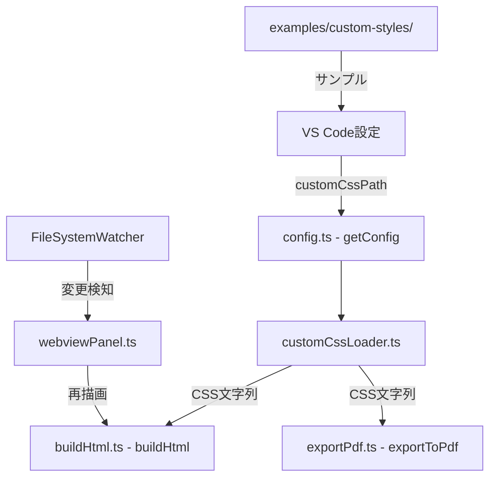

# 設計ドキュメント: カスタムCSS読み込み

## 概要

Markdown Studio拡張機能にカスタムCSS読み込み機能を追加する。ユーザーは `markdownStudio.style.customCssPath` 設定キーを通じてCSSファイルのパスを指定し、プレビューとPDF出力の両方にカスタムスタイルを適用できる。

本機能は既存のアーキテクチャに沿って実装する:
- 設定読み取りは `src/infra/config.ts` の `getConfig()` を拡張
- CSS注入は `src/preview/buildHtml.ts` の `buildHtml()` と `src/export/exportPdf.ts` の `exportToPdf()` に統合
- ファイル監視は `vscode.workspace.createFileSystemWatcher` を使用
- エラーハンドリングは既存のgraceful degradationパターンに従う

## アーキテクチャ

### システム構成図



### データフロー

1. ユーザーが `markdownStudio.style.customCssPath` を設定
2. `getConfig()` がパスを解決（相対パス→絶対パス変換含む）
3. `loadCustomCss()` がファイルを読み取り、バリデーション・サニタイズを実行
4. プレビュー: `buildHtml()` がプリセットスタイルブロックの後にカスタムCSS `<style>` タグを注入
5. PDF出力: `exportToPdf()` が既存CSS注入の後にカスタムCSS `<style>` タグを注入
6. `FileSystemWatcher` がCSS変更を検知し、プレビューの再描画をトリガー

### 設計判断

- **インライン `<style>` タグ注入方式を採用**: 既存のCSP（`style-src 'unsafe-inline'`）と互換性があり、webviewの `localResourceRoots` 変更が不要
- **専用モジュール `customCssLoader.ts` を新設**: CSS読み込み・バリデーション・サニタイズのロジックを集約し、プレビューとPDF出力で共有
- **FileSystemWatcherをwebviewPanel.tsに統合**: 既存のパネルライフサイクル管理と一致させ、リソースリークを防止
- **デバウンス500ms**: 高頻度のファイル変更イベントによるプレビュー再描画の過負荷を防止

## コンポーネントとインターフェース

### 1. `src/infra/customCssLoader.ts`（新規）

カスタムCSSの読み込み、バリデーション、サニタイズを担当する中核モジュール。

```typescript
/** カスタムCSS読み込み結果 */
export interface CustomCssResult {
  /** 読み込み成功時のCSS文字列。失敗時は空文字列 */
  css: string;
  /** 警告・エラーメッセージ（ログ出力用） */
  warnings: string[];
}

/** CSSファイルの最大サイズ（1MB） */
export const MAX_CSS_FILE_SIZE = 1 * 1024 * 1024;

/**
 * カスタムCSSパスを解決する。
 * 絶対パスはそのまま返し、相対パスはワークスペースルートを基準に解決する。
 * 空文字列の場合はnullを返す。
 */
export function resolveCustomCssPath(
  configPath: string,
  workspaceFolders?: readonly { uri: { fsPath: string } }[]
): string | null;

/**
 * パスがリモートURL（http:// または https://）かどうかを判定する。
 */
export function isRemoteUrl(filePath: string): boolean;

/**
 * CSSコンテンツから危険な記述を除去する。
 * - <script> タグを除去
 * - javascript: URLを除去
 */
export function sanitizeCss(css: string): string;

/**
 * カスタムCSSファイルを読み込み、バリデーション・サニタイズを実行する。
 * エラー時はgraceful degradationとして空文字列を返す。
 */
export async function loadCustomCss(configPath: string): Promise<CustomCssResult>;
```

### 2. `src/infra/config.ts`（変更）

`MarkdownStudioConfig` インターフェースに `customCssPath` フィールドを追加。

```typescript
export interface MarkdownStudioConfig {
  // ... 既存フィールド
  customCssPath: string;  // 新規追加
}
```

`getConfig()` 関数で `markdownStudio.style.customCssPath` を読み取る。

### 3. `src/preview/buildHtml.ts`（変更）

`buildHtml()` 関数にカスタムCSS注入を追加。プリセットの `styleBlock` の後に配置。

```typescript
// 既存: ${styleBlock}
// 新規: ${customCssBlock}  ← プリセットの後に注入
```

### 4. `src/export/exportPdf.ts`（変更）

`exportToPdf()` 関数で、既存のpreview.css/hljs-theme.css注入の後にカスタムCSSを注入。

### 5. `src/preview/webviewPanel.ts`（変更）

- `FileSystemWatcher` の作成・管理を追加
- 設定変更時のwatcher再作成ロジック
- パネル破棄時のwatcher解放
- デバウンス付きプレビュー再描画トリガー

### 6. `package.json`（変更）

`markdownStudio.style.customCssPath` 設定キーを追加。

### 7. `examples/custom-styles/modern.css`（新規）

モダンなデザインのサンプルCSSファイル。

## データモデル

### 設定スキーマ拡張

```json
{
  "markdownStudio.style.customCssPath": {
    "type": "string",
    "default": "",
    "description": "カスタムCSSファイルのパス。絶対パスまたはワークスペースルートからの相対パス。"
  }
}
```

### CustomCssResult

| フィールド | 型 | 説明 |
|---|---|---|
| `css` | `string` | サニタイズ済みCSS文字列。エラー時は空文字列 |
| `warnings` | `string[]` | 警告・エラーメッセージのリスト |

### MarkdownStudioConfig 拡張

既存の `MarkdownStudioConfig` に以下を追加:

| フィールド | 型 | デフォルト | 説明 |
|---|---|---|---|
| `customCssPath` | `string` | `""` | カスタムCSSファイルパス（設定値そのまま） |


## 正当性プロパティ（Correctness Properties）

*プロパティとは、システムのすべての有効な実行において真であるべき特性や振る舞いのことである。プロパティは、人間が読める仕様と機械が検証可能な正当性保証の橋渡しとなる。*

### Property 1: パス解決の正当性

*任意の*パス文字列とワークスペースルートに対して、`resolveCustomCssPath` は以下を満たす:
- 絶対パスの場合、入力パスをそのまま返す
- 相対パスの場合、`path.resolve(workspaceRoot, relativePath)` と等しい結果を返す
- 空文字列の場合、`null` を返す

**Validates: Requirements 1.2, 1.3, 1.4**

### Property 2: CSS注入の構造的正当性

*任意の*有効なCSS文字列に対して、カスタムCSSがHTMLに注入された場合:
- カスタムCSSは `<style>` タグで囲まれている
- カスタムCSS `<style>` タグはプリセットスタイルブロック（`/* md-studio-style */` マーカーを含む）の後に配置される
- カスタムCSS `<style>` タグは `</head>` の前に配置される

**Validates: Requirements 2.1, 2.2, 5.1**

### Property 3: loadCustomCssの冪等性

*任意の*カスタムCSSファイルパスに対して、`loadCustomCss` を同じパスで2回呼び出した場合、両方の呼び出しは同一の `CustomCssResult.css` を返す。

**Validates: Requirements 3.3**

### Property 4: ファイルエラー時のグレースフルデグラデーション

*任意の*存在しないファイルパスまたは読み取り不可能なファイルパスに対して、`loadCustomCss` は:
- 例外をスローしない
- `css` フィールドが空文字列の `CustomCssResult` を返す
- `warnings` フィールドに1つ以上の警告メッセージを含む

**Validates: Requirements 4.1, 4.2**

### Property 5: リモートURL拒否

*任意の*`http://` または `https://` で始まるURL文字列に対して、`isRemoteUrl` は `true` を返し、`loadCustomCss` はCSS読み込みを拒否して空文字列と警告メッセージを返す。

**Validates: Requirements 5.2, 5.3**

### Property 6: CSSサニタイズの安全性

*任意の*CSS文字列に対して、`sanitizeCss` の出力は:
- `<script` タグを含まない（大文字小文字不問）
- `javascript:` URLを含まない（大文字小文字不問）
- 元のCSSに `<script` タグや `javascript:` URLが含まれていなかった場合、出力は入力と同一である

**Validates: Requirements 5.4**

## エラーハンドリング

### エラーケースと対応

| エラーケース | 対応 | ログレベル |
|---|---|---|
| ファイルが存在しない | 空CSS返却、プリセットのみで描画続行 | Warning |
| 読み取り権限エラー | 空CSS返却、プリセットのみで描画続行 | Error |
| ファイルサイズ > 1MB | 空CSS返却、読み込みスキップ | Warning |
| リモートURL指定 | 空CSS返却、読み込み拒否 | Warning |
| 不正なCSS内容 | サニタイズ後に適用（`<script>`等除去） | Warning（除去発生時） |

### 既存パターンとの整合性

`exportToPdf.ts` の既存パターンに従う:

```typescript
try {
  const customCss = await fs.readFile(cssPath, 'utf-8');
  html = html.replace('</head>', `<style>${customCss}</style>\n</head>`);
} catch {
  // CSS file missing — degrade gracefully
}
```

すべてのエラーケースで、プレビューとPDF出力はカスタムCSSなしの状態で正常に動作し続ける。ユーザーのワークフローを中断しない。

## テスト戦略

### プロパティベーステスト（fast-check）

プロジェクトは既に `fast-check` を使用しているため、同じライブラリを使用する。各プロパティテストは最低100回のイテレーションを実行する。

| プロパティ | テストファイル | タグ |
|---|---|---|
| Property 1: パス解決 | `test/unit/customCssLoader.property.test.ts` | Feature: custom-css-loading, Property 1: パス解決の正当性 |
| Property 2: CSS注入構造 | `test/unit/customCssLoader.property.test.ts` | Feature: custom-css-loading, Property 2: CSS注入の構造的正当性 |
| Property 3: 冪等性 | `test/unit/customCssLoader.property.test.ts` | Feature: custom-css-loading, Property 3: loadCustomCssの冪等性 |
| Property 4: グレースフルデグラデーション | `test/unit/customCssLoader.property.test.ts` | Feature: custom-css-loading, Property 4: ファイルエラー時のグレースフルデグラデーション |
| Property 5: リモートURL拒否 | `test/unit/customCssLoader.property.test.ts` | Feature: custom-css-loading, Property 5: リモートURL拒否 |
| Property 6: CSSサニタイズ | `test/unit/customCssLoader.property.test.ts` | Feature: custom-css-loading, Property 6: CSSサニタイズの安全性 |

### ユニットテスト（例ベース）

| テスト対象 | テストファイル | カバー範囲 |
|---|---|---|
| getConfig() customCssPath | `test/unit/config.test.ts` | 設定キーのデフォルト値、型 (1.1) |
| 空パスでのスキップ | `test/unit/customCssLoader.test.ts` | 空文字列入力 (1.4) |
| 1MB超ファイル拒否 | `test/unit/customCssLoader.test.ts` | サイズ制限エッジケース (4.3) |
| サンプルCSS内容検証 | `test/unit/sampleCss.test.ts` | 必須セレクタ・ダークモード・コメント (7.3, 7.4, 7.5) |
| PDF出力でのCSS順序 | `test/unit/exportPdf.test.ts` | preview.css/hljs後の注入順序 (3.2) |

### インテグレーションテスト

| テスト対象 | テストファイル | カバー範囲 |
|---|---|---|
| FileSystemWatcher連携 | `test/integration/customCssWatcher.integration.test.ts` | ファイル変更検知、デバウンス (6.1, 6.2) |
| 設定変更時のwatcher再作成 | `test/integration/customCssWatcher.integration.test.ts` | watcher lifecycle (6.3, 6.4) |
| プレビュー再描画 | `test/integration/customCssPreview.integration.test.ts` | 設定変更→再描画 (1.5, 2.3, 2.4) |
