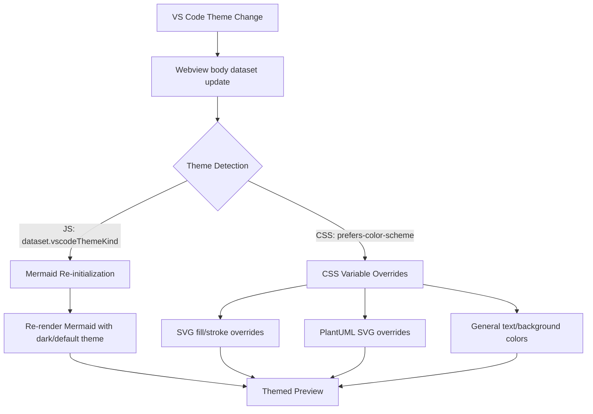
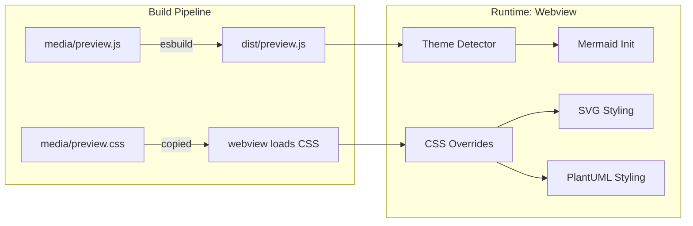
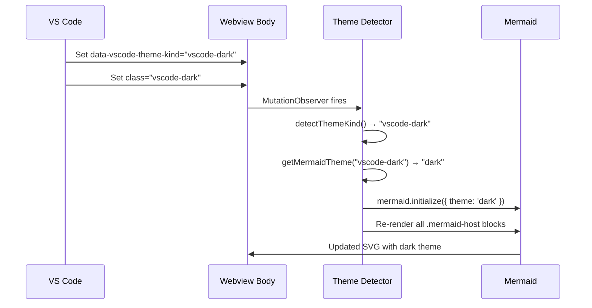
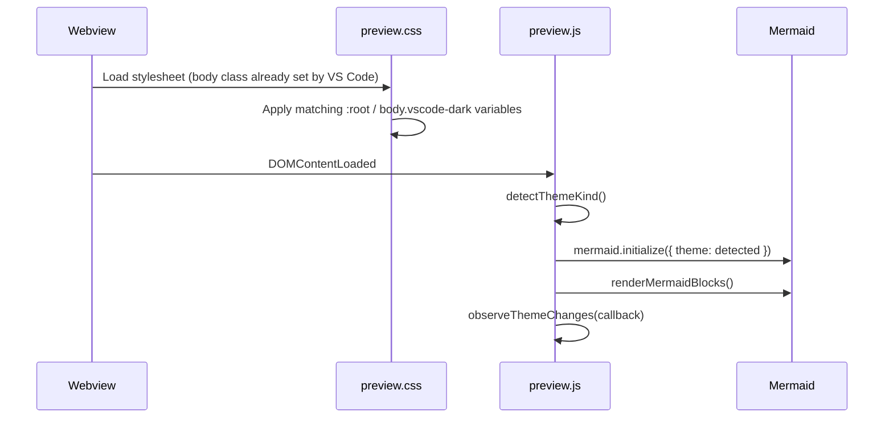

# Design Document: Dark/Light Theme Support

## Overview

Markdown Studio's preview webview currently renders all diagrams and SVG elements with hardcoded light-mode colors, making them invisible or hard to read when VS Code is in a dark theme. Mermaid is always initialized with `theme: 'default'` (light), inline SVG blocks use fixed fills like `#4CAF50` that blend into dark backgrounds, and PlantUML output has no CSS overrides for dark mode.

This feature adds automatic theme detection in the webview so that Mermaid diagrams switch between `'default'` and `'dark'` themes, inline SVG and PlantUML output receive CSS-based color overrides for dark mode, and `preview.css` gains `prefers-color-scheme` media queries plus VS Code CSS variable usage. The demo file will also be updated to showcase theme-adaptive diagrams.

The approach relies on two detection mechanisms: the `document.body.dataset.vscodeThemeKind` attribute (set by VS Code on webview bodies) and the `prefers-color-scheme` CSS media query. Both are used because the dataset attribute is the most reliable for JS-driven logic (Mermaid re-init), while the media query handles pure-CSS overrides for SVG/PlantUML styling.

## Architecture





## Components and Interfaces

### Component 1: Theme Detector (media/preview.js)

**Purpose**: Detects the current VS Code theme kind and provides it to other components. Listens for theme changes and triggers re-renders.

**Interface**:
```typescript
/** Returns 'dark' | 'light' | 'high-contrast' | 'high-contrast-light' */
function detectThemeKind(): string;

/** Maps VS Code theme kind to Mermaid theme name */
function getMermaidTheme(themeKind: string): 'dark' | 'default';

/** Observes body dataset changes and fires callback on theme switch */
function observeThemeChanges(callback: (themeKind: string) => void): MutationObserver;
```

**Responsibilities**:
- Read `document.body.dataset.vscodeThemeKind` on load
- Watch for mutations on the body's `data-vscode-theme-kind` attribute
- Map theme kind to Mermaid theme string
- Trigger Mermaid re-render when theme changes

### Component 2: CSS Theme Overrides (media/preview.css)

**Purpose**: Provides dark-mode color overrides for SVG elements, PlantUML output, and general preview styling using CSS custom properties and media queries.

**Interface**:
```css
/* Dark-mode custom properties */
:root {
  --diagram-fg: #1e1e1e;
  --diagram-bg: #ffffff;
  --diagram-stroke: #333333;
  --diagram-fill-primary: #4CAF50;
  --diagram-fill-secondary: #2196F3;
}

/* Overridden in dark mode via body class or media query */
body.vscode-dark, body.vscode-high-contrast {
  --diagram-fg: #d4d4d4;
  --diagram-bg: #1e1e1e;
  --diagram-stroke: #888888;
  --diagram-fill-primary: #66BB6A;
  --diagram-fill-secondary: #42A5F5;
}
```

**Responsibilities**:
- Define CSS custom properties for diagram colors
- Override properties for dark/high-contrast themes using VS Code body classes
- Apply overrides to inline SVG elements (text fill, rect fill, stroke)
- Apply overrides to PlantUML-generated SVG
- Ensure error blocks remain readable in both themes

### Component 3: buildHtml.ts (minor update)

**Purpose**: No structural changes needed. VS Code already sets `data-vscode-theme-kind` and body classes (`vscode-dark`, `vscode-light`, `vscode-high-contrast`) on webview bodies automatically. The CSP already allows `'unsafe-inline'` for styles, which covers the CSS custom properties.

**Responsibilities**:
- Continue generating HTML with CSP nonce
- No changes to CSP required (inline styles already allowed)

## Sequence Diagrams

### Theme Detection and Mermaid Re-render on Theme Change



### Initial Page Load



## Data Models

### Theme Kind Mapping

```typescript
/** VS Code theme kinds as set on webview body dataset */
type VSCodeThemeKind = 'vscode-dark' | 'vscode-light' | 'vscode-high-contrast' | 'vscode-high-contrast-light';

/** Mermaid theme options */
type MermaidThemeName = 'dark' | 'default';

/** Mapping from VS Code theme kind to Mermaid theme */
const THEME_MAP: Record<VSCodeThemeKind, MermaidThemeName> = {
  'vscode-dark': 'dark',
  'vscode-light': 'default',
  'vscode-high-contrast': 'dark',
  'vscode-high-contrast-light': 'default',
};
```

**Validation Rules**:
- If `dataset.vscodeThemeKind` is undefined or unrecognized, default to `'default'` (light)
- Theme kind string must be one of the four known values for explicit mapping


## Key Functions with Formal Specifications

### Function 1: detectThemeKind()

```typescript
function detectThemeKind(): VSCodeThemeKind {
  const kind = document.body.dataset.vscodeThemeKind;
  if (kind && kind in THEME_MAP) return kind as VSCodeThemeKind;
  return 'vscode-light'; // safe default
}
```

**Preconditions:**
- `document.body` exists (called after DOMContentLoaded)

**Postconditions:**
- Returns a valid `VSCodeThemeKind` string
- If body dataset has a recognized value, returns that value
- If body dataset is missing or unrecognized, returns `'vscode-light'`

**Loop Invariants:** N/A

### Function 2: getMermaidTheme()

```typescript
function getMermaidTheme(themeKind: VSCodeThemeKind): MermaidThemeName {
  return THEME_MAP[themeKind] ?? 'default';
}
```

**Preconditions:**
- `themeKind` is a string

**Postconditions:**
- Returns `'dark'` for dark/high-contrast themes
- Returns `'default'` for light/high-contrast-light themes
- Never returns undefined

**Loop Invariants:** N/A

### Function 3: observeThemeChanges()

```typescript
function observeThemeChanges(callback: (themeKind: VSCodeThemeKind) => void): MutationObserver {
  const observer = new MutationObserver((mutations) => {
    for (const mutation of mutations) {
      if (mutation.type === 'attributes' && mutation.attributeName === 'data-vscode-theme-kind') {
        callback(detectThemeKind());
      }
    }
  });
  observer.observe(document.body, { attributes: true, attributeFilter: ['data-vscode-theme-kind'] });
  return observer;
}
```

**Preconditions:**
- `document.body` exists
- `callback` is a callable function

**Postconditions:**
- Returns a `MutationObserver` that is actively observing
- `callback` is invoked exactly once per theme-kind attribute change
- Observer only fires for `data-vscode-theme-kind` changes (not other attributes)

**Loop Invariants:**
- For each mutation in the mutations list: only process if `attributeName === 'data-vscode-theme-kind'`

### Function 4: renderMermaidBlocks() (updated)

```typescript
async function renderMermaidBlocks(): Promise<void> {
  const blocks = Array.from(document.querySelectorAll('.mermaid-host[data-mermaid-src]'));
  for (const [index, block] of blocks.entries()) {
    const encoded = safeText(block.getAttribute('data-mermaid-src'));
    const source = safeDecode(encoded);
    try {
      await mermaid.parse(source);
      const id = `ms-mermaid-${index}-${Date.now()}`;
      const result = await mermaid.render(id, source);
      block.innerHTML = result.svg;
    } catch (error) {
      block.innerHTML = `<div class="ms-error"><div class="ms-error-title">Mermaid render error</div><pre>${String(error)}</pre></div>`;
    }
  }
}
```

**Preconditions:**
- Mermaid has been initialized with the correct theme before calling
- DOM contains zero or more `.mermaid-host[data-mermaid-src]` elements

**Postconditions:**
- All mermaid-host elements have their innerHTML replaced with rendered SVG or error
- Mermaid SVG uses the theme that was set during the most recent `mermaid.initialize()` call

**Loop Invariants:**
- All previously processed blocks have valid innerHTML (SVG or error div)

## Algorithmic Pseudocode

### Main Theme-Aware Initialization

```typescript
// preview.js — full updated flow

import mermaid from 'mermaid';

const THEME_MAP = {
  'vscode-dark': 'dark',
  'vscode-light': 'default',
  'vscode-high-contrast': 'dark',
  'vscode-high-contrast-light': 'default',
};

function detectThemeKind() {
  const kind = document.body.dataset.vscodeThemeKind;
  return (kind && kind in THEME_MAP) ? kind : 'vscode-light';
}

function getMermaidTheme(themeKind) {
  return THEME_MAP[themeKind] ?? 'default';
}

function initMermaidWithTheme(themeKind) {
  mermaid.initialize({
    startOnLoad: false,
    securityLevel: 'strict',
    theme: getMermaidTheme(themeKind),
  });
}

function observeThemeChanges(callback) {
  const observer = new MutationObserver((mutations) => {
    for (const m of mutations) {
      if (m.type === 'attributes' && m.attributeName === 'data-vscode-theme-kind') {
        callback(detectThemeKind());
      }
    }
  });
  observer.observe(document.body, {
    attributes: true,
    attributeFilter: ['data-vscode-theme-kind'],
  });
  return observer;
}

// On load: detect theme, init mermaid, render, observe changes
window.addEventListener('DOMContentLoaded', () => {
  const themeKind = detectThemeKind();
  initMermaidWithTheme(themeKind);
  renderMermaidBlocks();

  observeThemeChanges((newThemeKind) => {
    initMermaidWithTheme(newThemeKind);
    renderMermaidBlocks();
  });
});
```

### CSS Dark Mode Override Strategy

```css
/*
  Strategy: Use VS Code's body classes (vscode-dark, vscode-light, vscode-high-contrast)
  which are automatically set on webview bodies. Define CSS custom properties on :root
  for light mode defaults, then override them under body.vscode-dark and
  body.vscode-high-contrast selectors.

  For inline SVG: target svg text, rect, circle, etc. with currentColor or
  CSS custom properties. Since user-authored SVGs may have inline fill attributes,
  use CSS specificity to override only elements without explicit fills, and provide
  a filter-based fallback for PlantUML SVGs.
*/

/* Light mode defaults (already the current behavior) */
:root {
  --diagram-text: #1e1e1e;
  --diagram-bg: #ffffff;
  --diagram-stroke: #333333;
}

/* Dark mode overrides */
body.vscode-dark,
body.vscode-high-contrast {
  --diagram-text: #d4d4d4;
  --diagram-bg: #1e1e1e;
  --diagram-stroke: #888888;
}

/* PlantUML SVGs: invert in dark mode since PlantUML generates light-bg SVGs */
body.vscode-dark svg[xmlns] text,
body.vscode-high-contrast svg[xmlns] text {
  fill: var(--diagram-text);
}

/* Ensure SVG elements without explicit fill use theme-aware colors */
body.vscode-dark svg rect:not([fill]),
body.vscode-dark svg circle:not([fill]),
body.vscode-dark svg ellipse:not([fill]),
body.vscode-dark svg polygon:not([fill]) {
  fill: var(--diagram-bg);
  stroke: var(--diagram-stroke);
}
```

## Example Usage

### Mermaid with Theme Detection

```typescript
// In preview.js — Mermaid automatically uses dark theme in dark mode
const themeKind = detectThemeKind(); // 'vscode-dark'
const mermaidTheme = getMermaidTheme(themeKind); // 'dark'
mermaid.initialize({ startOnLoad: false, securityLevel: 'strict', theme: mermaidTheme });
// Mermaid now renders with dark background and light text
```

### SVG That Works in Both Themes

```svg
<!-- Before: hardcoded colors that disappear in dark mode -->
<svg viewBox="0 0 200 100" xmlns="http://www.w3.org/2000/svg">
  <rect x="10" y="10" width="80" height="80" fill="#4CAF50" />
  <text x="50" y="55" fill="white" font-size="14">Safe</text>
</svg>

<!-- After: uses currentColor and CSS variables for theme adaptability -->
<svg viewBox="0 0 200 100" xmlns="http://www.w3.org/2000/svg">
  <rect x="10" y="10" width="80" height="80" rx="10" fill="#4CAF50" />
  <text x="50" y="55" text-anchor="middle" fill="white" font-size="14">Safe</text>
  <!-- CSS overrides ensure visibility; demo uses colors that contrast in both themes -->
</svg>
```

### Demo File Theme Showcase Section

```markdown
## Theme Adaptability

This section demonstrates how diagrams adapt to your current VS Code theme.
Switch between light and dark mode to see the difference.

### Mermaid (auto-detects theme)
The diagram below uses Mermaid's built-in dark/light theme switching.

### SVG (CSS overrides)
SVG elements use colors chosen for visibility in both themes.
```

## Correctness Properties

*A property is a characteristic or behavior that should hold true across all valid executions of a system — essentially, a formal statement about what the system should do. Properties serve as the bridge between human-readable specifications and machine-verifiable correctness guarantees.*

### Property 1: Theme detection always returns a valid theme kind with correct fallback

*For any* string value (including undefined and empty string) set as the `data-vscode-theme-kind` body dataset attribute, `detectThemeKind()` SHALL return a valid VSCodeThemeKind. For any value not in the THEME_MAP, the result SHALL be `'vscode-light'`.

**Validates: Requirements 1.1, 1.2**

### Property 2: Theme-to-Mermaid mapping is total and correct

*For any* recognized VSCodeThemeKind, `getMermaidTheme()` SHALL return `'dark'` for dark-family themes (`vscode-dark`, `vscode-high-contrast`) and `'default'` for light-family themes (`vscode-light`, `vscode-high-contrast-light`), never returning undefined or null.

**Validates: Requirements 2.1, 2.2, 2.3**

## Error Handling

### Error Scenario 1: Missing Theme Kind Attribute

**Condition**: `document.body.dataset.vscodeThemeKind` is undefined (e.g., running outside VS Code webview)
**Response**: `detectThemeKind()` returns `'vscode-light'` as safe default
**Recovery**: Mermaid uses `'default'` theme; CSS uses light-mode variables. Preview is fully functional.

### Error Scenario 2: Mermaid Re-render Failure on Theme Switch

**Condition**: A Mermaid block that rendered successfully in one theme fails in another (unlikely but possible with edge-case syntax)
**Response**: The per-block try/catch in `renderMermaidBlocks()` catches the error and displays an error div
**Recovery**: Other blocks continue rendering. User sees error message for the failing block only.

### Error Scenario 3: MutationObserver Not Supported

**Condition**: Running in an environment without MutationObserver (extremely unlikely in VS Code webview)
**Response**: `observeThemeChanges()` would throw
**Recovery**: Initial theme detection still works on DOMContentLoaded. Only dynamic theme switching is affected. Wrap in try/catch as defensive measure.

## Testing Strategy

### Unit Testing Approach

- Test `getMermaidTheme()` mapping for all four theme kinds plus unknown values
- Test `detectThemeKind()` with mocked `document.body.dataset`
- Test that CSS custom properties are defined for both light and dark selectors (static CSS analysis)

### Property-Based Testing Approach

**Property Test Library**: fast-check (already in devDependencies)

- Property: For any string input to `detectThemeKind()`, the result is always a valid `VSCodeThemeKind`
- Property: For any valid `VSCodeThemeKind`, `getMermaidTheme()` returns either `'dark'` or `'default'`
- Property: Theme mapping is idempotent — calling `getMermaidTheme(detectThemeKind())` twice with the same body state returns the same result

### Integration Testing Approach

- Verify that `buildHtml()` output contains the CSS link that includes theme variables
- Verify that the generated HTML does not hardcode a Mermaid theme (theme is set at runtime by preview.js)
- Manual testing: toggle VS Code theme and verify Mermaid diagrams re-render with correct theme

## Performance Considerations

- MutationObserver is lightweight and only watches a single attribute on a single element
- Mermaid re-render on theme change re-renders all blocks; for documents with many diagrams this could cause a brief flash. This is acceptable since theme changes are infrequent user actions.
- CSS custom property overrides have zero runtime cost compared to JS-based style manipulation

## Security Considerations

- No changes to CSP required — the existing policy already allows inline styles and nonce-gated scripts
- MutationObserver only reads the body dataset attribute; no new attack surface
- SVG CSS overrides use only CSS selectors and custom properties; no inline script injection
- The `sanitizeSvg()` function continues to strip dangerous elements regardless of theme

## Dependencies

- No new dependencies required
- Existing: `mermaid` (already supports `theme: 'dark'`), `sanitize-html`, VS Code webview API
- VS Code automatically sets `data-vscode-theme-kind` and body classes on webview elements
