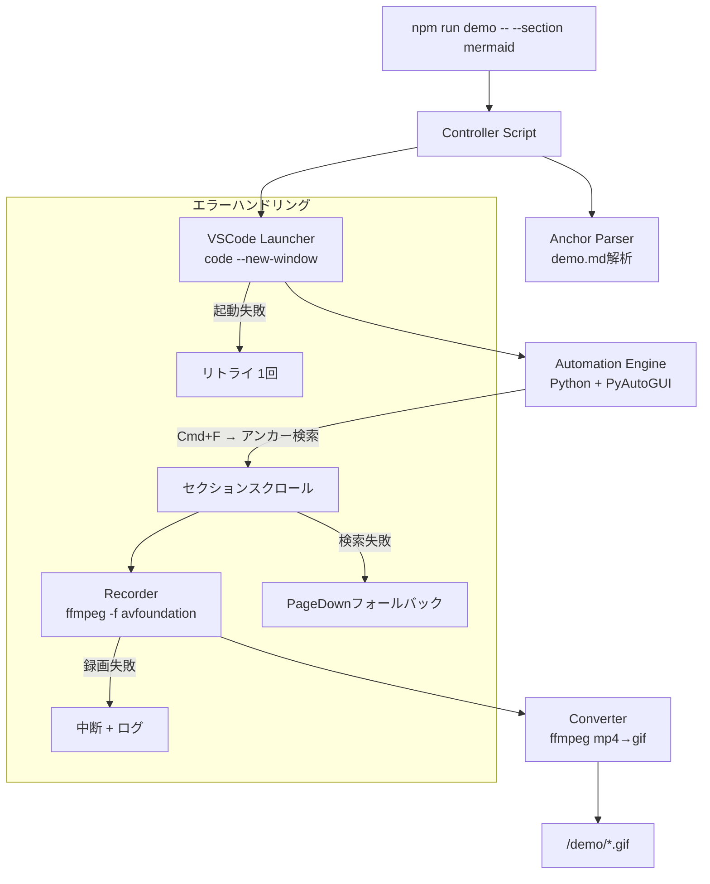
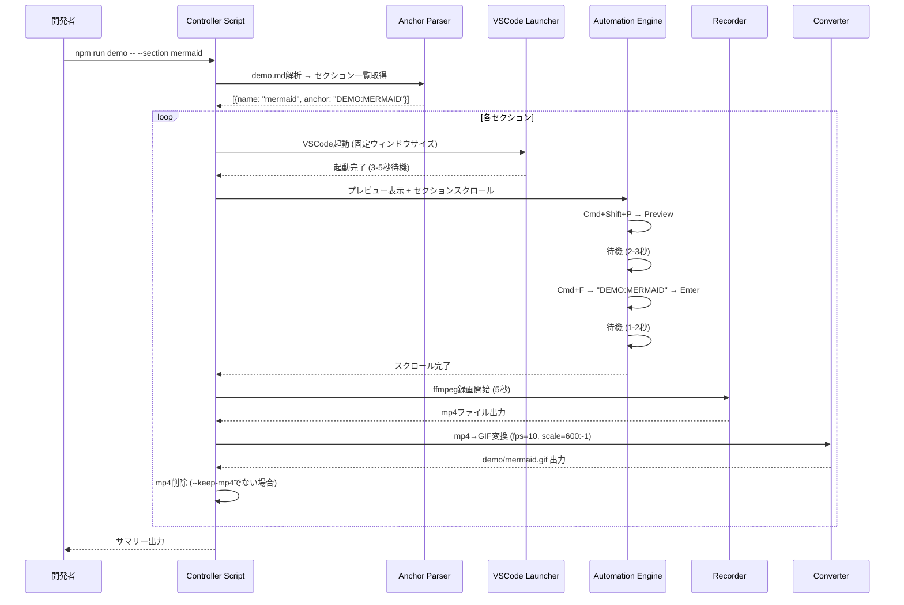
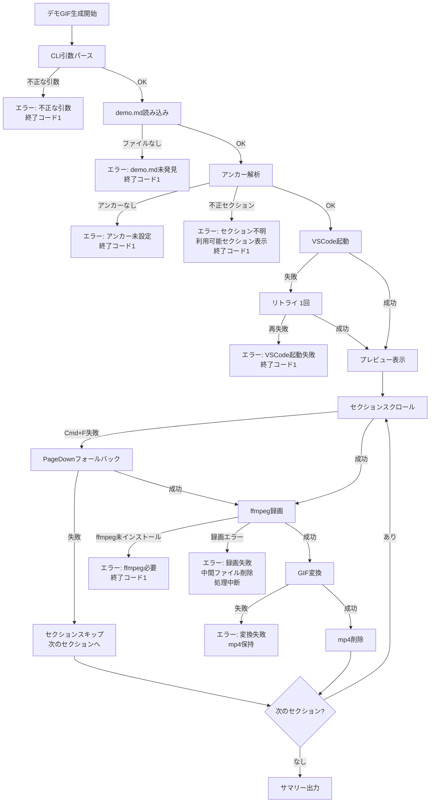

# 設計ドキュメント: Demo GIF自動生成

## 概要

Markdown Studio VSCode拡張のデモGIFを自動生成するCLIツールを構築する。`npm run demo` コマンドで `examples/demo.md` の各セクションを対象に、VSCode起動→プレビュー表示→セクションスクロール→画面録画→GIF変換の一連のフローを自動実行する。

本ツールは以下の5つのモジュールで構成される:
1. **Controller Script** (Node.js/TypeScript) — CLIエントリーポイント、全体フロー制御
2. **VSCode Launcher** (Node.js) — VSCodeプロセスの起動・ウィンドウサイズ制御
3. **Automation Engine** (Python + PyAutoGUI) — キーボード/マウス操作によるセクションスクロール
4. **Recorder** (ffmpeg) — 画面録画（mp4キャプチャ）
5. **Converter** (ffmpeg) — mp4→GIF変換

外部サービスへの通信は一切行わず、ローカル環境のみで完結する。

### 設計方針

- Controller ScriptはTypeScriptで実装し、既存のnpmスクリプト体系に統合する
- 外部ツール（ffmpeg, Python, PyAutoGUI）の呼び出しは `child_process.execFile` / `spawn` で行う
- セクションアンカーの解析はpure functionとして実装し、テスタビリティを確保する
- タイミング制御は設定可能なパラメータとして外部化する
- エラー発生時はリトライ・フォールバック・スキップの段階的な対応を行う

## アーキテクチャ



### 実行フロー



## コンポーネントとインターフェース

### ファイル構成

| ファイル | 役割 |
| --- | --- |
| `scripts/demo/index.ts` | Controller Script — CLIエントリーポイント |
| `scripts/demo/anchorParser.ts` | demo.mdからセクションアンカーを解析 |
| `scripts/demo/sectionResolver.ts` | セクション名→アンカーのマッピング解決 |
| `scripts/demo/vscodeLauncher.ts` | VSCode起動・ウィンドウサイズ制御 |
| `scripts/demo/recorder.ts` | ffmpegによる画面録画 |
| `scripts/demo/converter.ts` | mp4→GIF変換 |
| `scripts/demo/config.ts` | タイミング設定・デフォルト値 |
| `scripts/demo/logger.ts` | タイムスタンプ付きログ出力 |
| `scripts/demo/automation.py` | PyAutoGUIによるVSCode操作スクリプト |

### CLIインターフェース

```typescript
interface CliOptions {
  section?: string;       // 対象セクション名 (省略時: 全セクション)
  duration?: number;      // 録画時間（秒）(デフォルト: 5)
  output?: string;        // 出力ファイル名
  keepMp4?: boolean;      // 中間MP4を保持するか (デフォルト: false)
  width?: number;         // ウィンドウ幅 (デフォルト: 1280)
  height?: number;        // ウィンドウ高さ (デフォルト: 800)
}
```

npm scriptの登録:
```json
{
  "scripts": {
    "demo": "tsx scripts/demo/index.ts"
  }
}
```

### Anchor Parser インターフェース

```typescript
/** demo.md内のセクションアンカー情報 */
interface SectionAnchor {
  name: string;      // セクション名 (例: "MERMAID")
  anchor: string;    // アンカー文字列 (例: "<!-- DEMO:MERMAID -->")
  line: number;      // demo.md内の行番号
}

/** demo.mdの内容からセクションアンカーを抽出する (pure function) */
function parseAnchors(content: string): SectionAnchor[];

/** セクション名からアンカーを解決する */
function resolveSection(
  anchors: SectionAnchor[],
  sectionName: string
): SectionAnchor | undefined;
```

セクションマッピング定数:
```typescript
const SECTION_MAP: Record<string, string> = {
  rendering: 'DEMO:RENDERING',
  mermaid:   'DEMO:MERMAID',
  plantuml:  'DEMO:PLANTUML',
  security:  'DEMO:SECURITY',
  export:    'DEMO:EXPORT',
};
```

### VSCode Launcher インターフェース

```typescript
interface LaunchOptions {
  filePath: string;       // 開くファイルパス
  width: number;          // ウィンドウ幅
  height: number;         // ウィンドウ高さ
  waitAfterLaunch: number; // 起動後待機時間(ms)
}

interface LaunchResult {
  pid: number;
  success: boolean;
}

/** VSCodeを起動し、指定ファイルを開く */
async function launchVSCode(options: LaunchOptions): Promise<LaunchResult>;

/** VSCodeプロセスを終了する */
async function closeVSCode(pid: number): Promise<void>;
```

起動コマンド:
```bash
code --new-window --disable-extensions \
  --window-size={width},{height} \
  examples/demo.md
```

注: `--disable-extensions` は他の拡張機能の干渉を防ぐが、Markdown Studio自体は開発ホスト（Extension Development Host）として別途起動する必要がある。実際の実装では `code --extensionDevelopmentPath=.` を使用する。

### Recorder インターフェース

```typescript
interface RecordOptions {
  outputPath: string;     // mp4出力パス
  duration: number;       // 録画時間（秒）
  fps?: number;           // フレームレート (デフォルト: 30)
}

/** ffmpegで画面録画を開始する */
async function startRecording(options: RecordOptions): Promise<void>;
```

macOS録画コマンド:
```bash
ffmpeg -f avfoundation -framerate 30 -i "1:none" \
  -t {duration} -pix_fmt yuv420p {outputPath}
```

### Converter インターフェース

```typescript
interface ConvertOptions {
  inputPath: string;      // mp4入力パス
  outputPath: string;     // GIF出力パス
  fps?: number;           // GIFフレームレート (デフォルト: 10)
  width?: number;         // GIF幅 (デフォルト: 600)
  keepSource?: boolean;   // 変換後にmp4を保持するか
}

/** mp4をGIFに変換する */
async function convertToGif(options: ConvertOptions): Promise<void>;
```

変換コマンド:
```bash
ffmpeg -i {inputPath} \
  -vf "fps={fps},scale={width}:-1:flags=lanczos,split[s0][s1];[s0]palettegen[p];[s1][p]paletteuse" \
  {outputPath}
```

### Automation Engine インターフェース (Python)

```python
# scripts/demo/automation.py
# 引数: action, anchor (optional)
# action: "open_preview" | "scroll_to_anchor" | "close_search"

def open_preview():
    """Cmd+Shift+P → 'Markdown Studio: Preview' → Enter"""
    
def scroll_to_anchor(anchor: str):
    """Cmd+F → anchor入力 → Enter → Escape"""
    
def fallback_scroll(page_count: int):
    """PageDownキーで指定回数スクロール"""
```

### タイミング設定

```typescript
interface TimingConfig {
  vscodeLaunchWait: number;    // VSCode起動後待機 (デフォルト: 4000ms)
  previewInitWait: number;     // プレビュー初期化待機 (デフォルト: 2500ms)
  sectionSettleWait: number;   // セクションスクロール後待機 (デフォルト: 1500ms)
  defaultDuration: number;     // デフォルト録画時間 (デフォルト: 5s)
}
```

環境変数によるオーバーライド:
```
DEMO_VSCODE_WAIT=5000
DEMO_PREVIEW_WAIT=3000
DEMO_SETTLE_WAIT=2000
DEMO_DURATION=8
```

### Logger インターフェース

```typescript
interface Logger {
  info(message: string): void;
  error(message: string): void;
  step(step: string, status: 'start' | 'done' | 'skip' | 'fail'): void;
  summary(results: SectionResult[]): void;
}

interface SectionResult {
  section: string;
  status: 'success' | 'failed' | 'skipped';
  outputPath?: string;
  fileSize?: number;
  error?: string;
}
```

## データモデル

### セクションマッピング

```typescript
// 固定のセクション名→アンカーマッピング
const SECTION_MAP: Record<string, string> = {
  rendering: 'DEMO:RENDERING',
  mermaid:   'DEMO:MERMAID',
  plantuml:  'DEMO:PLANTUML',
  security:  'DEMO:SECURITY',
  export:    'DEMO:EXPORT',
};

// 出力ファイル名マッピング
const OUTPUT_FILES: Record<string, string> = {
  rendering: 'rendering.gif',
  mermaid:   'mermaid.gif',
  plantuml:  'plantuml.gif',
  security:  'security.gif',
  export:    'export.gif',
};
```

### アンカー正規表現

```typescript
// demo.md内のセクションアンカーを検出する正規表現
const ANCHOR_PATTERN = /^<!--\s*DEMO:(\w+)\s*-->$/;
```

### demo.mdへのアンカー埋め込み

`examples/demo.md` に以下のアンカーを追加する:

```markdown
<!-- DEMO:RENDERING -->
## 1. Markdown Rendering

<!-- DEMO:MERMAID -->
## 2. Mermaid Diagrams

<!-- DEMO:PLANTUML -->
## 3. PlantUML Diagrams

<!-- DEMO:SECURITY -->
## 6. Images and Security

<!-- DEMO:EXPORT -->
## 10. PDF Export
```


## 正当性プロパティ (Correctness Properties)

*プロパティとは、システムの全ての有効な実行において成り立つべき特性や振る舞いのことである。プロパティは人間が読める仕様と機械的に検証可能な正当性保証の橋渡しとなる。*

本機能はCLIツール・外部プロセス連携が中心だが、以下のpure functionロジックについてプロパティベーステストを適用する:
- アンカーパース（正規表現マッチング）
- CLI引数パース
- セクション解決
- ファイル名生成
- ffmpegコマンド構築
- サマリー出力フォーマット
- タイミング設定

### Property 1: アンカーパース — 有効なアンカーのみ検出

*任意の* 文字列配列（行のリスト）に対して、`parseAnchors` が返すアンカーは全て `<!-- DEMO:XXXX -->` パターンに一致し、かつ元の入力に含まれる全ての有効なアンカー行が漏れなく検出される。

**Validates: Requirements 2.1**

### Property 2: CLI引数パース ラウンドトリップ

*任意の* 有効なCLIオプション（duration: 正の数値, output: 非空文字列, section: 文字列, width/height: 正の整数）に対して、それらをコマンドライン引数文字列に変換し、再度パースした結果が元のオプションと一致する。

**Validates: Requirements 1.2, 1.4, 11.3**

### Property 3: セクション解決 — 存在するアンカーは必ず解決される

*任意の* アンカーリストとそのリスト内に存在するセクション名に対して、`resolveSection` は対応するアンカーを返す。リストに存在しないセクション名に対しては `undefined` を返す。

**Validates: Requirements 2.4**

### Property 4: 不正セクション名のエラーメッセージ

*任意の* 有効セクション名以外の文字列と、*任意の* 非空のアンカーリストに対して、エラーメッセージには指定されたセクション名と利用可能なセクション名の一覧が含まれる。

**Validates: Requirements 1.7, 2.6**

### Property 5: デフォルトファイル名生成

*任意の* 有効なセクション名に対して、デフォルト出力ファイル名は `{セクション名}.gif` の形式であり、出力パスは `demo/` ディレクトリ配下となる。

**Validates: Requirements 1.5, 7.2**

### Property 6: ffmpegフィルタ文字列生成

*任意の* 正の整数fps値と正の整数width値に対して、生成されるffmpegフィルタ文字列には `fps={fps}` と `scale={width}:-1` が含まれ、有効なffmpegフィルタ構文である。

**Validates: Requirements 6.2**

### Property 7: サマリー出力の完全性

*任意の* `SectionResult` 配列に対して、サマリー出力には全セクションの名前が含まれ、成功・失敗・スキップの件数の合計が入力配列の長さと一致する。

**Validates: Requirements 7.3, 9.5**

### Property 8: タイミング設定オーバーライド

*任意の* 正の数値を環境変数として設定した場合、タイミング設定の読み込み結果は環境変数の値と一致する。環境変数が未設定の場合はデフォルト値が使用される。

**Validates: Requirements 8.5**

### Property 9: タイムスタンプ付きログフォーマット

*任意の* ステップ名とステータスに対して、ログ出力にはISO 8601形式のタイムスタンプ、ステップ名、およびステータスが含まれる。

**Validates: Requirements 9.4**

## エラーハンドリング

### エラーフロー



### エラーケース一覧

| ケース | 対応 | 終了コード |
| --- | --- | --- |
| 不正なCLI引数 | エラーメッセージ表示 | 1 |
| demo.md未発見 | エラーメッセージ表示 | 1 |
| アンカー未設定 | エラーメッセージ表示 | 1 |
| 不正セクション名 | 利用可能セクション一覧表示 | 1 |
| VSCode起動失敗 | 1回リトライ → 再失敗で終了 | 1 |
| スクロール失敗 | PageDownフォールバック → 失敗でスキップ | 0 (スキップ) |
| ffmpeg未インストール | インストール案内表示 | 1 |
| 録画エラー | 中間ファイル削除、処理中断 | 1 |
| GIF変換失敗 | mp4保持（デバッグ用） | 0 (スキップ) |

### 依存関係チェック

Controller Script起動時に以下の外部ツールの存在を確認する:

```typescript
async function checkDependencies(): Promise<void> {
  // ffmpeg
  await execFile('ffmpeg', ['-version']).catch(() => {
    throw new Error('ffmpegがインストールされていません。brew install ffmpeg を実行してください。');
  });
  
  // Python + PyAutoGUI
  await execFile('python3', ['-c', 'import pyautogui']).catch(() => {
    throw new Error('Python3またはPyAutoGUIがインストールされていません。pip install pyautogui を実行してください。');
  });
  
  // VSCode CLI
  await execFile('code', ['--version']).catch(() => {
    throw new Error('VSCode CLIが利用できません。PATHにcodeコマンドが含まれていることを確認してください。');
  });
}
```

## テスト戦略

### PBTの適用範囲

本機能はCLIツール・外部プロセス連携が中心だが、以下のpure functionロジックにプロパティベーステストを適用する:

| 対象モジュール | テスト対象関数 | PBT適用 |
| --- | --- | --- |
| `anchorParser.ts` | `parseAnchors()` | ✅ Property 1 |
| CLI引数パース | `parseCliArgs()` | ✅ Property 2 |
| `sectionResolver.ts` | `resolveSection()` | ✅ Property 3 |
| エラーメッセージ生成 | `buildSectionError()` | ✅ Property 4 |
| ファイル名生成 | `getOutputPath()` | ✅ Property 5 |
| ffmpegコマンド構築 | `buildFfmpegFilter()` | ✅ Property 6 |
| サマリー出力 | `formatSummary()` | ✅ Property 7 |
| タイミング設定 | `loadTimingConfig()` | ✅ Property 8 |
| ログフォーマット | `formatLogEntry()` | ✅ Property 9 |

外部プロセス連携（VSCode起動、ffmpeg実行、PyAutoGUI操作）はモックベースのユニットテストと手動統合テストで検証する。

### テストフレームワーク

- **PBTライブラリ**: `fast-check`（既にdevDependenciesに含まれている）
- **テストランナー**: Vitest（既存設定 `config/vitest.unit.config.ts` を使用）
- **PBT設定**: 各プロパティテストで最低100イテレーション
- **タグ形式**: `Feature: demo-gif-automation, Property {number}: {property_text}`

### テストファイル構成

| テストファイル | 対象 |
| --- | --- |
| `test/unit/demoAnchorParser.property.test.ts` | Property 1: アンカーパース |
| `test/unit/demoCliArgs.property.test.ts` | Property 2: CLI引数パース |
| `test/unit/demoSectionResolver.property.test.ts` | Property 3, 4: セクション解決・エラー |
| `test/unit/demoOutputPath.property.test.ts` | Property 5: ファイル名生成 |
| `test/unit/demoFfmpegFilter.property.test.ts` | Property 6: ffmpegフィルタ |
| `test/unit/demoSummary.property.test.ts` | Property 7: サマリー出力 |
| `test/unit/demoTimingConfig.property.test.ts` | Property 8: タイミング設定 |
| `test/unit/demoLogger.property.test.ts` | Property 9: ログフォーマット |

### ユニットテスト（example-based）

PBTの対象外となる以下の項目はexample-basedユニットテストで検証する:

- CLI引数のデフォルト値（duration=5, keep-mp4=false）
- セクションマッピング定数の正確性（5つのマッピング）
- VSCode起動コマンドの引数構築（モック）
- リトライロジック（起動失敗→1回リトライ→再失敗）
- フォールバックスクロール（Cmd+F失敗→PageDown）
- ffmpeg未インストール時のエラーメッセージ
- GIF変換失敗時のmp4保持
- `--keep-mp4` フラグの動作

### 統合テスト

手動実行による統合テスト:
- 実際のVSCode起動→プレビュー表示→録画→GIF変換の一連フロー
- 全セクション一括生成
- エラーケース（ffmpeg未インストール、不正セクション名）
