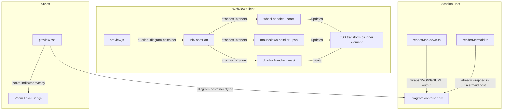
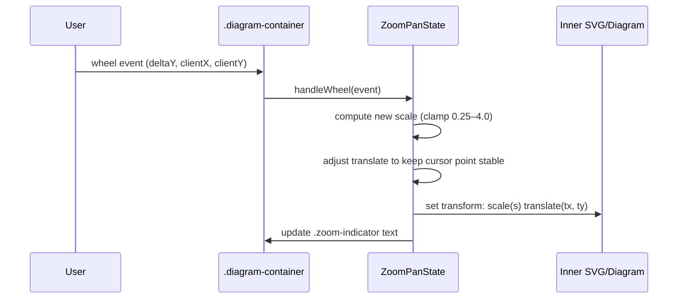
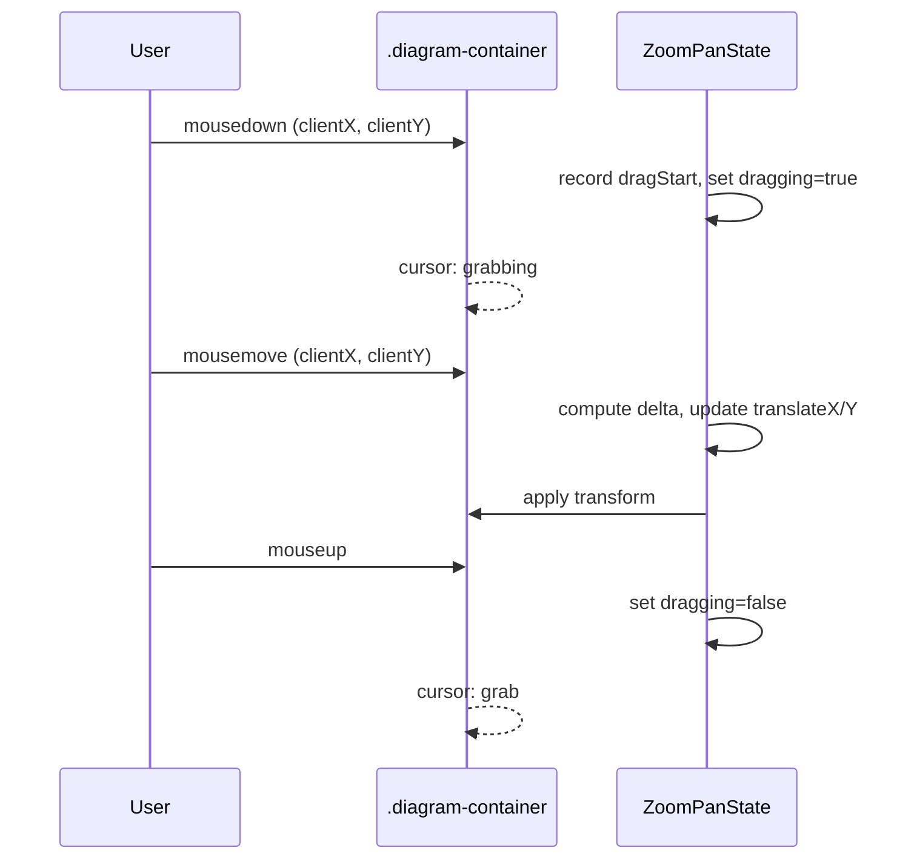
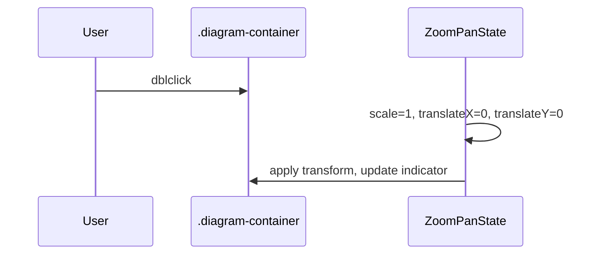

# Design Document: Diagram Zoom & Pan

## Overview

This feature adds interactive zoom, pan, and reset controls to all diagram types (Mermaid, PlantUML, inline SVG) rendered in the Markdown Studio webview preview. Users can scroll-wheel to zoom (cursor-centered), click-drag to pan, and double-click to reset — matching the interaction model of GitHub's Mermaid viewer. All logic lives client-side in `media/preview.js` and `media/preview.css`, with no extension host changes and no impact on PDF export.

The implementation wraps each diagram output in a `.diagram-container` div with `overflow: hidden`, then applies CSS `transform: scale() translate()` to the inner content. Mermaid diagrams already use a `.mermaid-host` wrapper which will be nested inside the container. PlantUML and inline SVG outputs, currently inserted as raw HTML, will be wrapped during `renderMarkdownDocument()` processing.

## Architecture



## Sequence Diagrams

### Zoom (Scroll Wheel)



### Pan (Mouse Drag)



### Reset (Double-Click)



## Components and Interfaces

### Component 1: DiagramContainerWrapper (renderMarkdown.ts)

**Purpose**: Wraps PlantUML and inline SVG output in a `.diagram-container` div so the client-side zoom/pan logic can target them uniformly.

**Responsibilities**:
- Wrap PlantUML SVG output in `<div class="diagram-container">...</div>`
- Wrap inline SVG output in `<div class="diagram-container">...</div>`
- Wrap Mermaid `.mermaid-host` divs in `<div class="diagram-container">...</div>`
- Preserve existing HTML content and attributes

### Component 2: ZoomPanController (preview.js)

**Purpose**: Client-side module that discovers all `.diagram-container` elements and attaches zoom/pan/reset event listeners with per-container state.

**Interface**:
```javascript
/**
 * State tracked per diagram container.
 */
// { scale: number, translateX: number, translateY: number, dragging: boolean, dragStartX: number, dragStartY: number }

/**
 * Initialize zoom/pan on all diagram containers in the document.
 * Called on DOMContentLoaded and after Mermaid re-renders.
 */
function initZoomPan() { }

/**
 * Attach zoom/pan listeners to a single container element.
 */
function attachZoomPan(container) { }

/**
 * Apply the current transform state to the container's inner element.
 */
function applyTransform(container, state) { }
```

**Responsibilities**:
- Discover `.diagram-container` elements
- Create and manage per-container zoom/pan state
- Handle wheel, mousedown, mousemove, mouseup, dblclick events
- Clamp zoom between MIN_SCALE (0.25) and MAX_SCALE (4.0)
- Compute cursor-centered zoom (adjust translate so the point under the cursor stays fixed)
- Show/hide zoom level indicator
- Prevent default scroll behavior when zooming
- Use `cursor: grab` / `cursor: grabbing` for visual feedback

### Component 3: DiagramContainerStyles (preview.css)

**Purpose**: CSS rules for the `.diagram-container` wrapper and zoom indicator overlay.

**Responsibilities**:
- `overflow: hidden` on container
- `position: relative` for indicator positioning
- `cursor: grab` default cursor
- Zoom indicator badge styling (absolute positioned, semi-transparent)
- `@media print` rule to hide indicator and reset transforms
- `will-change: transform` on inner element for GPU acceleration

## Data Models

### ZoomPanState (per container)

```javascript
const state = {
  scale: 1.0,        // Current zoom level (0.25 – 4.0)
  translateX: 0,     // Horizontal pan offset in px
  translateY: 0,     // Vertical pan offset in px
  dragging: false,   // Whether a drag is in progress
  dragStartX: 0,     // Mouse X at drag start
  dragStartY: 0      // Mouse Y at drag start
};
```

**Validation Rules**:
- `scale` must be clamped to `[MIN_SCALE, MAX_SCALE]`
- `translateX` and `translateY` are unconstrained (user can pan freely)
- `dragging` is only `true` between mousedown and mouseup

### Constants

```javascript
const MIN_SCALE = 0.25;
const MAX_SCALE = 4.0;
const ZOOM_SENSITIVITY = 0.001;  // scale delta per wheel deltaY pixel
```

## Key Functions with Formal Specifications

### Function 1: handleWheel(event, container, state)

```javascript
function handleWheel(event, container, state) {
  event.preventDefault();
  const rect = container.getBoundingClientRect();
  const cursorX = event.clientX - rect.left;
  const cursorY = event.clientY - rect.top;

  const prevScale = state.scale;
  const delta = -event.deltaY * ZOOM_SENSITIVITY;
  state.scale = clamp(state.scale * (1 + delta), MIN_SCALE, MAX_SCALE);

  // Adjust translate so the point under the cursor stays fixed
  const ratio = state.scale / prevScale;
  state.translateX = cursorX - ratio * (cursorX - state.translateX);
  state.translateY = cursorY - ratio * (cursorY - state.translateY);

  applyTransform(container, state);
}
```

**Preconditions:**
- `container` is a valid `.diagram-container` DOM element
- `state` is initialized with valid scale/translate values
- `event` is a WheelEvent with `deltaY` defined

**Postconditions:**
- `state.scale` is within `[MIN_SCALE, MAX_SCALE]`
- The point under the cursor remains visually fixed after zoom
- CSS transform on inner element is updated
- Zoom indicator reflects new scale value

**Loop Invariants:** N/A (single computation, no loops)

### Function 2: handleMouseDown(event, state)

```javascript
function handleMouseDown(event, container, state) {
  if (event.button !== 0) return; // left-click only
  state.dragging = true;
  state.dragStartX = event.clientX - state.translateX;
  state.dragStartY = event.clientY - state.translateY;
  container.style.cursor = 'grabbing';
}
```

**Preconditions:**
- `event` is a MouseEvent
- `state.translateX` and `state.translateY` reflect current pan position

**Postconditions:**
- If left-click: `state.dragging === true`, dragStart values recorded, cursor changed
- If not left-click: state unchanged

### Function 3: handleMouseMove(event, container, state)

```javascript
function handleMouseMove(event, container, state) {
  if (!state.dragging) return;
  state.translateX = event.clientX - state.dragStartX;
  state.translateY = event.clientY - state.dragStartY;
  applyTransform(container, state);
}
```

**Preconditions:**
- `state.dragging` indicates whether a drag is active
- `state.dragStartX/Y` were set during mousedown

**Postconditions:**
- If dragging: translate values updated, transform applied
- If not dragging: no-op

### Function 4: handleMouseUp(container, state)

```javascript
function handleMouseUp(container, state) {
  state.dragging = false;
  container.style.cursor = 'grab';
}
```

**Postconditions:**
- `state.dragging === false`
- Cursor restored to `grab`

### Function 5: handleDblClick(container, state)

```javascript
function handleDblClick(container, state) {
  state.scale = 1.0;
  state.translateX = 0;
  state.translateY = 0;
  applyTransform(container, state);
}
```

**Postconditions:**
- State fully reset to initial values
- Transform is `scale(1) translate(0, 0)`
- Zoom indicator shows "100%"

### Function 6: applyTransform(container, state)

```javascript
function applyTransform(container, state) {
  const inner = container.querySelector('svg, .mermaid-host');
  if (!inner) return;
  inner.style.transform = `translate(${state.translateX}px, ${state.translateY}px) scale(${state.scale})`;
  inner.style.transformOrigin = '0 0';

  let indicator = container.querySelector('.zoom-indicator');
  if (!indicator) {
    indicator = document.createElement('div');
    indicator.className = 'zoom-indicator';
    container.appendChild(indicator);
  }
  indicator.textContent = `${Math.round(state.scale * 100)}%`;
}
```

**Preconditions:**
- `container` contains an SVG or `.mermaid-host` child element

**Postconditions:**
- Inner element's CSS transform reflects current state
- Zoom indicator text shows percentage (rounded to integer)

### Function 7: clamp(value, min, max)

```javascript
function clamp(value, min, max) {
  return Math.min(Math.max(value, min), max);
}
```

**Postconditions:**
- Return value is in `[min, max]`
- If `value < min`, returns `min`; if `value > max`, returns `max`; otherwise returns `value`


## Algorithmic Pseudocode

### Cursor-Centered Zoom Algorithm

```pascal
ALGORITHM cursorCenteredZoom(event, container, state)
INPUT: wheel event with deltaY, container bounding rect, current state
OUTPUT: updated state with new scale and adjusted translate

BEGIN
  rect ← container.getBoundingClientRect()
  cursorX ← event.clientX - rect.left
  cursorY ← event.clientY - rect.top

  prevScale ← state.scale
  delta ← -event.deltaY × ZOOM_SENSITIVITY
  newScale ← clamp(state.scale × (1 + delta), MIN_SCALE, MAX_SCALE)

  // Key insight: the cursor point in "content space" must remain
  // at the same screen position before and after zoom.
  // Content point under cursor: (cursorX - translateX) / prevScale
  // After zoom, that same content point must map back to cursorX:
  //   cursorX = contentPoint × newScale + newTranslateX
  //   newTranslateX = cursorX - (cursorX - translateX) × (newScale / prevScale)

  ratio ← newScale / prevScale
  state.translateX ← cursorX - ratio × (cursorX - state.translateX)
  state.translateY ← cursorY - ratio × (cursorY - state.translateY)
  state.scale ← newScale

  applyTransform(container, state)
END
```

**Preconditions:**
- state.scale ∈ [MIN_SCALE, MAX_SCALE]
- container is visible and has non-zero bounding rect

**Postconditions:**
- state.scale ∈ [MIN_SCALE, MAX_SCALE]
- The content point under the cursor is visually unchanged

**Loop Invariants:** N/A

### Container Initialization Algorithm

```pascal
ALGORITHM initZoomPan()
INPUT: DOM document
OUTPUT: all .diagram-container elements have zoom/pan listeners

BEGIN
  containers ← document.querySelectorAll('.diagram-container')

  FOR EACH container IN containers DO
    // Skip if already initialized
    IF container has 'data-zoom-init' attribute THEN
      CONTINUE
    END IF

    state ← { scale: 1.0, translateX: 0, translateY: 0,
               dragging: false, dragStartX: 0, dragStartY: 0 }

    // Store state on the DOM element for access across handlers
    container._zoomState ← state
    container.setAttribute('data-zoom-init', 'true')

    container.addEventListener('wheel', handleWheel)
    container.addEventListener('mousedown', handleMouseDown)
    container.addEventListener('mousemove', handleMouseMove)
    container.addEventListener('mouseup', handleMouseUp)
    container.addEventListener('mouseleave', handleMouseUp)
    container.addEventListener('dblclick', handleDblClick)
  END FOR
END
```

**Preconditions:**
- DOM is loaded and diagram containers exist

**Postconditions:**
- Every `.diagram-container` without `data-zoom-init` now has listeners attached
- Previously initialized containers are not double-bound

**Loop Invariants:**
- All containers processed before current index have listeners attached or were skipped

## Example Usage

```javascript
// In preview.js — called after Mermaid renders and on DOMContentLoaded

window.addEventListener('DOMContentLoaded', () => {
  renderMermaidBlocks().then(() => {
    initZoomPan();
  });
});

// After theme-change re-render, re-init zoom/pan for new Mermaid SVGs
observeThemeChanges((newThemeKind) => {
  mermaid.initialize({ startOnLoad: false, securityLevel: 'strict', theme: getMermaidTheme(newThemeKind) });
  renderMermaidBlocks().then(() => {
    // Reset zoom state since SVG content changed
    document.querySelectorAll('.diagram-container').forEach(c => {
      c.removeAttribute('data-zoom-init');
    });
    initZoomPan();
  });
});
```

```html
<!-- Generated HTML structure for PlantUML diagram -->
<div class="diagram-container">
  <svg xmlns="http://www.w3.org/2000/svg" viewBox="0 0 400 300">
    <!-- PlantUML SVG content -->
  </svg>
  <div class="zoom-indicator">100%</div>
</div>

<!-- Generated HTML structure for Mermaid diagram -->
<div class="diagram-container">
  <div class="mermaid-host" data-mermaid-src="...">
    <svg><!-- Mermaid rendered SVG --></svg>
  </div>
  <div class="zoom-indicator">100%</div>
</div>
```

```css
/* Key CSS additions in preview.css */
.diagram-container {
  position: relative;
  overflow: hidden;
  cursor: grab;
  margin: 1rem 0;
}

.diagram-container svg,
.diagram-container .mermaid-host {
  will-change: transform;
  transform-origin: 0 0;
}

.zoom-indicator {
  position: absolute;
  top: 8px;
  right: 8px;
  background: rgba(0, 0, 0, 0.6);
  color: #fff;
  padding: 2px 8px;
  border-radius: 4px;
  font-size: 12px;
  pointer-events: none;
  opacity: 0;
  transition: opacity 0.2s;
}

.diagram-container:hover .zoom-indicator {
  opacity: 1;
}

@media print {
  .diagram-container {
    overflow: visible;
    cursor: default;
  }
  .diagram-container svg,
  .diagram-container .mermaid-host {
    transform: none !important;
  }
  .zoom-indicator {
    display: none;
  }
}
```

## Correctness Properties

*A property is a characteristic or behavior that should hold true across all valid executions of a system — essentially, a formal statement about what the system should do. Properties serve as the bridge between human-readable specifications and machine-verifiable correctness guarantees.*

### Property 1: Diagram wrapping preserves content

*For any* valid diagram HTML content (Mermaid placeholder, PlantUML SVG, or inline SVG), wrapping it in a Diagram_Container div and then extracting the inner HTML SHALL produce content identical to the original.

**Validates: Requirements 1.1, 1.2, 1.3, 1.4**

### Property 2: Zoom scale clamping invariant

*For any* sequence of wheel events with arbitrary deltaY values applied to any initial Zoom_Pan_State, the resulting scale SHALL always be within [0.25, 4.0] after each event is processed.

**Validates: Requirement 2.2**

### Property 3: Cursor-centered zoom stability

*For any* zoom operation with any valid initial Zoom_Pan_State, any cursor position within the container bounds, and any wheel deltaY, the content-space point under the cursor before the zoom SHALL map to the same screen coordinate after the zoom (within floating-point tolerance of 1e-9).

**Validates: Requirement 2.3**

### Property 4: Double-click reset from any state

*For any* Zoom_Pan_State with arbitrary scale, translateX, and translateY values, applying handleDblClick SHALL produce a state with scale equal to 1.0, translateX equal to 0, and translateY equal to 0.

**Validates: Requirements 4.1, 4.2**

### Property 5: Pan displacement correctness

*For any* drag sequence starting from any initial translate position, the resulting translateX and translateY SHALL equal the mouse displacement (clientX - dragStartX, clientY - dragStartY) applied to the initial translate values.

**Validates: Requirement 3.3**

### Property 6: Non-left-click does not initiate drag

*For any* mousedown event with a button value other than 0, the Zoom_Pan_State dragging flag SHALL remain false and no drag start coordinates SHALL be recorded.

**Validates: Requirement 3.2**

### Property 7: Zoom indicator displays correct percentage

*For any* scale value in [0.25, 4.0], the Zoom_Indicator text after applyTransform SHALL equal `Math.round(scale * 100)` followed by "%".

**Validates: Requirement 5.1**

### Property 8: Initialization idempotency

*For any* number of consecutive initZoomPan calls on the same set of Diagram_Container elements, each container SHALL have event listeners attached exactly once, guarded by the Init_Guard attribute.

**Validates: Requirements 6.1, 6.2**

## Error Handling

### Error Scenario 1: No Inner Element Found

**Condition**: `applyTransform` is called on a container that has no `svg` or `.mermaid-host` child (e.g., diagram failed to render).
**Response**: `applyTransform` returns early without modifying DOM.
**Recovery**: No action needed — the error div from the renderer is displayed as-is.

### Error Scenario 2: Container Has Zero Dimensions

**Condition**: Container is hidden or collapsed when zoom is attempted.
**Response**: `getBoundingClientRect()` returns zeros; zoom math produces NaN or Infinity.
**Recovery**: Guard `handleWheel` — if `rect.width === 0 || rect.height === 0`, return early.

### Error Scenario 3: Rapid Re-renders (Theme Change)

**Condition**: Mermaid re-renders on theme change, replacing SVG content inside `.mermaid-host`.
**Response**: Old transform state references stale SVG elements.
**Recovery**: Clear `data-zoom-init` on all containers before calling `initZoomPan()` after re-render, resetting state.

## Testing Strategy

### Unit Testing Approach

- Test `clamp()` with values below min, above max, and within range.
- Test `handleDblClick` resets state to initial values.
- Test `handleMouseDown` only activates on `button === 0`.
- Test zoom math: given a known state, wheel deltaY, and cursor position, verify the resulting scale and translate values.

### Property-Based Testing Approach

**Property Test Library**: fast-check

- **Zoom clamp property**: For any sequence of random wheel deltas, `state.scale` always remains in [0.25, 4.0].
- **Reset property**: For any random state, `handleDblClick` always produces `{ scale: 1, translateX: 0, translateY: 0 }`.
- **Cursor stability property**: For any zoom operation, the content-space coordinate under the cursor is preserved (within floating-point tolerance).

### Integration Testing Approach

- Render a markdown document with Mermaid, PlantUML, and inline SVG blocks.
- Verify each diagram output is wrapped in `.diagram-container`.
- Verify `data-zoom-init` attribute is set after `initZoomPan()`.
- Verify PDF export HTML does not contain interactive transforms.

## Performance Considerations

- `will-change: transform` on inner elements enables GPU-composited transforms, avoiding layout/paint on every frame.
- Event handlers are attached per-container (not globally), limiting scope.
- `wheel` event uses `preventDefault()` — the container should have `{ passive: false }` on the listener to allow this.
- Zoom indicator updates are lightweight (text content change only).
- No `requestAnimationFrame` needed for single-step transforms (wheel events are already throttled by the browser).

## Security Considerations

- No new CSP directives required — all code runs within the existing `preview.js` bundle and `preview.css` stylesheet.
- No `eval()`, no inline scripts, no dynamic style injection.
- The `_zoomState` property on DOM elements is a plain object — no prototype pollution risk.
- `data-zoom-init` attribute is a simple flag with no user-controlled content.

## Dependencies

- No new npm dependencies required.
- All functionality uses standard DOM APIs: `addEventListener`, `getBoundingClientRect`, `style.transform`, `querySelector`.
- Mermaid library (already bundled) — no changes needed.
- PlantUML renderer (server-side) — only the HTML wrapping changes in `renderMarkdown.ts`.
