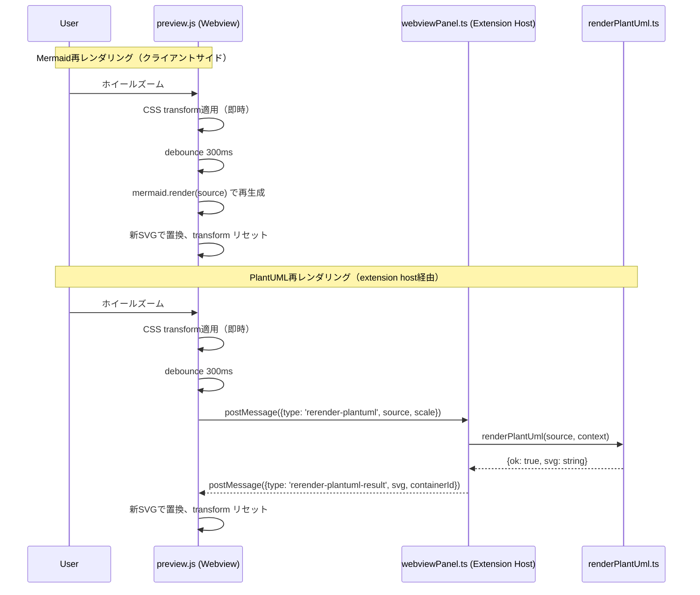

# 設計書: ダイアグラムズームツールバー (Diagram Zoom Toolbar)

## 概要

ダイアグラムコンテナ (`.diagram-container`) にミニマルなツールバーオーバーレイを追加する。ツールバーはズームレベル表示（パーセンテージ）と100%リセットボタンで構成され、ホバー時にフェードイン表示する。ズーム操作はこれまで通りフォーカス（クリック）時のみ有効とし、プレビューのスクロールハイジャックを防止する。

さらに、ズーム変更時にMermaid/PlantUMLダイアグラムのSVGを新しい解像度で再レンダリングし、CSSスケーリングによるぼやけを解消する。

### 設計判断の要約

| 判断事項 | 決定 | 根拠 |
|---------|------|------|
| ツールバー表示トリガー | hover (mouseenter/mouseleave) | スクロールハイジャック防止パターンと整合。ズーム操作はfocusedゲートのまま |
| 既存 `.zoom-indicator` の扱い | ツールバー構造に置換 | pointer-events: none のラベルからクリック可能なボタン付きツールバーに進化 |
| Mermaid再レンダリング | クライアントサイド (preview.js) | mermaid.render() がWebview内で利用可能 |
| PlantUML再レンダリング | extension host経由 (postMessage) | Java JARプロセスが必要なためWebview内では実行不可 |
| インラインSVG再レンダリング | CSSフォールバックのみ | ユーザー作成SVGのため再生成不可 |
| デバウンス戦略 | 300ms debounce | 連続ズーム中の不要な再レンダリング防止 |

## アーキテクチャ

### コンポーネント構成

変更対象は既存ファイルのみ。新規モジュールは不要。

```
media/
  preview.js   # ツールバーDOM生成、リセット機能、SVG再レンダリング制御
  preview.css  # ツールバースタイル、テーマ対応、印刷時非表示

src/
  preview/
    webviewPanel.ts  # PlantUML再レンダリングメッセージハンドラ追加
  renderers/
    renderPlantUml.ts  # 既存のrenderPlantUml()をスケール付きで再利用
```

### メッセージフロー図



## コンポーネントと詳細設計

### 1. ツールバーDOM構造 (preview.js)

既存の `applyTransform()` が生成する `.zoom-indicator` div を、新しいツールバー構造に置き換える。

```html
<div class="zoom-toolbar" role="toolbar" aria-label="Diagram zoom controls">
  <span class="zoom-toolbar-level">150%</span>
  <button class="zoom-toolbar-reset"
          aria-label="Reset zoom to 100%"
          title="100%にリセット"
          disabled>
    ↺
  </button>
</div>
```

**変更点:**
- `applyTransform()` 内で `.zoom-indicator` の代わりに `.zoom-toolbar` を生成・更新
- `attachZoomPan()` にツールバー初期化ロジックを追加
- リセットボタンの `click` イベントで `resetZoom()` 関数を呼び出し

```javascript
// preview.js 内の新規関数

function createZoomToolbar(container, state) {
  let toolbar = container.querySelector('.zoom-toolbar');
  if (toolbar) return toolbar;

  toolbar = document.createElement('div');
  toolbar.className = 'zoom-toolbar';
  toolbar.setAttribute('role', 'toolbar');
  toolbar.setAttribute('aria-label', 'Diagram zoom controls');

  const level = document.createElement('span');
  level.className = 'zoom-toolbar-level';
  level.textContent = '100%';

  const resetBtn = document.createElement('button');
  resetBtn.className = 'zoom-toolbar-reset';
  resetBtn.setAttribute('aria-label', 'Reset zoom to 100%');
  resetBtn.setAttribute('title', '100%にリセット');
  resetBtn.textContent = '↺';
  resetBtn.disabled = true;
  resetBtn.addEventListener('click', (e) => {
    e.stopPropagation(); // ツールバークリックでコンテナのフォーカス/ドラッグを発火させない
    resetZoom(container, state);
  });

  toolbar.appendChild(level);
  toolbar.appendChild(resetBtn);
  container.appendChild(toolbar);
  return toolbar;
}

function resetZoom(container, state) {
  state.scale = 1.0;
  state.translateX = 0;
  state.translateY = 0;
  applyTransform(container, state);
  triggerSvgRerender(container, state);
}

function isDefaultZoomState(state) {
  return state.scale === 1.0 && state.translateX === 0 && state.translateY === 0;
}
```

**`applyTransform()` の変更:**

```javascript
function applyTransform(container, state) {
  const inner = container.querySelector('svg, .mermaid-host');
  if (!inner) return;
  inner.style.transform =
    `translate(${state.translateX}px, ${state.translateY}px) scale(${state.scale})`;
  inner.style.transformOrigin = '0 0';

  // ツールバーのズームレベル表示を更新
  const toolbar = container.querySelector('.zoom-toolbar');
  if (toolbar) {
    const level = toolbar.querySelector('.zoom-toolbar-level');
    if (level) {
      level.textContent = `${Math.round(state.scale * 100)}%`;
    }
    const resetBtn = toolbar.querySelector('.zoom-toolbar-reset');
    if (resetBtn) {
      resetBtn.disabled = isDefaultZoomState(state);
    }
  }
}
```

### 2. ツールバー表示制御 (preview.js)

ツールバーはhover時に表示され、ズーム/スクロール操作はfocused時のみ有効。

```javascript
// attachZoomPan() 内に追加

// ツールバーを生成
createZoomToolbar(container, state);

// ホバーで表示
container.addEventListener('mouseenter', () => {
  container.classList.add('diagram-hover');
});
container.addEventListener('mouseleave', () => {
  container.classList.remove('diagram-hover');
});
```

CSSでの制御:
```css
.zoom-toolbar {
  opacity: 0;
  transition: opacity 0.2s;
}

/* ホバーまたはフォーカスで表示 */
.diagram-container.diagram-hover .zoom-toolbar,
.diagram-container.diagram-focused .zoom-toolbar {
  opacity: 1;
}
```

### 3. SVG高解像度再レンダリング (preview.js)

#### 3a. デバウンス制御

```javascript
const RERENDER_DEBOUNCE_MS = 300;

// attachZoomPan() 内で各containerにデバウンスタイマーを保持
// state._rerenderTimer = null;

function scheduleRerender(container, state) {
  if (state._rerenderTimer) {
    clearTimeout(state._rerenderTimer);
  }
  state._rerenderTimer = setTimeout(() => {
    state._rerenderTimer = null;
    triggerSvgRerender(container, state);
  }, RERENDER_DEBOUNCE_MS);
}
```

`handleWheel()` の末尾に `scheduleRerender(container, state)` 呼び出しを追加。

#### 3b. ダイアグラムタイプ判別と再レンダリング

```javascript
function getDiagramType(container) {
  const mermaidHost = container.querySelector('.mermaid-host');
  if (mermaidHost) return 'mermaid';
  // PlantUMLはdata属性で識別（renderMarkdown.tsで付与）
  if (container.hasAttribute('data-plantuml-src')) return 'plantuml';
  return 'svg'; // インラインSVG（再レンダリング不可）
}

async function triggerSvgRerender(container, state) {
  if (state.scale === 1.0) return; // 100%時は再レンダリング不要

  const diagramType = getDiagramType(container);

  if (diagramType === 'mermaid') {
    await rerenderMermaid(container, state);
  } else if (diagramType === 'plantuml') {
    rerenderPlantUml(container, state);
  }
  // 'svg' タイプはCSS transformフォールバックを維持
}
```

#### 3c. Mermaid再レンダリング（クライアントサイド）

```javascript
async function rerenderMermaid(container, state) {
  const mermaidHost = container.querySelector('.mermaid-host');
  if (!mermaidHost || !mermaidReady) return;

  const encoded = mermaidHost.getAttribute('data-mermaid-src');
  if (!encoded) return;

  const source = safeDecode(encoded);
  try {
    await mermaid.parse(source);
    const id = `ms-mermaid-rerender-${Date.now()}`;
    const result = await mermaid.render(id, source);
    mermaidHost.innerHTML = result.svg;

    // 新SVGのviewBoxを調整して高解像度表示
    const svg = mermaidHost.querySelector('svg');
    if (svg) {
      const origWidth = svg.getAttribute('width');
      const origHeight = svg.getAttribute('height');
      if (origWidth && origHeight) {
        const w = parseFloat(origWidth);
        const h = parseFloat(origHeight);
        svg.setAttribute('width', String(w * state.scale));
        svg.setAttribute('height', String(h * state.scale));
        svg.setAttribute('viewBox', `0 0 ${w} ${h}`);
      }
    }

    // CSS transformをリセット（SVG自体が拡大済み）
    mermaidHost.style.transform = 'none';
    mermaidHost.style.transformOrigin = '0 0';
  } catch (error) {
    // 再レンダリング失敗 → CSS transformフォールバック維持
    console.error('[Markdown Studio] Mermaid re-render failed:', error);
  }
}
```

#### 3d. PlantUML再レンダリング（extension host経由）

**preview.js側:**

```javascript
function rerenderPlantUml(container, state) {
  const source = container.getAttribute('data-plantuml-src');
  if (!source) return;

  // コンテナにIDを付与してレスポンスとマッチング
  if (!container.id) {
    container.id = `plantuml-${Date.now()}-${Math.random().toString(36).slice(2, 8)}`;
  }

  vscode.postMessage({
    type: 'rerender-plantuml',
    source: source,
    scale: state.scale,
    containerId: container.id,
  });
}

// メッセージハンドラ内に追加
// window.addEventListener('message', (event) => {
//   ...
//   if (message.type === 'rerender-plantuml-result') {
//     handlePlantUmlRerenderResult(message);
//   }
// });

function handlePlantUmlRerenderResult(message) {
  const container = document.getElementById(message.containerId);
  if (!container) return;

  if (message.ok && message.svg) {
    const inner = container.querySelector('svg');
    if (inner) {
      inner.outerHTML = message.svg;
      // CSS transformをリセット
      const newSvg = container.querySelector('svg');
      if (newSvg) {
        newSvg.style.transform = 'none';
        newSvg.style.transformOrigin = '0 0';
      }
    }
  }
  // 失敗時はCSS transformフォールバック維持（何もしない）
}
```

**webviewPanel.ts側:**

```typescript
// onDidReceiveMessage ハンドラに追加
messageSubscription = panel.webview.onDidReceiveMessage(async (msg) => {
  handleJumpToLine(document.uri, msg);

  if (msg.type === 'rerender-plantuml' && typeof msg.source === 'string') {
    const result = await renderPlantUml(msg.source, context);
    panel.webview.postMessage({
      type: 'rerender-plantuml-result',
      ok: result.ok,
      svg: result.ok ? result.svg : undefined,
      containerId: msg.containerId,
    });
  }
});
```

### 4. renderMarkdown.ts への変更

PlantUMLブロックのレンダリング時に、ソースコードを `data-plantuml-src` 属性として保持する。

```typescript
// renderMarkdown.ts 内のPlantUMLブロック処理を変更
if (block.kind === 'plantuml' || block.kind === 'puml') {
  const result = await renderPlantUml(block.content, context);
  if (result.ok && result.svg) {
    const encodedSrc = encodeURIComponent(block.content);
    replacement = `<div class="diagram-container" data-plantuml-src="${encodedSrc}">${result.svg}</div>`;
  } else {
    // エラー処理は既存のまま
  }
}
```

### 5. CSSスタイル (preview.css)

```css
/* ── Zoom toolbar overlay ────────────────────────────── */

.zoom-toolbar {
  position: absolute;
  top: 8px;
  right: 8px;
  display: flex;
  align-items: center;
  gap: 4px;
  background: rgba(0, 0, 0, 0.6);
  color: #fff;
  padding: 2px 6px;
  border-radius: 4px;
  font-size: 12px;
  opacity: 0;
  transition: opacity 0.2s;
  z-index: 10;
}

.diagram-container.diagram-hover .zoom-toolbar,
.diagram-container.diagram-focused .zoom-toolbar {
  opacity: 1;
}

.zoom-toolbar-level {
  min-width: 3ch;
  text-align: center;
  user-select: none;
}

.zoom-toolbar-reset {
  background: transparent;
  border: 1px solid rgba(255, 255, 255, 0.3);
  color: #fff;
  border-radius: 3px;
  cursor: pointer;
  padding: 0 4px;
  font-size: 12px;
  line-height: 1.4;
}

.zoom-toolbar-reset:hover:not(:disabled) {
  background: rgba(255, 255, 255, 0.15);
  border-color: rgba(255, 255, 255, 0.5);
}

.zoom-toolbar-reset:disabled {
  opacity: 0.4;
  cursor: default;
}

.zoom-toolbar-reset:focus-visible {
  outline: 2px solid var(--vscode-focusBorder, #007fd4);
  outline-offset: 1px;
}

/* ダークテーマ対応（ベースが半透明黒背景のためライト/ダーク共用） */

/* ── 印刷時非表示 ── */
@media print {
  .zoom-toolbar {
    display: none;
  }
}
```

既存の `.zoom-indicator` 関連CSSは削除する。

## データモデル

### Zoom State（既存の拡張）

```typescript
interface ZoomState {
  scale: number;           // 0.25 ~ 4.0
  translateX: number;      // ピクセル単位のX方向パン
  translateY: number;      // ピクセル単位のY方向パン
  dragging: boolean;       // ドラッグ中フラグ
  dragStartX: number;
  dragStartY: number;
  focused: boolean;        // フォーカス状態（ホイールイベントゲート）
  _rerenderTimer: number | null;  // デバウンスタイマーID（新規）
}
```

### メッセージプロトコル（新規）

```typescript
// Webview → Extension Host
interface RerenderPlantUmlRequest {
  type: 'rerender-plantuml';
  source: string;       // PlantUMLソースコード
  scale: number;        // 現在のスケール値
  containerId: string;  // DOM上のコンテナID
}

// Extension Host → Webview
interface RerenderPlantUmlResponse {
  type: 'rerender-plantuml-result';
  ok: boolean;
  svg?: string;         // 成功時のみ
  containerId: string;  // リクエストと同じID
}
```

## Correctness Properties

*正当性プロパティは、システムのすべての有効な実行にわたって成立すべき特性・振る舞いです。人間が読める仕様と機械検証可能な正当性保証の橋渡しとなります。*

### Property 1: ホバー表示のラウンドトリップ

*For any* diagram container、mouseenterイベント後にコンテナが `diagram-hover` クラスを持ち、続くmouseleaveイベント後に `diagram-hover` クラスが除去される。

**Validates: Requirements 1.1, 1.2**

### Property 2: ズームインジケーターのパーセンテージ表示

*For any* scale値 (MIN_SCALE ≤ scale ≤ MAX_SCALE) に対して、applyTransform実行後のツールバー内ズームレベル表示テキストは `Math.round(scale * 100) + "%"` と一致する。

**Validates: Requirements 2.1, 2.2, 2.3**

### Property 3: リセットボタンによる任意状態からの復元

*For any* ZoomState (任意のscale, translateX, translateY) に対して、resetZoom実行後のstateは `{scale: 1.0, translateX: 0, translateY: 0}` となり、DOM上のtransformも更新される。

**Validates: Requirements 3.2, 3.3, 3.4**

### Property 4: リセットボタンの無効化状態の双条件

*For any* ZoomState に対して、リセットボタンの `disabled` 属性は `(scale === 1.0 && translateX === 0 && translateY === 0)` と同値である。すなわち、デフォルト状態でのみ無効化される。

**Validates: Requirements 3.5**

### Property 5: 再レンダリングトリガー条件

*For any* ズーム操作後のscale値に対して、SVG再レンダリングは `scale !== 1.0` の場合にのみトリガーされる。scale === 1.0 の場合は再レンダリングが発生しない。

**Validates: Requirements 4.1**

### Property 6: デバウンスによる再レンダリング統合

*For any* N個 (N ≥ 1) のデバウンス間隔内で発生したズーム操作のシーケンスに対して、再レンダリングは最後の操作後に正確に1回だけ実行される。

**Validates: Requirements 4.2**

## エラーハンドリング

| シナリオ | 対応 |
|---------|------|
| Mermaid再レンダリング失敗 | console.errorでログ出力、CSS transformフォールバック維持 |
| PlantUML再レンダリング失敗 | extension hostがエラー応答、CSS transformフォールバック維持 |
| PlantUML再レンダリングタイムアウト | renderPlantUml()の既存15秒タイムアウトを利用 |
| data-plantuml-src属性が欠損 | 再レンダリングをスキップ、CSS transformフォールバック |
| mermaidReady === false | Mermaid再レンダリングをスキップ |
| コンテナIDのマッチング失敗 | PlantUMLレスポンスを無視 |
| インラインSVGのズーム | 再レンダリングなし、CSS transformのみ |

## テスト戦略

### プロパティベーステスト（fast-check）

PBTが適用可能な機能のため、以下の正当性プロパティをプロパティベーステストで検証する。既存の `test/unit/zoomPanController.property.test.ts` を拡張する形で実装する。

- **最低100回の反復**を各プロパティテストに設定
- 各テストに `Feature: diagram-zoom-toolbar, Property N: {description}` のタグコメントを付与

| プロパティ | テスト方式 | 備考 |
|-----------|----------|------|
| Property 1: ホバー表示ラウンドトリップ | PBT (fast-check) | ランダムなコンテナ状態でmouseenter/mouseleave |
| Property 2: パーセンテージ表示 | PBT (fast-check) | 既存Property 7の拡張（ツールバー構造対応） |
| Property 3: リセットからの復元 | PBT (fast-check) | 既存Property 4と同パターン |
| Property 4: 無効化状態の双条件 | PBT (fast-check) | ランダムなZoomStateで disabled ↔ isDefault |
| Property 5: 再レンダリングトリガー | PBT (fast-check) | ランダムなscale値で条件分岐を検証 |
| Property 6: デバウンス統合 | PBT (fast-check) | ランダムなイベント数とタイミングで検証 |

### ユニットテスト（Vitest）

- ツールバーDOM構造の検証（button要素、aria-label属性）
- リセットボタンのクリックイベント伝播（stopPropagation確認）
- PlantUMLメッセージプロトコルのラウンドトリップ
- getDiagramType()のタイプ判別
- Mermaid再レンダリングのSVGサイズ調整
- 再レンダリング失敗時のフォールバック動作
- 印刷時CSSの確認

### 既存テストの保全

既存の `zoomPanController.property.test.ts` のProperty 2〜8はすべて維持する。`.zoom-indicator` → `.zoom-toolbar` への構造変更に伴うテストのセレクタ更新が必要。
