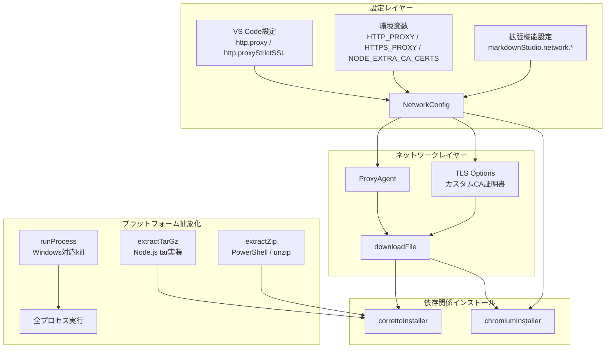
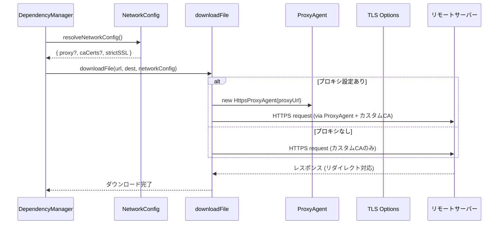
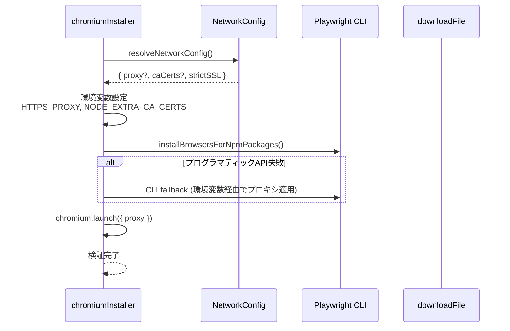

# 設計ドキュメント: Enterprise Environment Support

## 概要

Markdown Studio VS Code拡張機能に、企業・エンタープライズ環境での利用を可能にするサポートを追加する。現在、Corretto JDKとChromiumのダウンロード処理（`download.ts`）は生のNode.js `https`/`http`モジュールを使用しており、プロキシ設定やカスタムCA証明書に対応していない。また、`extract.ts`のtar展開はシステムの`tar`コマンドに依存しており、一部のWindows環境で動作しない。`runProcess.ts`の`SIGKILL`もWindows上で異なる挙動を示す。

本設計では以下の4つの柱で対応する:
1. **HTTPプロキシサポート** — VS Code設定およびシステム環境変数からプロキシ情報を取得し、全HTTPダウンロードに適用
2. **カスタムCA証明書サポート** — Zscaler等のSSLインスペクションツールが注入するCA証明書を信頼
3. **Windows互換性強化** — tar展開のNode.js純粋実装、SIGKILLの代替、パス処理の統一
4. **Playwright/Chromiumプロキシ対応** — Chromiumインストールおよびブラウザ起動時のプロキシ設定

## アーキテクチャ



## シーケンス図

### ダウンロードフロー（プロキシ・CA証明書対応）



### Chromiumインストールフロー



## コンポーネントとインターフェース

### コンポーネント1: NetworkConfig（新規）

**目的**: プロキシURL、CA証明書パス、SSL検証設定を統一的に解決する

**ファイル**: `src/infra/networkConfig.ts`

```typescript
export interface NetworkConfig {
  /** HTTPSプロキシURL (例: "http://proxy.corp.example.com:8080") */
  proxyUrl?: string;
  /** カスタムCA証明書のファイルパス配列 */
  caCertPaths: string[];
  /** SSL証明書検証を厳密に行うか (デフォルト: true) */
  strictSSL: boolean;
}

/**
 * VS Code設定、拡張機能設定、環境変数からネットワーク設定を解決する。
 * 優先順位: 拡張機能設定 > VS Code設定 > 環境変数
 */
export function resolveNetworkConfig(): NetworkConfig;
```

**責務**:
- VS Codeの`http.proxy`設定を読み取る
- 環境変数`HTTP_PROXY`/`HTTPS_PROXY`/`NO_PROXY`をフォールバックとして使用
- `NODE_EXTRA_CA_CERTS`環境変数および拡張機能設定からCA証明書パスを収集
- VS Codeの`http.proxyStrictSSL`設定を反映

### コンポーネント2: downloadFile（改修）

**目的**: プロキシとカスタムCA証明書を使用したHTTPダウンロード

**ファイル**: `src/deps/download.ts`

```typescript
/**
 * 改修後のdownloadFile関数シグネチャ。
 * NetworkConfigを受け取り、プロキシエージェントとTLSオプションを適用する。
 */
export async function downloadFile(
  url: string,
  destPath: string,
  networkConfig?: NetworkConfig,
  _redirectCount?: number
): Promise<void>;
```

**責務**:
- `NetworkConfig.proxyUrl`が存在する場合、`https-proxy-agent`を使用してリクエストを送信
- `NetworkConfig.caCertPaths`からCA証明書を読み込み、TLSオプションの`ca`に追加
- `NetworkConfig.strictSSL`が`false`の場合、`rejectUnauthorized: false`を設定
- 既存のリダイレクト処理を維持

### コンポーネント3: extractTarGz（改修）

**目的**: Windows環境でもtar.gz展開を確実に動作させる

**ファイル**: `src/deps/extract.ts`

```typescript
/**
 * Node.js組み込みのzlibとtarストリーム解析による展開。
 * システムtarコマンドへの依存を排除する。
 */
export async function extractTarGz(
  archivePath: string,
  destDir: string
): Promise<void>;
```

**責務**:
- `zlib.createGunzip()`でgzip解凍
- `tar-stream`ライブラリ（または同等のNode.js実装）でtarエントリを解析
- ファイルパーミッションの適切な設定（Unix系のみ）
- パストラバーサル攻撃の防止

### コンポーネント4: runProcess（改修）

**目的**: Windows上でのプロセス終了処理を正しく行う

**ファイル**: `src/infra/runProcess.ts`

```typescript
/**
 * Windows対応のプロセス強制終了。
 * Windows: taskkill /F /T /PID を使用
 * Unix: SIGKILL を使用
 */
function killProcess(child: ChildProcess): void;
```

**責務**:
- Windows上では`taskkill /F /T /PID`でプロセスツリーごと終了
- Unix系では従来通り`SIGKILL`を使用
- タイムアウト時の確実なクリーンアップ

### コンポーネント5: chromiumInstaller（改修）

**目的**: プロキシ環境下でのChromiumインストールと起動

**ファイル**: `src/deps/chromiumInstaller.ts`

```typescript
export const chromiumInstaller = {
  async install(
    storageDir: string,
    progress: (message: string, increment: number) => void,
    networkConfig?: NetworkConfig
  ): Promise<InstallerResult>;

  async verify(
    storageDir: string,
    networkConfig?: NetworkConfig
  ): Promise<InstallerResult>;
};
```

**責務**:
- インストール前に`HTTPS_PROXY`/`NODE_EXTRA_CA_CERTS`環境変数を設定
- Playwright CLIフォールバック時にも環境変数経由でプロキシを適用
- `chromium.launch()`に`proxy`オプションを渡す（検証時）

## データモデル

### NetworkConfig

```typescript
export interface NetworkConfig {
  proxyUrl?: string;
  caCertPaths: string[];
  strictSSL: boolean;
}
```

**バリデーションルール**:
- `proxyUrl`が指定される場合、有効なURL形式であること（http:// または https://）
- `caCertPaths`の各パスは存在するファイルを指すこと（存在しないパスは警告ログを出力し無視）
- `strictSSL`のデフォルトは`true`

### MarkdownStudioConfig（拡張）

```typescript
export interface MarkdownStudioConfig {
  // ... 既存フィールド ...
  
  /** ネットワーク設定（プロキシ・CA証明書） */
  network: {
    /** カスタムCA証明書ファイルパス（複数指定可） */
    caCertPaths: string[];
  };
}
```

### package.json設定スキーマ（追加）

```typescript
// 追加する設定項目
{
  "markdownStudio.network.caCertificates": {
    type: "array",
    items: { type: "string" },
    default: [],
    description: "追加のCA証明書ファイルパス（PEM形式）。Zscaler等のSSLインスペクション環境で使用。"
  }
}
```

## 主要関数の形式仕様

### 関数1: resolveNetworkConfig()

```typescript
export function resolveNetworkConfig(): NetworkConfig
```

**事前条件:**
- VS Code APIが利用可能であること（拡張機能コンテキスト内で呼び出されること）

**事後条件:**
- 返却される`NetworkConfig`オブジェクトは常に有効
- `proxyUrl`が設定されている場合、`http://`または`https://`で始まる文字列
- `caCertPaths`は空配列または有効なファイルパスの配列
- `strictSSL`は必ずboolean値

**ループ不変条件:** N/A

### 関数2: downloadFile()（改修版）

```typescript
export async function downloadFile(
  url: string,
  destPath: string,
  networkConfig?: NetworkConfig,
  _redirectCount?: number
): Promise<void>
```

**事前条件:**
- `url`は有効なHTTPまたはHTTPS URL
- `destPath`は書き込み可能なファイルパス
- `networkConfig`が指定される場合、有効な`NetworkConfig`オブジェクト
- `_redirectCount`は0以上`MAX_REDIRECTS`以下

**事後条件:**
- 成功時: `destPath`にダウンロードされたファイルが存在する
- 失敗時: 部分ファイルはクリーンアップされ、適切なエラーメッセージを含むErrorがthrowされる
- リダイレクトは最大`MAX_REDIRECTS`回まで追跡される
- プロキシ設定がある場合、全リクエストがプロキシ経由で送信される

**ループ不変条件:**
- リダイレクトループ: `_redirectCount`は各再帰呼び出しで1ずつ増加し、`MAX_REDIRECTS`を超えない

### 関数3: extractTarGz()（改修版）

```typescript
export async function extractTarGz(
  archivePath: string,
  destDir: string
): Promise<void>
```

**事前条件:**
- `archivePath`は有効なtar.gzファイルを指す
- `destDir`は存在するディレクトリ

**事後条件:**
- `destDir`配下にアーカイブの全エントリが展開される
- パストラバーサル（`../`を含むパス）のエントリはスキップされる
- Unix系OSではファイルパーミッションが0o755以下に設定される
- シンボリックリンクエントリは安全に処理される（destDir外へのリンクは無視）

**ループ不変条件:**
- tarエントリ処理ループ: 全ての処理済みエントリは`destDir`配下に存在する

### 関数4: killProcess()

```typescript
function killProcess(child: ChildProcess): void
```

**事前条件:**
- `child`は有効な`ChildProcess`オブジェクト
- `child.pid`が定義されている

**事後条件:**
- Windows: `taskkill /F /T /PID {pid}`が実行され、プロセスツリーが終了
- Unix: `SIGKILL`シグナルが送信される
- プロセス終了に失敗した場合でもエラーはthrowされない（ベストエフォート）

**ループ不変条件:** N/A

## アルゴリズム擬似コード

### ネットワーク設定解決アルゴリズム

```typescript
function resolveNetworkConfig(): NetworkConfig {
  // Step 1: プロキシURLの解決（優先順位順）
  const vscodeProxy = vscode.workspace.getConfiguration("http").get<string>("proxy");
  const envProxy = process.env.HTTPS_PROXY || process.env.HTTP_PROXY 
                   || process.env.https_proxy || process.env.http_proxy;
  const proxyUrl = vscodeProxy || envProxy || undefined;

  // Step 2: SSL厳密検証の解決
  const strictSSL = vscode.workspace.getConfiguration("http")
    .get<boolean>("proxyStrictSSL", true);

  // Step 3: CA証明書パスの収集
  const caCertPaths: string[] = [];
  
  // 拡張機能設定から
  const configPaths = vscode.workspace.getConfiguration("markdownStudio")
    .get<string[]>("network.caCertificates", []);
  caCertPaths.push(...configPaths);
  
  // NODE_EXTRA_CA_CERTS環境変数から
  const envCaCert = process.env.NODE_EXTRA_CA_CERTS;
  if (envCaCert && !caCertPaths.includes(envCaCert)) {
    caCertPaths.push(envCaCert);
  }

  return { proxyUrl, caCertPaths, strictSSL };
}
```

### プロキシ対応ダウンロードアルゴリズム

```typescript
async function downloadFile(
  url: string,
  destPath: string,
  networkConfig?: NetworkConfig,
  _redirectCount = 0
): Promise<void> {
  if (_redirectCount > MAX_REDIRECTS) {
    throw new Error(`Too many redirects (>${MAX_REDIRECTS})`);
  }

  // Step 1: TLSオプションの構築
  const tlsOptions: https.RequestOptions = {};
  
  if (networkConfig) {
    // カスタムCA証明書の読み込み
    if (networkConfig.caCertPaths.length > 0) {
      const caCerts: string[] = [];
      for (const certPath of networkConfig.caCertPaths) {
        try {
          const cert = await fs.promises.readFile(certPath, "utf-8");
          caCerts.push(cert);
        } catch {
          // 読み込めない証明書は警告ログを出力しスキップ
          console.warn(`CA certificate not readable: ${certPath}`);
        }
      }
      if (caCerts.length > 0) {
        tlsOptions.ca = caCerts;
      }
    }
    
    // SSL検証設定
    if (!networkConfig.strictSSL) {
      tlsOptions.rejectUnauthorized = false;
    }
    
    // プロキシエージェントの設定
    if (networkConfig.proxyUrl) {
      const { HttpsProxyAgent } = await import("https-proxy-agent");
      tlsOptions.agent = new HttpsProxyAgent(networkConfig.proxyUrl, {
        ca: tlsOptions.ca,
        rejectUnauthorized: tlsOptions.rejectUnauthorized,
      });
    }
  }

  // Step 2: HTTPリクエスト実行（既存ロジック + tlsOptions適用）
  return new Promise<void>((resolve, reject) => {
    const get = url.startsWith("https") ? https.get : http.get;
    const request = get(url, tlsOptions, (response) => {
      // ... 既存のリダイレクト・レスポンス処理 ...
      // リダイレクト時はnetworkConfigを引き継ぐ
    });
    // ... 既存のエラーハンドリング ...
  });
}
```

### Node.js純粋tar.gz展開アルゴリズム

```typescript
import * as zlib from "zlib";
import { pipeline } from "stream/promises";
import * as tar from "tar-stream";

async function extractTarGz(archivePath: string, destDir: string): Promise<void> {
  const absoluteDestDir = path.resolve(destDir);
  const extract = tar.extract();

  extract.on("entry", async (header, stream, next) => {
    // Step 1: パストラバーサル防止
    const entryPath = path.join(absoluteDestDir, header.name);
    const resolvedPath = path.resolve(entryPath);
    
    if (!resolvedPath.startsWith(absoluteDestDir + path.sep) 
        && resolvedPath !== absoluteDestDir) {
      // 危険なパス — スキップ
      stream.resume();
      next();
      return;
    }

    // Step 2: エントリタイプに応じた処理
    if (header.type === "directory") {
      await fs.promises.mkdir(resolvedPath, { recursive: true });
      stream.resume();
      next();
    } else if (header.type === "file") {
      await fs.promises.mkdir(path.dirname(resolvedPath), { recursive: true });
      const writeStream = fs.createWriteStream(resolvedPath);
      stream.pipe(writeStream);
      writeStream.on("finish", () => {
        // Unix系でのパーミッション設定
        if (process.platform !== "win32" && header.mode) {
          const mode = header.mode & 0o755;
          fs.promises.chmod(resolvedPath, mode).catch(() => {});
        }
        next();
      });
      writeStream.on("error", (err) => next(err));
    } else {
      // シンボリックリンク等 — スキップ
      stream.resume();
      next();
    }
  });

  // Step 3: パイプライン実行
  const gunzip = zlib.createGunzip();
  const readStream = fs.createReadStream(archivePath);
  
  await pipeline(readStream, gunzip, extract);
}
```

### Windows対応プロセス終了アルゴリズム

```typescript
import { spawn, ChildProcess } from "node:child_process";

function killProcess(child: ChildProcess): void {
  if (!child.pid) return;

  if (process.platform === "win32") {
    // Windows: taskkillでプロセスツリーごと強制終了
    // /F = 強制終了, /T = 子プロセスも含む, /PID = プロセスID指定
    try {
      spawn("taskkill", ["/F", "/T", "/PID", String(child.pid)], {
        stdio: "ignore",
      });
    } catch {
      // ベストエフォート — 既に終了している場合もある
    }
  } else {
    // Unix: SIGKILL送信
    child.kill("SIGKILL");
  }
}

// runProcess内での使用
async function runProcess(
  command: string,
  args: string[],
  timeoutMs: number,
  cwd?: string
): Promise<ProcessResult> {
  return new Promise((resolve) => {
    const child = spawn(command, args, {
      cwd,
      stdio: ["ignore", "pipe", "pipe"],
    });

    let timedOut = false;
    const timer = setTimeout(() => {
      timedOut = true;
      killProcess(child);  // SIGKILL → killProcess に変更
    }, timeoutMs);

    // ... 既存のstdout/stderr/close/errorハンドリング ...
  });
}
```

### Chromiumプロキシ対応アルゴリズム

```typescript
async function installChromium(
  storageDir: string,
  progress: ProgressCallback,
  networkConfig?: NetworkConfig
): Promise<InstallerResult> {
  const browsersDir = getBrowserPath(storageDir);
  await fs.promises.mkdir(browsersDir, { recursive: true });
  process.env.PLAYWRIGHT_BROWSERS_PATH = browsersDir;

  // Step 1: プロキシ環境変数の設定（Playwright CLIが参照する）
  if (networkConfig?.proxyUrl) {
    process.env.HTTPS_PROXY = networkConfig.proxyUrl;
    process.env.HTTP_PROXY = networkConfig.proxyUrl;
  }
  if (networkConfig?.caCertPaths.length) {
    // Playwrightは NODE_EXTRA_CA_CERTS を参照する
    process.env.NODE_EXTRA_CA_CERTS = networkConfig.caCertPaths[0];
  }
  if (networkConfig && !networkConfig.strictSSL) {
    process.env.NODE_TLS_REJECT_UNAUTHORIZED = "0";
  }

  // Step 2: インストール実行（既存ロジック）
  try {
    const server = await import("playwright-core/lib/server");
    await server.installBrowsersForNpmPackages(["playwright"]);
  } catch {
    // CLI fallback — 環境変数は既に設定済み
    // ... 既存のCLIフォールバック ...
  }

  // Step 3: 検証（プロキシ設定付き）
  try {
    const { chromium } = await import("playwright");
    const launchOptions: any = { headless: true };
    if (networkConfig?.proxyUrl) {
      launchOptions.proxy = { server: networkConfig.proxyUrl };
    }
    const browser = await chromium.launch(launchOptions);
    await browser.close();
    return { ok: true, path: browsersDir };
  } catch (err) {
    return {
      ok: false,
      error: `Chromium verification failed: ${err instanceof Error ? err.message : String(err)}`,
    };
  }
}
```

## 使用例

```typescript
// 例1: 基本的なダウンロード（プロキシ・CA証明書対応）
import { resolveNetworkConfig } from "./infra/networkConfig";
import { downloadFile } from "./deps/download";

const networkConfig = resolveNetworkConfig();
await downloadFile(
  "https://corretto.aws/downloads/latest/amazon-corretto-21-x64-linux-jdk.tar.gz",
  "/tmp/corretto.tar.gz",
  networkConfig
);

// 例2: DependencyManagerからの統合利用
const depManager = new DependencyManager();
// ensureAll内部でresolveNetworkConfig()を呼び出し、
// correttoInstallerとchromiumInstallerにnetworkConfigを渡す

// 例3: Windows上でのtar.gz展開
import { extractTarGz } from "./deps/extract";
// Node.js純粋実装のため、システムtarコマンド不要
await extractTarGz("/path/to/archive.tar.gz", "/path/to/dest");

// 例4: プロキシ環境でのChromiumインストール
const networkConfig = resolveNetworkConfig();
const result = await chromiumInstaller.install(storageDir, progress, networkConfig);
```

## 正当性プロパティ

*プロパティとは、システムの全ての有効な実行において成り立つべき特性や振る舞いのことである。プロパティは人間が読める仕様と機械的に検証可能な正当性保証の橋渡しとなる。*

### Property 1: NetworkConfig有効性不変条件

*For any* VS Code設定と環境変数の組み合わせに対して、`resolveNetworkConfig()`は常に有効な`NetworkConfig`オブジェクトを返す（`proxyUrl`がundefinedまたは文字列、`caCertPaths`が配列、`strictSSL`がboolean）

**Validates: Requirements 1.6**

### Property 2: プロキシURL優先順位解決

*For any* プロキシURL値に対して、VS Code `http.proxy`設定が構成されている場合はその値が使用され、未構成の場合は環境変数`HTTPS_PROXY`/`HTTP_PROXY`の値がフォールバックとして使用される

**Validates: Requirements 1.1, 1.2**

### Property 3: CA証明書パス収集

*For any* `markdownStudio.network.caCertificates`設定値と`NODE_EXTRA_CA_CERTS`環境変数の組み合わせに対して、`resolveNetworkConfig()`の`caCertPaths`は両方のソースからの全パスを含む（重複なし）

**Validates: Requirements 1.3, 1.4**

### Property 4: tar展開パストラバーサル防止

*For any* tar.gzアーカイブとエントリパス（`../`を含むパストラバーサルを含む）に対して、`extractTarGz()`で展開された全ファイルは指定された展開先ディレクトリ配下に存在し、ディレクトリ外にファイルが書き込まれることはない

**Validates: Requirements 3.2, 3.3**

### Property 5: tar展開パーミッション制限

*For any* tarエントリのモード値に対して、Unix系OSで展開されたファイルのパーミッションは0o755以下に制限される

**Validates: Requirements 3.4**

### Property 6: downloadFile後方互換性

*For any* URL・宛先パスの組み合わせに対して、`networkConfig`パラメータを省略して`downloadFile()`を呼び出した場合、プロキシエージェントやカスタムTLSオプションは適用されず、既存の動作と同一である

**Validates: Requirements 2.4**

## エラーハンドリング

### エラーシナリオ1: プロキシ接続失敗

**条件**: プロキシURLが設定されているが、プロキシサーバーに接続できない
**レスポンス**: `Network error downloading {url}: connect ECONNREFUSED {proxyHost}:{proxyPort}` エラーをthrow
**復旧**: ユーザーにプロキシ設定の確認を促すエラーメッセージを表示。VS Code設定`http.proxy`の値を確認するよう案内

### エラーシナリオ2: カスタムCA証明書が無効

**条件**: 指定されたCA証明書ファイルが存在しない、または不正なPEM形式
**レスポンス**: 警告ログを出力し、該当証明書をスキップ。他の証明書やシステムデフォルトで続行
**復旧**: 出力チャネルに警告メッセージを表示。証明書パスの確認を案内

### エラーシナリオ3: SSL証明書検証エラー（Zscaler等）

**条件**: SSLインスペクションにより証明書チェーンが信頼できない
**レスポンス**: `UNABLE_TO_VERIFY_LEAF_SIGNATURE`または`SELF_SIGNED_CERT_IN_CHAIN`エラー
**復旧**: エラーメッセージにCA証明書設定の案内を含める。`markdownStudio.network.caCertificates`設定または`NODE_EXTRA_CA_CERTS`環境変数の設定を提案

### エラーシナリオ4: Windows上でのtar展開失敗

**条件**: tar.gzアーカイブが破損している、またはディスク容量不足
**レスポンス**: 展開エラーをthrow。部分展開されたファイルはクリーンアップ
**復旧**: アーカイブの再ダウンロードを試行

### エラーシナリオ5: taskkillによるプロセス終了失敗

**条件**: Windows上でtaskkillコマンドが失敗（権限不足等）
**レスポンス**: エラーを無視（ベストエフォート）。プロセスは最終的にOSにより回収される
**復旧**: 特別な復旧処理なし。次回実行時に正常動作

## テスト戦略

### ユニットテスト

- `resolveNetworkConfig()`: VS Code設定モック、環境変数モックを使用して各優先順位パターンをテスト
- `downloadFile()`: `nock`等でHTTPモックを作成し、プロキシエージェント適用・CA証明書適用・リダイレクト処理をテスト
- `extractTarGz()`: テスト用tar.gzファイルを作成し、パストラバーサル防止・正常展開をテスト
- `killProcess()`: `process.platform`をモックし、Windows/Unix両方のコードパスをテスト

### プロパティベーステスト

**ライブラリ**: fast-check（既にdevDependenciesに含まれている）

- `resolveNetworkConfig`: 任意の環境変数・設定値の組み合わせで常に有効なNetworkConfigを返す
- `extractTarGz`: 任意のファイル名（パストラバーサルを含む）でdestDir外にファイルが作成されない
- `downloadFile`: networkConfigの有無に関わらず、成功時は必ずファイルが存在する

### 統合テスト

- 実際のプロキシサーバー（テスト用）を起動し、プロキシ経由のダウンロードをE2Eテスト
- Windows CI環境でのtar.gz展開テスト
- Playwright Chromiumのプロキシ対応インストールテスト

## パフォーマンス考慮事項

- **プロキシエージェントの再利用**: 同一プロキシURLに対するエージェントインスタンスをキャッシュし、接続のオーバーヘッドを削減
- **CA証明書の遅延読み込み**: 証明書ファイルはダウンロード時に初めて読み込み、拡張機能起動時の遅延を回避
- **tar-streamのメモリ効率**: ストリーミング処理によりアーカイブ全体をメモリに展開しない
- **Node.js tar展開 vs システムtar**: Node.js実装はシステムtarより若干遅い可能性があるが、クロスプラットフォーム互換性を優先

## セキュリティ考慮事項

- **パストラバーサル防止**: tar展開時に`../`を含むパスを検出・拒否（Zip Slip攻撃対策）
- **CA証明書の検証**: 指定されたCA証明書ファイルのPEM形式を検証
- **strictSSL=falseの警告**: SSL検証を無効化する場合、出力チャネルに警告を表示
- **プロキシ認証情報の保護**: プロキシURLに含まれる認証情報をログに出力しない
- **環境変数の復元**: Playwright用に設定した環境変数（`HTTPS_PROXY`等）は処理完了後に元の値に復元

## 依存関係

### 新規追加パッケージ

| パッケージ | バージョン | 用途 |
|-----------|-----------|------|
| `https-proxy-agent` | ^7.x | HTTPSプロキシエージェント |
| `tar-stream` | ^3.x | Node.js純粋tar解析（Windows対応） |

### 既存パッケージ（変更なし）

| パッケージ | 用途 |
|-----------|------|
| `playwright` | Chromiumブラウザ制御 |

### Node.js組み込みモジュール（追加使用）

| モジュール | 用途 |
|-----------|------|
| `zlib` | gzip解凍（extractTarGzで使用） |
| `stream/promises` | ストリームパイプライン |
