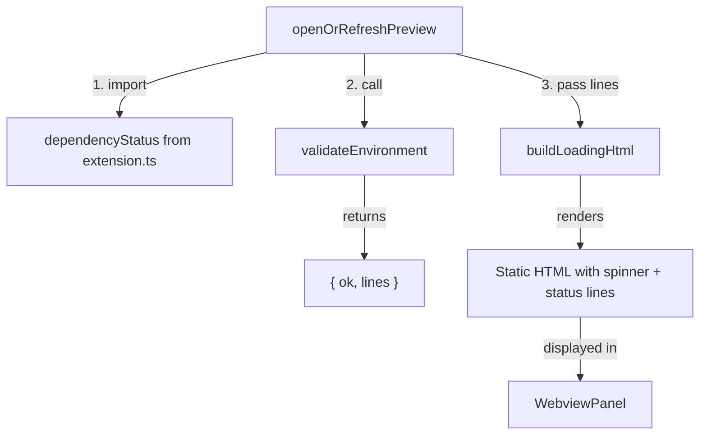
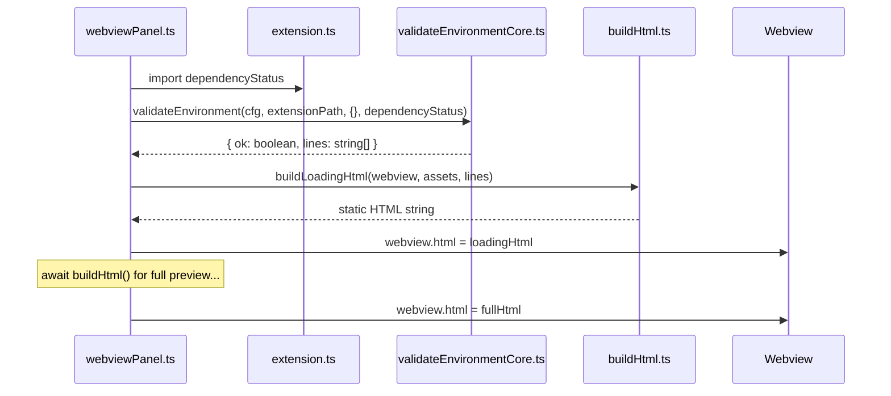

# Design Document: Loading Screen Enhancement

## Overview

The preview loading screen currently shows only a CSS spinner while the full preview renders. Two problems exist: (1) users have no visibility into whether their environment is healthy while waiting, and (2) the loading HTML contains a `<div id="ms-loading-timer">` element intended for a JS-based countdown timer, but the CSP policy on the loading page blocks all scripts (`script-src` is absent), so the timer never runs.

This enhancement adds static environment validation status lines (Java, PlantUML jar, Chromium, temp directory) to the loading screen so users see reassuring feedback immediately, and removes the dead timer element and its associated JS code from `preview.js`. Since the loading page is fully static HTML with no script execution, all information must be gathered before HTML generation and embedded directly.

## Architecture





## Components and Interfaces

### Component 1: webviewPanel.ts (modified)

**Purpose**: Orchestrates gathering environment status and passing it to the loading HTML builder before showing the loading screen.

**Interface change**:
```typescript
// New import
import { validateEnvironment } from '../commands/validateEnvironmentCore';
import { dependencyStatus } from '../extension';
import { getConfig } from '../infra/config';

// Inside openOrRefreshPreview, before buildLoadingHtml calls:
const cfg = getConfig();
const envResult = await validateEnvironment(cfg, context.extensionPath, {}, dependencyStatus);
panel.webview.html = buildLoadingHtml(panel.webview, assets, envResult.lines);
```

**Responsibilities**:
- Gather environment validation results before showing loading screen
- Pass status lines to `buildLoadingHtml()`
- No changes to the full preview flow (`buildHtml()` call remains unchanged)

### Component 2: buildHtml.ts (modified)

**Purpose**: `buildLoadingHtml()` gains a new optional parameter for status lines and embeds them as static HTML. The timer div is removed from both `buildLoadingHtml()` and `buildHtml()`.

**Interface change**:
```typescript
export function buildLoadingHtml(
  webview?: vscode.Webview,
  assets?: { styleUri: vscode.Uri; scriptUri?: vscode.Uri; hljsStyleUri?: vscode.Uri },
  statusLines?: string[]
): string
```

**Responsibilities**:
- Accept optional `statusLines` array
- Render each line as a `<div>` with appropriate CSS class based on ✅/❌ prefix
- Remove the `ms-loading-timer` div from loading HTML
- Remove the `ms-loading-timer` div from the full preview HTML in `buildHtml()`

### Component 3: preview.js (modified)

**Purpose**: Remove the dead timer code that never executes on the loading page.

**Responsibilities**:
- Remove `_loadingTimerId`, `_loadingStartTime`, `_updateTimerText()` variables/function
- Remove timer logic from `showLoadingOverlay()` and `hideLoadingOverlay()`
- Remove the timer div from the dynamically created overlay in `showLoadingOverlay()`
- Keep the spinner and overlay show/hide logic intact

### Component 4: preview.css (modified)

**Purpose**: Add styles for the environment status lines display and remove the timer style.

**Responsibilities**:
- Add `.ms-env-status` container style
- Add `.ms-env-line` base style
- Add `.ms-env-ok` and `.ms-env-fail` color variants
- Remove `.ms-loading-timer` style

## Data Models

### Environment Status Lines

The status lines come from `validateEnvironment()` which already returns:
```typescript
interface EnvironmentValidationResult {
  ok: boolean;
  lines: string[];  // e.g. ["✅ Java detected (managed Corretto)", "❌ Managed Chromium browser not available"]
}
```

No new data models are needed. The `lines` array is passed through as-is and rendered into HTML.

## Key Functions with Formal Specifications

### Function 1: buildLoadingHtml() (modified signature)

```typescript
export function buildLoadingHtml(
  webview?: vscode.Webview,
  assets?: { styleUri: vscode.Uri; scriptUri?: vscode.Uri; hljsStyleUri?: vscode.Uri },
  statusLines?: string[]
): string
```

**Preconditions:**
- `webview` may be undefined (for testing); if undefined, CSP source defaults to `'none'`
- `assets` may be undefined; if undefined, stylesheet href defaults to `''`
- `statusLines` may be undefined or empty array; if undefined/empty, no status section is rendered

**Postconditions:**
- Returns valid HTML string with `<!doctype html>` prefix
- If `statusLines` is provided and non-empty, HTML contains one `<div class="ms-env-line ...">` per line
- Lines starting with `✅` get class `ms-env-ok`; lines starting with `❌` get class `ms-env-fail`
- HTML does NOT contain any `<script>` tags
- HTML does NOT contain `ms-loading-timer` element
- CSP `default-src 'none'` is preserved (no script-src)

**Loop Invariants:** N/A

### Function 2: showLoadingOverlay() in preview.js (simplified)

```typescript
function showLoadingOverlay(): void
```

**Preconditions:**
- DOM is available (runs in webview context)

**Postconditions:**
- Overlay element exists in DOM with `display: flex`
- Overlay contains spinner div only (no timer div)
- No interval timers are created

### Function 3: hideLoadingOverlay() in preview.js (simplified)

```typescript
function hideLoadingOverlay(): void
```

**Preconditions:**
- DOM is available

**Postconditions:**
- Overlay element has `display: none`
- No interval timers to clear (simplified from current implementation)

## Algorithmic Pseudocode

### Loading HTML Generation

```pascal
ALGORITHM buildLoadingHtml(webview, assets, statusLines)
INPUT: webview (optional), assets (optional), statusLines (optional string array)
OUTPUT: HTML string

BEGIN
  styleHref ← assets?.styleUri.toString() ?? ''
  cspSource ← webview?.cspSource ?? 'none'
  
  statusHtml ← ''
  IF statusLines IS NOT NULL AND statusLines.length > 0 THEN
    statusHtml ← '<div class="ms-env-status">'
    FOR EACH line IN statusLines DO
      IF line starts with '✅' THEN
        cssClass ← 'ms-env-line ms-env-ok'
      ELSE IF line starts with '❌' THEN
        cssClass ← 'ms-env-line ms-env-fail'
      ELSE
        cssClass ← 'ms-env-line'
      END IF
      statusHtml ← statusHtml + '<div class="' + cssClass + '">' + escapeHtml(line) + '</div>'
    END FOR
    statusHtml ← statusHtml + '</div>'
  END IF
  
  RETURN html template with:
    - CSP: default-src 'none'; style-src {cspSource} 'unsafe-inline'
    - Stylesheet link to styleHref
    - Spinner div (existing)
    - statusHtml (new)
    - NO timer div
    - NO script tags
END
```

### Environment Status Gathering in webviewPanel

```pascal
ALGORITHM gatherAndShowLoading(context, panel, assets)
INPUT: context (ExtensionContext), panel (WebviewPanel), assets (PreviewAssetUris)
OUTPUT: loading HTML set on panel.webview

BEGIN
  cfg ← getConfig()
  depStatus ← import dependencyStatus from extension.ts
  
  envResult ← validateEnvironment(cfg, context.extensionPath, {}, depStatus)
  
  panel.webview.html ← buildLoadingHtml(panel.webview, assets, envResult.lines)
END
```

## Example Usage

```typescript
// In webviewPanel.ts — before the full buildHtml() call:
import { validateEnvironment } from '../commands/validateEnvironmentCore';
import { dependencyStatus } from '../extension';
import { getConfig } from '../infra/config';

// Inside openOrRefreshPreview:
const cfg = getConfig();
const envResult = await validateEnvironment(cfg, context.extensionPath, {}, dependencyStatus);
panel.webview.html = buildLoadingHtml(panel.webview, assets, envResult.lines);

// The loading screen now shows:
// ┌─────────────────────────────────┐
// │          [spinner]              │
// │                                 │
// │  ✅ Java detected (managed)     │
// │  ✅ Bundled PlantUML jar found  │
// │  ✅ Temp directory writable     │
// │  ✅ Managed Chromium available  │
// └─────────────────────────────────┘
```

## Correctness Properties

*A property is a characteristic or behavior that should hold true across all valid executions of a system — essentially, a formal statement about what the system should do. Properties serve as the bridge between human-readable specifications and machine-verifiable correctness guarantees.*

### Property 1: Status line count invariant

*For any* array of N status line strings passed to `buildLoadingHtml()`, the output HTML SHALL contain exactly N elements with class `ms-env-line`.

**Validates: Requirements 1.1, 7.1**

### Property 2: Status line CSS class classification

*For any* status line string, if it starts with ✅ the corresponding div SHALL have class `ms-env-ok`, if it starts with ❌ the div SHALL have class `ms-env-fail`, and if it starts with neither prefix the div SHALL have only the base class `ms-env-line`.

**Validates: Requirements 1.2, 1.3, 1.4**

### Property 3: No script execution in loading page

*For any* input (including any combination of webview, assets, and statusLines), the output of `buildLoadingHtml()` SHALL contain no `<script` tags and SHALL include a CSP meta tag with `default-src 'none'` and no `script-src` directive.

**Validates: Requirements 4.1, 4.2**

### Property 4: Timer removal completeness

*For any* input to `buildLoadingHtml()`, the output HTML SHALL not contain any element with id or class `ms-loading-timer`.

**Validates: Requirement 3.1**

### Property 5: HTML escaping of status lines

*For any* status line string containing HTML-special characters (`<`, `>`, `&`, `"`), the output of `buildLoadingHtml()` SHALL contain the escaped form of those characters and SHALL not contain the raw unescaped HTML within the status line div content.

**Validates: Requirement 4.3**

## Error Handling

### Scenario 1: validateEnvironment() throws

**Condition**: Java binary hangs, file system error, or unexpected exception during validation.
**Response**: Catch the error in `webviewPanel.ts` and fall back to calling `buildLoadingHtml()` with no status lines (empty array), so the user still sees the spinner.
**Recovery**: The full preview continues to render via `buildHtml()` regardless of whether the loading screen had status info.

### Scenario 2: dependencyStatus is undefined

**Condition**: Extension activation failed before `ensureAll()` completed, or `dependencyStatus` hasn't been set yet.
**Response**: Pass `undefined` as the `managedDeps` parameter to `validateEnvironment()`. The function handles this gracefully — it skips the Chromium line and falls back to system Java path.
**Recovery**: Status lines will show whatever could be validated; missing items simply won't appear.

## Testing Strategy

### Unit Testing Approach

- Test `buildLoadingHtml()` with various `statusLines` inputs: empty, all-ok, mixed, undefined
- Verify CSS class assignment (`ms-env-ok` / `ms-env-fail`) based on line prefix
- Verify no `<script>` tag or `ms-loading-timer` in output
- Verify `buildHtml()` no longer contains `ms-loading-timer`
- Test HTML escaping of status lines

### Property-Based Testing Approach

**Property Test Library**: fast-check

- For any array of status lines, `buildLoadingHtml()` output contains exactly `lines.length` elements with class `ms-env-line`
- For any status line starting with `✅`, the corresponding div has class `ms-env-ok`
- For any status line starting with `❌`, the corresponding div has class `ms-env-fail`
- `buildLoadingHtml()` output never contains `<script` regardless of input

### Integration Testing Approach

- Verify the full flow: `openOrRefreshPreview` → loading HTML contains status lines → full HTML replaces it
- Verify that `validateEnvironment()` results are correctly threaded through to the loading HTML

## Security Considerations

- The loading page CSP remains `default-src 'none'; style-src {cspSource} 'unsafe-inline'` — no script execution allowed
- Status lines must be HTML-escaped before embedding to prevent injection
- No new CSP permissions are needed since status display is pure static HTML

## Dependencies

- No new external dependencies
- Uses existing `validateEnvironment()` from `src/commands/validateEnvironmentCore.ts`
- Uses existing `dependencyStatus` from `src/extension.ts`
- Uses existing `getConfig()` from `src/infra/config.ts`
