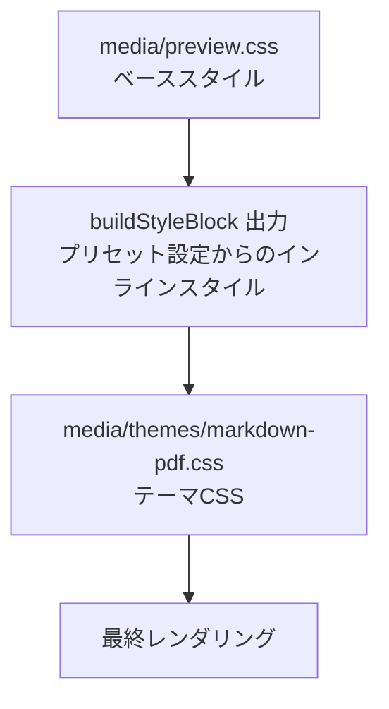
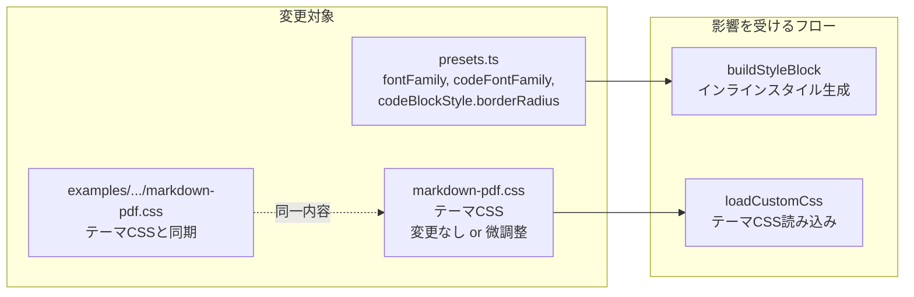

# 設計書: markdown-pdf テーマCSS精度改善

## 概要

本設計は、`markdown-pdf` テーマのCSSスタイルをオリジナルの Markdown PDF 拡張機能（yzane/vscode-markdown-pdf）のデフォルトスタイルに正確に一致させるための変更を定義する。

変更対象は3つのファイルに限定される:

1. **`media/themes/markdown-pdf.css`** — テーマCSS本体
2. **`src/infra/presets.ts`** — プリセット設定オブジェクト（`buildStyleBlock` で使用）
3. **`examples/custom-styles/markdown-pdf.css`** — カスタムスタイル例ファイル（テーマCSSと同一内容を維持）

現状のテーマCSSは既にオリジナル拡張機能のスタイルに近いが、一部のプリセット設定値（`fontFamily`、`codeFontFamily`、`codeBlockStyle.borderRadius`）がテーマCSSと不整合を起こしている。`buildStyleBlock` がプリセット設定値からインラインスタイルを生成するため、この不整合によりテーマCSSの値がインラインスタイルで上書きされる問題がある。

## アーキテクチャ

### スタイル適用の優先順位



HTMLの `<head>` 内でのスタイル読み込み順序:

1. `preview.css`（`<link>` タグ）
2. `buildStyleBlock` 出力（`<style>` タグ、プリセット設定値から生成）
3. テーマCSS（`<style>` タグ、`loadCustomCss` 経由）

CSS の詳細度が同等の場合、後に読み込まれたスタイルが優先される。ただし `buildStyleBlock` が生成するインラインスタイルは `body` や `pre` に直接適用されるため、テーマCSSの同一セレクタと競合する。**プリセット設定値とテーマCSS値が一致していれば、どちらが優先されても結果は同じになる。**

### 変更の影響範囲



## コンポーネントとインターフェース

### 変更: `src/infra/presets.ts`

`MARKDOWN_PDF_DEFAULTS` の値をテーマCSSと一致させる。

```typescript
const MARKDOWN_PDF_DEFAULTS: PresetStyleDefaults = {
  // 変更前: '-apple-system, BlinkMacSystemFont, "Segoe UI", Helvetica, Arial, sans-serif'
  // 変更後: テーマCSSのbody font-familyと一致
  fontFamily: '-apple-system, BlinkMacSystemFont, "Segoe WPC", "Segoe UI", "Ubuntu", "Droid Sans", sans-serif',
  fontSize: 14,       // 変更なし（テーマCSSと一致済み）
  lineHeight: 1.6,    // 変更なし（テーマCSSと一致済み）
  margin: '20mm',     // 変更なし
  // 変更前: '"SFMono-Regular", Consolas, "Liberation Mono", Menlo, monospace'
  // 変更後: テーマCSSのcode font-familyと一致
  codeFontFamily: '"SFMono-Regular", Consolas, "Liberation Mono", Menlo, Courier, monospace',
  headingStyle: {
    h1FontWeight: 600,
    h1MarginTop: '24px',
    h1MarginBottom: '16px',
    h2MarginTop: '24px',
    h2MarginBottom: '16px',
  },
  codeBlockStyle: {
    background: '#f6f8fa',
    border: '1px solid #d0d7de',
    // 変更前: '6px'
    // 変更後: テーマCSSのpre border-radiusと一致
    borderRadius: '3px',
    padding: '16px',    // 変更なし（テーマCSSでは '16px'）
  },
};
```

**変更理由:**

| プロパティ | 現在値 | 修正値 | 理由 |
| --- | --- | --- | --- |
| `fontFamily` | `"Segoe UI", Helvetica, Arial` | `"Segoe WPC", "Segoe UI", "Ubuntu", "Droid Sans"` | テーマCSSの `body` `font-family` と一致させる |
| `codeFontFamily` | `Menlo, monospace` | `Menlo, Courier, monospace` | テーマCSSの `code` `font-family` と一致させる（`Courier` が欠落） |
| `codeBlockStyle.borderRadius` | `6px` | `3px` | テーマCSSの `pre` `border-radius` と一致させる |

### 変更: `media/themes/markdown-pdf.css`

現状のテーマCSSは既に要件の大部分を満たしている。要件との差分を確認し、必要に応じて微調整する。

**現状の確認結果:** テーマCSSの全スタイル値は要件1〜8の受け入れ基準と一致している。変更不要。

### 変更: `examples/custom-styles/markdown-pdf.css`

テーマCSSと同一内容を維持する。現状既に同一であるため、テーマCSSに変更がなければ変更不要。

## データモデル

### PresetStyleDefaults（変更箇所のみ）

| フィールド | 型 | 現在値 | 修正値 |
| --- | --- | --- | --- |
| `fontFamily` | `string` | `-apple-system, BlinkMacSystemFont, "Segoe UI", Helvetica, Arial, sans-serif` | `-apple-system, BlinkMacSystemFont, "Segoe WPC", "Segoe UI", "Ubuntu", "Droid Sans", sans-serif` |
| `codeFontFamily` | `string` | `"SFMono-Regular", Consolas, "Liberation Mono", Menlo, monospace` | `"SFMono-Regular", Consolas, "Liberation Mono", Menlo, Courier, monospace` |
| `codeBlockStyle.borderRadius` | `string` | `6px` | `3px` |

### CSS値の参照テーブル

テーマCSSとプリセット設定の整合性を検証するための参照値:

| CSS セレクタ | プロパティ | 期待値 | ソース |
| --- | --- | --- | --- |
| `body` | `font-family` | `-apple-system, BlinkMacSystemFont, "Segoe WPC", "Segoe UI", "Ubuntu", "Droid Sans", sans-serif` | 要件6.1 |
| `body` | `font-size` | `14px` | 要件6.2 |
| `body` | `line-height` | `1.6` | 要件6.2 |
| `pre` | `border-radius` | `3px` | 要件2.1 |
| `code` | `font-family` | `"SFMono-Regular", Consolas, "Liberation Mono", Menlo, Courier, monospace` | 要件2.2 |

## エラーハンドリング

### エラーシナリオ 1: プリセット設定とテーマCSSの不整合

**条件:** `presets.ts` の値とテーマCSSの値が異なる場合
**影響:** `buildStyleBlock` が生成するインラインスタイルがテーマCSSの値を上書きし、意図しないスタイルが適用される
**対応:** テストで不整合を検出し、CI で防止する

### エラーシナリオ 2: テーマCSSとカスタムスタイル例の不同期

**条件:** `media/themes/markdown-pdf.css` と `examples/custom-styles/markdown-pdf.css` の内容が異なる場合
**影響:** ユーザーがカスタムスタイル例を参考にした場合、テーマCSSと異なるスタイルが適用される
**対応:** テストでファイル内容の同一性を検証し、CI で防止する

### エラーシナリオ 3: preview.css との競合

**条件:** `preview.css` のベーススタイルがテーマCSSの値と競合する場合
**影響:** CSS詳細度の問題でテーマCSSの値が適用されない可能性がある
**対応:** テーマCSSはベーススタイルの後に読み込まれるため、同一詳細度であればテーマCSSが優先される。テストで主要な競合ポイントを検証する。

## テスト戦略

### PBT適用性の評価

本機能はプロパティベーステスト（PBT）の適用対象外である。理由:

- 全ての受け入れ基準は**静的なCSS値の検証**（特定のプロパティが特定の値を持つことの確認）
- 入力に応じて振る舞いが変化する関数やロジックが存在しない
- 「任意の入力に対してプロパティP(X)が成立する」という形式の命題を構成できない
- これは**構成検証**と**スナップショットテスト**の領域

### ユニットテスト

**`test/unit/markdownPdfTheme.test.ts`** — テーマCSS値の検証

テーマCSSファイルを読み込み、各要素のスタイル値が要件と一致することを検証する。CSSをパースして個別のプロパティ値をアサートする。

テストケース:
- 見出しスタイル（h1〜h6）の `font-size`、`font-weight`、`margin`、`border-bottom`
- コードブロック（`pre`）の `background`、`border`、`border-radius`、`padding`
- インラインコード（`code`）の `font-size`、`padding`、`background`、`border-radius`
- テーブル（`table`、`th`、`td`）のスタイル
- ブロック引用（`blockquote`）のスタイル
- リンク（`a`）の `color`、`text-decoration`
- 基本タイポグラフィ（`body`）の `font-family`、`font-size`、`line-height`、`color`
- 水平線（`hr`）のスタイル
- リスト（`ul`、`ol`）の `padding-left`
- ダークモード（`.vscode-dark`）の各スタイル
- 印刷スタイル（`@media print`）の各スタイル

**`test/unit/markdownPdfPresetSync.test.ts`** — プリセット設定とテーマCSSの整合性検証

プリセット設定値とテーマCSSの対応する値が一致することを検証する。

テストケース:
- `fontFamily` がテーマCSSの `body` `font-family` と一致
- `fontSize` がテーマCSSの `body` `font-size` と一致
- `lineHeight` がテーマCSSの `body` `line-height` と一致
- `codeFontFamily` がテーマCSSの `code` `font-family` と一致
- `codeBlockStyle.background` がテーマCSSの `pre` `background` と一致
- `codeBlockStyle.border` がテーマCSSの `pre` `border` と一致
- `codeBlockStyle.borderRadius` がテーマCSSの `pre` `border-radius` と一致
- `codeBlockStyle.padding` がテーマCSSの `pre` `padding` と一致

**`test/unit/markdownPdfExampleSync.test.ts`** — カスタムスタイル例の同期検証

テストケース:
- `examples/custom-styles/markdown-pdf.css` と `media/themes/markdown-pdf.css` のファイル内容が同一

### テスト実装方針

CSSファイルのパースには正規表現ベースの簡易パーサーを使用する。完全なCSSパーサーライブラリの追加は不要（対象が限定的なため）。テストヘルパーとして以下の関数を実装する:

```typescript
/** CSSファイルからセレクタに対応するプロパティ値を抽出する */
function extractCssProperty(css: string, selector: string, property: string): string | null;

/** CSSファイルからメディアクエリ内のプロパティ値を抽出する */
function extractMediaProperty(css: string, media: string, selector: string, property: string): string | null;
```
