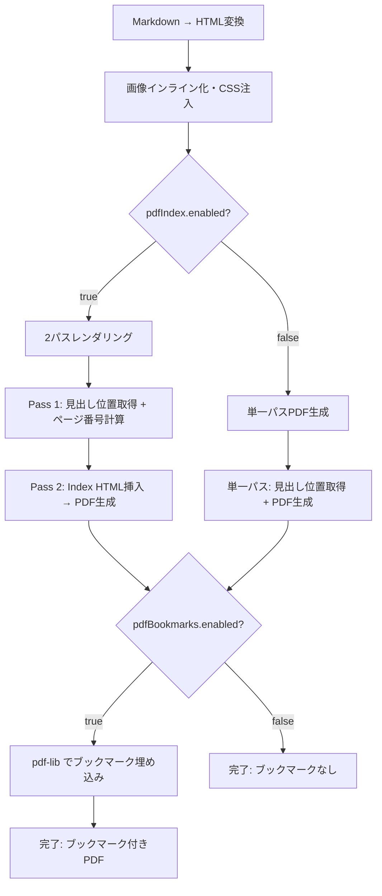
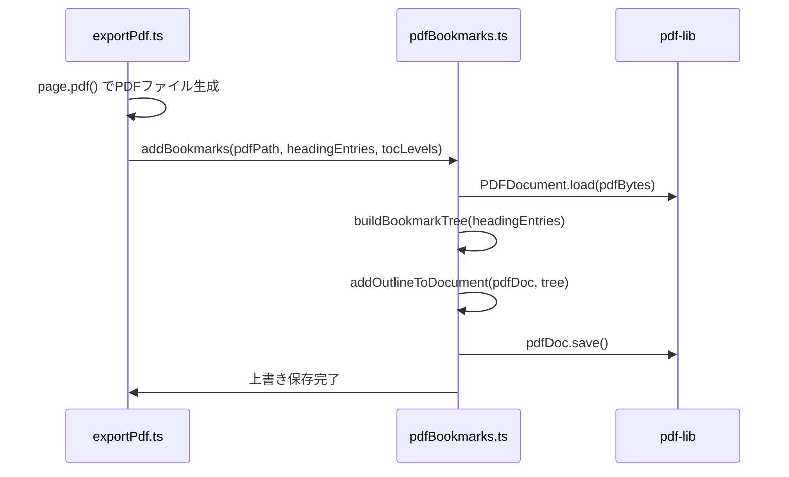

# 設計書: PDFブックマーク（しおり）生成

## 概要

Markdown Studio のPDFエクスポート機能に、ネイティブPDFブックマーク（アウトライン/しおり）を追加する。PDFブックマークとは、Adobe Reader、Preview.app、Chrome等のPDFビューアのサイドバーに表示されるツリー型ナビゲーション機能であり、既存のPDF Index（目次ページ）とは異なるPDFフォーマットレベルの機能である。

Playwrightの `page.pdf()` APIはPDFブックマーク生成をネイティブにサポートしていないため、生成済みPDFファイルを `pdf-lib` ライブラリで後処理し、ブックマークアウトラインを埋め込む。見出しデータは既存の2パスレンダリング（`exportPdf.ts`）で収集済みのものを再利用し、見出し階層（H1→トップレベル、H2→H1の子、等）に基づくブックマークツリーを構築する。

本機能は `markdownStudio.export.pdfBookmarks.enabled`（デフォルト: `true`）設定で切り替え可能とし、`pdfIndex.enabled` が `false`（目次ページなし）の場合でも、単一パスのページ番号推定によりブックマークを生成する。

## アーキテクチャ

### 全体フロー



### ブックマーク埋め込みフロー



## コンポーネントとインターフェース

### 新規: pdfBookmarks.ts

PDFブックマーク生成の中核モジュール。`pdf-lib` を使用してPDFファイルにアウトラインを埋め込む。

```typescript
import { PDFDocument, PDFRef, PDFDict, PDFName, PDFString, PDFArray, PDFNumber } from 'pdf-lib';
import fs from 'node:fs/promises';

/** ブックマークツリーのノード */
export interface BookmarkNode {
  title: string;
  pageIndex: number;   // 0-based ページインデックス
  level: number;       // 見出しレベル (1-6)
  children: BookmarkNode[];
}

/**
 * フラットな見出しエントリ配列からブックマークツリーを構築する。
 * 見出しレベルの階層関係に基づき、親子関係を決定する。
 */
export function buildBookmarkTree(
  entries: BookmarkEntry[],
  minLevel: number,
  maxLevel: number
): BookmarkNode[];

/**
 * 生成済みPDFファイルにブックマークアウトラインを埋め込む。
 * pdf-lib を使用してPDFのOutlineディクショナリを構築し、ファイルを上書き保存する。
 */
export async function addBookmarks(
  pdfPath: string,
  entries: BookmarkEntry[],
  minLevel: number,
  maxLevel: number
): Promise<void>;
```

**責務:**

- フラットな見出しリストからツリー構造への変換
- pdf-lib を使用したPDFアウトラインディクショナリの構築
- PDFファイルの読み込み・上書き保存

### 変更: exportPdf.ts

既存のエクスポートパイプラインにブックマーク生成ステップを追加する。

```typescript
// 既存の page.pdf() 呼び出し後に追加
if (cfg.pdfBookmarks.enabled) {
  progress?.report('Adding bookmarks...', 5);
  await addBookmarks(outputPath, headingEntries, cfg.toc.minLevel, cfg.toc.maxLevel);
}
```

**変更点:**

- `pdfBookmarks.enabled` 設定の読み込み
- PDF生成後のブックマーク埋め込み呼び出し
- `pdfIndex.enabled=false` 時の単一パスでの見出し位置取得ロジック追加

### 変更: config.ts

新しい設定項目 `pdfBookmarks` の読み込みを追加する。`MarkdownStudioConfig` インターフェースに `pdfBookmarks: PdfBookmarksConfig` フィールドを追加し、`getConfig()` 内で値を読み込む。

```typescript
// MarkdownStudioConfig インターフェースに追加
pdfBookmarks: PdfBookmarksConfig;

// getConfig() 内に追加
pdfBookmarks: {
  enabled: cfg.get<boolean>('export.pdfBookmarks.enabled', true),
},
```

### 変更: models.ts

`PdfBookmarksConfig` インターフェースと `BookmarkEntry` 型を追加する。既存の `HeadingPageEntry`（`pdfIndex.ts`）は `anchorId` フィールドを含むが、ブックマーク生成にはアンカーIDは不要なため、より軽量な `BookmarkEntry` 型を別途定義する。

```typescript
/** PDFブックマーク設定 */
export interface PdfBookmarksConfig {
  enabled: boolean;
}

/** ブックマーク生成用の見出しエントリ（HeadingPageEntryからanchorIdを除いた軽量版） */
export interface BookmarkEntry {
  level: number;
  text: string;
  pageNumber: number;  // 1-based ページ番号
}
```

### 変更: package.json

`pdf-lib` 依存関係と新しい設定項目を追加する。

```json
{
  "dependencies": {
    "pdf-lib": "^1.17.1"
  },
  "contributes": {
    "configuration": {
      "properties": {
        "markdownStudio.export.pdfBookmarks.enabled": {
          "type": "boolean",
          "default": true,
          "markdownDescription": "PDFエクスポート時にブックマーク（しおり/アウトライン）を生成する。PDFビューアのサイドバーナビゲーションに表示される。"
        }
      }
    }
  }
}
```

## データモデル

### BookmarkEntry

| フィールド | 型 | 説明 |
| --- | --- | --- |
| `level` | `number` | 見出しレベル (1-6) |
| `text` | `string` | 見出しテキスト（プレーンテキスト） |
| `pageNumber` | `number` | ページ番号 (1-based) |

### BookmarkNode（ツリーノード）

| フィールド | 型 | 説明 |
| --- | --- | --- |
| `title` | `string` | ブックマーク表示テキスト |
| `pageIndex` | `number` | ページインデックス (0-based) |
| `level` | `number` | 見出しレベル (1-6) |
| `children` | `BookmarkNode[]` | 子ブックマークノード |

### PDFアウトライン構造

PDFのアウトラインは `/Outlines` ディクショナリで表現される。各アウトラインアイテムは以下のキーを持つ:

| キー | 型 | 説明 |
| --- | --- | --- |
| `/Title` | `PDFString` | ブックマーク表示テキスト |
| `/Parent` | `PDFRef` | 親ノードへの参照 |
| `/First` | `PDFRef` | 最初の子ノードへの参照 |
| `/Last` | `PDFRef` | 最後の子ノードへの参照 |
| `/Next` | `PDFRef` | 次の兄弟ノードへの参照 |
| `/Prev` | `PDFRef` | 前の兄弟ノードへの参照 |
| `/Count` | `PDFNumber` | 子孫ノード数（負値=折りたたみ） |
| `/Dest` | `PDFArray` | 宛先ページ参照 + 表示モード |

## 主要関数の形式仕様

### buildBookmarkTree()

```typescript
function buildBookmarkTree(
  entries: BookmarkEntry[],
  minLevel: number,
  maxLevel: number
): BookmarkNode[]
```

**事前条件:**

- `entries` の各要素の `level` は 1〜6 の整数
- `minLevel` ≤ `maxLevel`、両方とも 1〜6 の範囲
- `entries` の各要素の `pageNumber` は 1 以上

**事後条件:**

- 返却されるツリーのルートノードは `minLevel` の見出しのみ
- 各ノードの `children` には、そのノードより深いレベルの見出しが含まれる
- ツリーの全ノード数は入力 `entries` のうち `minLevel`〜`maxLevel` 範囲内のエントリ数と一致
- 入力配列の順序がツリーの深さ優先走査順序と一致

**ループ不変条件:**

- スタックの各要素は現在の走査パス上の祖先ノードを表す
- スタックのレベルは常に単調増加

### addBookmarks()

```typescript
async function addBookmarks(
  pdfPath: string,
  entries: BookmarkEntry[],
  minLevel: number,
  maxLevel: number
): Promise<void>
```

**事前条件:**

- `pdfPath` は有効なPDFファイルへのパス
- `entries` は空でない配列
- PDFファイルのページ数 ≥ `max(entries[i].pageNumber)` for all i

**事後条件:**

- PDFファイルが `/Outlines` ディクショナリを含む状態で上書き保存される
- 各ブックマークの宛先ページが正しいページオブジェクトを参照する
- ブックマークの階層構造が `buildBookmarkTree` の出力と一致
- 元のPDFコンテンツ（ページ、テキスト、画像等）は変更されない

## アルゴリズム擬似コード

### ブックマークツリー構築アルゴリズム

```typescript
function buildBookmarkTree(entries: BookmarkEntry[], minLevel: number, maxLevel: number): BookmarkNode[] {
  // minLevel〜maxLevel 範囲でフィルタリング
  const filtered = entries.filter(e => e.level >= minLevel && e.level <= maxLevel);
  if (filtered.length === 0) return [];

  const roots: BookmarkNode[] = [];
  // スタック: 現在の祖先パスを保持（レベル昇順）
  const stack: BookmarkNode[] = [];

  for (const entry of filtered) {
    const node: BookmarkNode = {
      title: entry.text,
      pageIndex: entry.pageNumber - 1,
      level: entry.level,
      children: [],
    };

    // スタックから現在のレベル以上のノードをポップ
    // 不変条件: stack[i].level < stack[i+1].level
    while (stack.length > 0 && stack[stack.length - 1].level >= entry.level) {
      stack.pop();
    }

    if (stack.length === 0) {
      // ルートノード
      roots.push(node);
    } else {
      // 最も近い祖先の子として追加
      stack[stack.length - 1].children.push(node);
    }

    stack.push(node);
  }

  return roots;
}
```

### PDFアウトライン埋め込みアルゴリズム

```typescript
async function addBookmarks(
  pdfPath: string,
  entries: BookmarkEntry[],
  minLevel: number,
  maxLevel: number
): Promise<void> {
  const tree = buildBookmarkTree(entries, minLevel, maxLevel);
  if (tree.length === 0) return;

  const pdfBytes = await fs.readFile(pdfPath);
  const pdfDoc = await PDFDocument.load(pdfBytes);
  const pages = pdfDoc.getPages();

  // Outlines ルートディクショナリを作成
  const outlinesRef = createOutlinesDictionary(pdfDoc, tree, pages);

  // PDFカタログに /Outlines を設定
  const catalog = pdfDoc.catalog;
  catalog.set(PDFName.of('Outlines'), outlinesRef);

  // /PageMode を /UseOutlines に設定（ビューア起動時にブックマークパネルを表示）
  catalog.set(PDFName.of('PageMode'), PDFName.of('UseOutlines'));

  const modifiedBytes = await pdfDoc.save();
  await fs.writeFile(pdfPath, modifiedBytes);
}
```

### 単一パス見出し位置取得（pdfIndex.enabled=false 時）

```typescript
// exportPdf.ts 内: pdfIndex.enabled=false かつ pdfBookmarks.enabled=true の場合
async function collectHeadingsForBookmarks(
  page: PlaywrightPage,
  pdfBuffer: Buffer,
  minLevel: number,
  maxLevel: number
): Promise<BookmarkEntry[]> {
  // PDFバイナリからページ数を取得
  const pdfStr = pdfBuffer.toString('latin1');
  const pageMatches = pdfStr.match(/\/Type\s*\/Page(?!s)/g);
  const totalPages = pageMatches ? pageMatches.length : 1;

  // DOM から見出し位置を取得
  const domData = await page.evaluate(/* 既存の見出し走査ロジック */);

  // ページ番号を計算（pageOffset=0、目次ページなし）
  return domData.headings.map(h => {
    const ratio = domData.scrollHeight > 0 ? h.offsetTop / domData.scrollHeight : 0;
    const pageNumber = Math.min(Math.floor(ratio * totalPages) + 1, totalPages);
    return { level: h.level, text: h.text, pageNumber };
  });
}
```

## 使用例

```typescript
import { buildBookmarkTree, addBookmarks } from './pdfBookmarks';

// 例1: ブックマークツリーの構築
const entries: BookmarkEntry[] = [
  { level: 1, text: 'はじめに', pageNumber: 1 },
  { level: 2, text: '背景', pageNumber: 1 },
  { level: 2, text: '目的', pageNumber: 2 },
  { level: 1, text: '設計', pageNumber: 3 },
  { level: 2, text: 'アーキテクチャ', pageNumber: 3 },
  { level: 3, text: 'コンポーネント構成', pageNumber: 4 },
  { level: 2, text: 'データモデル', pageNumber: 5 },
  { level: 1, text: 'まとめ', pageNumber: 6 },
];

const tree = buildBookmarkTree(entries, 1, 3);
// tree[0] = { title: 'はじめに', pageIndex: 0, children: [
//   { title: '背景', pageIndex: 0, children: [] },
//   { title: '目的', pageIndex: 1, children: [] },
// ]}
// tree[1] = { title: '設計', pageIndex: 2, children: [
//   { title: 'アーキテクチャ', pageIndex: 2, children: [
//     { title: 'コンポーネント構成', pageIndex: 3, children: [] },
//   ]},
//   { title: 'データモデル', pageIndex: 4, children: [] },
// ]}
// tree[2] = { title: 'まとめ', pageIndex: 5, children: [] }

// 例2: PDFへのブックマーク埋め込み
await addBookmarks('/path/to/output.pdf', entries, 1, 3);

// 例3: exportPdf.ts 内での統合
const cfg = getConfig();
// ... PDF生成後 ...
if (cfg.pdfBookmarks.enabled && headingEntries.length > 0) {
  await addBookmarks(outputPath, headingEntries, cfg.toc.minLevel, cfg.toc.maxLevel);
}
```

## 正確性プロパティ

*プロパティとは、システムの全ての有効な実行において真であるべき特性や振る舞いのことである。*

### Property 1: ブックマークツリーのノード数保存

*任意の* `BookmarkEntry[]` 配列と有効な `minLevel`/`maxLevel` に対して、`buildBookmarkTree` が返すツリーの全ノード数（再帰的にカウント）は、入力配列のうち `minLevel`〜`maxLevel` 範囲内のエントリ数と一致すること。

### Property 2: ブックマークツリーの深さ優先走査順序

*任意の* `BookmarkEntry[]` 配列に対して、`buildBookmarkTree` が返すツリーを深さ優先で走査した際のノード順序は、入力配列のフィルタリング後の順序と一致すること。

### Property 3: ページインデックスの範囲制約

*任意の* `BookmarkEntry[]` 配列に対して、`buildBookmarkTree` が返すツリーの全ノードの `pageIndex` は `0` 以上であること。また、入力の `pageNumber` が `n` の場合、対応するノードの `pageIndex` は `n - 1` であること。

### Property 4: ルートノードのレベル制約

*任意の* `BookmarkEntry[]` 配列と有効な `minLevel`/`maxLevel` に対して、`buildBookmarkTree` が返すルートノードは全て、フィルタリング後の最小レベル以下のレベルを持つこと。つまり、ルートノードの子として配置されるべきノードがルートに昇格しないこと。

### Property 5: 空入力に対する安全性

*任意の* 空の `BookmarkEntry[]` 配列に対して、`buildBookmarkTree` は空配列を返し、`addBookmarks` はPDFファイルを変更せずに正常終了すること。

## エラーハンドリング

### エラーシナリオ 1: 見出しが0件

**条件:** ドキュメントに見出しが存在しない、またはフィルタリング後に0件
**対応:** `buildBookmarkTree` が空配列を返し、`addBookmarks` は早期リターン。PDFは変更されない。
**復旧:** 不要（正常動作）

### エラーシナリオ 2: PDFファイル読み込み失敗

**条件:** `pdfPath` が存在しない、またはファイルが破損
**対応:** `pdf-lib` の `PDFDocument.load()` が例外をスロー
**復旧:** 例外が `exportPdf.ts` にバブルアップし、エクスポート失敗として報告。元のPDFファイルは変更されない（読み込み段階で失敗するため）。

### エラーシナリオ 3: ページ番号がPDFページ数を超過

**条件:** 見出しの `pageNumber` がPDFの実際のページ数より大きい
**対応:** `pageIndex` をクランプして最終ページに設定（`Math.min(pageIndex, pages.length - 1)`）
**復旧:** ブックマークは最終ページを指す（グレースフルデグラデーション）

### エラーシナリオ 4: pdf-lib の保存失敗

**条件:** ディスク容量不足、書き込み権限なし等
**対応:** `fs.writeFile` が例外をスロー
**復旧:** 例外が上位にバブルアップ。Playwrightが生成した元のPDFは既にディスク上に存在するため、ブックマークなしのPDFとして残る。

### エラーシナリオ 5: pdfIndex.enabled=false 時の単一パス

**条件:** 目次ページが無効だがブックマークは有効
**対応:** 単一パスでPDF生成後、DOM評価で見出し位置を取得し、ページ番号を推定してブックマークを埋め込む
**復旧:** 不要（正常フロー）

## テスト戦略

### ユニットテスト

`test/unit/pdfBookmarks.test.ts`:

- `buildBookmarkTree` の基本動作（フラット→ツリー変換）
- 見出しレベルフィルタリング（minLevel/maxLevel）
- 空入力での空配列返却
- 単一レベルのみの入力（全てルートノード）
- 深いネスト（H1→H2→H3→H4）
- レベルスキップ（H1→H3、H2なし）
- ページインデックス変換（1-based → 0-based）

### プロパティベーステスト（fast-check）

`test/unit/pdfBookmarks.property.test.ts`:

プロジェクトは既に `fast-check` を devDependencies に含んでおり、多数の `.property.test.ts` ファイルが存在する。各プロパティテストは最低100回のイテレーションで実行する。

| プロパティ | 検証内容 |
| --- | --- |
| Property 1 | ツリーの全ノード数 = フィルタリング後の入力エントリ数 |
| Property 2 | 深さ優先走査順序 = 入力配列のフィルタリング後の順序 |
| Property 3 | 全ノードの pageIndex ≥ 0、pageIndex = pageNumber - 1 |
| Property 4 | ルートノードのレベル制約 |
| Property 5 | 空入力に対する安全性 |

タグ形式: `Feature: pdf-bookmarks, Property {number}: {property_text}`

### 統合テスト

`test/integration/exportPdf.integration.test.ts` に追加:

- `pdfBookmarks.enabled=true` 時にPDFに `/Outlines` ディクショナリが存在すること
- `pdfBookmarks.enabled=false` 時にPDFに `/Outlines` が存在しないこと
- `pdfIndex.enabled=false` かつ `pdfBookmarks.enabled=true` 時にブックマークが生成されること
- ブックマークの階層構造が見出し階層と一致すること

## パフォーマンス考慮事項

- `pdf-lib` によるPDF読み込み・保存は追加のI/Oコストが発生するが、通常のドキュメントサイズ（数MB以下）では無視できるレベル
- ブックマークツリー構築は O(n) で完了（n = 見出し数）
- PDFアウトラインの構築は O(n) で完了
- 大規模ドキュメント（数百見出し）でも性能上の問題は発生しない

## セキュリティ考慮事項

- `pdf-lib` はピュアJavaScript実装であり、外部プロセスの起動やネットワークアクセスを行わない
- PDFファイルの読み書きはローカルファイルシステムのみ（既存の `outputPath` と同一パス）
- 見出しテキストはPDFの文字列オブジェクトとして埋め込まれるため、HTMLインジェクションのリスクはない

## 依存関係

| パッケージ | バージョン | 用途 |
| --- | --- | --- |
| `pdf-lib` | `^1.17.1` | PDFファイルの読み込み・アウトライン埋め込み・保存 |

`pdf-lib` の特徴:

- ピュアJavaScript（ネイティブバイナリ不要）
- Node.js / ブラウザ両対応
- PDFの読み込み・作成・編集が可能
- TypeScript型定義を同梱
- MIT ライセンス
