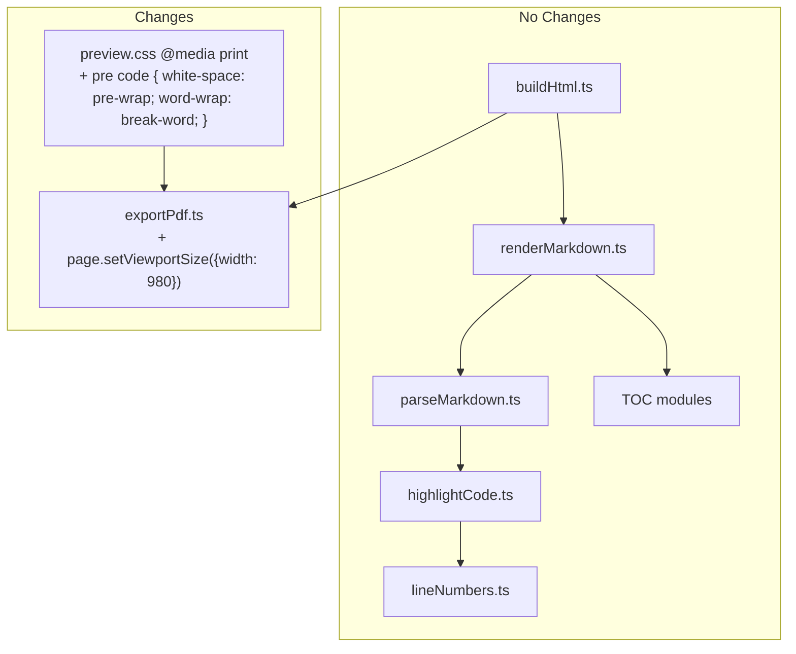
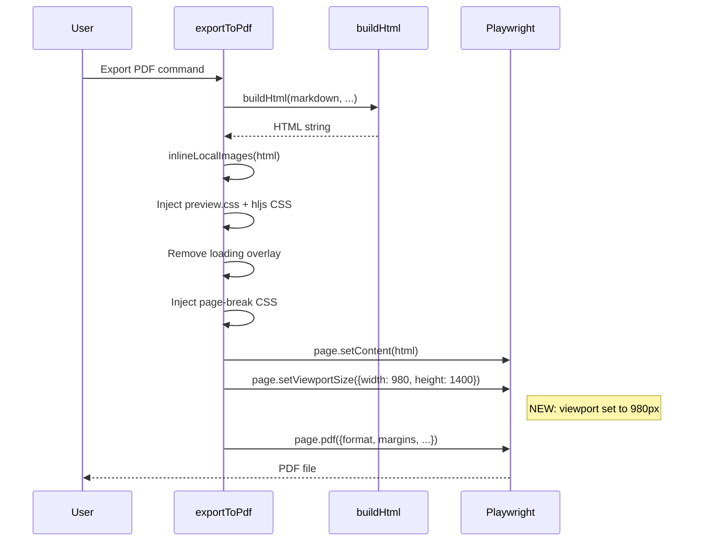

# Design Document: PDF Export Fidelity Improvement

## Overview

This feature improves the fidelity of Markdown Studio's PDF export by addressing two specific rendering discrepancies between the Webview preview and the exported PDF:

1. **Image scaling mismatch**: Playwright uses the default A4 print width (~640px at 96dpi) while the preview body has `max-width: 980px`. Images with `max-width: 100%` shrink in the PDF because the layout width is narrower. The fix is to set the Playwright viewport width to 980px before generating the PDF.

2. **Code line clipping**: `overflow-x: auto` produces scrollbars in the webview, but PDF has no scroll concept, so long code lines are clipped/truncated. The fix is to add `white-space: pre-wrap` and `word-wrap: break-word` for `pre code` elements in `@media print`.

The changes are minimal and surgically scoped:
- **One line** added to `src/export/exportPdf.ts`: `page.setViewportSize({ width: 980, height: 1400 })` after `page.setContent()` and before `page.pdf()`
- **A few CSS rules** added to the existing `@media print` block in `media/preview.css`: `white-space: pre-wrap` and `word-wrap: break-word` for `pre code`
- **No changes** to `src/preview/buildHtml.ts`

### Regression Safety

The design prioritizes regression prevention:
- The viewport width change is Playwright-only, isolated inside `exportToPdf()`. The Webview preview never calls `page.setViewportSize()`.
- The CSS changes are strictly scoped to `@media print`. Screen rendering is unaffected.
- `buildHtml.ts` is not modified. The HTML generation pipeline is identical before and after.
- Existing TOC, line numbers, and preview features are unaffected because the changes operate at a different layer (Playwright viewport) or are media-query scoped.

## Architecture

### Change Scope



### Execution Flow (PDF Export)



### Isolation Guarantees

| Concern | Isolation Mechanism |
| --- | --- |
| Viewport width affects only PDF | `page.setViewportSize()` is called on the Playwright `page` object, which exists only within `exportToPdf()`. The Webview preview uses VS Code's webview API, which has no `setViewportSize()`. |
| CSS changes affect only print | `white-space: pre-wrap` and `word-wrap: break-word` are placed inside `@media print {}`. Screen media queries do not match during Webview rendering. |
| buildHtml.ts unchanged | No modifications to the shared HTML builder. Both preview and PDF paths receive identical HTML. |
| TOC unaffected | TOC HTML is generated by `renderMarkdown.ts` before it reaches `exportPdf.ts`. The viewport width change happens after HTML is set. TOC anchor links, page-break CSS injection, and `.ms-toc` styles are all preserved. |
| Line numbers unaffected | Line number HTML is generated by `lineNumbers.ts` via `highlightCode.ts`. The `pre-wrap` rule targets `.ms-code-content pre code` (code content column) and does not affect `.ms-line-numbers pre` (line number column). The existing `@media print` rule for `.ms-line-numbers pre` in `preview.css` is preserved. |

## Components and Interfaces

### 1. exportPdf.ts — Viewport Width Addition

The only code change in `src/export/exportPdf.ts`:

```typescript
// After page.setContent() and before page.pdf():
await page.setViewportSize({ width: 980, height: 1400 });
```

This is inserted between the existing `page.setContent(html, { waitUntil: 'networkidle' })` call and the `page.pdf()` call. The height value (1400) is arbitrary since PDF generation uses the page format (A4/Letter) for vertical pagination, not the viewport height.

**Design rationale**: Setting the viewport width to 980px matches the `max-width: 980px` on the `<body>` element in `preview.css`. This ensures that `max-width: 100%` images and SVGs are laid out at the same proportional width as in the Webview preview. The `@media print` rule removes `max-width` from body (`max-width: none`), but the viewport width still controls the initial CSS layout width that Playwright uses for rendering.

**No other changes** to `exportPdf.ts`. All existing PDF options (format, margins, header/footer, printBackground, preferCSSPageSize) are passed through unchanged.

### 2. preview.css — Print CSS Addition

Add to the existing `@media print` block in `media/preview.css`:

```css
@media print {
  /* ... existing rules ... */

  pre code {
    white-space: pre-wrap;
    word-wrap: break-word;
  }
}
```

**Design rationale**:
- `white-space: pre-wrap` preserves whitespace and line breaks but allows wrapping at the edge of the container, preventing clipping.
- `word-wrap: break-word` allows long unbroken strings (e.g., URLs in code) to break at arbitrary points.
- These rules are scoped to `@media print` only. The screen rendering retains `white-space: pre` and `overflow-x: auto` for horizontal scrolling.

**Targeting with line numbers**: When line numbers are enabled, the code content lives inside `.ms-code-content pre code`. The `pre code` selector matches this element. The line number column (`.ms-line-numbers pre`) does not contain `<code>` elements, so the `pre-wrap` rule does not apply to it.

### 3. buildHtml.ts — No Changes

`src/preview/buildHtml.ts` is not modified. The `buildStyleBlock()` function already includes `@media print` rules for line numbers. The new print CSS rules are added to `preview.css` (the shared stylesheet), not to the inline style block.

## Data Models

No new data models are required. The existing `MarkdownStudioConfig`, `PdfHeaderFooterConfig`, and `PdfTemplateOptions` types are sufficient. The viewport width (980) is a constant, not a configurable value.


## Correctness Properties

Property-based testing is **not applicable** to this feature. The changes consist of:

1. A single Playwright API call (`page.setViewportSize()`) — this is infrastructure configuration, not a pure function with varying inputs.
2. CSS rules scoped to `@media print` — these are static styling declarations, not data transformations.

There are no pure functions, parsers, serializers, or business logic that would benefit from property-based testing. All acceptance criteria are best verified through:
- **Example-based unit tests**: Static checks on CSS content and code structure
- **Integration tests**: Mock-based verification of Playwright API call ordering and arguments
- **Smoke tests**: Existing test suite regression verification

## Error Handling

| Scenario | Handling |
| --- | --- |
| `page.setViewportSize()` fails | Playwright throws an error, which propagates up through `exportToPdf()`. The existing `try/finally` block ensures `browser.close()` is called. No special handling needed. |
| CSS syntax error in `@media print` | Would be caught during development by CSS linting. The browser silently ignores invalid CSS rules, so a syntax error would degrade gracefully (no wrapping, but no crash). |
| Viewport width causes layout overflow | The 980px width matches the preview's `max-width: 980px`. The `@media print` rule removes `max-width` from body, so the content flows naturally within the viewport width. |

## Testing Strategy

### Unit Tests (Example-Based)

Since PBT does not apply, all testing uses example-based unit tests and integration tests.

**CSS Content Verification** (`test/unit/pdfExportFidelity.test.ts`):

1. Verify `preview.css` `@media print` block contains `white-space: pre-wrap` for `pre code`
   - _Validates: Requirements 2.1, 7.1_
2. Verify `preview.css` `@media print` block contains `word-wrap: break-word` for `pre code`
   - _Validates: Requirements 2.2, 7.2_
3. Verify `preview.css` screen context retains `white-space: pre` on `pre code` and `overflow-x: auto` on `pre`
   - _Validates: Requirements 2.4, 3.2_
4. Verify `preview.css` body retains `max-width: 980px`
   - _Validates: Requirements 3.1_
5. Verify existing `@media print` rules are preserved (body max-width removal, table display, heading margins, copy button hiding, code font-family, `.ms-toc` styles, `.ms-line-numbers` styles)
   - _Validates: Requirements 3.3, 4.4, 5.4, 7.4_
6. Verify `pre-wrap` rule uses `pre code` selector (not just `pre`), ensuring `.ms-line-numbers pre` is unaffected
   - _Validates: Requirements 5.2_

### Integration Tests

**Playwright API Call Verification** (extend `test/integration/exportPdf.integration.test.ts`):

1. Verify `page.setViewportSize({ width: 980, height: 1400 })` is called after `page.setContent()` and before `page.pdf()`
   - _Validates: Requirements 1.1, 6.1, 6.2_
2. Verify `page.pdf()` receives the same options as before (format, margins, header/footer, printBackground, preferCSSPageSize)
   - _Validates: Requirements 1.2_
3. Verify TOC page-break CSS injection still occurs for documents with `<!-- TOC -->` markers
   - _Validates: Requirements 4.1, 4.2_

### Regression Smoke Tests

All existing tests must continue to pass:
- `test/integration/buildHtml.integration.test.ts` — HTML builder unchanged
- `test/integration/toc.integration.test.ts` — TOC pipeline unchanged
- `test/integration/lineNumbers.integration.test.ts` — Line numbers unchanged
- `test/unit/lineNumbers.property.test.ts` — Line number properties unchanged
- `test/unit/buildToc.property.test.ts` — TOC properties unchanged
