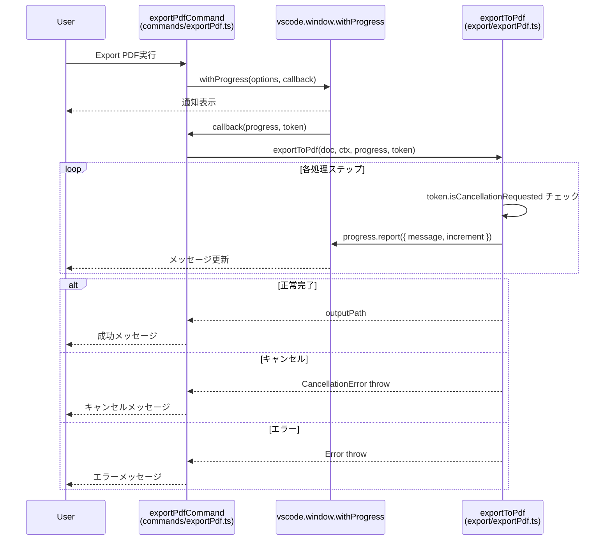
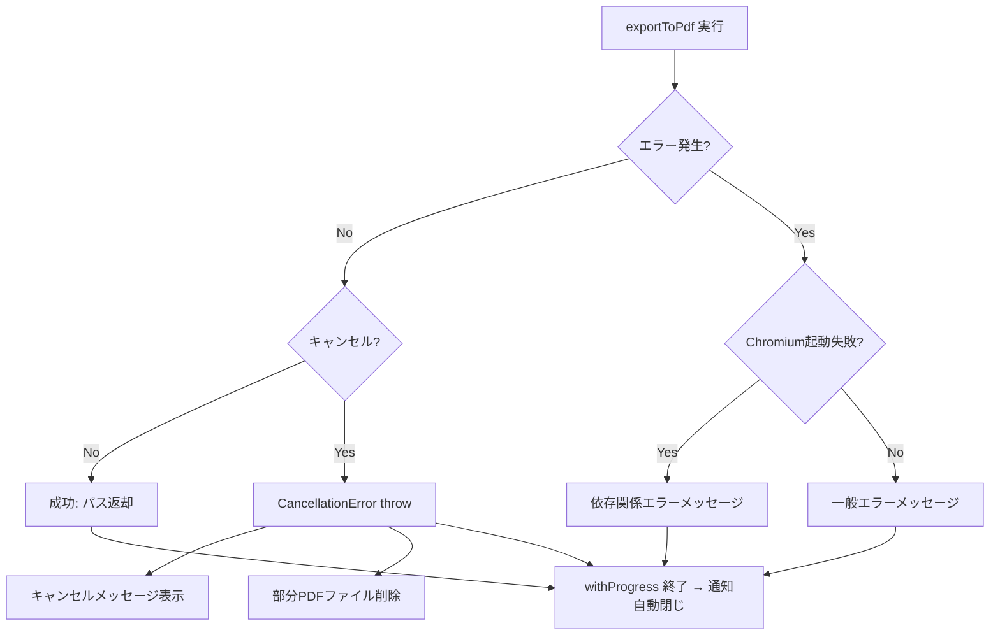

# 設計ドキュメント: PDF Export プログレス通知

## 概要

PDF Exportコマンド（`markdownStudio.exportPdf`）実行時に、VS Codeの通知エリアにプログレス通知を表示する機能を追加する。`vscode.window.withProgress` APIを使用し、エクスポートパイプラインの各ステップ（HTML構築、画像処理、Chromium起動、Mermaid描画、PDF生成、目次生成）の進捗をリアルタイムに表示する。キャンセル機能も提供し、ユーザーが処理を中断できるようにする。

### 設計方針

- 既存の `exportToPdf` 関数のシグネチャを拡張し、`ProgressReporter` と `CancellationToken` を受け取れるようにする
- コマンドレイヤー（`src/commands/exportPdf.ts`）で `withProgress` を呼び出し、エクスポートレイヤー（`src/export/exportPdf.ts`）にプログレスとキャンセルトークンを渡す
- 各処理ステップの前に `progress.report()` を呼び出してメッセージを更新する
- キャンセルトークンを各ステップ間でチェックし、キャンセル要求があれば処理を中断する

## アーキテクチャ



## コンポーネントとインターフェース

### 変更対象ファイル

| ファイル | 変更内容 |
|---------|---------|
| `src/commands/exportPdf.ts` | `withProgress` APIの統合、キャンセル・エラーハンドリング |
| `src/export/exportPdf.ts` | `exportToPdf` のシグネチャ拡張、各ステップでのプログレス報告・キャンセルチェック |

### 新規型定義


`src/export/exportPdf.ts` に以下のインターフェースを追加する:

```typescript
/** プログレス報告用の抽象インターフェース（VS Code APIへの直接依存を避ける） */
export interface ProgressReporter {
  report(message: string, increment?: number): void;
}

/** キャンセルチェック用の抽象インターフェース */
export interface CancellationChecker {
  isCancelled(): boolean;
}
```

VS Code APIの `vscode.Progress` と `vscode.CancellationToken` を直接受け取る代わりに、抽象インターフェースを使用する。これにより:
- `exportToPdf` のユニットテストでモックが容易になる
- エクスポートロジックがVS Code APIに直接依存しない

### コマンドレイヤーの変更 (`src/commands/exportPdf.ts`)

```typescript
export async function exportPdfCommand(context: vscode.ExtensionContext): Promise<void> {
  const editor = vscode.window.activeTextEditor;
  if (!editor || editor.document.languageId !== 'markdown') {
    void vscode.window.showWarningMessage('Markdown Studio: Open a Markdown file first.');
    return;
  }

  try {
    const path = await vscode.window.withProgress(
      {
        location: vscode.ProgressLocation.Notification,
        title: 'Markdown Studio: PDFエクスポート',
        cancellable: true,
      },
      async (progress, token) => {
        const reporter: ProgressReporter = {
          report(message: string, increment?: number) {
            progress.report({ message, increment });
          },
        };
        const cancellation: CancellationChecker = {
          isCancelled() { return token.isCancellationRequested; },
        };
        return exportToPdf(editor.document, context, reporter, cancellation);
      }
    );
    void vscode.window.showInformationMessage(`Markdown Studio: Exported PDF to ${path}`);
  } catch (error) {
    if (error instanceof CancellationError) {
      void vscode.window.showInformationMessage('Markdown Studio: エクスポートがキャンセルされました');
      return;
    }
    const msg = String(error);
    if (msg.includes("Executable doesn't exist") || msg.includes('browserType.launch')) {
      void vscode.window.showErrorMessage(
        'Markdown Studio: Chromium browser not found. Run `npx playwright install chromium` in your terminal, then try again.'
      );
    } else {
      void vscode.window.showErrorMessage(`Markdown Studio PDF export failed: ${msg}`);
    }
  }
}
```

### エクスポートレイヤーの変更 (`src/export/exportPdf.ts`)

`exportToPdf` のシグネチャを拡張:

```typescript
export async function exportToPdf(
  document: vscode.TextDocument,
  context: vscode.ExtensionContext,
  progress?: ProgressReporter,
  cancellation?: CancellationChecker
): Promise<string>
```

`progress` と `cancellation` はオプショナルパラメータとし、後方互換性を維持する。

### プログレスステップ定義

各ステップのメッセージとインクリメント値:

| ステップ | メッセージ | increment |
|---------|-----------|-----------|
| HTML構築 | `HTMLを構築中...` | 15 |
| 画像インライン化 | `画像を処理中...` | 15 |
| Chromium起動 | `ブラウザを起動中...` | 20 |
| Mermaidレンダリング | `ダイアグラムをレンダリング中...` | 15 |
| PDF生成 | `PDFを生成中...` | 20 |
| 目次生成（2パス） | `目次を生成中...` | 15 |

合計: 100%（目次生成がない場合はPDF生成のincrementを35に調整）

### キャンセルチェックポイント

`exportToPdf` 内の以下のタイミングでキャンセルをチェックする:

1. HTML構築後
2. 画像インライン化後
3. Chromium起動後（起動前にもチェック）
4. Mermaidレンダリング後
5. PDF生成前

キャンセル検出時の処理:
```typescript
/** エクスポートキャンセルを示すカスタムエラー */
export class CancellationError extends Error {
  constructor() {
    super('Export cancelled by user');
    this.name = 'CancellationError';
  }
}

function checkCancellation(cancellation?: CancellationChecker): void {
  if (cancellation?.isCancelled()) {
    throw new CancellationError();
  }
}
```

### リソースクリーンアップ

キャンセル時のクリーンアップは既存の `finally` ブロック（`browser.close()`）で対応済み。追加で:
- キャンセル時に部分的に生成されたPDFファイルが存在する場合は削除する
- `CancellationError` を catch した `exportPdfCommand` で、出力パスのファイル存在チェック＆削除を行う

## データモデル

本機能で新規のデータモデルは不要。既存の `vscode.Progress` と `vscode.CancellationToken` のラッパーインターフェースのみ追加する。

```typescript
// ProgressReporter と CancellationChecker は上記「コンポーネントとインターフェース」セクションで定義済み
```

## エラーハンドリング

### エラーフロー



### エラーケース

| ケース | 処理 |
|-------|------|
| 正常完了 | `withProgress` コールバック完了 → 通知自動閉じ → 成功メッセージ |
| ユーザーキャンセル | `CancellationError` throw → `finally` でブラウザ終了 → キャンセルメッセージ |
| Chromium起動失敗 | 既存のエラーハンドリング維持 → 依存関係セットアップ案内 |
| その他のエラー | 既存のエラーハンドリング維持 → エラーメッセージ表示 |

全てのケースで `withProgress` のコールバックが終了（return または throw）するため、プログレス通知は自動的に閉じる。

## テスト戦略

### PBTの適用判断

本機能はプロパティベーステスト（PBT）の対象外とする。理由:
- 全ての受け入れ基準がVS Code APIの呼び出し検証（特定のメッセージ、特定のオプション）
- 入力空間が狭く、固定的な動作の検証が中心
- 外部API（VS Code、Playwright）との統合テストが主体
- 「任意の入力に対して成り立つ普遍的な性質」が存在しない

### ユニットテスト

モックベースのユニットテストで以下を検証する:

1. `exportPdfCommand` のテスト:
   - `withProgress` が `ProgressLocation.Notification` と `cancellable: true` で呼ばれること（要件1.1, 1.4, 3.1）
   - 正常完了時に成功メッセージが表示されること（要件1.3）
   - `CancellationError` 時にキャンセルメッセージが表示されること（要件3.4）
   - Chromium起動失敗時に依存関係案内メッセージが表示されること（要件4.3）
   - その他のエラー時に既存のエラーメッセージが表示されること（要件4.2）

2. `exportToPdf` のプログレス報告テスト:
   - 各ステップで正しいメッセージが `progress.report()` に渡されること（要件2.1〜2.6）
   - メッセージの順序が正しいこと

3. キャンセル機能のテスト:
   - `cancellation.isCancelled()` が `true` の場合に `CancellationError` がthrowされること（要件3.2）
   - キャンセル時にブラウザが確実に終了すること（要件3.3）

4. エラー時のプログレス通知テスト:
   - エラー発生時に `withProgress` コールバックが例外をthrowし、通知が閉じること（要件4.1）

### テストフレームワーク

- 既存のVitest設定（`config/vitest.unit.config.ts`）を使用
- VS Code APIのモックは既存の `test/setup.ts` のパターンに従う
- テストファイル: `test/unit/exportPdfCommand.test.ts`（コマンドレイヤー）、`test/unit/exportPdfProgress.test.ts`（エクスポートレイヤー）
