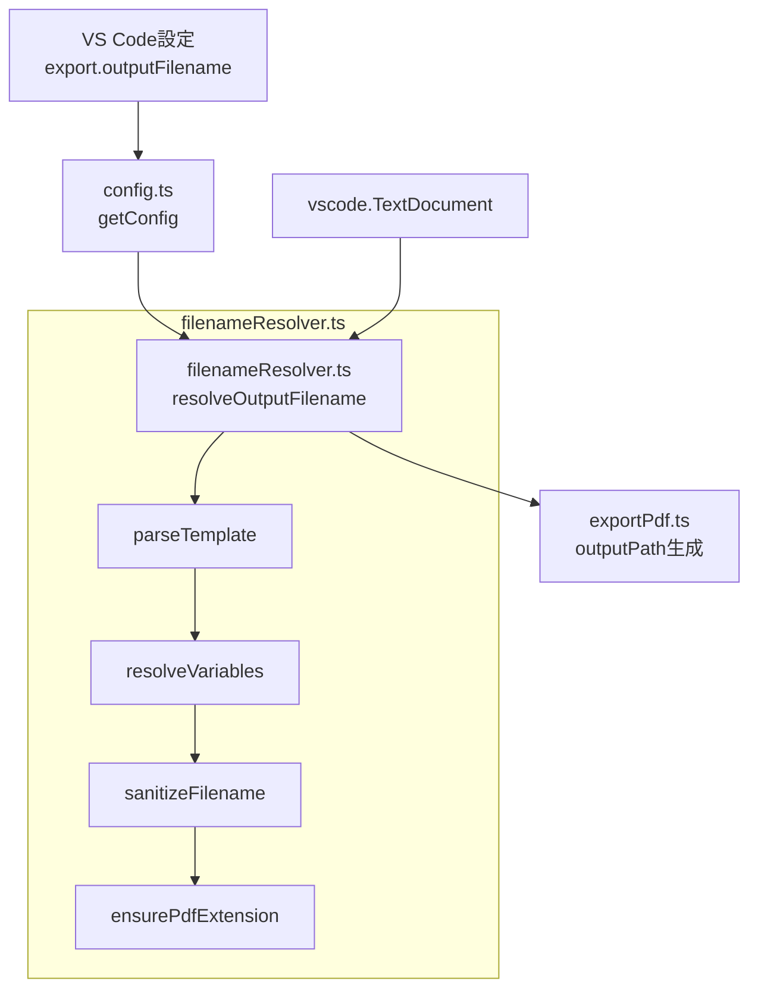

# 設計ドキュメント: PDF出力ファイル名カスタマイズ

## 概要

Markdown StudioのPDFエクスポートにおいて、出力ファイル名をテンプレートベースでカスタマイズする機能を追加する。`src/export/filenameResolver.ts` に新規モジュールを作成し、テンプレート変数のパース・解決・サニタイズを担当させる。既存の `exportPdf.ts` の出力パス生成ロジックを本モジュールに委譲する形で統合する。

## アーキテクチャ



処理フロー:
1. `getConfig()` が `export.outputFilename` 設定値を読み取る
2. `exportToPdf()` が `resolveOutputFilename()` を呼び出す
3. `resolveOutputFilename()` 内でテンプレートのパース → 変数解決 → サニタイズ → `.pdf` 拡張子付与を実行
4. 解決済みファイル名をソースドキュメントのディレクトリと結合して最終出力パスを生成

## コンポーネントとインターフェース

### 1. `src/export/filenameResolver.ts`（新規）

テンプレート解決の中核モジュール。純粋関数で構成し、テスト容易性を確保する。

```typescript
/** テンプレート変数解決に必要なコンテキスト */
export interface FilenameContext {
  /** ソースファイル名（拡張子なし） */
  filename: string;
  /** ソースファイルの拡張子（ドットなし） */
  ext: string;
  /** ドキュメント内の最初のH1見出しテキスト（存在しない場合はundefined） */
  title?: string;
  /** エクスポート実行時刻（テスト時に注入可能） */
  now?: Date;
}

/**
 * テンプレート文字列を解決し、サニタイズ済みのファイル名（.pdf付き）を返す。
 * 空テンプレートの場合は `${filename}` にフォールバックする。
 */
export function resolveOutputFilename(template: string, ctx: FilenameContext): string;

/**
 * テンプレート内の `${variableName}` パターンを検出し、
 * 定義済み変数は値に置換、未定義変数はそのまま残す。
 */
export function resolveVariables(template: string, ctx: FilenameContext): string;

/**
 * ファイルシステムで禁止されている文字の除去、
 * 先頭/末尾の空白・ドットの除去を行う。
 */
export function sanitizeFilename(name: string): string;

/**
 * `.pdf` 拡張子を付与する。既に `.pdf` で終わる場合は付与しない。
 */
export function ensurePdfExtension(name: string): string;

/**
 * Markdownテキストから最初のH1見出しのプレーンテキストを抽出する。
 * H1が存在しない場合は undefined を返す。
 */
export function extractH1Title(markdown: string): string | undefined;
```

### 2. `src/infra/config.ts`（変更）

`MarkdownStudioConfig` インターフェースに `outputFilename` フィールドを追加。

```typescript
export interface MarkdownStudioConfig {
  // ... 既存フィールド
  outputFilename: string;  // 追加
}
```

`getConfig()` 内で設定値を読み取る:

```typescript
outputFilename: cfg.get<string>('export.outputFilename', '${filename}'),
```

### 3. `package.json`（変更）

`contributes.configuration.properties` に設定を追加:

```json
"markdownStudio.export.outputFilename": {
  "type": "string",
  "default": "${filename}",
  "markdownDescription": "PDF出力ファイル名のテンプレート。使用可能な変数: `${filename}` (ソースファイル名), `${date}` (YYYY-MM-DD), `${datetime}` (YYYY-MM-DD_HHmmss), `${title}` (最初のH1見出し), `${ext}` (ソース拡張子)。例: `${filename}_${date}`"
}
```


### 4. `src/export/exportPdf.ts`（変更）

`exportToPdf()` 内の出力パス生成ロジックを変更:

```typescript
// 変更前:
const outputPath = path.join(
  path.dirname(document.uri.fsPath),
  `${path.basename(document.uri.fsPath, '.md')}.pdf`
);

// 変更後:
import { resolveOutputFilename, extractH1Title } from './filenameResolver';

const filenameCtx: FilenameContext = {
  filename: path.basename(document.uri.fsPath, path.extname(document.uri.fsPath)),
  ext: path.extname(document.uri.fsPath).replace(/^\./, ''),
  title: extractH1Title(document.getText()),
};
const resolvedName = resolveOutputFilename(cfg.outputFilename, filenameCtx);
const outputPath = path.join(path.dirname(document.uri.fsPath), resolvedName);
```

## データモデル

### テンプレート変数一覧

| 変数名 | 解決値 | 例 |
|--------|--------|-----|
| `${filename}` | ソースファイル名（拡張子なし） | `document` |
| `${date}` | ローカル日付 `YYYY-MM-DD` | `2025-01-15` |
| `${datetime}` | ローカル日時 `YYYY-MM-DD_HHmmss` | `2025-01-15_143022` |
| `${title}` | 最初のH1テキスト（なければfilename） | `設計書` |
| `${ext}` | ソース拡張子（ドットなし） | `md` |

### サニタイズ対象文字

ファイルシステム禁止文字: `/` `\` `:` `*` `?` `"` `<` `>` `|`

### H1タイトル抽出

`extractH1Title()` は正規表現ベースで実装する。既存の `extractHeadings()` は markdown-it インスタンスを必要とするため、ファイル名解決のような軽量処理には過剰。代わりにシンプルな正規表現 `/^#\s+(.+)$/m` でMarkdownソースから最初のH1行を検出する。

設計判断の根拠:
- `extractHeadings()` は markdown-it のトークンストリームを使用し、フェンスブロック内の見出しを除外する高精度な処理を行う
- ファイル名用途では、フェンスブロック内のH1を誤検出するリスクは極めて低い（コードブロック内に `# ` で始まる行があるケースは稀）
- 正規表現ベースなら外部依存なしで純粋関数として実装でき、テストが容易

## 正確性プロパティ

*プロパティとは、システムの全ての有効な実行において真であるべき特性や振る舞いのことです。プロパティは人間が読める仕様と機械で検証可能な正確性保証の橋渡しをします。*

### Property 1: ファイル名変数の解決

*For any* ソースファイルパスに対して、`${filename}` を含むテンプレートを解決した結果は、ソースファイルの拡張子を除いたベース名を含む

**Validates: Requirements 2.1**

### Property 2: 日付・日時フォーマットの準拠

*For any* Date オブジェクトに対して、`${date}` は `YYYY-MM-DD` パターン（`/^\d{4}-\d{2}-\d{2}$/`）に一致し、`${datetime}` は `YYYY-MM-DD_HHmmss` パターン（`/^\d{4}-\d{2}-\d{2}_\d{6}$/`）に一致する

**Validates: Requirements 2.2, 2.3**

### Property 3: タイトル変数の解決

*For any* H1見出しを含むMarkdownテキストに対して、`${title}` を含むテンプレートを解決した結果は、最初のH1見出しのプレーンテキストを含む

**Validates: Requirements 2.4**

### Property 4: 拡張子変数の解決

*For any* 拡張子を持つソースファイルに対して、`${ext}` を含むテンプレートを解決した結果は、ドットなしの拡張子文字列を含む

**Validates: Requirements 2.6**

### Property 5: サニタイズの完全性

*For any* 文字列に対して、`sanitizeFilename()` の出力はファイルシステム禁止文字（`/\:*?"<>|`）を含まず、先頭・末尾に空白文字およびドットを含まない

**Validates: Requirements 3.1, 3.2, 3.3**

### Property 6: PDF拡張子の一意性

*For any* ファイル名文字列に対して、`ensurePdfExtension()` の出力は必ず `.pdf` で終わり、かつ `.pdf.pdf` で終わらない

**Validates: Requirements 3.5, 3.6**

### Property 7: 非対象テキストの保持

*For any* テンプレート文字列に対して、定義済み変数以外のリテラルテキストおよび未定義変数（`${unknown}` 等）は解決後もそのまま保持される

**Validates: Requirements 4.1, 6.2**

### Property 8: テンプレート解決の冪等性

*For any* 有効なテンプレート文字列に対して、変数を解決した結果を再度解決しても同一の文字列が得られる（`resolve(resolve(t, ctx), ctx) === resolve(t, ctx)`）

**Validates: Requirements 6.3**

## エラーハンドリング

| シナリオ | 対応 |
|---------|------|
| テンプレートが空文字列 | `${filename}` にフォールバック |
| サニタイズ後に空文字列 | `${filename}` の値にフォールバック |
| H1見出しが存在しない | `${title}` を `${filename}` の値にフォールバック |
| 未定義テンプレート変数 | そのまま文字列として残す |
| テンプレートにディレクトリ区切り文字 | サニタイズで除去 |

全てのフォールバックは既存動作（ソースファイル名ベース）と一致するため、エクスポート処理が失敗することはない。

## テスト戦略

### プロパティベーステスト（fast-check）

本機能はテンプレートのパース・変数解決・サニタイズという純粋関数の組み合わせであり、入力空間が広い（任意の文字列テンプレート × 任意のファイル名 × 任意の日時）ため、プロパティベーステストが適している。

- ライブラリ: `fast-check`（既にdevDependenciesに含まれている）
- 各プロパティテストは最低100回のイテレーションを実行
- テストファイル: `test/unit/filenameResolver.property.test.ts`
- 各テストにプロパティ番号のタグコメントを付与
  - タグ形式: `Feature: pdf-filename-customization, Property {number}: {property_text}`

### ユニットテスト（例ベース）

- テストファイル: `test/unit/filenameResolver.test.ts`
- 具体的なテンプレートパターンの動作確認
- エッジケース: 空テンプレート、全禁止文字テンプレート、H1なしMarkdown
- 設定読み取りの統合: `config.ts` の `outputFilename` フィールド
- `exportPdf.ts` の出力パス生成ロジック変更の確認
