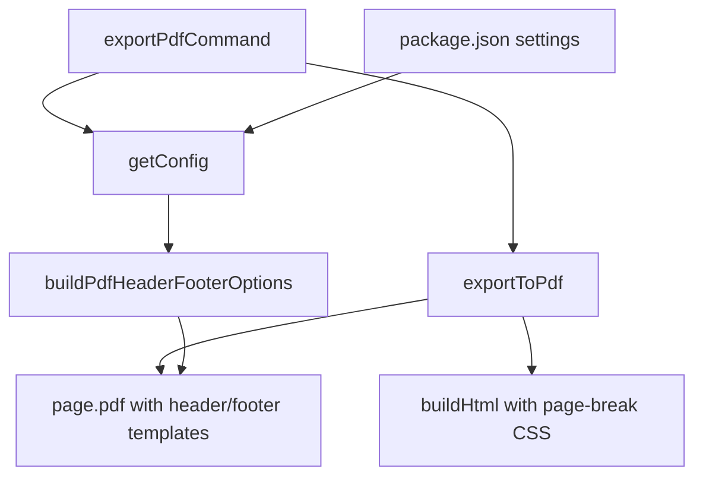
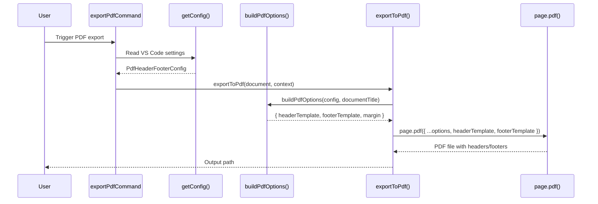

# Design Document: PDF Header/Footer with Page Numbers

## Overview

This feature adds configurable header and footer templates to the Markdown Studio PDF export pipeline. By default, exported PDFs will include a header displaying the document title and a footer showing "Page X of Y" pagination. Users can customize or disable these elements through VS Code settings. The implementation leverages Playwright's built-in `headerTemplate` and `footerTemplate` options on `page.pdf()`, which support special CSS classes (`pageNumber`, `totalPages`, `title`, `date`, `url`) for dynamic content injection.

Additionally, the feature introduces CSS page-break support so authors can control pagination in their Markdown source using `page-break-before` and `page-break-after` CSS properties via dedicated HTML markers or CSS classes.

## Architecture





## Components and Interfaces

### Component 1: Configuration Extension

**Purpose**: Extend the existing `MarkdownStudioConfig` with header/footer settings and expose them via VS Code's `contributes.configuration`.

**Interface**:
```typescript
interface PdfHeaderFooterConfig {
  headerEnabled: boolean;           // default: true
  headerTemplate: string | null;    // null = use default template
  footerEnabled: boolean;           // default: true
  footerTemplate: string | null;    // null = use default template
  pageBreakEnabled: boolean;        // default: true
}
```

**Responsibilities**:
- Read header/footer settings from VS Code workspace configuration
- Provide sensible defaults (header with title, footer with page numbers)
- Allow full override via custom HTML templates

### Component 2: PDF Options Builder

**Purpose**: Translate configuration into Playwright-compatible `page.pdf()` options including header/footer templates and margins.

**Interface**:
```typescript
function buildPdfOptions(
  config: PdfHeaderFooterConfig,
  documentTitle: string
): PdfTemplateOptions;

interface PdfTemplateOptions {
  headerTemplate?: string;
  footerTemplate?: string;
  displayHeaderFooter: boolean;
  margin: { top: string; bottom: string; left: string; right: string };
}
```

**Responsibilities**:
- Generate default header HTML template with document title
- Generate default footer HTML template with page number / total pages
- Apply custom templates when provided
- Set appropriate margins to accommodate header/footer space
- Return empty templates and no extra margin when headers/footers are disabled

### Component 3: Page Break CSS Injection

**Purpose**: Inject CSS into the HTML content that enables CSS page-break properties to work in the Playwright PDF renderer.

**Responsibilities**:
- Add CSS rules that honor `page-break-before` and `page-break-after` properties
- Inject a `<style>` block into the HTML before PDF generation

## Data Models

### VS Code Settings Schema (package.json additions)

```typescript
// Settings keys under "markdownStudio.export"
{
  "markdownStudio.export.header.enabled": boolean,       // default: true
  "markdownStudio.export.header.template": string | null, // default: null (use built-in)
  "markdownStudio.export.footer.enabled": boolean,       // default: true
  "markdownStudio.export.footer.template": string | null, // default: null (use built-in)
  "markdownStudio.export.pageBreak.enabled": boolean     // default: true
}
```

**Validation Rules**:
- `template` fields accept raw HTML strings; when null/empty, the built-in default is used
- Custom templates must use Playwright's special CSS classes for dynamic values: `pageNumber`, `totalPages`, `title`, `date`, `url`
- Boolean fields default to `true`


## Key Functions with Formal Specifications

### Function 1: getConfig() — Extended

```typescript
function getConfig(): MarkdownStudioConfig & { pdfHeaderFooter: PdfHeaderFooterConfig }
```

**Preconditions:**
- VS Code workspace configuration API is available

**Postconditions:**
- Returns a config object with all fields populated (using defaults for unset values)
- `pdfHeaderFooter.headerEnabled` and `pdfHeaderFooter.footerEnabled` default to `true`
- `pdfHeaderFooter.headerTemplate` and `pdfHeaderFooter.footerTemplate` default to `null`
- `pdfHeaderFooter.pageBreakEnabled` defaults to `true`

### Function 2: buildPdfOptions()

```typescript
function buildPdfOptions(
  config: PdfHeaderFooterConfig,
  documentTitle: string
): PdfTemplateOptions
```

**Preconditions:**
- `config` is a valid `PdfHeaderFooterConfig` object
- `documentTitle` is a string (may be empty)

**Postconditions:**
- If `config.headerEnabled === false && config.footerEnabled === false`:
  - `result.displayHeaderFooter === false`
  - `result.headerTemplate` and `result.footerTemplate` are undefined
- If `config.headerEnabled === true && config.headerTemplate === null`:
  - `result.headerTemplate` contains the default header with `documentTitle` embedded
- If `config.headerEnabled === true && config.headerTemplate !== null`:
  - `result.headerTemplate === config.headerTemplate`
- If `config.footerEnabled === true && config.footerTemplate === null`:
  - `result.footerTemplate` contains the default footer with `<span class="pageNumber">` and `<span class="totalPages">`
- If `config.footerEnabled === true && config.footerTemplate !== null`:
  - `result.footerTemplate === config.footerTemplate`
- `result.margin.top` is at least `"20mm"` when header is enabled, otherwise `"10mm"`
- `result.margin.bottom` is at least `"20mm"` when footer is enabled, otherwise `"10mm"`

**Loop Invariants:** N/A

### Function 3: getDefaultHeaderTemplate()

```typescript
function getDefaultHeaderTemplate(documentTitle: string): string
```

**Preconditions:**
- `documentTitle` is a string

**Postconditions:**
- Returns valid HTML string
- HTML contains the `documentTitle` text (HTML-escaped)
- Uses inline styles with `font-size` set small enough for Playwright header rendering (≤12px)
- Template spans full page width

### Function 4: getDefaultFooterTemplate()

```typescript
function getDefaultFooterTemplate(): string
```

**Preconditions:** None

**Postconditions:**
- Returns valid HTML string
- Contains `<span class="pageNumber"></span>` (Playwright fills this automatically)
- Contains `<span class="totalPages"></span>` (Playwright fills this automatically)
- Displays in "Page X of Y" format
- Uses inline styles with `font-size` ≤ 12px

### Function 5: injectPageBreakCss()

```typescript
function injectPageBreakCss(html: string): string
```

**Preconditions:**
- `html` is a valid HTML string containing a `</head>` tag

**Postconditions:**
- Returns HTML with a `<style>` block injected before `</head>`
- The injected CSS includes rules for `page-break-before` and `page-break-after`
- Original HTML content is otherwise unchanged
- If `</head>` is not found, returns the original HTML unchanged

## Algorithmic Pseudocode

### Main PDF Export Algorithm (Updated)

```typescript
async function exportToPdf(document, context): Promise<string> {
  const cfg = getConfig();
  let html = await buildHtml(document.getText(), context);

  // Inject hljs CSS (existing logic)
  html = injectHljsCss(html, context);

  // NEW: Inject page-break CSS if enabled
  if (cfg.pdfHeaderFooter.pageBreakEnabled) {
    html = injectPageBreakCss(html);
  }

  // NEW: Build header/footer options
  const documentTitle = path.basename(document.uri.fsPath, '.md');
  const pdfOptions = buildPdfOptions(cfg.pdfHeaderFooter, documentTitle);

  // Launch browser and generate PDF
  const browser = await chromium.launch({ headless: true });
  const page = await browser.newPage();
  await page.setContent(html, { waitUntil: 'networkidle' });

  const outputPath = buildOutputPath(document);
  await page.pdf({
    path: outputPath,
    format: cfg.pageFormat,
    printBackground: true,
    preferCSSPageSize: true,
    displayHeaderFooter: pdfOptions.displayHeaderFooter,
    headerTemplate: pdfOptions.headerTemplate,
    footerTemplate: pdfOptions.footerTemplate,
    margin: pdfOptions.margin
  });

  return outputPath;
}
```

### buildPdfOptions Algorithm

```typescript
function buildPdfOptions(config, documentTitle): PdfTemplateOptions {
  const displayHeaderFooter = config.headerEnabled || config.footerEnabled;

  let headerTemplate: string | undefined;
  if (config.headerEnabled) {
    headerTemplate = config.headerTemplate ?? getDefaultHeaderTemplate(documentTitle);
  } else {
    // Playwright requires a template even when "disabled"; use empty
    headerTemplate = '<span></span>';
  }

  let footerTemplate: string | undefined;
  if (config.footerEnabled) {
    footerTemplate = config.footerTemplate ?? getDefaultFooterTemplate();
  } else {
    footerTemplate = '<span></span>';
  }

  return {
    displayHeaderFooter,
    headerTemplate,
    footerTemplate,
    margin: {
      top: config.headerEnabled ? '20mm' : '10mm',
      bottom: config.footerEnabled ? '20mm' : '10mm',
      left: '10mm',
      right: '10mm'
    }
  };
}
```

## Example Usage

```typescript
// Example 1: Default behavior — header with title, footer with page numbers
// User exports a file called "report.md" with default settings
// Result: Header shows "report", Footer shows "Page 1 of 5"

// Example 2: Custom footer template via VS Code settings
// settings.json:
// {
//   "markdownStudio.export.footer.template": "<div style='font-size:10px;text-align:right;width:100%;padding-right:10mm;'>Confidential — <span class='pageNumber'></span>/<span class='totalPages'></span></div>"
// }

// Example 3: Disable header, keep footer
// settings.json:
// {
//   "markdownStudio.export.header.enabled": false
// }
// Result: No header, footer with "Page X of Y", top margin reduced

// Example 4: Page breaks in Markdown source
// ```html
// <div style="page-break-before: always;"></div>
// ```
// Forces a page break at that point in the PDF output

// Example 5: Fully disable header/footer
// settings.json:
// {
//   "markdownStudio.export.header.enabled": false,
//   "markdownStudio.export.footer.enabled": false
// }
// Result: No header/footer, margins revert to 10mm
```

## Correctness Properties

*A property is a characteristic or behavior that should hold true across all valid executions of a system-essentially, a formal statement about what the system should do. Properties serve as the bridge between human-readable specifications and machine-verifiable correctness guarantees.*

### Property 1: Default header contains escaped document title

*For any* document title string, when `headerEnabled` is `true` and `headerTemplate` is `null`, the generated default header HTML SHALL contain the HTML-escaped version of the title, with all special characters (`<`, `>`, `&`, `"`, `'`) replaced by their corresponding HTML entities.

**Validates: Requirements 2.1, 2.2, 8.1, 8.2, 8.3, 8.4, 8.5**

### Property 2: Custom template passthrough

*For any* non-null custom template string, when the corresponding enabled flag is `true`, `buildPdfOptions` SHALL return that string verbatim as the header or footer template without modification.

**Validates: Requirements 4.1, 4.2**

### Property 3: displayHeaderFooter flag consistency

*For any* `PdfHeaderFooterConfig`, the `displayHeaderFooter` field in the output of `buildPdfOptions` SHALL equal `headerEnabled || footerEnabled`.

**Validates: Requirements 5.3, 5.4, 5.5**

### Property 4: Margin consistency

*For any* `PdfHeaderFooterConfig`, the output margins of `buildPdfOptions` SHALL satisfy: top margin is `20mm` iff `headerEnabled` is `true` (otherwise `10mm`), bottom margin is `20mm` iff `footerEnabled` is `true` (otherwise `10mm`), and left and right margins are always `10mm`.

**Validates: Requirements 6.1, 6.2, 6.3, 6.4, 6.5, 6.6**

### Property 5: Page break CSS injection idempotency

*For any* HTML string containing a `</head>` tag, applying `injectPageBreakCss` twice SHALL produce the same result as applying it once.

**Validates: Requirement 7.4**

### Property 6: Page break injector no-op without head tag

*For any* HTML string that does not contain a `</head>` tag, `injectPageBreakCss` SHALL return the original string unchanged.

**Validates: Requirement 7.3**

## Error Handling

### Error Scenario 1: Missing `</head>` tag in HTML

**Condition**: `injectPageBreakCss` receives HTML without a `</head>` tag (malformed HTML from buildHtml)
**Response**: Return the HTML unchanged; page breaks won't work but PDF export still succeeds
**Recovery**: No action needed; graceful degradation

### Error Scenario 2: Invalid custom template HTML

**Condition**: User provides malformed HTML in `headerTemplate` or `footerTemplate` settings
**Response**: Playwright will render whatever it can; may show blank or broken header/footer
**Recovery**: User corrects their settings.json; no crash or data loss

### Error Scenario 3: Document title contains HTML special characters

**Condition**: Filename like `<script>alert('xss')</script>.md`
**Response**: `getDefaultHeaderTemplate` HTML-escapes the title before embedding
**Recovery**: Automatic; no user action needed

## Testing Strategy

### Unit Testing Approach

- Test `buildPdfOptions` with all combinations of enabled/disabled header/footer
- Test `getDefaultHeaderTemplate` with normal titles, empty titles, and titles with special characters
- Test `getDefaultFooterTemplate` returns HTML with required Playwright CSS classes
- Test `injectPageBreakCss` injects CSS correctly and handles missing `</head>`
- Test `getConfig` returns correct defaults for new settings

### Property-Based Testing Approach

**Property Test Library**: fast-check (already in devDependencies)

- For any `PdfHeaderFooterConfig`, `buildPdfOptions` always returns valid `PdfTemplateOptions` with consistent margin/template/flag relationships
- For any string title, `getDefaultHeaderTemplate` returns HTML containing the escaped title
- `injectPageBreakCss` is idempotent: applying it twice produces the same result as applying it once

### Integration Testing Approach

- Extend existing `exportPdf.integration.test.ts` to verify that exported PDFs with default settings contain header/footer content
- Test that page-break CSS produces multi-page PDFs with correct pagination

## Security Considerations

- Custom header/footer templates are rendered by Playwright in a sandboxed Chromium context, limiting XSS risk
- Document titles are HTML-escaped in the default header template to prevent injection
- Custom templates are user-provided settings (trusted input from settings.json), not external input

## Dependencies

- **Playwright** (existing): `page.pdf()` `headerTemplate`, `footerTemplate`, `displayHeaderFooter`, `margin` options
- **VS Code API** (existing): `workspace.getConfiguration()` for reading new settings
- **fast-check** (existing dev dependency): Property-based testing
