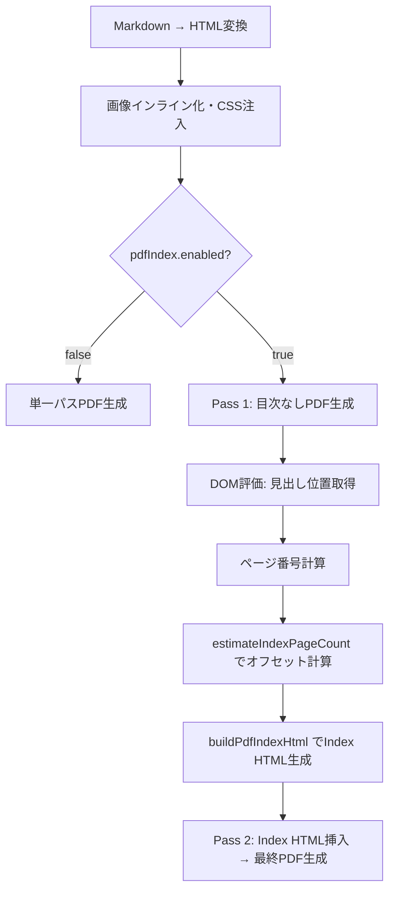

# 設計書: PDF Index ページ番号付き目次

## 概要

Markdown Studio のPDFエクスポート機能に、ページ番号付き目次（PDF Index）を実装する。既存の `exportPdf.ts` の2パスレンダリング基盤と `pdfIndex.ts` モジュールを拡張し、各見出しの正確なページ番号を計算して「Chapter 1 はじめに ...... p.3」形式のエントリを持つ目次ページをPDF先頭に挿入する。

現在の実装状況:
- `pdfIndex.ts`: `HeadingPageEntry` 型、`buildPdfIndexHtml()`、`estimateIndexPageCount()` は既に実装済み
- `exportPdf.ts`: 2パスレンダリング（Pass 1でDOM位置取得→ページ番号計算→Pass 2でIndex HTML挿入）は既に実装済み
- `preview.css`: Dot Leader CSS（flexbox + dotted border）は既に実装済み

本設計書は、既存実装の正確性を検証し、改善すべき点を明確にするためのものである。

## アーキテクチャ

### 2パスレンダリングフロー



### ページ番号計算アルゴリズム

1. Pass 1でPlaywrightの `page.pdf()` を実行し、一時PDFバッファを取得
2. PDFバイナリから `/Type /Page` パターンをカウントして総ページ数を取得（`/Type /Pages` は除外）
3. `page.evaluate()` で各見出し要素の `offsetTop` と `document.documentElement.scrollHeight` を取得
4. 各見出しのページ番号を計算: `pageNumber = min(floor(offsetTop / scrollHeight * totalPages) + 1, totalPages)`
5. `estimateIndexPageCount(entryCount)` で目次ページ数を推定し、`pageOffset` として加算

## コンポーネントとインターフェース

### pdfIndex.ts（既存・拡張対象）

```typescript
/** 見出しとページ番号のマッピング */
export interface HeadingPageEntry {
  level: number;      // 見出しレベル (1-6)
  text: string;       // 見出しテキスト（プレーンテキスト）
  pageNumber: number; // Pass 1で計算されたページ番号
  anchorId: string;   // アンカーID（GitHub互換スラッグ）
}

/**
 * 目次ページ数を推定する。
 * entryCount === 0 → 0、それ以外 → ceil(entryCount / 30)
 */
export function estimateIndexPageCount(entryCount: number): number;

/**
 * ページ番号付きPDF目次HTMLを生成する。
 * entries が空の場合は空文字列を返す。
 * 各エントリのページ番号に pageOffset を加算して表示する。
 */
export function buildPdfIndexHtml(
  entries: HeadingPageEntry[],
  title: string,
  pageOffset: number
): string;
```

### exportPdf.ts（既存・2パスレンダリング部分）

Pass 1のDOM評価で取得するデータ構造:

```typescript
interface DomData {
  headings: {
    level: number;
    text: string;
    anchorId: string;
    offsetTop: number;
  }[];
  scrollHeight: number;
}
```

DOM評価時のフィルタリング:
- `cfg.toc.minLevel` 〜 `cfg.toc.maxLevel` 範囲外の見出しを除外
- `ms-pdf-index-title` クラスを持つ要素を除外（目次タイトル自身の自己参照防止）

### anchorResolver.ts（既存・変更なし）

```typescript
export function slugify(text: string): string;
export function resolveAnchors(headings: HeadingEntry[]): AnchorMapping[];
```

### extractHeadings.ts（既存・変更なし）

```typescript
export function extractHeadings(markdown: string, md: MarkdownIt): HeadingEntry[];
```

## データモデル

### HeadingPageEntry

| フィールド | 型 | 説明 |
|---|---|---|
| `level` | `number` | 見出しレベル (1-6) |
| `text` | `string` | 見出しテキスト（インライン書式除去済み） |
| `pageNumber` | `number` | Pass 1で計算されたページ番号 (1-based) |
| `anchorId` | `string` | GitHub互換アンカーID |

### PdfIndexConfig（既存）

| フィールド | 型 | デフォルト | 説明 |
|---|---|---|---|
| `enabled` | `boolean` | `true` | PDF Index生成の有効/無効 |
| `title` | `string` | `"Table of Contents"` | 目次ページのタイトル |

### 生成されるHTML構造

```html
<div class="ms-pdf-index" style="page-break-after: always;">
  <h1 class="ms-pdf-index-title">Table of Contents</h1>
  <div class="ms-pdf-index-entries">
    <div class="ms-pdf-index-entry ms-pdf-index-level-1" style="padding-left: 0em;">
      <a class="ms-pdf-index-text" href="#introduction">Introduction</a>
      <span class="ms-pdf-index-dots"></span>
      <span class="ms-pdf-index-page">2</span>
    </div>
    <div class="ms-pdf-index-entry ms-pdf-index-level-2" style="padding-left: 1.5em;">
      <a class="ms-pdf-index-text" href="#background">Background</a>
      <span class="ms-pdf-index-dots"></span>
      <span class="ms-pdf-index-page">3</span>
    </div>
  </div>
</div>
```

### Dot Leader CSS（既存）

```css
.ms-pdf-index-entry {
  display: flex;
  align-items: baseline;
  margin: 0.3em 0;
}
.ms-pdf-index-text {
  white-space: nowrap;
}
.ms-pdf-index-dots {
  flex: 1;
  border-bottom: 1px dotted #999;
  margin: 0 0.5em;
  min-width: 2em;
}
.ms-pdf-index-page {
  white-space: nowrap;
  font-variant-numeric: tabular-nums;
}
```

flexboxレイアウトにより:
- テキスト部分は `nowrap` で折り返さない
- ドット部分が `flex: 1` で残りスペースを埋める
- ページ番号が右端に固定される
- `min-width: 2em` でテキストが長くてもドットが最低限表示される


## 正確性プロパティ

*プロパティとは、システムの全ての有効な実行において真であるべき特性や振る舞いのことである。プロパティは、人間が読める仕様と機械が検証可能な正確性保証の橋渡しとなる。*

### Property 1: HTML特殊文字エスケープの完全性

*任意の* 文字列に対して、`escapeHtml` を適用した結果にはエスケープされていない `<`, `>`, `&`, `"` が含まれないこと。また、エスケープされていない文字列を含まない入力に対しては、出力が入力と同一であること。

**Validates: Requirements 6.5**

### Property 2: buildPdfIndexHtml の構造的正確性

*任意の* 非空の `HeadingPageEntry[]` 配列、任意のタイトル文字列、任意の `pageOffset` に対して、`buildPdfIndexHtml` の出力は以下を全て満たすこと:
- 各エントリの表示ページ番号が `pageNumber + pageOffset` であること
- 各エントリに `ms-pdf-index-level-{level}` クラスが含まれること
- 各エントリの `padding-left` が `(level - 1) * 1.5em` であること
- 各エントリに `href="#{anchorId}"` のリンクが含まれること（anchorIdが非空の場合）
- 全体が `ms-pdf-index` クラスのコンテナで囲まれていること
- タイトルが `ms-pdf-index-title` クラスの h1 要素に含まれること

**Validates: Requirements 1.3, 2.3, 3.3, 5.1, 6.1, 6.2, 7.2**

### Property 3: estimateIndexPageCount の計算式

*任意の* 非負整数 `entryCount` に対して:
- `entryCount === 0` のとき `estimateIndexPageCount(entryCount) === 0`
- `entryCount > 0` のとき `estimateIndexPageCount(entryCount) === Math.ceil(entryCount / 30)`

**Validates: Requirements 7.1, 7.4**

### Property 4: ページ番号計算の範囲制約

*任意の* 有効な `offsetTop` (0以上), `scrollHeight` (正の数), `totalPages` (1以上) に対して、計算されたページ番号は `1` 以上 `totalPages` 以下であること。

**Validates: Requirements 2.2**

## エラーハンドリング

| シナリオ | 対応 |
|---|---|
| 見出しが0件 | `buildPdfIndexHtml` が空文字列を返し、目次ページを生成しない |
| `scrollHeight` が0 | ratio を 0 として扱い、全見出しをページ1に配置 |
| 見出しテキストにHTML特殊文字 | `escapeHtml` で `<`, `>`, `&`, `"` をエスケープ |
| `anchorId` が空文字列 | `href` 属性を省略（リンクなしのテキストとして表示） |
| Chromium起動失敗 | 既存のエラーハンドリング（Setup Dependencies案内）を継続 |
| Pass 1 PDF生成失敗 | 例外が上位にバブルアップし、エクスポート失敗として報告 |
| ユーザーキャンセル | `checkCancellation` による既存のキャンセル処理を継続 |

## テスト戦略

### プロパティベーステスト（fast-check）

プロジェクトは既に `fast-check` を devDependencies に含んでおり、多数の `.property.test.ts` ファイルが存在する。

各プロパティテストは最低100回のイテレーションで実行する。

| プロパティ | テストファイル | 検証内容 |
|---|---|---|
| Property 1 | `test/unit/pdfIndex.property.test.ts` | 任意文字列のHTMLエスケープ完全性 |
| Property 2 | `test/unit/pdfIndex.property.test.ts` | buildPdfIndexHtml の構造的正確性 |
| Property 3 | `test/unit/pdfIndex.property.test.ts` | estimateIndexPageCount の計算式 |
| Property 4 | `test/unit/pdfIndex.property.test.ts` | ページ番号計算の範囲制約 |

タグ形式: `Feature: pdf-index-page-numbers, Property {number}: {property_text}`

### ユニットテスト（既存の拡張）

`test/unit/pdfIndex.test.ts` に以下のテストケースを追加:
- 空エントリでの空文字列返却（既存）
- タイトルとエントリを含むHTML生成（既存）
- レベル別CSSクラスの付与（既存）
- HTML特殊文字のエスケープ（既存）
- page-break-afterスタイルの適用（既存）
- estimateIndexPageCount の境界値テスト（既存）

### 統合テスト

`test/integration/exportPdf.integration.test.ts` で以下を検証:
- `pdfIndex.enabled=true` 時にPDF先頭に目次ページが挿入されること
- `pdfIndex.enabled=false` 時に目次ページが生成されないこと
- 見出しレベルフィルタリングが正しく動作すること
- `ms-pdf-index-title` クラスの見出しが目次エントリから除外されること
