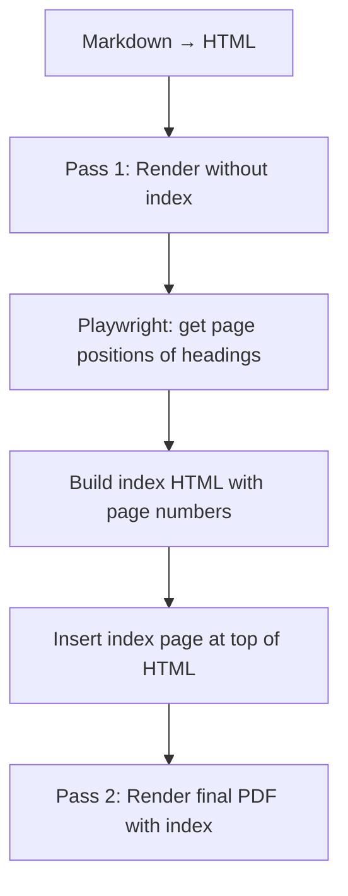

# 設計ドキュメント: PDF Index with Page Numbers

## 概要

PDF出力時に見出しベースの目次ページをページ番号付きで自動生成する。Playwrightの2パスレンダリングを使用し、1パス目で各見出しのページ位置を取得、2パス目で目次ページを先頭に挿入して最終PDFを生成する。

## アーキテクチャ

### 2パスレンダリング方式



### データフロー

1. `exportToPdf()` が通常通りHTMLを生成
2. Playwrightでページをロード（Pass 1）
3. `page.evaluate()` で各見出し要素の `getBoundingClientRect()` とページ高さからページ番号を計算
4. `buildPdfIndexHtml()` でページ番号付き目次HTMLを生成
5. 目次HTMLを `<body>` の先頭に挿入
6. 再度 `page.setContent()` して最終PDFを生成（Pass 2）

### 設計判断

- **2パスレンダリング**: 正確なページ番号を得るにはレンダリング後の位置情報が必要。1パス目はページ番号取得専用、2パス目が最終PDF生成
- **目次ページのオフセット**: 目次ページが追加されることで本文のページ番号がずれる。目次が何ページになるかを計算し、全ページ番号にオフセットを加算
- **既存TOCとの共存**: 既存の `<!-- TOC -->` マーカーによるインラインTOCはそのまま残す。PDF Indexは別の目次ページとして先頭に挿入

## コンポーネントとインターフェース

### 1. `src/export/pdfIndex.ts`（新規）

PDF目次ページの生成を担当するモジュール。

```typescript
/** 見出しとページ番号のマッピング */
export interface HeadingPageEntry {
  level: number;
  text: string;
  pageNumber: number;
}

/**
 * Playwrightページ上で各見出し要素のページ番号を取得する。
 * data-source-line属性を持つh1〜h6要素を対象とする。
 */
export async function resolveHeadingPages(
  page: import('playwright').Page,
  pageHeight: number,
  minLevel: number,
  maxLevel: number
): Promise<HeadingPageEntry[]>;

/**
 * ページ番号付きPDF目次HTMLを生成する。
 * ドットリーダー付きの「見出し ... p.N」形式。
 */
export function buildPdfIndexHtml(
  entries: HeadingPageEntry[],
  title: string,
  pageOffset: number
): string;

/**
 * 目次HTMLが何ページになるかを推定する。
 * エントリ数とページ高さから概算。
 */
export function estimateIndexPageCount(
  entryCount: number,
  pageHeight: number
): number;
```

### 2. `src/export/exportPdf.ts`（変更）

`exportToPdf()` に2パスレンダリングロジックを追加。

### 3. `src/infra/config.ts`（変更）

`MarkdownStudioConfig` に `pdfIndex` フィールドを追加。

```typescript
export interface PdfIndexConfig {
  enabled: boolean;
  title: string;
}
```

### 4. `package.json`（変更）

設定キーを追加:
- `markdownStudio.export.pdfIndex.enabled` (boolean, default: false)
- `markdownStudio.export.pdfIndex.title` (string, default: "Table of Contents")

## ページ番号解決アルゴリズム

```
1. Pass 1: HTMLをPlaywrightにロード
2. page.evaluate() で全見出し要素を取得:
   - element.getBoundingClientRect().top + window.scrollY → absoluteY
   - pageNumber = Math.floor(absoluteY / pageHeight) + 1
3. 目次ページ数を推定（エントリ数 / 1ページあたりの行数）
4. 全ページ番号にオフセット（目次ページ数）を加算
5. buildPdfIndexHtml() で目次HTMLを生成
6. Pass 2: 目次HTML + 本文HTMLでPDFを生成
```

## 目次HTMLの構造

```html
<div class="ms-pdf-index" style="page-break-after: always;">
  <h1 class="ms-pdf-index-title">Table of Contents</h1>
  <div class="ms-pdf-index-entries">
    <div class="ms-pdf-index-entry ms-pdf-index-level-1">
      <span class="ms-pdf-index-text">1. Introduction</span>
      <span class="ms-pdf-index-dots"></span>
      <span class="ms-pdf-index-page">3</span>
    </div>
    <div class="ms-pdf-index-entry ms-pdf-index-level-2">
      <span class="ms-pdf-index-text">1.1 Background</span>
      <span class="ms-pdf-index-dots"></span>
      <span class="ms-pdf-index-page">3</span>
    </div>
  </div>
</div>
```

## CSSスタイル

```css
.ms-pdf-index-entry {
  display: flex;
  align-items: baseline;
  margin: 0.3em 0;
}
.ms-pdf-index-dots {
  flex: 1;
  border-bottom: 1px dotted #999;
  margin: 0 0.5em;
  min-width: 2em;
}
.ms-pdf-index-page {
  white-space: nowrap;
}
.ms-pdf-index-level-2 { padding-left: 1.5em; }
.ms-pdf-index-level-3 { padding-left: 3em; }
```

## エラーハンドリング

| ケース | 対応 |
|---|---|
| 見出しが0件 | 目次ページをスキップ |
| ページ番号取得失敗 | 警告ログ、目次なしでPDF生成 |
| 目次ページ数の推定誤差 | ±1ページの誤差は許容（実用上問題なし） |

## テスト戦略

| テスト | ファイル |
|---|---|
| buildPdfIndexHtml の出力構造 | `test/unit/pdfIndex.test.ts` |
| estimateIndexPageCount | `test/unit/pdfIndex.test.ts` |
| 設定のデフォルト値 | `test/unit/config.test.ts` |
| 見出し0件時のスキップ | `test/unit/pdfIndex.test.ts` |
