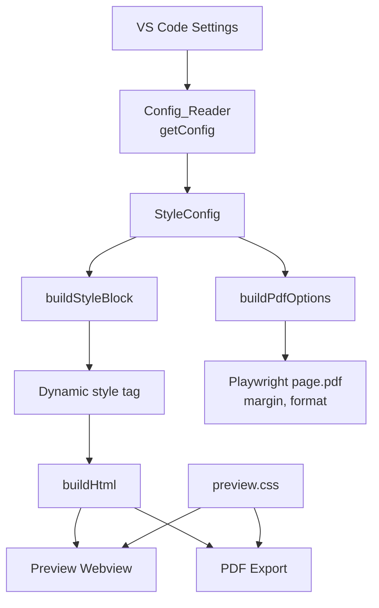

# 設計書: PDFスタイル改善

## 概要

Markdown Studio のPDF出力およびプレビューのスタイルシステムを拡張し、Markdown PDF（yzane.markdown-pdf）相当のデフォルト品質を実現する。ユーザーがフォント、行間、余白、ページサイズをカスタマイズできる設定を追加し、プレビューとPDFの一貫性を保証する。また、demo.md のインラインSVGをより高度なものに更新する。

### 設計方針

1. 既存の `getConfig()` パターンを踏襲し、新しいスタイル設定を `MarkdownStudioConfig` に追加する
2. スタイル注入は `buildHtml()` 内で動的 `<style>` ブロックとして行い、プレビューとPDFの両方で同一のスタイルを適用する
3. 余白設定は既存の `buildPdfOptions()` を拡張して対応する
4. CSS の `@media print` ブロックでPDF固有のタイポグラフィを制御する

## アーキテクチャ



データフロー:
1. ユーザーが VS Code 設定を変更
2. `getConfig()` が `StyleConfig` を含む設定オブジェクトを返す
3. `buildStyleBlock()` が `StyleConfig` からインラインCSS文字列を生成
4. `buildHtml()` が `<head>` 内にスタイルブロックを注入
5. プレビューとPDFの両方が同一のHTMLを使用
6. PDF出力時は `buildPdfOptions()` が余白・ページサイズも適用

## コンポーネントとインターフェース

### 1. StyleConfig インターフェース（src/types/models.ts）

```typescript
export interface StyleConfig {
  fontFamily: string;
  fontSize: number;    // px, clamped to [8, 32]
  lineHeight: number;  // unitless, clamped to [1.0, 3.0]
  margin: string;      // CSS value with unit (e.g., "20mm", "1in")
}
```

### 2. MarkdownStudioConfig 拡張（src/infra/config.ts）

既存の `MarkdownStudioConfig` に以下を追加:

```typescript
export interface MarkdownStudioConfig {
  // ... 既存フィールド
  pageFormat: 'A3' | 'A4' | 'A5' | 'Letter' | 'Legal' | 'Tabloid'; // 拡張
  style: StyleConfig;
}
```

`getConfig()` 内でクランプ処理を行う:

```typescript
function clampFontSize(value: number): number {
  return Math.max(8, Math.min(32, value));
}

function clampLineHeight(value: number): number {
  return Math.max(1.0, Math.min(3.0, value));
}
```

### 3. buildStyleBlock 関数（src/preview/buildHtml.ts）

新規関数。`StyleConfig` を受け取り、`<style>` タグ文字列を返す。

```typescript
export function buildStyleBlock(style: StyleConfig): string
```

生成するCSS:
- `body` に `font-family`, `font-size`, `line-height` を適用
- `@media print` ブロックでPDF固有のデフォルトタイポグラフィを適用
- コードブロック用のモノスペースフォント指定
- 見出し（h1–h6）のマージン設定

### 4. buildHtml 拡張（src/preview/buildHtml.ts）

`buildHtml()` のシグネチャに `StyleConfig` を追加するか、内部で `getConfig()` を呼び出す。生成されたスタイルブロックを `<head>` 内に注入する。

PDF パスでは `exportToPdf()` が `buildHtml()` を呼び出す際に同じスタイルが適用される。

### 5. buildPdfOptions 拡張（src/export/pdfHeaderFooter.ts）

既存の `buildPdfOptions()` を拡張し、カスタム余白を受け取る:

```typescript
export function buildPdfOptions(
  config: PdfHeaderFooterConfig,
  documentTitle: string,
  customMargin?: string
): PdfTemplateOptions
```

ロジック:
- `customMargin` が指定された場合、left/right にその値を使用
- header/footer が有効な場合、top/bottom に余白 + ヘッダー/フッター用スペースを確保
- header/footer が無効な場合、全方向に `customMargin` を使用

### 6. package.json 設定スキーマ

追加する設定:

| 設定キー | 型 | デフォルト値 | 説明 |
|---------|------|-------------|------|
| `markdownStudio.style.fontFamily` | string | `-apple-system, BlinkMacSystemFont, "Segoe UI", Helvetica, Arial, sans-serif` | 本文フォント |
| `markdownStudio.style.fontSize` | number | 14 | 本文フォントサイズ (px) |
| `markdownStudio.style.lineHeight` | number | 1.6 | 本文行間 |
| `markdownStudio.export.margin` | string | `20mm` | PDF余白 |
| `markdownStudio.export.pageFormat` | enum | `A4` | ページサイズ（A3/A4/A5/Letter/Legal/Tabloid） |

既存の `pageFormat` enum を `["A3", "A4", "A5", "Letter", "Legal", "Tabloid"]` に拡張する。

## データモデル

### StyleConfig

| フィールド | 型 | 制約 | デフォルト |
|-----------|------|------|-----------|
| fontFamily | string | 空文字の場合デフォルトにフォールバック | `-apple-system, BlinkMacSystemFont, "Segoe UI", Helvetica, Arial, sans-serif` |
| fontSize | number | [8, 32] にクランプ | 14 |
| lineHeight | number | [1.0, 3.0] にクランプ | 1.6 |
| margin | string | CSS単位付き文字列 (mm, cm, in, px) | `20mm` |

### 生成されるCSSの構造

```css
/* buildStyleBlock() が生成するスタイル */
body {
  font-family: {fontFamily};
  font-size: {fontSize}px;
  line-height: {lineHeight};
}

@media print {
  body {
    font-family: {fontFamily}, "Apple Color Emoji", "Segoe UI Emoji";
    font-size: {fontSize}px;
    line-height: {lineHeight};
  }
  pre, code {
    font-family: "SFMono-Regular", Consolas, "Liberation Mono", Menlo, monospace;
  }
  h1 { margin-top: 24px; margin-bottom: 16px; }
  h2 { margin-top: 24px; margin-bottom: 16px; }
  h3 { margin-top: 20px; margin-bottom: 12px; }
  h4, h5, h6 { margin-top: 16px; margin-bottom: 8px; }
}
```


## 正当性プロパティ

*プロパティとは、システムのすべての有効な実行において真であるべき特性や振る舞いのことです。人間が読める仕様と機械が検証可能な正当性保証の橋渡しとなる形式的な記述です。*

### Property 1: スタイル設定のHTML出力反映

*For any* 有効な StyleConfig（fontFamily, fontSize, lineHeight の任意の組み合わせ）に対して、`buildStyleBlock()` が生成する CSS 文字列は、設定された fontFamily、fontSize（px付き）、lineHeight のすべての値を含まなければならない。

**Validates: Requirements 2.3, 3.3, 4.3, 7.1, 7.2, 7.3**

### Property 2: 数値スタイル値のクランプ

*For any* 数値 n に対して、`clampFontSize(n)` は常に [8, 32] の範囲内の値を返し、8 ≤ n ≤ 32 の場合は n をそのまま返す。同様に、`clampLineHeight(n)` は常に [1.0, 3.0] の範囲内の値を返し、1.0 ≤ n ≤ 3.0 の場合は n をそのまま返す。

**Validates: Requirements 3.4, 4.4**

### Property 3: 余白設定とヘッダー/フッターの相互作用

*For any* 有効な CSS 余白値と header/footer 設定の組み合わせに対して、`buildPdfOptions()` は以下を満たす: (a) left と right は常にカスタム余白値を使用する、(b) header/footer が無効な場合は top/bottom もカスタム余白値を使用する、(c) header/footer が有効な場合は top/bottom がカスタム余白値以上の値を持つ。

**Validates: Requirements 5.3, 5.4**

### Property 4: 空文字フォントファミリーのフォールバック

*For any* 空文字列または空白のみの fontFamily 設定に対して、`buildStyleBlock()` はデフォルトのフォントファミリー値を使用した CSS を生成しなければならない。

**Validates: Requirements 2.4**

## エラーハンドリング

| シナリオ | 対応 |
|---------|------|
| fontFamily が空文字 | デフォルト値にフォールバック |
| fontSize が範囲外 | [8, 32] にクランプ |
| lineHeight が範囲外 | [1.0, 3.0] にクランプ |
| margin が不正な形式 | そのまま Playwright に渡す（Playwright 側でエラー処理） |
| pageFormat が不正な値 | VS Code の enum バリデーションで防止 |

## テスト戦略

### ユニットテスト

- `buildStyleBlock()` のデフォルト値出力の検証
- `clampFontSize()` / `clampLineHeight()` の境界値テスト
- `buildPdfOptions()` の余白計算（header/footer 有効/無効の組み合わせ）
- `getConfig()` のデフォルト値読み取り
- 空文字 fontFamily のフォールバック動作
- 各ページサイズ（A3/A4/A5/Letter/Legal/Tabloid）の設定パススルー
- 見出しマージンCSS の存在確認
- モノスペースフォントCSS の存在確認

### プロパティベーステスト

ライブラリ: `fast-check`（既にプロジェクトの devDependencies に含まれている）

各プロパティテストは最低100回のイテレーションで実行する。

- **Property 1**: ランダムな fontFamily 文字列、fontSize（8–32）、lineHeight（1.0–3.0）を生成し、`buildStyleBlock()` の出力にすべての値が含まれることを検証
  - タグ: `Feature: pdf-style-improvement, Property 1: Style config HTML output reflection`
- **Property 2**: ランダムな数値（負数、0、極大値を含む）を生成し、クランプ関数の出力が常に有効範囲内であること、範囲内の値が保存されることを検証
  - タグ: `Feature: pdf-style-improvement, Property 2: Numeric style value clamping`
- **Property 3**: ランダムな余白値と header/footer 設定を生成し、`buildPdfOptions()` の出力が仕様を満たすことを検証
  - タグ: `Feature: pdf-style-improvement, Property 3: Margin and header/footer interaction`
- **Property 4**: 空白文字のみで構成されるランダムな文字列を生成し、`buildStyleBlock()` がデフォルトフォントを使用することを検証
  - タグ: `Feature: pdf-style-improvement, Property 4: Empty fontFamily fallback`

### 統合テスト

- `buildHtml()` がスタイルブロックを含むHTMLを生成することの検証
- `exportToPdf()` がカスタムスタイル設定でPDFを生成できることの検証
- demo.md の更新されたSVGがエラーなくレンダリングされることの検証
