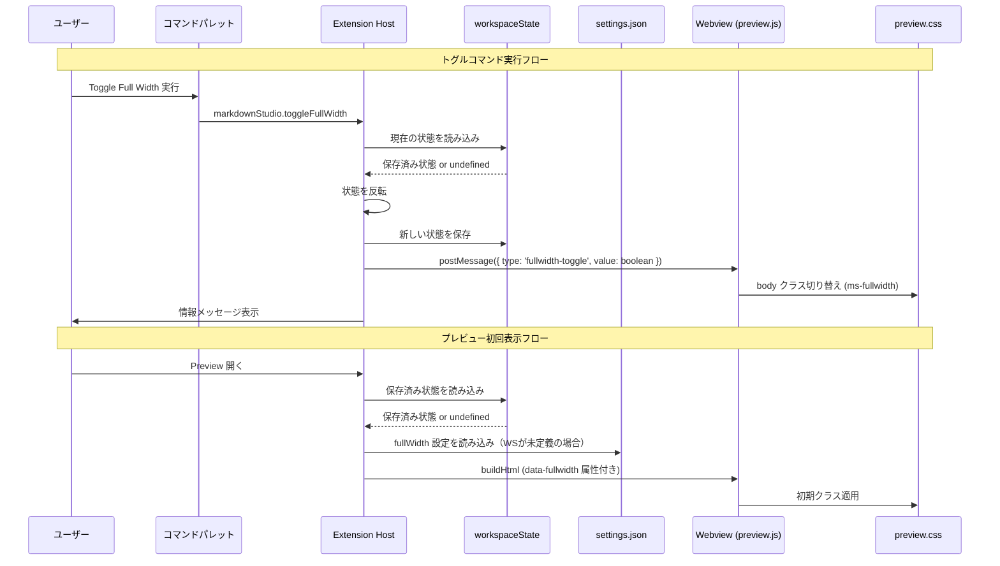

# 設計ドキュメント: Preview Full-Width Mode

## 概要

本機能は、Markdown Studioのプレビューパネル（Webview）に「フルワイドモード」を追加する。現在 `body` 要素に適用されている `max-width: 980px` の制約をトグルで解除し、コンテンツがパネル全幅に広がるようにする。

### 設計方針

既存のテーマ切り替え（`preview.theme`）のパターンに倣い、以下の方針で実装する：

1. **postMessage による即時CSS切り替え** — HTMLの全体再レンダリングを避け、Webviewへのメッセージ送信でCSSクラスを切り替える
2. **workspaceState による永続化** — トグルコマンドで切り替えた状態はワークスペース単位で保存し、設定値よりも優先する
3. **buildHtml での初回モード埋め込み** — プレビュー生成時に正しいモードのCSSを含め、表示後のレイアウトジャンプを防ぐ
4. **PDFエクスポートへの非影響** — エクスポートパイプラインは本設定を参照せず、既存の `@media print` ルールを維持する

## アーキテクチャ

### コンポーネント間のデータフロー



### 状態解決の優先順位

```
workspaceState (トグルコマンドで設定) > settings.json (markdownStudio.preview.fullWidth)
```

workspaceState に値が存在する場合はそれを使用し、存在しない場合は settings.json の値をフォールバックとして使用する。

## コンポーネントとインターフェース

### 1. コマンド登録 (`extension.ts`)

`markdownStudio.toggleFullWidth` コマンドを `activate()` 内で登録する。

```typescript
// extension.ts — activate() 内に追加
vscode.commands.registerCommand('markdownStudio.toggleFullWidth', async () => {
  toggleFullWidthCommand(context);
});
```

### 2. トグルコマンド実装 (`src/commands/toggleFullWidth.ts`)

新規ファイル。トグルロジックと状態永続化を担当する。

```typescript
import * as vscode from 'vscode';

const FULLWIDTH_STATE_KEY = 'markdownStudio.fullWidthEnabled';

/**
 * workspaceState とユーザー設定からフルワイドモードの有効状態を解決する。
 * workspaceState に値があればそれを優先し、なければ設定値を使用する。
 */
export function resolveFullWidthState(context: vscode.ExtensionContext): boolean {
  const stored = context.workspaceState.get<boolean>(FULLWIDTH_STATE_KEY);
  if (stored !== undefined) {
    return stored;
  }
  const cfg = vscode.workspace.getConfiguration('markdownStudio');
  return cfg.get<boolean>('preview.fullWidth', false);
}

/**
 * トグルコマンドの実装。
 * 現在の状態を反転し、workspaceState に保存し、Webview にメッセージを送信する。
 */
export async function toggleFullWidthCommand(
  context: vscode.ExtensionContext,
  panel?: vscode.WebviewPanel
): Promise<void> {
  const current = resolveFullWidthState(context);
  const next = !current;
  await context.workspaceState.update(FULLWIDTH_STATE_KEY, next);

  if (panel) {
    panel.webview.postMessage({ type: 'fullwidth-toggle', value: next });
  }

  const msg = next
    ? 'Markdown Studio: Full-width mode enabled'
    : 'Markdown Studio: Full-width mode disabled';
  vscode.window.showInformationMessage(msg);
}
```

### 3. package.json への追加

#### コマンド定義

```json
{
  "command": "markdownStudio.toggleFullWidth",
  "title": "Markdown Studio: Toggle Full Width"
}
```

#### 設定項目定義

```json
{
  "markdownStudio.preview.fullWidth": {
    "type": "boolean",
    "default": false,
    "description": "プレビューをフルワイドモードで表示する。有効にすると body の max-width 制約が解除される。"
  }
}
```

### 4. buildHtml の変更 (`src/preview/buildHtml.ts`)

`buildHtml()` 関数に `fullWidth` パラメータを追加し、`<body>` タグに `data-fullwidth` 属性を埋め込む。

```typescript
// buildHtml() のシグネチャ変更
export async function buildHtml(
  markdown: string,
  context: vscode.ExtensionContext,
  webview?: vscode.Webview,
  assets?: PreviewAssetUris,
  documentUri?: vscode.Uri,
  options?: { fullWidth?: boolean }
): Promise<string> {
  // ...既存のロジック...
  const fullWidthAttr = options?.fullWidth ? 'true' : 'false';
  // <body> タグに data-fullwidth 属性を追加
  return `...
<body data-theme-override="..." data-fullwidth="${fullWidthAttr}">
...`;
}
```

### 5. preview.css の変更 (`media/preview.css`)

`body` のデフォルト `max-width: 980px` はそのまま維持し、`ms-fullwidth` クラスが付与された場合に解除する。

```css
/* フルワイドモード — max-width 制約を解除 */
body.ms-fullwidth {
  max-width: none;
}
```

`@media print` ルール内の `max-width: none` は既存のまま変更しない。これにより PDFエクスポートは影響を受けない。

### 6. preview.js の変更 (`media/preview.js`)

Webview側でメッセージを受信し、`body` 要素のクラスを切り替える。

```javascript
// initPreview() 内に追加 — 初期状態の適用
const fullwidthAttr = document.body.getAttribute('data-fullwidth');
if (fullwidthAttr === 'true') {
  document.body.classList.add('ms-fullwidth');
}

// message イベントハンドラに追加
if (message.type === 'fullwidth-toggle') {
  if (message.value) {
    document.body.classList.add('ms-fullwidth');
  } else {
    document.body.classList.remove('ms-fullwidth');
  }
  return;
}
```

### 7. webviewPanel.ts の変更 (`src/preview/webviewPanel.ts`)

#### 7a. buildHtml 呼び出し時に fullWidth オプションを渡す

`openOrRefreshPreview()` 内の `buildHtml()` 呼び出しに `resolveFullWidthState()` の結果を渡す。

```typescript
import { resolveFullWidthState } from '../commands/toggleFullWidth';

// buildHtml 呼び出し箇所（新規パネル作成時・リフレッシュ時の両方）
const fullWidth = resolveFullWidthState(context);
panel.webview.html = await buildHtml(
  document.getText(), context, panel.webview, assets, document.uri,
  { fullWidth }
);
```

#### 7b. トグルコマンドからの postMessage 送信

`toggleFullWidthCommand` は `currentPanel` への参照が必要。`webviewPanel.ts` からパネル参照を公開するか、コマンド登録時にクロージャで渡す。

既存パターン（`theme-override` の `onDidChangeConfiguration` ハンドラ）に倣い、`webviewPanel.ts` 内で設定変更を監視する：

```typescript
// onDidChangeConfiguration ハンドラ内に追加
if (e.affectsConfiguration('markdownStudio.preview.fullWidth')) {
  if (currentPanel) {
    const fullWidth = resolveFullWidthState(context);
    currentPanel.webview.postMessage({ type: 'fullwidth-toggle', value: fullWidth });
  }
}
```

#### 7c. currentPanel のエクスポート

トグルコマンドが `currentPanel` にアクセスできるよう、getter 関数を公開する：

```typescript
export function getCurrentPanel(): vscode.WebviewPanel | undefined {
  return currentPanel;
}
```

### 8. PDFエクスポートへの非影響 (`src/export/exportPdf.ts`)

`exportPdf.ts` は `buildHtml()` を `webview` パラメータなし（`undefined`）で呼び出しており、`fullWidth` オプションも渡さない。これにより：

- `data-fullwidth` 属性は `"false"` となる
- `ms-fullwidth` クラスは付与されない
- 既存の `@media print { body { max-width: none; } }` ルールがPDFレイアウトを制御する

**変更不要** — 既存のエクスポートパイプラインはそのまま動作する。

## データモデル

### workspaceState キー

| キー | 型 | 説明 |
|------|------|------|
| `markdownStudio.fullWidthEnabled` | `boolean \| undefined` | トグルコマンドで設定されたフルワイドモードの状態。`undefined` の場合は設定値にフォールバック |

### Webview メッセージプロトコル

| メッセージタイプ | 方向 | ペイロード | 説明 |
|-----------------|------|-----------|------|
| `fullwidth-toggle` | Extension → Webview | `{ type: 'fullwidth-toggle', value: boolean }` | フルワイドモードの切り替え |

### HTML属性

| 属性 | 要素 | 値 | 説明 |
|------|------|------|------|
| `data-fullwidth` | `<body>` | `"true"` \| `"false"` | 初回レンダリング時のフルワイドモード状態 |

### CSSクラス

| クラス名 | 要素 | 効果 |
|----------|------|------|
| `ms-fullwidth` | `body` | `max-width: none` を適用し、幅制約を解除 |

