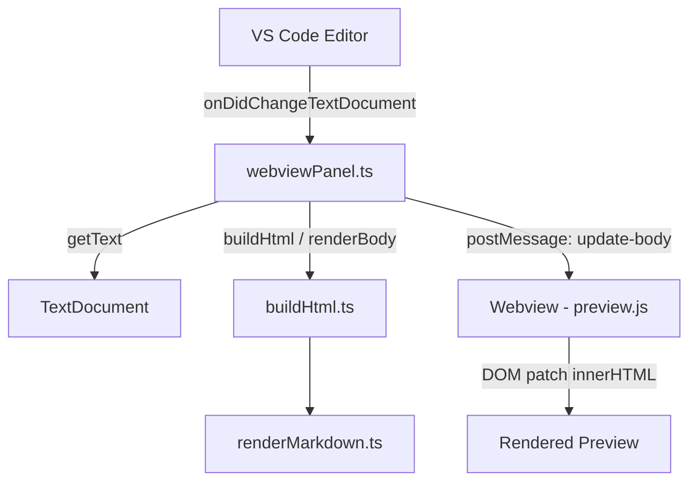
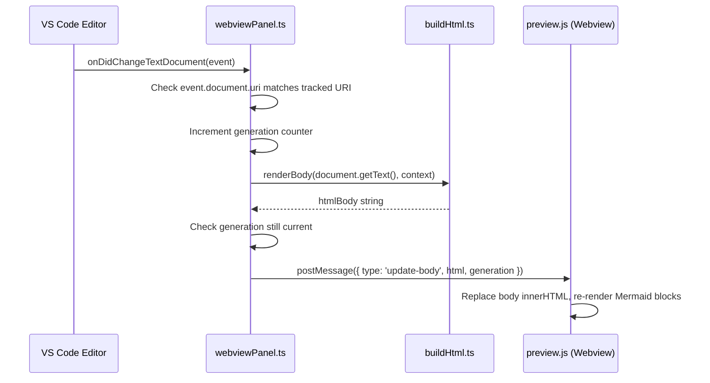

# Design Document: Preview Live Sync

## Overview

The Markdown Studio preview panel should update automatically in real-time whenever the user edits the Markdown source document. The existing implementation in `webviewPanel.ts` already registers an `onDidChangeTextDocument` listener that calls an `update()` closure, which rebuilds the full HTML via `buildHtml()` and assigns it to `webview.html`. However, users report the preview does not sync on edits.

The root cause is that replacing `webview.html` with a full HTML document on every keystroke forces the webview to perform a full page reload — destroying scroll position, Mermaid render state, and causing visible flicker. The VS Code webview API treats each `webview.html` assignment as a complete document replacement. Additionally, the `update()` closure captures the original `document` reference, so when the panel is reused for a different file the listener may still compare against the stale URI, and rapid keystrokes can cause overlapping async `buildHtml` calls that resolve out of order.

The fix introduces an incremental update path: instead of replacing the entire HTML document, the extension posts a message to the webview's `preview.js` script containing only the new rendered body HTML. The webview script patches the DOM in-place, preserving scroll position and avoiding a full reload. A generation counter in the extension ensures out-of-order async completions are discarded.

## Architecture



## Sequence Diagram: Live Sync Flow



## Components and Interfaces

### Component 1: webviewPanel.ts (Extension Host)

**Purpose**: Manages the webview panel lifecycle, listens for document changes, and sends incremental updates to the webview.

```typescript
interface PanelState {
  panel: vscode.WebviewPanel;
  changeSubscription: vscode.Disposable;
  trackedUri: string;
  generation: number;
}
```

**Responsibilities**:
- Register `onDidChangeTextDocument` listener scoped to the tracked document URI
- Increment a generation counter on each change event to handle out-of-order async completions
- On first open: assign full `webview.html` (initial load)
- On subsequent edits: call `renderBody()` and post an `update-body` message to the webview
- Dispose listener and reset state when panel is closed or document changes

### Component 2: buildHtml.ts (Render Pipeline)

**Purpose**: Renders Markdown to HTML. Exposes a new `renderBody()` function that returns only the `<body>` content (no `<head>`, no CSP meta tags) for incremental updates.

```typescript
// Existing — used for initial full-page load
export async function buildHtml(
  markdown: string,
  context: vscode.ExtensionContext,
  webview?: vscode.Webview,
  assets?: PreviewAssetUris
): Promise<string>;

// New — returns only the rendered body HTML for incremental updates
export async function renderBody(
  markdown: string,
  context: vscode.ExtensionContext
): Promise<string>;
```

**Responsibilities**:
- `buildHtml()` continues to produce the full HTML document for initial panel creation
- `renderBody()` calls `renderMarkdownDocument()` and returns just `htmlBody`

### Component 3: preview.js (Webview Script)

**Purpose**: Runs inside the webview. Listens for `update-body` messages from the extension host and patches the DOM in-place.

```typescript
// Message protocol
interface UpdateBodyMessage {
  type: 'update-body';
  html: string;
  generation: number;
}
```

**Responsibilities**:
- Listen for `message` events from the extension host via `window.addEventListener('message', ...)`
- On `update-body`: replace `document.body.innerHTML` with the new HTML
- Re-run Mermaid rendering on the updated DOM
- Discard messages with a stale generation number

## Data Models

### UpdateBodyMessage

```typescript
interface UpdateBodyMessage {
  type: 'update-body';
  html: string;
  generation: number;
}
```

**Validation Rules**:
- `type` must be the literal string `'update-body'`
- `html` must be a non-null string (may be empty for blank documents)
- `generation` must be a non-negative integer

## Key Functions with Formal Specifications

### Function 1: Incremental update in onDidChangeTextDocument handler

```typescript
async function handleDocumentChange(
  event: vscode.TextDocumentChangeEvent,
  trackedUri: string,
  panel: vscode.WebviewPanel,
  context: vscode.ExtensionContext,
  state: { generation: number }
): Promise<void>
```

**Preconditions**:
- `panel` is not disposed
- `trackedUri` is a valid document URI string
- `state.generation` is a non-negative integer

**Postconditions**:
- If `event.document.uri.toString() !== trackedUri`, no message is posted
- If generation has been superseded by a newer call, no message is posted
- Otherwise, `panel.webview.postMessage` is called with `{ type: 'update-body', html, generation }` where `html` is the rendered body

**Loop Invariants**: N/A (no loops)

### Function 2: renderBody()

```typescript
async function renderBody(
  markdown: string,
  context: vscode.ExtensionContext
): Promise<string>
```

**Preconditions**:
- `markdown` is a string (may be empty)
- `context` is a valid ExtensionContext

**Postconditions**:
- Returns the `htmlBody` string from `renderMarkdownDocument()`
- No `<html>`, `<head>`, or `<meta>` tags in the output
- No side effects on input parameters

### Function 3: Message handler in preview.js

```typescript
function handleUpdateMessage(message: UpdateBodyMessage): void
```

**Preconditions**:
- `message.type === 'update-body'`
- `document.body` exists in the webview DOM

**Postconditions**:
- `document.body.innerHTML` is replaced with `message.html`
- Mermaid blocks in the new content are re-rendered
- Scroll position is preserved (no full page reload)
- Stale generations (lower than the last applied) are ignored

## Algorithmic Pseudocode

### Live Sync Update Algorithm

```typescript
// Extension-host side (webviewPanel.ts)
let generation = 0;

onDidChangeTextDocument(async (event) => {
  if (event.document.uri.toString() !== trackedUri) return;

  generation++;
  const thisGeneration = generation;

  const htmlBody = await renderBody(document.getText(), context);

  // Discard if a newer edit arrived while we were rendering
  if (thisGeneration !== generation) return;

  panel.webview.postMessage({
    type: 'update-body',
    html: htmlBody,
    generation: thisGeneration,
  });
});
```

```typescript
// Webview side (preview.js)
let lastAppliedGeneration = -1;

window.addEventListener('message', (event) => {
  const message = event.data;
  if (message.type !== 'update-body') return;
  if (message.generation <= lastAppliedGeneration) return;

  lastAppliedGeneration = message.generation;
  document.body.innerHTML = message.html;
  renderMermaidBlocks();
});
```

## Example Usage

```typescript
// Initial panel creation — full HTML assigned once
const panel = vscode.window.createWebviewPanel(...);
panel.webview.html = await buildHtml(document.getText(), context, panel.webview, assets);

// Subsequent edits — incremental body update via postMessage
vscode.workspace.onDidChangeTextDocument(async (event) => {
  if (event.document.uri.toString() === trackedUri) {
    generation++;
    const gen = generation;
    const body = await renderBody(document.getText(), context);
    if (gen === generation) {
      panel.webview.postMessage({ type: 'update-body', html: body, generation: gen });
    }
  }
});
```

## Correctness Properties

*A property is a characteristic or behavior that should hold true across all valid executions of a system — essentially, a formal statement about what the system should do. Properties serve as the bridge between human-readable specifications and machine-verifiable correctness guarantees.*

### Property 1: Body-only content

*For any* arbitrary Markdown string, the output of `renderBody()` shall contain no `<!doctype`, `<html>`, `<head>`, or `<meta>` tags.

**Validates: Requirement 1.2**

### Property 2: Monotonic generation ordering

*For any* sequence of Update_Messages delivered to the Message_Handler, the handler shall only apply messages whose generation number is strictly greater than the last applied generation, discarding all others.

**Validates: Requirements 3.2, 3.3**

### Property 3: URI filtering

*For any* text change event whose document URI does not match the Tracked_URI, the Change_Handler shall not post any message to the Preview_Panel.

**Validates: Requirement 2.1**

## Error Handling

### Error Scenario 1: renderBody throws during rendering

**Condition**: Markdown contains malformed Mermaid/PlantUML that causes `renderMarkdownDocument` to throw.
**Response**: The `catch` block in the change handler logs the error to the output channel and does not post a message, leaving the last good preview in place.
**Recovery**: The next successful edit will produce a valid update.

### Error Scenario 2: postMessage called on disposed panel

**Condition**: The panel is disposed between the start of `renderBody` and the `postMessage` call.
**Response**: The generation check and the `onDidDispose` cleanup ensure the listener is removed. If a race occurs, `postMessage` on a disposed panel is a no-op in VS Code.
**Recovery**: No recovery needed; state is already cleaned up.

### Error Scenario 3: Rapid keystrokes cause overlapping renders

**Condition**: User types faster than `renderBody` can complete, causing multiple concurrent async calls.
**Response**: The generation counter ensures only the latest render result is applied. Stale results are silently discarded.
**Recovery**: Automatic — the latest generation always wins.

## Testing Strategy

### Unit Testing Approach

- Mock `vscode.workspace.onDidChangeTextDocument` to capture the registered callback
- Simulate firing the callback with a matching document URI and verify `postMessage` is called with `{ type: 'update-body', html, generation }`
- Simulate firing with a non-matching URI and verify no `postMessage` call
- Verify generation counter prevents stale updates by resolving two async renders out of order
- Verify `renderBody` returns body-only HTML without wrapper tags

### Property-Based Testing Approach

**Property Test Library**: fast-check

- For any arbitrary Markdown string, `renderBody()` output never contains `<!doctype`, `<html`, or `<head` tags
- For any sequence of generation numbers, the webview message handler only applies monotonically increasing generations

### Integration Testing Approach

- Open a real Markdown file, trigger `openOrRefreshPreview`, edit the document, and verify the webview receives an `update-body` message with correct content

## Performance Considerations

- Incremental DOM patching via `innerHTML` replacement on the body avoids full webview reload, eliminating flicker and preserving scroll position
- The generation counter acts as a natural debounce for rapid edits — stale renders are discarded without additional timer complexity
- `renderBody()` avoids regenerating the full HTML document (CSP headers, asset URIs) on each keystroke, reducing string allocation overhead
- For very large documents, a future optimization could diff the rendered HTML and send only changed sections, but `innerHTML` replacement is sufficient for typical Markdown files

## Security Considerations

- The Content Security Policy is set once during initial `buildHtml()` and is not re-sent via `postMessage`, so it cannot be weakened by incremental updates
- The `postMessage` channel only accepts the `update-body` type; unknown message types are ignored
- The rendered HTML body goes through the existing `sanitize-html` pipeline in `renderMarkdownDocument`, so no new XSS vectors are introduced
- The generation counter is a simple integer, not user-controlled, so it cannot be spoofed from within the webview

## Dependencies

- `vscode.workspace.onDidChangeTextDocument` — VS Code API for text change events
- `vscode.WebviewPanel.webview.postMessage` — VS Code API for extension-to-webview messaging
- `renderMarkdownDocument` from `src/renderers/renderMarkdown.ts` — existing Markdown rendering pipeline
- `sanitize-html` — existing HTML sanitization (no new dependency)
- `mermaid` — existing client-side Mermaid renderer in `preview.js` (no new dependency)
