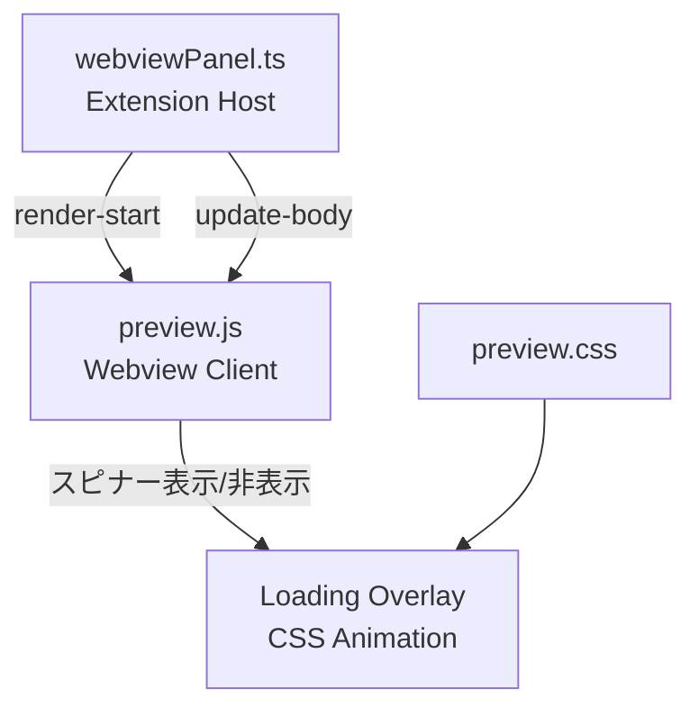
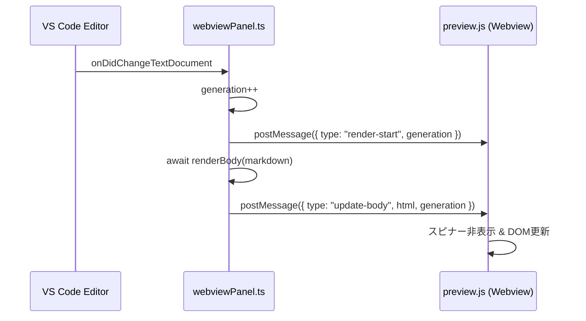
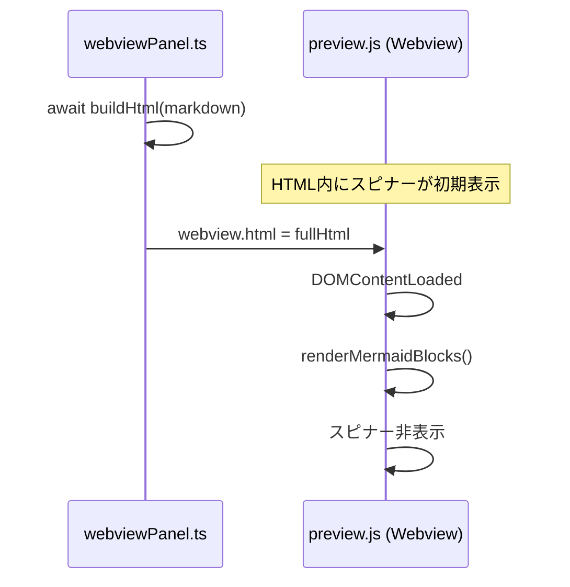

# 設計ドキュメント: Preview Loading Indicator

## 概要

Markdown Studio のプレビューパネルにおいて、Markdownレンダリング（特にMermaid・PlantUMLダイアグラム）に時間がかかる場合、ユーザーに処理中であることを視覚的に伝えるローディングインジケーターを追加する。

現在の実装では、`webviewPanel.ts` が `renderBody()` を非同期で呼び出し、完了後に `update-body` メッセージで webview の DOM を更新している。この非同期処理の間、ユーザーには何のフィードバックもない。本機能では、Extension Host 側からレンダリング開始・完了のメッセージを送信し、webview 側でスピナーオーバーレイを表示・非表示にする。

## アーキテクチャ



## シーケンス図

### テキスト変更時のフロー



### 初回表示時のフロー



## コンポーネントとインターフェース

### Component 1: Extension Host メッセージ送信 (webviewPanel.ts)

**目的**: レンダリング開始時に `render-start` メッセージを webview に送信する

**インターフェース**:
```typescript
// 新しいメッセージ型
interface RenderStartMessage {
  type: 'render-start';
  generation: number;
}

// 既存のメッセージ型（変更なし）
interface UpdateBodyMessage {
  type: 'update-body';
  html: string;
  generation: number;
}
```

**責務**:
- `renderBody()` 呼び出し前に `render-start` メッセージを送信
- レンダリングエラー時もスピナーを解除するため `render-error` メッセージを送信

### Component 2: Webview クライアント (preview.js)

**目的**: メッセージに応じてローディングオーバーレイを表示・非表示する

**インターフェース**:
```typescript
// スピナー制御関数
function showLoadingOverlay(): void;
function hideLoadingOverlay(): void;
```

**責務**:
- `render-start` メッセージ受信時にスピナーを表示
- `update-body` メッセージ受信時にスピナーを非表示
- 初回ロード時、Mermaidレンダリング完了後にスピナーを非表示
- generation チェックにより古いメッセージを無視

### Component 3: ローディングオーバーレイ UI (preview.css)

**目的**: CSSアニメーションによるスピナーを提供する

**責務**:
- ライト/ダークテーマ両対応
- コンテンツの上にオーバーレイとして表示（半透明背景）
- CSS-only アニメーション（JSタイマー不要）

## データモデル

### メッセージ型定義

```typescript
type WebviewMessage =
  | { type: 'render-start'; generation: number }
  | { type: 'update-body'; html: string; generation: number }
  | { type: 'render-error'; generation: number };
```

**バリデーションルール**:
- `generation` は正の整数
- `render-start` の generation は対応する `update-body` / `render-error` と一致すること

## 主要関数の仕様

### Function 1: showLoadingOverlay()

```typescript
function showLoadingOverlay(): void
```

**事前条件:**
- DOM が読み込み済み（DOMContentLoaded 後）

**事後条件:**
- `.ms-loading-overlay` 要素が `body` 内に存在する
- オーバーレイが `display: flex` で表示されている
- 既にオーバーレイが表示中の場合、重複作成しない

**ループ不変条件:** N/A

### Function 2: hideLoadingOverlay()

```typescript
function hideLoadingOverlay(): void
```

**事前条件:**
- なし（オーバーレイが存在しなくても安全に呼べる）

**事後条件:**
- `.ms-loading-overlay` 要素が `display: none` になっている
- DOM からは削除しない（再利用のため）

**ループ不変条件:** N/A

### Function 3: onDidChangeTextDocument ハンドラ（変更箇所）

```typescript
// webviewPanel.ts 内の変更
async function handleTextChange(
  document: vscode.TextDocument,
  context: vscode.ExtensionContext,
  panel: vscode.WebviewPanel
): Promise<void>
```

**事前条件:**
- `panel` が dispose されていない
- `document.uri` が `trackedUri` と一致

**事後条件:**
- `render-start` メッセージが `update-body` より先に送信される
- レンダリングエラー時は `render-error` メッセージが送信される
- stale generation のレンダリング結果は送信されない

## アルゴリズム擬似コード

### テキスト変更時の処理フロー

```pascal
ALGORITHM handleTextChange(document, context, panel)
INPUT: document (変更されたドキュメント), context, panel (webview panel)
OUTPUT: なし（副作用としてwebviewを更新）

BEGIN
  generation ← generation + 1
  thisGeneration ← generation

  // Step 1: レンダリング開始を通知
  panel.webview.postMessage({
    type: "render-start",
    generation: thisGeneration
  })

  // Step 2: 非同期レンダリング実行
  TRY
    htmlBody ← AWAIT renderBody(document.getText(), context)
  CATCH error
    IF thisGeneration = generation THEN
      panel.webview.postMessage({
        type: "render-error",
        generation: thisGeneration
      })
    END IF
    RETURN
  END TRY

  // Step 3: stale チェック後に結果を送信
  IF thisGeneration ≠ generation THEN
    RETURN  // 新しい変更が来たので破棄
  END IF

  panel.webview.postMessage({
    type: "update-body",
    html: htmlBody,
    generation: thisGeneration
  })
END
```

### Webview メッセージハンドラ

```pascal
ALGORITHM handleWebviewMessage(message)
INPUT: message (Extension Host からのメッセージ)
OUTPUT: なし（副作用としてDOM更新）

BEGIN
  SWITCH message.type
    CASE "render-start":
      IF message.generation > lastAppliedGeneration THEN
        showLoadingOverlay()
      END IF

    CASE "update-body":
      IF message.generation > lastAppliedGeneration THEN
        lastAppliedGeneration ← message.generation
        document.body の内容を message.html で更新
        AWAIT renderMermaidBlocks()
        hideLoadingOverlay()
      END IF

    CASE "render-error":
      IF message.generation > lastAppliedGeneration THEN
        hideLoadingOverlay()
      END IF
  END SWITCH
END
```

## 使用例

### Extension Host 側（webviewPanel.ts の変更）

```typescript
// onDidChangeTextDocument ハンドラ内
changeSubscription = vscode.workspace.onDidChangeTextDocument(async (event) => {
  if (event.document.uri.toString() !== trackedUri) return;

  generation++;
  const thisGeneration = generation;

  // レンダリング開始を通知
  panel.webview.postMessage({
    type: 'render-start',
    generation: thisGeneration,
  });

  let htmlBody: string;
  try {
    htmlBody = await renderBody(event.document.getText(), context);
  } catch (err) {
    console.error('[Markdown Studio] renderBody failed:', err);
    if (thisGeneration === generation) {
      panel.webview.postMessage({
        type: 'render-error',
        generation: thisGeneration,
      });
    }
    return;
  }

  if (thisGeneration !== generation) return;

  panel.webview.postMessage({
    type: 'update-body',
    html: htmlBody,
    generation: thisGeneration,
  });
});
```

### Webview 側（preview.js の変更）

```typescript
function showLoadingOverlay() {
  let overlay = document.getElementById('ms-loading-overlay');
  if (!overlay) {
    overlay = document.createElement('div');
    overlay.id = 'ms-loading-overlay';
    overlay.className = 'ms-loading-overlay';
    overlay.innerHTML = '<div class="ms-spinner"></div>';
    document.body.appendChild(overlay);
  }
  overlay.style.display = 'flex';
}

function hideLoadingOverlay() {
  const overlay = document.getElementById('ms-loading-overlay');
  if (overlay) {
    overlay.style.display = 'none';
  }
}
```

### CSS（preview.css の追加）

```css
.ms-loading-overlay {
  position: fixed;
  top: 0;
  left: 0;
  width: 100%;
  height: 100%;
  display: none;
  align-items: center;
  justify-content: center;
  background: rgba(0, 0, 0, 0.15);
  z-index: 9999;
  pointer-events: none;
}

body.vscode-dark .ms-loading-overlay,
body.vscode-high-contrast .ms-loading-overlay {
  background: rgba(0, 0, 0, 0.3);
}

.ms-spinner {
  width: 36px;
  height: 36px;
  border: 3px solid rgba(128, 128, 128, 0.3);
  border-top-color: var(--vscode-progressBar-background, #0078d4);
  border-radius: 50%;
  animation: ms-spin 0.8s linear infinite;
}

@keyframes ms-spin {
  to { transform: rotate(360deg); }
}
```

## Correctness Properties

*A property is a characteristic or behavior that should hold true across all valid executions of a system — essentially, a formal statement about what the system should do. Properties serve as the bridge between human-readable specifications and machine-verifiable correctness guarantees.*

### Property 1: Spinner consistency (render-start always followed by hide)

*For any* text change event that triggers a render-start message, the Change_Handler SHALL eventually send either an `update-body` or `render-error` message with the same generation, ensuring the spinner is never left visible indefinitely.

**Validates: Requirements 1.1, 2.1, 2.2, 3.2, 3.3**

### Property 2: Monotonic generation ordering

*For any* sequence of messages received by the Message_Handler, the `lastAppliedGeneration` value SHALL only increase, and messages with a generation less than or equal to the current `lastAppliedGeneration` SHALL be discarded without triggering Show_Loading or Hide_Loading.

**Validates: Requirements 5.1, 5.2**

### Property 3: Overlay idempotence and safety

*For any* number of consecutive Show_Loading calls (without intervening Hide_Loading), exactly one Loading_Overlay element SHALL exist in the DOM. Calling Hide_Loading when no overlay exists SHALL complete without error.

**Validates: Requirements 4.1, 4.2, 4.3**

### Property 4: Message ordering invariant

*For any* text change event, the Change_Handler SHALL send `render-start` before sending `update-body` or `render-error` for the same generation. No `update-body` or `render-error` SHALL be sent without a preceding `render-start` of the same generation.

**Validates: Requirements 1.1, 2.1**

## エラーハンドリング

### シナリオ 1: renderBody() の例外

**条件**: Markdown/ダイアグラムのレンダリング中にエラー発生
**対応**: `render-error` メッセージを送信してスピナーを解除
**復旧**: 次のテキスト変更で再レンダリングが試行される

### シナリオ 2: stale generation

**条件**: レンダリング中に新しいテキスト変更が発生
**対応**: 古い generation の結果は破棄。新しい `render-start` が送信されるためスピナーは維持される
**復旧**: 最新の generation のレンダリングが完了すればスピナーが解除される

### シナリオ 3: webview が dispose 済み

**条件**: レンダリング中にユーザーがプレビューパネルを閉じた
**対応**: `postMessage` は dispose 済みパネルに対して安全に失敗する（VS Code API の仕様）
**復旧**: 不要（パネルが閉じられている）

## テスト戦略

### ユニットテスト

- `showLoadingOverlay()` / `hideLoadingOverlay()` の DOM 操作テスト
- メッセージハンドラの generation チェックロジック
- `render-start` → `update-body` の順序でスピナーが正しく表示・非表示されること
- `render-error` でスピナーが解除されること

### プロパティベーステスト

**ライブラリ**: fast-check

- 任意の generation 列に対して `lastAppliedGeneration` が単調増加すること
- `showLoadingOverlay` を任意回数呼んでもオーバーレイ要素は1つだけ

### 統合テスト

- webviewPanel.ts の `onDidChangeTextDocument` ハンドラが `render-start` → `update-body` の順でメッセージを送信すること

## パフォーマンス考慮事項

- スピナーは CSS アニメーションのみ（JavaScript タイマー不使用）で GPU アクセラレーション対象
- `pointer-events: none` によりスピナー表示中もスクロール操作が可能
- オーバーレイ DOM 要素は再利用し、毎回の作成・削除を避ける

## セキュリティ考慮事項

- 新しいメッセージ型は既存の CSP ポリシー内で動作（外部リソース不要）
- スピナーは CSS-only で `unsafe-eval` 等の追加権限不要

## 依存関係

- 新規外部依存なし
- 既存の VS Code Webview API (`postMessage` / `onDidReceiveMessage`) を活用
