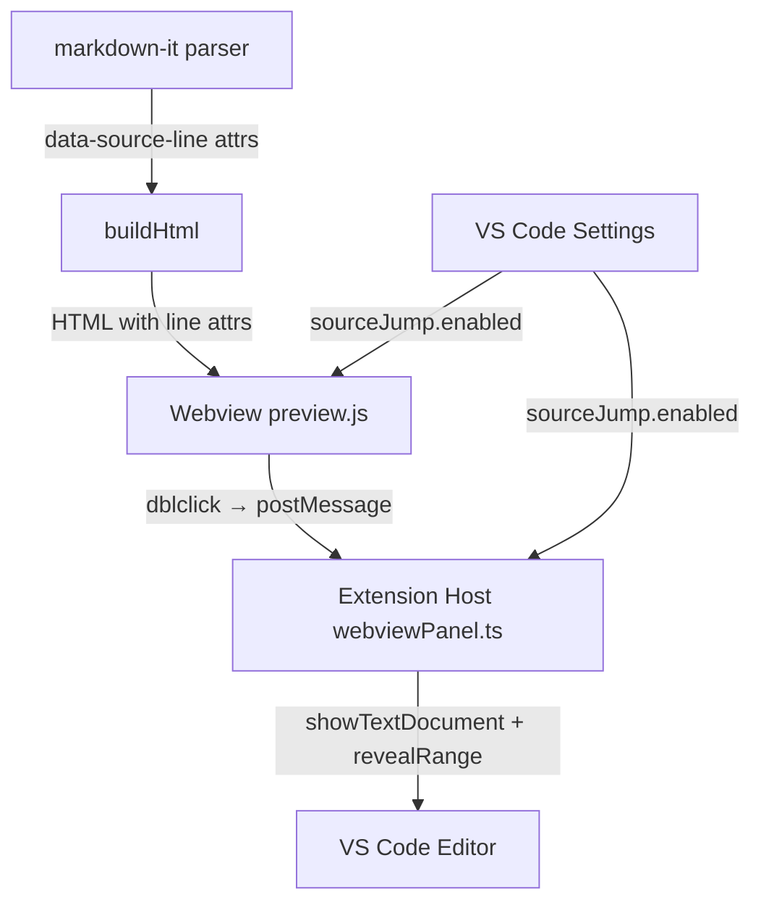
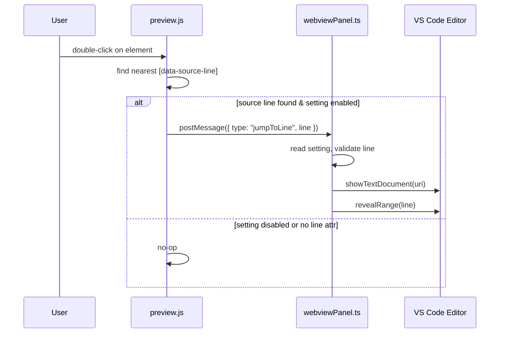

# Design Document: Preview Source Jump

## Overview

This feature allows users to double-click an element in the Markdown preview webview and have the editor scroll to the corresponding source line. Because this behavior can be disruptive (it steals editor focus on every double-click), it is gated behind a VS Code setting `markdownStudio.preview.sourceJump.enabled`, defaulting to `false`.

The implementation threads source-line metadata through three layers: the markdown-it parser emits `data-source-line` attributes on block-level HTML elements, the webview script listens for `dblclick` events and posts the line number back to the extension host, and the extension host opens/reveals the source document at that line.

## Architecture





## Components and Interfaces

### Component 1: Source Map Injection (parseMarkdown.ts)

**Purpose**: Configure markdown-it to emit `data-source-line` attributes on block-level tokens so rendered HTML carries source position metadata.

**Interface**:
```typescript
// No new public API — internal change to createMarkdownParser()
// markdown-it tokens with `map` property get data-source-line on their opening tags
```

**Responsibilities**:
- Add a custom renderer rule that injects `data-source-line="N"` into opening tags of block tokens
- Preserve existing rendering behavior for all other attributes
- Only inject when the token has a valid `.map` property (array with start line)

### Component 2: Webview Double-Click Handler (preview.js)

**Purpose**: Listen for `dblclick` events in the preview, walk up the DOM to find the nearest `data-source-line` attribute, and post a message to the extension host.

**Interface**:
```typescript
// Message sent from webview to extension host
interface JumpToLineMessage {
  type: 'jumpToLine';
  line: number; // 0-based line index from data-source-line
}
```

**Responsibilities**:
- Register a `dblclick` listener on `document.body`
- Walk from `event.target` up through `parentElement` until an element with `data-source-line` is found or `<body>` is reached
- Post `{ type: 'jumpToLine', line }` via `acquireVsCodeApi().postMessage()`
- Do nothing if no `data-source-line` ancestor exists

### Component 3: Message Handler (webviewPanel.ts)

**Purpose**: Receive `jumpToLine` messages from the webview and scroll the editor to the corresponding source line.

**Interface**:
```typescript
// Handled inside openOrRefreshPreview after panel creation
panel.webview.onDidReceiveMessage(async (message: { type: string; line?: number }) => void)
```

**Responsibilities**:
- Check that `markdownStudio.preview.sourceJump.enabled` is `true`; ignore message otherwise
- Validate `message.line` is a finite non-negative integer
- Find the text document matching the previewed file URI
- Call `vscode.window.showTextDocument()` then `editor.revealRange()` to scroll to the line

### Component 4: Configuration (package.json + config.ts)

**Purpose**: Expose the `markdownStudio.preview.sourceJump.enabled` setting and surface it through the config helper.

**Interface**:
```typescript
// Addition to MarkdownStudioConfig
interface MarkdownStudioConfig {
  // ... existing fields
  sourceJumpEnabled: boolean;
}
```

**Responsibilities**:
- Declare the setting in `package.json` contributes.configuration with `default: false`
- Read the setting in `getConfig()` so the extension host can gate behavior

## Data Models

### Message Protocol

```typescript
// Webview → Extension Host
interface JumpToLineMessage {
  type: 'jumpToLine';
  line: number; // 0-based line number from markdown-it source map
}
```

**Validation Rules**:
- `type` must be the string literal `'jumpToLine'`
- `line` must be a finite integer ≥ 0
- `line` must be less than the document's total line count

### Configuration Schema

```json
{
  "markdownStudio.preview.sourceJump.enabled": {
    "type": "boolean",
    "default": false,
    "description": "Double-click in preview jumps to the corresponding source line."
  }
}
```

## Key Functions with Formal Specifications

### Function 1: injectSourceLineAttrs (markdown-it renderer rule)

```typescript
function addSourceLineAttributes(md: MarkdownIt): void
```

**Preconditions:**
- `md` is a valid MarkdownIt instance
- Called once during parser creation

**Postconditions:**
- All block-level opening tokens with a valid `map` property render with `data-source-line="N"` where N is `token.map[0]`
- Tokens without `map` render unchanged
- Inline tokens and closing tokens are unaffected
- Existing HTML attributes on tokens are preserved

**Loop Invariants:** N/A

### Function 2: findSourceLine (preview.js DOM walker)

```typescript
function findSourceLine(element: HTMLElement | null): number | null
```

**Preconditions:**
- `element` is a DOM element inside the webview body, or null

**Postconditions:**
- Returns the integer value of the nearest ancestor's `data-source-line` attribute
- Returns `null` if no ancestor (up to and excluding `<body>`) has the attribute
- Never throws

**Loop Invariants:**
- At each iteration, `element` is a strict ancestor of the previous value
- Loop terminates when `element` is `null` or `document.body`

### Function 3: handleJumpToLine (extension host)

```typescript
async function handleJumpToLine(
  documentUri: vscode.Uri,
  line: number
): Promise<void>
```

**Preconditions:**
- `documentUri` refers to an existing text document
- `line` is a non-negative integer
- `markdownStudio.preview.sourceJump.enabled` is `true`

**Postconditions:**
- The editor for `documentUri` is visible and focused
- The cursor is at the beginning of `line`
- The viewport has scrolled so `line` is visible (centered via `revealRange` with `InCenter`)
- If `line` ≥ document line count, clamps to last line

## Algorithmic Pseudocode

### Source Line Attribute Injection

```typescript
function addSourceLineAttributes(md: MarkdownIt): void {
  // Patch the default renderer for all block-level open tokens
  const defaultRender = md.renderer.rules.html_block
    ?? function(tokens, idx, options, env, self) {
      return self.renderToken(tokens, idx, options);
    };

  // For each block token type that supports source maps:
  for (const ruleName of ['paragraph_open', 'heading_open', 'blockquote_open',
    'list_item_open', 'bullet_list_open', 'ordered_list_open',
    'table_open', 'thead_open', 'tbody_open', 'tr_open',
    'hr', 'code_block', 'fence', 'html_block']) {

    const original = md.renderer.rules[ruleName];

    md.renderer.rules[ruleName] = (tokens, idx, options, env, self) => {
      const token = tokens[idx];
      if (token.map && token.map.length >= 2) {
        token.attrSet('data-source-line', String(token.map[0]));
      }
      if (original) {
        return original(tokens, idx, options, env, self);
      }
      return self.renderToken(tokens, idx, options);
    };
  }
}
```

### Webview Double-Click Handler

```typescript
// Inside preview.js DOMContentLoaded handler
function findSourceLine(el: HTMLElement | null): number | null {
  while (el && el !== document.body) {
    const attr = el.getAttribute('data-source-line');
    if (attr !== null) {
      const line = parseInt(attr, 10);
      if (Number.isFinite(line)) return line;
    }
    el = el.parentElement;
  }
  return null;
}

document.body.addEventListener('dblclick', (event) => {
  const line = findSourceLine(event.target as HTMLElement);
  if (line !== null) {
    vscode.postMessage({ type: 'jumpToLine', line });
  }
});
```

### Extension Host Message Handler

```typescript
panel.webview.onDidReceiveMessage(async (message) => {
  if (message.type === 'jumpToLine' && typeof message.line === 'number') {
    const cfg = vscode.workspace.getConfiguration('markdownStudio');
    if (!cfg.get<boolean>('preview.sourceJump.enabled', false)) return;

    const line = Math.max(0, Math.floor(message.line));
    const editor = await vscode.window.showTextDocument(document.uri, {
      viewColumn: vscode.ViewColumn.One,
      preserveFocus: false,
    });
    const safeLine = Math.min(line, editor.document.lineCount - 1);
    const range = new vscode.Range(safeLine, 0, safeLine, 0);
    editor.selection = new vscode.Selection(range.start, range.end);
    editor.revealRange(range, vscode.TextEditorRevealType.InCenter);
  }
});
```

## Example Usage

```typescript
// 1. User enables the setting in VS Code settings.json:
// "markdownStudio.preview.sourceJump.enabled": true

// 2. User opens a Markdown file and runs "Markdown Studio: Open Secure Preview"
// 3. The preview renders with data-source-line attributes:
// <h1 data-source-line="0">Title</h1>
// <p data-source-line="2">Some paragraph text...</p>
// <ul data-source-line="4">
//   <li data-source-line="4">Item 1</li>
//   <li data-source-line="5">Item 2</li>
// </ul>

// 4. User double-clicks on "Some paragraph text" in the preview
// 5. preview.js finds data-source-line="2" on the <p> element
// 6. preview.js posts: { type: 'jumpToLine', line: 2 }
// 7. Extension host receives message, checks setting is enabled
// 8. Editor scrolls to line 2 and places cursor there
```

## Correctness Properties

*A property is a characteristic or behavior that should hold true across all valid executions of a system — essentially, a formal statement about what the system should do. Properties serve as the bridge between human-readable specifications and machine-verifiable correctness guarantees.*

### Property 1: Source line injection correctness

*For any* valid markdown string, every block-level token that markdown-it assigns a source map (`token.map`) SHALL produce an HTML element with a `data-source-line` attribute equal to `map[0]`, and every token without a `map` property SHALL produce an HTML element without a `data-source-line` attribute.

**Validates: Requirements 1.1, 1.2, 1.4**

### Property 2: Attribute preservation under injection

*For any* markdown-it token that already carries HTML attributes (e.g., `class`, `id`), injecting the `data-source-line` attribute SHALL preserve all pre-existing attributes on the rendered element.

**Validates: Requirement 1.3**

### Property 3: Sanitizer preserves data-source-line

*For any* HTML string containing `data-source-line` attributes with non-negative integer values on block-level elements, passing the HTML through the sanitizer SHALL produce output that retains those `data-source-line` attributes with their original values.

**Validates: Requirements 2.1, 2.2**

### Property 4: DOM walker finds nearest source line

*For any* DOM tree and any starting element within it, `findSourceLine` SHALL return the `data-source-line` value of the nearest ancestor that has the attribute, or `null` if no such ancestor exists before `<body>`, and SHALL always terminate without traversing past `<body>`.

**Validates: Requirements 3.1, 3.3, 3.4**

### Property 5: Setting gate suppresses navigation

*For any* valid `jumpToLine` message, when `markdownStudio.preview.sourceJump.enabled` is `false`, the Jump_Handler SHALL not invoke any editor navigation API.

**Validates: Requirements 4.2, 5.2**

### Property 6: Line clamping for out-of-range values

*For any* `jumpToLine` message where the line number is greater than or equal to the document's line count, the Jump_Handler SHALL navigate to `lineCount - 1` (the last line) rather than throwing or navigating to an invalid position.

**Validates: Requirement 4.4**

### Property 7: Invalid message rejection

*For any* message where `type` is not the string `'jumpToLine'`, or where `line` is not a finite non-negative integer (e.g., NaN, Infinity, negative, non-number), the Jump_Handler SHALL ignore the message and perform no editor navigation.

**Validates: Requirements 4.5, 4.6**

## Error Handling

### Error Scenario 1: No source line ancestor found

**Condition**: User double-clicks on an element (e.g., injected Mermaid SVG) that has no `data-source-line` in its ancestor chain.
**Response**: `findSourceLine` returns `null`; no message is posted. Silent no-op.
**Recovery**: None needed.

### Error Scenario 2: Document closed before jump

**Condition**: The source document is closed between the double-click and the message arriving at the extension host.
**Response**: `vscode.window.showTextDocument(uri)` will reopen the document from disk.
**Recovery**: Automatic — VS Code handles reopening.

### Error Scenario 3: Line number out of range

**Condition**: Source map line exceeds current document length (e.g., document was edited after preview rendered).
**Response**: Clamp to last line via `Math.min(line, editor.document.lineCount - 1)`.
**Recovery**: User sees cursor at end of file, which is a reasonable degradation.

## Testing Strategy

### Unit Testing Approach

- Test `addSourceLineAttributes`: render markdown through a patched parser and assert `data-source-line` attributes appear on expected elements with correct line numbers.
- Test `findSourceLine`: mock a DOM tree with and without `data-source-line` attributes, verify correct line or `null` is returned.
- Test message handler: mock `vscode.window.showTextDocument` and verify it is called with correct URI and line when setting is enabled, and NOT called when setting is disabled.

### Property-Based Testing Approach

**Property Test Library**: fast-check (already in devDependencies)

- For any valid markdown string, every block-level element in the rendered HTML that has a `data-source-line` attribute should have a value that is a valid non-negative integer within the source line range.
- For any `data-source-line` value N, line N in the original markdown should correspond to the start of the block that produced that element.

### Integration Testing Approach

- Render a known markdown document, parse the HTML output, and verify the `data-source-line` attributes match expected line numbers for headings, paragraphs, lists, and code blocks.

## Security Considerations

- The `data-source-line` attribute contains only integer values derived from markdown-it's internal source map — no user-controlled strings are injected into attribute values.
- The `postMessage` / `onDidReceiveMessage` channel is already scoped to the webview panel; no new attack surface is introduced.
- The `sanitize-html` configuration in `renderMarkdown.ts` must be updated to allow `data-source-line` on block elements, otherwise the attributes will be stripped. This is safe because the attribute value is always a stringified integer set by our own renderer rule.

## Dependencies

- `markdown-it` (existing) — source map feature via `token.map`
- `vscode` API (existing) — `showTextDocument`, `revealRange`, `Selection`, `Range`
- No new external dependencies required
