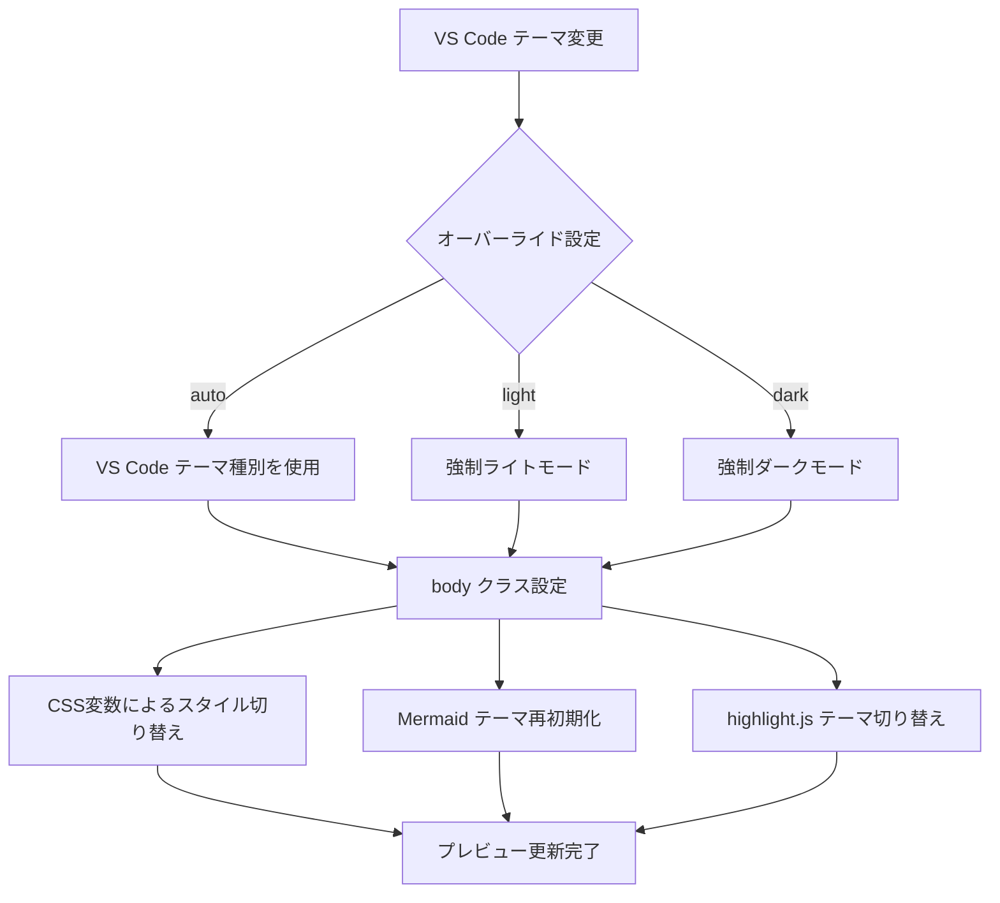

# 設計ドキュメント: プレビューテーマ自動切り替え

## 概要

本機能は、VS Codeのカラーテーマ種別（light / dark / high-contrast / high-contrast-light）に連動して、Markdown Studioのプレビューパネルの外観を自動的に切り替える。既存のCSS変数ベースのダークモード対応（`body.vscode-dark` クラスセレクタ）を活用し、Mermaidダイアグラム・highlight.jsテーマの連動、手動オーバーライド設定、PDF出力の分離を実現する。

### 設計方針

1. **既存パターンの最大活用**: VS Code Webviewが自動付与する `body.vscode-dark` / `body.vscode-light` クラスと `data-vscode-theme-kind` 属性を利用
2. **CSS変数ベース**: テーマ切り替えはCSS変数の再定義で実現し、CSS Layer Systemとの互換性を維持
3. **最小限の変更**: 既存の `preview.css`、`hljs-theme.css`、ビルトインテーマは既にダークモード対応済み。主な追加は手動オーバーライド機能とPDF出力の分離
4. **Webview側完結**: CSSの切り替えはWebview側のbodyクラスで完結し、Extension Host側はオーバーライド設定の伝達のみ担当

## アーキテクチャ

### テーマ検出・適用フロー



### レイヤー構成

```
Extension Host (Node.js)
├── config.ts          ← preview.theme 設定の読み取り
├── webviewPanel.ts    ← オーバーライド設定をWebviewに送信
└── buildHtml.ts       ← HTML生成（PDF時はライトモード固定）

Webview (Browser)
├── preview.js         ← テーマ検出・MutationObserver・Mermaid再初期化
│                        ← オーバーライドメッセージ受信・bodyクラス操作
├── preview.css        ← ベースCSS（ダークモード変数定義済み）
├── hljs-theme.css     ← highlight.jsテーマ（body.vscode-darkセレクタ済み）
└── themes/*.css       ← ビルトインテーマ（ダークモード定義済み）
```

## コンポーネントとインターフェース

### 1. テーマオーバーライド設定（Extension Host側）

**ファイル**: `src/infra/config.ts`, `package.json`

新しい設定項目 `markdownStudio.preview.theme` を追加:

```typescript
// config.ts に追加
previewTheme: 'auto' | 'light' | 'dark';
```

```json
// package.json contributes.configuration.properties に追加
"markdownStudio.preview.theme": {
  "type": "string",
  "default": "auto",
  "enum": ["auto", "light", "dark"],
  "enumDescriptions": [
    "VS Codeのカラーテーマに自動追従",
    "常にライトモードで表示",
    "常にダークモードで表示"
  ],
  "description": "プレビューのテーマモード。autoはVS Codeのカラーテーマに追従します。"
}
```

### 2. Webviewへのオーバーライド伝達（Extension Host側）

**ファイル**: `src/preview/webviewPanel.ts`

Extension Hostは設定変更時にWebviewへメッセージを送信:

```typescript
// webviewPanel.ts — 設定変更リスナーに追加
if (e.affectsConfiguration('markdownStudio.preview.theme')) {
  const cfg = getConfig();
  currentPanel.webview.postMessage({
    type: 'theme-override',
    value: cfg.previewTheme, // 'auto' | 'light' | 'dark'
  });
}
```

初回HTML生成時にも `data-theme-override` 属性をbodyに埋め込む:

```typescript
// buildHtml.ts — body タグ生成時
const themeOverride = config.previewTheme;
// <body data-theme-override="auto"> のように埋め込む
```

### 3. テーマ適用ロジック（Webview側）

**ファイル**: `media/preview.js`

```typescript
// 有効なテーマ種別を決定する関数
function resolveEffectiveThemeKind(override: string): string {
  if (override === 'light') return 'vscode-light';
  if (override === 'dark') return 'vscode-dark';
  // 'auto' の場合はVS Codeの実際のテーマ種別を使用
  return detectThemeKind();
}

// bodyクラスを更新してテーマを適用
function applyThemeClass(themeKind: string): void {
  const classes = ['vscode-light', 'vscode-dark', 'vscode-high-contrast', 'vscode-high-contrast-light'];
  document.body.classList.remove(...classes);
  document.body.classList.add(themeKind);
}
```

### 4. MutationObserverとメッセージリスナーの統合

**ファイル**: `media/preview.js`

既存の `observeThemeChanges` を拡張し、オーバーライドモード時はVS Codeのテーマ変更を無視:

```typescript
// テーマ変更時のコールバック（既存のMermaid再初期化を含む）
function onThemeChanged(newThemeKind: string): void {
  applyThemeClass(newThemeKind);
  // Mermaid再初期化（既存ロジック）
  mermaid.initialize({ startOnLoad: false, securityLevel: 'strict', theme: getMermaidTheme(newThemeKind) });
  renderMermaidBlocks();
}

// メッセージリスナーで theme-override を処理
window.addEventListener('message', (event) => {
  if (event.data.type === 'theme-override') {
    currentOverride = event.data.value;
    onThemeChanged(resolveEffectiveThemeKind(currentOverride));
  }
});
```

### 5. PDF出力の分離

**ファイル**: `src/export/exportPdf.ts`

PDF出力パイプラインでは、テーマオーバーライド設定に関係なく常にライトモードを使用:

- `buildHtml()` でPDFコンテキスト（`webview === undefined`）の場合、`data-theme-override="light"` を設定
- 既存の `@media print` ルールがライトモードの固定スタイルを提供
- Playwright Chromiumはbodyクラスを持たないため、デフォルトでライトモードになる

追加の安全策として、PDF出力時にbodyクラスを明示的にリセット:

```typescript
// exportPdf.ts — setContent後にbodyクラスをリセット
await page.evaluate(() => {
  document.body.classList.remove('vscode-dark', 'vscode-high-contrast');
  document.body.classList.add('vscode-light');
});
```

## データモデル

### 設定モデルの拡張

```typescript
// src/types/models.ts
export type PreviewThemeMode = 'auto' | 'light' | 'dark';

// src/infra/config.ts — MarkdownStudioConfig に追加
export interface MarkdownStudioConfig {
  // ... 既存フィールド
  previewTheme: PreviewThemeMode;
}
```

### Webview メッセージプロトコル

```typescript
// Extension Host → Webview
interface ThemeOverrideMessage {
  type: 'theme-override';
  value: 'auto' | 'light' | 'dark';
}

// 既存メッセージ（変更なし）
interface UpdateBodyMessage { type: 'update-body'; html: string; generation: number; }
interface RenderStartMessage { type: 'render-start'; generation: number; }
interface RenderErrorMessage { type: 'render-error'; generation: number; }
```

### CSS変数マッピング（既存・変更なし）

`preview.css` の既存CSS変数定義はそのまま活用:

| CSS変数 | ライトモード | ダークモード |
|---------|-------------|-------------|
| `--code-bg` | `#f6f8fa` | `#161b22` |
| `--code-border` | `#d0d7de` | `#3d444d` |
| `--table-border` | `#d0d7de` | `#3d444d` |
| `--table-header-bg` | `#f6f8fa` | `#2d333b` |
| `--table-stripe-bg` | `#f6f8fa80` | `#2d333b80` |
| `--diagram-text` | `#1e1e1e` | `#d4d4d4` |
| `--diagram-bg` | `#ffffff` | `#1e1e1e` |

### THEME_MAP（既存・変更なし）

```javascript
const THEME_MAP = {
  'vscode-dark': 'dark',
  'vscode-light': 'default',
  'vscode-high-contrast': 'dark',
  'vscode-high-contrast-light': 'default',
};
```


## 正当性プロパティ

*プロパティとは、システムのすべての有効な実行において真であるべき特性や振る舞いのことです。プロパティは、人間が読める仕様と機械で検証可能な正当性保証の橋渡しをします。*

### Property 1: テーマオーバーライド解決の正当性

*For any* オーバーライド値（`auto` | `light` | `dark`）と *for any* VS Codeテーマ種別（`vscode-light` | `vscode-dark` | `vscode-high-contrast` | `vscode-high-contrast-light`）の組み合わせにおいて、`resolveEffectiveThemeKind` は以下を満たす:
- オーバーライドが `light` の場合、結果は常に `vscode-light`
- オーバーライドが `dark` の場合、結果は常に `vscode-dark`
- オーバーライドが `auto` の場合、結果はVS Codeの実際のテーマ種別と一致

**Validates: Requirements 6.1, 6.2, 6.3, 6.4**

### Property 2: PDF出力のライトモード固定

*For any* プレビューテーマオーバーライド設定値（`auto` | `light` | `dark`）と *for any* 有効なMarkdownコンテンツにおいて、PDF出力用に生成されるHTMLは常にライトモードのbodyクラス（`vscode-light`）を持ち、ダークモードのbodyクラス（`vscode-dark`、`vscode-high-contrast`）を含まない。

**Validates: Requirements 7.1, 7.2**

### Property 3: Mermaidテーママッピングの一貫性

*For any* 有効なテーマ種別において、`getMermaidTheme` の戻り値は常に `'default'` または `'dark'` のいずれかであり、ダーク系テーマ種別（`vscode-dark`、`vscode-high-contrast`）は `'dark'` に、ライト系テーマ種別（`vscode-light`、`vscode-high-contrast-light`）は `'default'` にマッピングされる。

**Validates: Requirements 3.1, 3.3**

## エラーハンドリング

### テーマ検出失敗

| シナリオ | 対応 |
|---------|------|
| `data-vscode-theme-kind` 属性が存在しない | `detectThemeKind()` が `'vscode-light'` にフォールバック（既存動作） |
| MutationObserverが利用不可 | テーマ変更の自動追従が無効化。手動リロードで対応 |
| 不正なオーバーライド値 | `'auto'` として扱う |

### Mermaid再初期化失敗

| シナリオ | 対応 |
|---------|------|
| `mermaid.initialize()` が例外をスロー | `mermaidReady = false` に設定し、コンソールにエラーログ出力（既存動作） |
| 再レンダリング失敗 | 個別ブロックにエラーメッセージを表示（既存動作） |

### PDF出力時のテーマ分離

| シナリオ | 対応 |
|---------|------|
| Playwright Chromiumでbodyクラスが未設定 | `page.evaluate()` で明示的に `vscode-light` クラスを付与 |
| `@media print` ルールが適用されない | インラインスタイルでライトモード変数を強制設定 |

## テスト戦略

### テストアプローチ

本機能は以下の2つのテストアプローチを組み合わせる:

1. **プロパティベーステスト**: `resolveEffectiveThemeKind`、`getMermaidTheme`、PDF出力のライトモード固定など、純粋関数の正当性を検証
2. **ユニットテスト**: 具体的なシナリオ、エッジケース、CSS構造の検証

### プロパティベーステスト

- ライブラリ: `fast-check`（既にdevDependenciesに含まれている）
- 各プロパティテストは最低100イテレーション実行
- タグ形式: `Feature: preview-theme-auto-switch, Property {number}: {property_text}`

#### テスト対象

| プロパティ | テスト内容 | ファイル |
|-----------|-----------|---------|
| Property 1 | `resolveEffectiveThemeKind` のオーバーライド解決 | `test/unit/previewTheme.property.test.ts` |
| Property 2 | PDF出力HTML生成のライトモード固定 | `test/unit/previewTheme.property.test.ts` |
| Property 3 | `getMermaidTheme` のマッピング一貫性 | `test/unit/previewTheme.property.test.ts` |

### ユニットテスト

| テスト内容 | 分類 | ファイル |
|-----------|------|---------|
| `detectThemeKind` が4種類のテーマ種別を正しく識別 | EXAMPLE | `test/unit/previewTheme.test.ts` |
| `detectThemeKind` が不明な属性値でフォールバック | EDGE_CASE | `test/unit/previewTheme.test.ts` |
| `getConfig()` の `previewTheme` デフォルト値が `'auto'` | SMOKE | `test/unit/config.test.ts` |
| ビルトインテーマCSS（modern, markdown-pdf, minimal）に `body.vscode-dark` セレクタが存在 | EXAMPLE | `test/unit/previewTheme.test.ts` |
| `@media print` ルールがライトモードの固定スタイルを含む | EXAMPLE | `test/unit/previewTheme.test.ts` |
| テーマオーバーライドメッセージの送受信 | INTEGRATION | `test/integration/` |

### テスト対象外

- VS Code Webview内のMutationObserver動作（E2Eテストの範囲）
- 実際のCSS描画結果の視覚的検証（ビジュアルリグレッションテストの範囲）
- Mermaidダイアグラムの実際の再レンダリング結果（Mermaidライブラリの責務）
