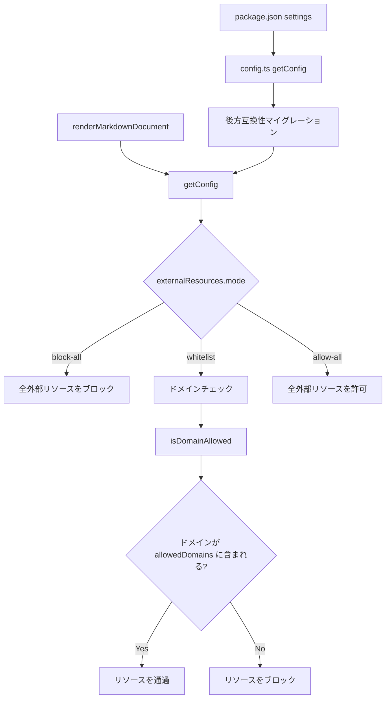
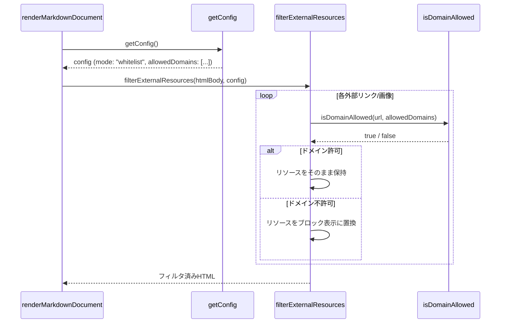
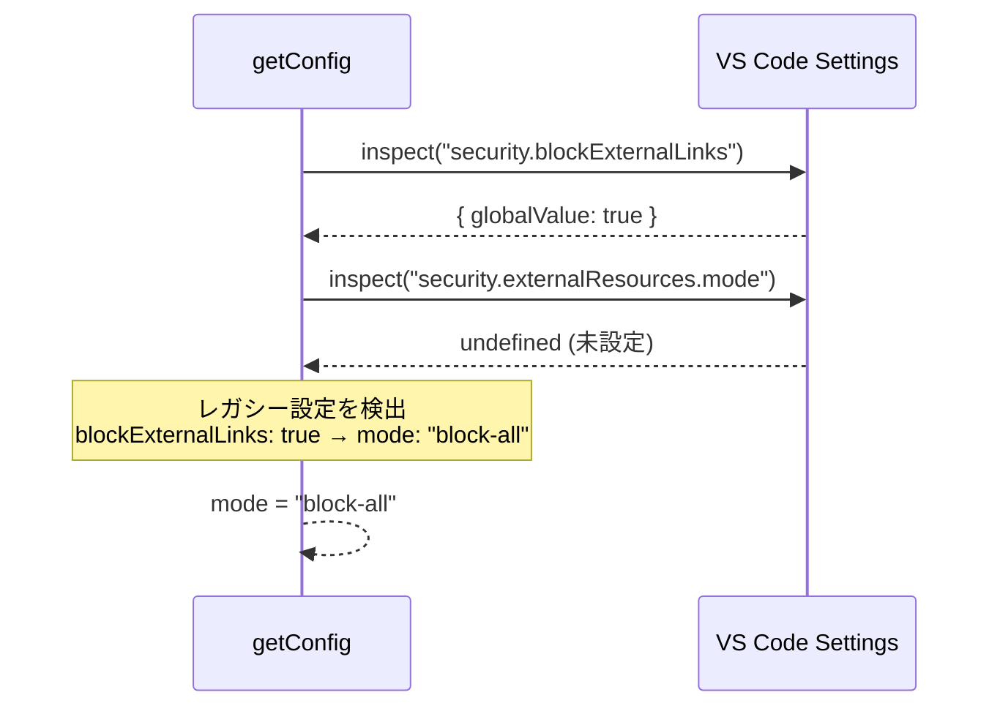

# 設計ドキュメント: Resource Whitelist

## 概要

現在の `blockExternalLinks: boolean` 設定を、より柔軟な外部リソース制御システムに置き換える。新しい設定では3つのモード（`block-all`、`whitelist`、`allow-all`）を提供し、`whitelist` モードではユーザーが許可するドメインを指定できる。デフォルトではGitHubドメイン（`github.com`、`raw.githubusercontent.com`、`user-images.githubusercontent.com`）がホワイトリストに含まれ、README/ドキュメント内のGitHubホスト画像をサポートする。

既存の `blockExternalLinks: true` を設定しているユーザーに対しては後方互換性を維持し、自動的に `block-all` モードとして扱う。この機能はプレビューとPDFエクスポートの両方に適用される。

## アーキテクチャ



## シーケンス図

### ホワイトリストモードでのレンダリングフロー



### 後方互換性マイグレーションフロー



## コンポーネントとインターフェース

### コンポーネント1: ExternalResourceConfig（設定モデル）

**目的**: 外部リソース制御の設定を型安全に表現する

```typescript
type ExternalResourceMode = "block-all" | "whitelist" | "allow-all";

interface ExternalResourceConfig {
  mode: ExternalResourceMode;
  allowedDomains: string[];
}
```

**責務**:
- 外部リソース制御モードの保持
- 許可ドメインリストの保持
- デフォルト値の定義

### コンポーネント2: ドメインマッチング関数群

**目的**: URLからドメインを抽出し、ホワイトリストと照合する

```typescript
function extractDomain(url: string): string | null;
function isDomainAllowed(url: string, allowedDomains: string[]): boolean;
```

**責務**:
- URLからドメイン部分を安全に抽出
- サブドメインを含む完全一致でのドメイン照合
- 不正なURLに対する安全なフォールバック

### コンポーネント3: HTMLフィルタリング

**目的**: HTMLボディ内の外部リソースをモードに応じてフィルタリングする

```typescript
function filterExternalResources(
  htmlBody: string,
  config: ExternalResourceConfig
): string;
```

**責務**:
- `<a href="https://...">` リンクのフィルタリング
- `` 画像のフィルタリング
- モードに応じた処理の分岐

## データモデル

### ExternalResourceConfig

```typescript
type ExternalResourceMode = "block-all" | "whitelist" | "allow-all";

const DEFAULT_ALLOWED_DOMAINS: readonly string[] = [
  "github.com",
  "raw.githubusercontent.com",
  "user-images.githubusercontent.com",
] as const;

interface ExternalResourceConfig {
  mode: ExternalResourceMode;
  allowedDomains: string[];
}
```

**バリデーションルール**:
- `mode` は `"block-all"` | `"whitelist"` | `"allow-all"` のいずれか
- `allowedDomains` の各要素は空文字列でないこと
- `allowedDomains` の各要素はプロトコルを含まないドメイン名であること（例: `github.com`、`https://github.com` ではない）

### MarkdownStudioConfig の変更

```typescript
interface MarkdownStudioConfig {
  // ... 既存フィールド ...
  blockExternalLinks: boolean;        // 削除
  externalResources: ExternalResourceConfig;  // 追加
}
```

### package.json 設定スキーマ

```typescript
// 新規追加
"markdownStudio.security.externalResources.mode": {
  type: "string",
  default: "whitelist",
  enum: ["block-all", "whitelist", "allow-all"],
  description: "外部リソースの制御モード"
}

"markdownStudio.security.externalResources.allowedDomains": {
  type: "array",
  items: { type: "string" },
  default: [
    "github.com",
    "raw.githubusercontent.com",
    "user-images.githubusercontent.com"
  ],
  description: "ホワイトリストモードで許可するドメインのリスト"
}

// 既存（非推奨化）
"markdownStudio.security.blockExternalLinks": {
  type: "boolean",
  default: true,
  description: "非推奨: externalResources.mode を使用してください",
  deprecationMessage: "非推奨: markdownStudio.security.externalResources.mode を使用してください"
}
```


## 主要関数の形式仕様

### 関数1: extractDomain()

```typescript
function extractDomain(url: string): string | null
```

**事前条件:**
- `url` は文字列型である
- `url` は空文字列でない

**事後条件:**
- 有効なHTTP/HTTPS URLの場合: ホスト名部分（ポート番号を除く）を小文字で返す
- 無効なURLの場合: `null` を返す
- 入力 `url` は変更されない

**ループ不変条件:** N/A

### 関数2: isDomainAllowed()

```typescript
function isDomainAllowed(url: string, allowedDomains: string[]): boolean
```

**事前条件:**
- `url` は文字列型である
- `allowedDomains` は文字列の配列である
- `allowedDomains` の各要素はプロトコルを含まないドメイン名である

**事後条件:**
- URLのドメインが `allowedDomains` のいずれかと完全一致する場合: `true` を返す
- URLのドメインが `allowedDomains` のいずれとも一致しない場合: `false` を返す
- URLが無効な場合: `false` を返す
- 比較は大文字小文字を区別しない
- 入力パラメータは変更されない

**ループ不変条件:**
- 照合ループ中、以前にチェックしたドメインは一致しなかった

### 関数3: filterExternalResources()

```typescript
function filterExternalResources(
  htmlBody: string,
  config: ExternalResourceConfig
): string
```

**事前条件:**
- `htmlBody` は有効なHTML文字列である
- `config.mode` は `"block-all"` | `"whitelist"` | `"allow-all"` のいずれか
- `config.allowedDomains` は文字列の配列である

**事後条件:**
- `mode === "allow-all"` の場合: `htmlBody` をそのまま返す
- `mode === "block-all"` の場合: 全ての外部リンクと画像がブロック表示に置換される
- `mode === "whitelist"` の場合: 許可ドメインのリソースのみ保持され、それ以外はブロック表示に置換される
- ローカルリソース（`vscode-resource://` 等）は影響を受けない
- 入力 `htmlBody` は変更されない

**ループ不変条件:**
- 処理済みのリソースは全てモードに従って正しくフィルタリングされている

### 関数4: resolveExternalResourceConfig()

```typescript
function resolveExternalResourceConfig(
  cfg: vscode.WorkspaceConfiguration
): ExternalResourceConfig
```

**事前条件:**
- `cfg` は有効な VS Code WorkspaceConfiguration オブジェクトである

**事後条件:**
- レガシー設定 `blockExternalLinks: true` が存在し、新設定が未設定の場合: `{ mode: "block-all", allowedDomains: DEFAULT_ALLOWED_DOMAINS }` を返す
- レガシー設定 `blockExternalLinks: false` が存在し、新設定が未設定の場合: `{ mode: "allow-all", allowedDomains: DEFAULT_ALLOWED_DOMAINS }` を返す
- 新設定が存在する場合: 新設定の値を優先して返す
- どちらも未設定の場合: デフォルト値 `{ mode: "whitelist", allowedDomains: DEFAULT_ALLOWED_DOMAINS }` を返す

**ループ不変条件:** N/A

## アルゴリズム擬似コード

### 外部リソースフィルタリングアルゴリズム

```typescript
function filterExternalResources(
  htmlBody: string,
  config: ExternalResourceConfig
): string {
  // モード判定による早期リターン
  if (config.mode === "allow-all") {
    return htmlBody;
  }

  let result = htmlBody;

  // 外部リンクのフィルタリング
  result = result.replace(
    /<a\s+([^>]*href="(https?:\/\/[^"]+?)"[^>]*)>/g,
    (match, attrs, url) => {
      if (config.mode === "block-all") {
        return '<span class="ms-link-blocked" title="External link blocked">';
      }
      // whitelist モード
      if (isDomainAllowed(url, config.allowedDomains)) {
        return match; // 許可ドメイン → そのまま
      }
      return '<span class="ms-link-blocked" title="External link blocked">';
    }
  );

  // block-all の場合、全 </a> を </span> に置換
  // whitelist の場合、ブロックされたリンクの </a> のみ置換が必要
  // → 簡略化のため、block-all と同じ置換を適用し、
  //   許可されたリンクは元の <a> タグを保持しているため </a> も保持される
  if (config.mode === "block-all") {
    result = result.replace(/<\/a>/g, "</span>");
  }

  // 外部画像のフィルタリング
  result = result.replace(
    /]*src="(https?:\/\/[^"]+?)"[^>]*)>/g,
    (match, attrs, url) => {
      if (config.mode === "block-all") {
        return '<div class="ms-error">External image blocked by policy.</div>';
      }
      // whitelist モード
      if (isDomainAllowed(url, config.allowedDomains)) {
        return match; // 許可ドメイン → そのまま
      }
      return '<div class="ms-error">External image blocked by policy.</div>';
    }
  );

  return result;
}
```

### 設定解決アルゴリズム

```typescript
function resolveExternalResourceConfig(
  cfg: vscode.WorkspaceConfiguration
): ExternalResourceConfig {
  const hasNewMode = hasUserValue(cfg, "security.externalResources.mode");
  const hasLegacy = hasUserValue(cfg, "security.blockExternalLinks");

  // 新設定が明示的に設定されている場合は新設定を優先
  if (hasNewMode) {
    return {
      mode: cfg.get<ExternalResourceMode>(
        "security.externalResources.mode",
        "whitelist"
      ),
      allowedDomains: cfg.get<string[]>(
        "security.externalResources.allowedDomains",
        [...DEFAULT_ALLOWED_DOMAINS]
      ),
    };
  }

  // レガシー設定のみ存在する場合はマイグレーション
  if (hasLegacy) {
    const blockAll = cfg.get<boolean>("security.blockExternalLinks", true);
    return {
      mode: blockAll ? "block-all" : "allow-all",
      allowedDomains: [...DEFAULT_ALLOWED_DOMAINS],
    };
  }

  // どちらも未設定 → デフォルト
  return {
    mode: "whitelist",
    allowedDomains: [...DEFAULT_ALLOWED_DOMAINS],
  };
}
```

### ドメイン抽出・照合アルゴリズム

```typescript
function extractDomain(url: string): string | null {
  try {
    const parsed = new URL(url);
    return parsed.hostname.toLowerCase();
  } catch {
    return null;
  }
}

function isDomainAllowed(url: string, allowedDomains: string[]): boolean {
  const domain = extractDomain(url);
  if (domain === null) {
    return false;
  }
  return allowedDomains.some(
    (allowed) => domain === allowed.toLowerCase()
  );
}
```

## 使用例

```typescript
// 例1: デフォルト設定（ホワイトリストモード）
// settings.json に何も設定しない場合
// → mode: "whitelist", allowedDomains: ["github.com", "raw.githubusercontent.com", ...]
// GitHub画像は表示され、他の外部画像はブロックされる

// 例2: カスタムドメインを追加
// settings.json:
// {
//   "markdownStudio.security.externalResources.mode": "whitelist",
//   "markdownStudio.security.externalResources.allowedDomains": [
//     "github.com",
//     "raw.githubusercontent.com",
//     "user-images.githubusercontent.com",
//     "i.imgur.com",
//     "example.com"
//   ]
// }

// 例3: 全ブロック（既存動作と同等）
// settings.json:
// {
//   "markdownStudio.security.externalResources.mode": "block-all"
// }

// 例4: 全許可
// settings.json:
// {
//   "markdownStudio.security.externalResources.mode": "allow-all"
// }

// 例5: レガシー設定からの自動マイグレーション
// settings.json に blockExternalLinks: true がある場合
// → 自動的に mode: "block-all" として動作
```

## 正当性プロパティ

以下の性質が常に成り立つことを保証する:

1. **モード網羅性**: `∀ config: ExternalResourceConfig, config.mode ∈ {"block-all", "whitelist", "allow-all"}`
2. **block-all の完全性**: `mode === "block-all" ⟹ フィルタ後のHTMLに外部URL（https://）を含む <a> タグまたは  タグが存在しない`
3. **allow-all の透過性**: `mode === "allow-all" ⟹ filterExternalResources(html, config) === html`
4. **whitelist の正確性**: `mode === "whitelist" ∧ isDomainAllowed(url, allowedDomains) ⟹ そのURLを含むリソースはフィルタ後も保持される`
5. **whitelist のブロック性**: `mode === "whitelist" ∧ ¬isDomainAllowed(url, allowedDomains) ⟹ そのURLを含むリソースはブロック表示に置換される`
6. **後方互換性**: `blockExternalLinks: true ∧ 新設定未設定 ⟹ mode === "block-all"`
7. **後方互換性（false）**: `blockExternalLinks: false ∧ 新設定未設定 ⟹ mode === "allow-all"`
8. **デフォルト安全性**: `設定未指定 ⟹ mode === "whitelist" ∧ allowedDomains にGitHubドメインが含まれる`
9. **ドメイン照合の大文字小文字非依存**: `isDomainAllowed("https://GitHub.COM/...", ["github.com"]) === true`
10. **無効URL安全性**: `extractDomain(invalidUrl) === null ⟹ isDomainAllowed(invalidUrl, anyDomains) === false`

## エラーハンドリング

### エラーシナリオ1: 無効なドメイン形式

**条件**: `allowedDomains` にプロトコル付きURL（`https://github.com`）やパス付き文字列が含まれる場合
**対応**: ドメイン比較時にホスト名部分のみを抽出して比較。設定値のバリデーションは行わず、寛容に処理する
**回復**: 正常動作を継続

### エラーシナリオ2: 無効なURL

**条件**: HTML内のhref/srcに不正なURLが含まれる場合
**対応**: `extractDomain` が `null` を返し、`isDomainAllowed` が `false` を返す → リソースはブロックされる
**回復**: 安全側にフォールバック（ブロック）

### エラーシナリオ3: レガシー設定と新設定の競合

**条件**: ユーザーが `blockExternalLinks` と `externalResources.mode` の両方を設定している場合
**対応**: 新設定（`externalResources.mode`）を優先する
**回復**: 競合は自動解決され、ユーザーへの通知は不要

## テスト戦略

### ユニットテスト

- `extractDomain`: 各種URL形式（有効/無効/エッジケース）に対するドメイン抽出
- `isDomainAllowed`: ドメイン照合の正確性（大文字小文字、完全一致）
- `filterExternalResources`: 各モードでのHTML変換の正確性
- `resolveExternalResourceConfig`: 設定解決ロジック（レガシー、新設定、デフォルト）

### プロパティベーステスト

**ライブラリ**: fast-check（既にdevDependenciesに含まれている）

- 任意のURLに対して `extractDomain` が例外を投げないこと
- `mode === "allow-all"` の場合、任意のHTMLが変更されないこと
- `mode === "block-all"` の場合、出力に外部URLを含む `<a>` / `` が存在しないこと
- 任意のドメインリストに対して、`isDomainAllowed` の結果が大文字小文字に依存しないこと

### 統合テスト

- `renderMarkdownDocument` が各モードで正しくフィルタリングを適用すること
- GitHub画像URLがデフォルト設定で表示されること

## セキュリティ考慮事項

- デフォルトモードは `whitelist`（最小権限の原則）
- `allow-all` モードはユーザーが明示的に設定した場合のみ有効
- ドメイン照合は完全一致（サブドメインワイルドカードは非サポート）で、意図しないドメインの許可を防止
- URL解析には `URL` コンストラクタを使用し、正規表現ベースの解析による脆弱性を回避

## 依存関係

- 新規外部依存なし
- 既存の `URL` API（Node.js標準）を使用
- 既存の `fast-check` をプロパティベーステストに使用
