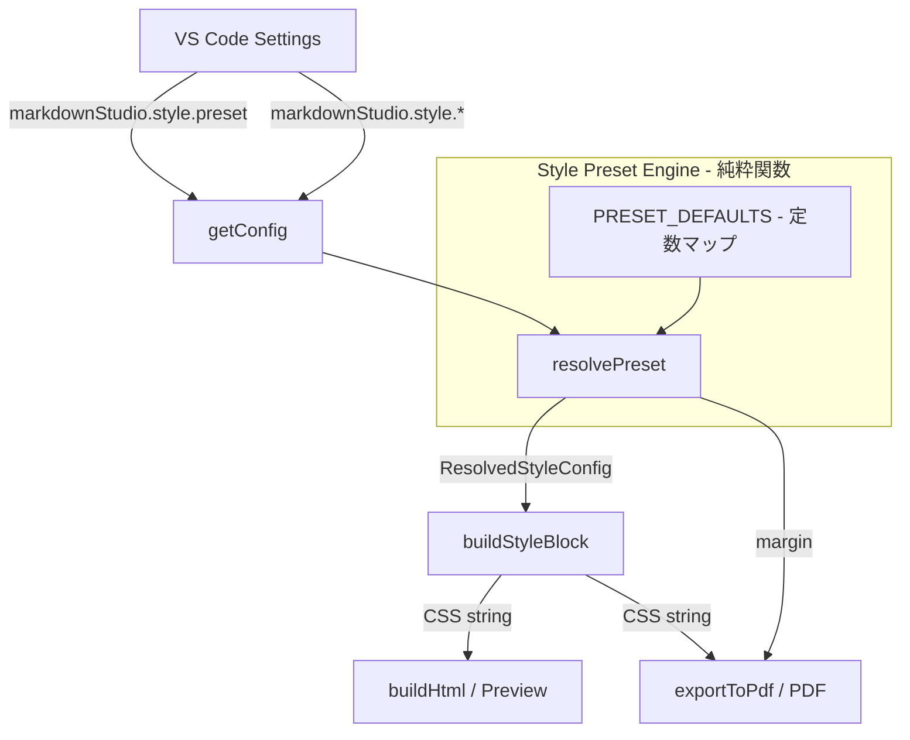
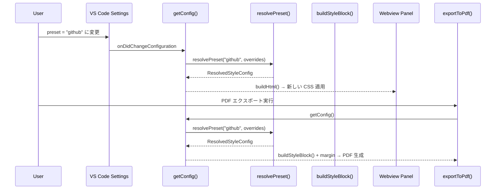

# 設計書: スタイルプリセット

## 概要

Markdown Studio にスタイルプリセット機能を追加する。ユーザーは `markdownStudio.style.preset` 設定で5種類のプリセット（`markdown-pdf`, `github`, `minimal`, `academic`, `custom`）から選択でき、プレビューと PDF エクスポートの見た目を一括で切り替えられる。

本機能の中核は純粋関数 `resolvePreset()` であり、プリセット名と個別オーバーライド設定を入力として受け取り、解決済み `StyleConfig` を出力する。この関数はテスト容易性と参照透過性を保証する。既存の `buildStyleBlock()` は拡張された `StyleConfig` を受け取り、プリセット固有の CSS（コードブロック、見出しスタイル、`@media print`）を生成する。

設定変更時は既存の `onDidChangeConfiguration` リスナーを通じてプレビューが自動更新される。PDF エクスポートは毎回 `getConfig()` を呼ぶため、追加の変更検知は不要。

## アーキテクチャ





## コンポーネントとインターフェース

### コンポーネント 1: プリセット定義（PRESET_DEFAULTS）

**目的**: 各プリセットのデフォルトスタイル値を定数として定義する。

**インターフェース**:
```typescript
const PRESET_DEFAULTS: Record<PresetName, PresetStyleDefaults> = {
  'markdown-pdf': { /* ... */ },
  'github': { /* ... */ },
  'minimal': { /* ... */ },
  'academic': { /* ... */ },
  'custom': { /* ... */ },
};
```

**責務**:
- 5種類のプリセットそれぞれのデフォルト値を保持
- `custom` プリセットは全フィールドが `undefined`（個別設定のみ使用）

### コンポーネント 2: プリセット解決関数（resolvePreset）

**目的**: プリセット名と個別オーバーライドを受け取り、最終的な `ResolvedStyleConfig` を返す純粋関数。

**インターフェース**:
```typescript
function resolvePreset(
  presetName: PresetName,
  overrides: Partial<StyleConfigOverrides>
): ResolvedStyleConfig;
```

**責務**:
- プリセットのデフォルト値を取得
- 個別オーバーライドが指定されている場合はデフォルト値を上書き
- `custom` プリセットの場合はオーバーライド値のみ使用（未指定フィールドはシステムデフォルト）
- 無効なプリセット名は `markdown-pdf` にフォールバック

### コンポーネント 3: 拡張された buildStyleBlock

**目的**: `ResolvedStyleConfig` からプリセット固有の CSS を生成する。

**インターフェース**:
```typescript
function buildStyleBlock(style: ResolvedStyleConfig): string;
```

**責務**:
- 基本スタイル（フォント、サイズ、行間）の CSS 生成
- プリセット固有のコードブロックスタイル生成
- プリセット固有の見出しスタイル生成
- `@media print` セクションの生成

### コンポーネント 4: 拡張された getConfig

**目的**: VS Code 設定からプリセット名と個別オーバーライドを読み取り、`resolvePreset()` を呼び出して解決済み設定を返す。

**責務**:
- `markdownStudio.style.preset` 設定の読み取り
- 個別スタイル設定の読み取り（ユーザーが明示的に設定したかどうかの判定）
- `resolvePreset()` の呼び出しと結果の返却

## データモデル

### 型定義

```typescript
type PresetName = 'markdown-pdf' | 'github' | 'minimal' | 'academic' | 'custom';

interface PresetStyleDefaults {
  fontFamily: string;
  fontSize: number;
  lineHeight: number;
  margin: string;
  codeFontFamily: string;
  headingStyle: HeadingStyle;
  codeBlockStyle: CodeBlockStyle;
}

interface HeadingStyle {
  h1FontWeight: number;
  h1MarginTop: string;
  h1MarginBottom: string;
  h1TextAlign?: string;        // academic: 'center'
  h2MarginTop: string;
  h2MarginBottom: string;
}

interface CodeBlockStyle {
  background: string;
  border: string;
  borderRadius: string;
  padding: string;
}

interface ResolvedStyleConfig {
  fontFamily: string;
  fontSize: number;
  lineHeight: number;
  margin: string;
  codeFontFamily: string;
  headingStyle: HeadingStyle;
  codeBlockStyle: CodeBlockStyle;
  presetName: PresetName;
}

interface StyleConfigOverrides {
  fontFamily: string;
  fontSize: number;
  lineHeight: number;
  margin: string;
}
```

### プリセットデフォルト値

| プリセット | fontFamily | fontSize | lineHeight | margin | codeFontFamily |
|---|---|---|---|---|---|
| markdown-pdf | -apple-system, BlinkMacSystemFont, "Segoe UI", Helvetica, Arial, sans-serif | 14 | 1.6 | 20mm | "SFMono-Regular", Consolas, "Liberation Mono", Menlo, monospace |
| github | -apple-system, BlinkMacSystemFont, "Segoe UI", Noto Sans, Helvetica, Arial, sans-serif | 16 | 1.5 | 20mm | ui-monospace, SFMono-Regular, "SF Mono", Menlo, Consolas, monospace |
| minimal | system-ui, sans-serif | 15 | 1.8 | 25mm | ui-monospace, monospace |
| academic | Georgia, "Times New Roman", serif | 12 | 2.0 | 25mm | "Courier New", Courier, monospace |
| custom | (システムデフォルト) | 14 | 1.6 | 20mm | (システムデフォルト) |

### VS Code 設定スキーマ（package.json 追加分）

```json
{
  "markdownStudio.style.preset": {
    "type": "string",
    "default": "markdown-pdf",
    "enum": ["markdown-pdf", "github", "minimal", "academic", "custom"],
    "description": "Style preset for preview and PDF export."
  }
}
```


## 正当性プロパティ

*プロパティとは、システムのすべての有効な実行において真であるべき特性や振る舞いのことである。人間が読める仕様と機械が検証可能な正当性保証の橋渡しとなる形式的な記述である。*

### Property 1: 無効なプリセット名のフォールバック

*For any* 文字列が有効な PresetName（`markdown-pdf`, `github`, `minimal`, `academic`, `custom`）でない場合、`resolvePreset` はその文字列を `markdown-pdf` として扱い、`markdown-pdf` のデフォルト値を返す。

**Validates: Requirements 1.3**

### Property 2: プリセットデフォルトの完全性

*For any* 有効な PresetName に対して、オーバーライドが空の場合、`resolvePreset` は全フィールド（fontFamily, fontSize, lineHeight, margin, codeFontFamily, headingStyle, codeBlockStyle）が定義済みの `ResolvedStyleConfig` を返す。返される値はそのプリセットの定義済みデフォルト値と一致する。

**Validates: Requirements 2.5, 2.6, 7.3**

### Property 3: オーバーライドの優先

*For any* 有効な PresetName と *for any* 有効なオーバーライド値（fontFamily, fontSize, lineHeight, margin のいずれか）に対して、`resolvePreset` の出力にはオーバーライドで指定された値がそのまま含まれ、プリセットのデフォルト値は使用されない。

**Validates: Requirements 3.1, 3.2, 3.3, 3.4**

### Property 4: custom プリセットはプリセットデフォルトを無視

*For any* オーバーライド設定に対して、`resolvePreset('custom', overrides)` はプリセット固有のデフォルト値を一切使用せず、オーバーライドで指定された値とシステムデフォルト値のみを使用する。

**Validates: Requirements 3.5**

### Property 5: 参照透過性

*For any* 有効な PresetName と *for any* オーバーライド設定に対して、`resolvePreset` を同一の引数で2回呼び出した場合、両方の呼び出しは同一の `ResolvedStyleConfig` を返す。

**Validates: Requirements 7.1, 7.2**

### Property 6: CSS 出力の正当性

*For any* 有効な `ResolvedStyleConfig` に対して、`buildStyleBlock` の出力は以下を満たす: (a) CSS に設定の fontFamily, fontSize, lineHeight の値が含まれる、(b) `@media print` セクションが含まれる。

**Validates: Requirements 4.1, 4.5**

## エラーハンドリング

### エラーシナリオ 1: 無効なプリセット名

**条件**: `markdownStudio.style.preset` に enum 外の値が設定された場合
**対応**: `resolvePreset` は `markdown-pdf` にフォールバック。エラーログは出さず、サイレントに処理する。
**復旧**: ユーザーアクション不要。正しいプリセット名に変更すれば即座に反映される。

### エラーシナリオ 2: 個別設定の値が範囲外

**条件**: fontSize が 8 未満または 32 超、lineHeight が 1.0 未満または 3.0 超
**対応**: 既存の `clampFontSize()` / `clampLineHeight()` でクランプ。`resolvePreset` の前段で処理される。
**復旧**: ユーザーアクション不要。

### エラーシナリオ 3: fontFamily が空文字列

**条件**: ユーザーが `markdownStudio.style.fontFamily` を空文字列に設定
**対応**: 既存のロジックと同様、`buildStyleBlock` 内でシステムデフォルトフォントにフォールバック。
**復旧**: ユーザーアクション不要。

### エラーシナリオ 4: custom プリセットで個別設定が未設定

**条件**: `custom` プリセット選択時に個別設定が一切ない
**対応**: 全フィールドにシステムデフォルト値（`markdown-pdf` と同等）を適用。
**復旧**: ユーザーが個別設定を追加すれば反映される。

## テスト戦略

### プロパティベーステスト

**ライブラリ**: fast-check（既存の devDependency）

**設定**: 各プロパティテストは最低 100 イテレーション実行

以下のプロパティを実装する:

1. **Feature: style-presets, Property 1: 無効なプリセット名のフォールバック** — 有効な PresetName 以外の任意の文字列に対して markdown-pdf デフォルトが返ることを検証
2. **Feature: style-presets, Property 2: プリセットデフォルトの完全性** — 有効な PresetName に対してオーバーライドなしで全フィールドが定義済みであることを検証
3. **Feature: style-presets, Property 3: オーバーライドの優先** — 任意のプリセットと任意のオーバーライド値に対してオーバーライドが優先されることを検証
4. **Feature: style-presets, Property 4: custom プリセットはプリセットデフォルトを無視** — custom プリセットがプリセット固有デフォルトを使用しないことを検証
5. **Feature: style-presets, Property 5: 参照透過性** — 同一入力に対して同一出力を返すことを検証
6. **Feature: style-presets, Property 6: CSS 出力の正当性** — buildStyleBlock の出力に設定値と @media print が含まれることを検証

### ユニットテスト

- 各プリセットの具体的なデフォルト値の検証（要件 2.1〜2.4）
- `github` プリセットの CSS にコードブロックスタイル（背景色、ボーダー、パディング）が含まれることの検証（要件 4.2）
- `minimal` プリセットの CSS に余白の広いコードブロックスタイルが含まれることの検証（要件 4.3）
- `academic` プリセットの CSS にセンタリングされた h1 が含まれることの検証（要件 4.4）
- `buildStyleBlock` が `<style>` タグで囲まれた有効な CSS を返すことの検証

### インテグレーションテスト

- プリセット変更時にプレビューが再起動なしで更新されることの検証（要件 5.1, 5.2）
- PDF エクスポートがプリセットの余白値を使用することの検証（要件 6.2）
- プレビューと PDF で同一の CSS が適用されることの検証（要件 6.3）
