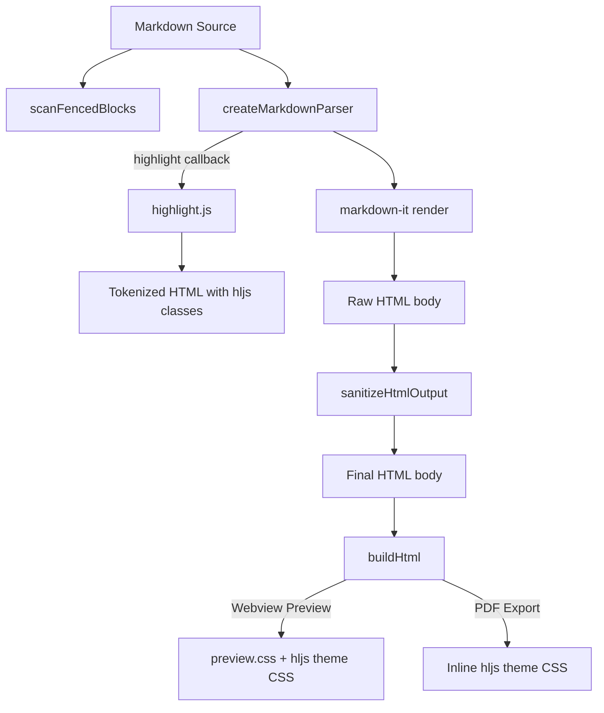
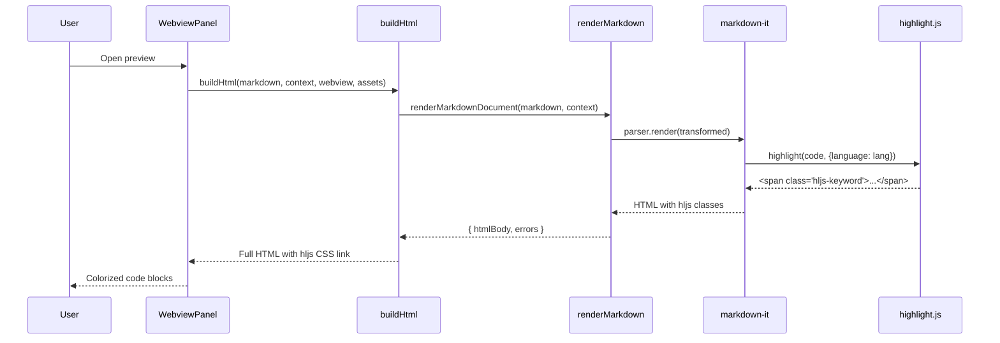
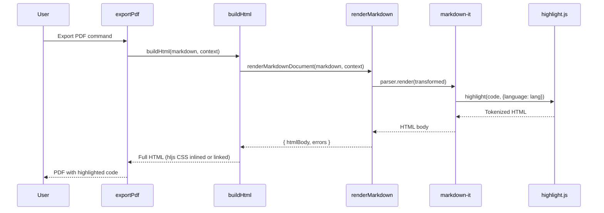

# Design Document: Syntax Highlighting for Code Blocks

## Overview

Markdown Studio currently renders fenced code blocks as plain `<pre><code>` elements without any syntax highlighting. This feature integrates highlight.js into the markdown-it rendering pipeline so that code blocks are tokenized and colorized at parse time (server-side, in the extension host). Because highlighting happens during `renderMarkdownDocument()`, both the webview preview and PDF export benefit without any webview-side JavaScript.

highlight.js is the standard choice here — markdown-it's constructor accepts a `highlight` callback, and highlight.js provides a `highlight(code, {language})` API that returns HTML with `<span class="hljs-*">` tokens. A bundled CSS theme provides the colors, and we ship two themes (one light, one dark) that respond to VS Code's `color-scheme` media query so the highlighting adapts automatically.

## Architecture




## Sequence Diagrams

### Preview Flow



### PDF Export Flow



## Components and Interfaces

### Component 1: `createMarkdownParser` (modified)

**Purpose**: Creates the markdown-it instance, now with a `highlight` callback that delegates to highlight.js.

**Interface**:
```typescript
// src/parser/parseMarkdown.ts
import MarkdownIt from 'markdown-it';

export function createMarkdownParser(): MarkdownIt;
```

**Responsibilities**:
- Instantiate markdown-it with `html`, `linkify`, `typographer` options (unchanged)
- Supply a `highlight(code, lang)` callback that calls highlight.js
- Return unhighlighted `<code>` when the language is unknown or empty (graceful fallback)

### Component 2: highlight.js integration (new)

**Purpose**: Thin wrapper that calls highlight.js with auto-detection fallback.

**Interface**:
```typescript
// Used inside createMarkdownParser's highlight callback
function highlightCode(code: string, lang: string): string;
```

**Responsibilities**:
- If `lang` is a known highlight.js language, call `hljs.highlight(code, { language: lang })`
- If `lang` is unknown or empty, return `''` so markdown-it falls back to its default escaping
- Never throw — catch highlight.js errors and return `''`

### Component 3: `buildHtml` (modified)

**Purpose**: Injects the highlight.js CSS theme stylesheet into the HTML `<head>`.

**Interface**:
```typescript
// src/preview/buildHtml.ts — signature unchanged
export async function buildHtml(
  markdown: string,
  context: vscode.ExtensionContext,
  webview?: vscode.Webview,
  assets?: { styleUri: vscode.Uri; scriptUri: vscode.Uri }
): Promise<string>;
```

**Responsibilities**:
- Add a `<link>` tag for the highlight.js theme CSS (webview URI for preview, relative path for PDF)
- No changes to CSP needed — hljs uses class-based styling, not inline styles

### Component 4: `getPreviewAssetUris` (modified)

**Purpose**: Resolves the highlight.js theme CSS URI alongside existing assets.

**Interface**:
```typescript
// src/preview/previewAssets.ts
export interface PreviewAssetUris {
  styleUri: vscode.Uri;
  scriptUri: vscode.Uri;
  hljsStyleUri: vscode.Uri; // NEW
}

export function getPreviewAssetUris(
  webview: vscode.Webview,
  context: vscode.ExtensionContext
): PreviewAssetUris;
```

### Component 5: `sanitizeHtmlOutput` (modified)

**Purpose**: The existing sanitize-html call must allow `hljs-*` class names on `<span>` elements inside code blocks so the tokenized output survives sanitization.

**Responsibilities**:
- Ensure `span` is in `allowedTags` (already is)
- Ensure `class` is allowed on `span` (already allowed via `'*': ['class', ...]`)
- No changes expected — current config already permits this. Verified by inspection.


## Data Models

### highlight.js Language Subset

```typescript
// Languages to register with highlight.js (common subset to keep bundle small)
const HIGHLIGHT_LANGUAGES = [
  'typescript', 'javascript', 'python', 'java', 'json', 'yaml',
  'bash', 'shell', 'html', 'xml', 'css', 'sql', 'go', 'rust',
  'c', 'cpp', 'csharp', 'ruby', 'php', 'swift', 'kotlin',
  'dockerfile', 'markdown', 'plaintext'
] as const;

type SupportedLanguage = typeof HIGHLIGHT_LANGUAGES[number];
```

**Validation Rules**:
- Language identifiers are case-insensitive (highlight.js handles this)
- Unknown languages fall back to no highlighting (not an error)
- Empty language string (```` ``` ```` with no lang) produces no highlighting

### Theme CSS Files

Two CSS theme files will be placed in `media/`:

| File | Purpose |
|------|---------|
| `media/hljs-light.css` | Light theme (e.g., `github`) |
| `media/hljs-dark.css` | Dark theme (e.g., `github-dark`) |

A single `media/hljs-theme.css` wrapper uses `prefers-color-scheme` to import the correct theme, or we embed both in one file with media queries. The simpler approach: ship a single `media/hljs-theme.css` that contains both light and dark rules gated by `@media (prefers-color-scheme: dark)`.

## Algorithmic Pseudocode

### highlight callback algorithm

```typescript
// Inside createMarkdownParser
const md = new MarkdownIt({
  html: true,
  linkify: true,
  typographer: true,
  highlight(code: string, lang: string): string {
    if (lang && hljs.getLanguage(lang)) {
      try {
        return hljs.highlight(code, { language: lang }).value;
      } catch {
        // fall through
      }
    }
    return ''; // markdown-it will escape and wrap in <pre><code>
  }
});
```

**Preconditions:**
- `code` is a non-null string (markdown-it guarantees this)
- `lang` is a string, possibly empty (markdown-it guarantees this)

**Postconditions:**
- Returns an HTML string of `<span class="hljs-*">` tokens if language is known
- Returns `''` if language is unknown or highlighting fails
- Never throws an exception

**Loop Invariants:** N/A (no loops)

### Theme CSS injection in buildHtml

```typescript
// In buildHtml, after existing <link> for preview.css:
const hljsStyleHref = assets?.hljsStyleUri?.toString() ?? '';

// In the HTML template <head>:
// <link rel="stylesheet" href="${styleHref}">
// <link rel="stylesheet" href="${hljsStyleHref}">   ← NEW
```

**Preconditions:**
- `assets.hljsStyleUri` is a valid webview URI when rendering for preview
- For PDF export (no webview), the CSS can be inlined or omitted (PDF pipeline handles its own styles)

**Postconditions:**
- The HTML document includes a `<link>` to the hljs theme CSS
- CSP `style-src` already allows `${cspSource}` and `'unsafe-inline'`, so the link is permitted

## Key Functions with Formal Specifications

### Function 1: `createMarkdownParser()`

```typescript
function createMarkdownParser(): MarkdownIt
```

**Preconditions:**
- highlight.js module is importable (bundled with the extension)

**Postconditions:**
- Returns a MarkdownIt instance with `highlight` callback configured
- The callback produces valid HTML for known languages
- The callback returns `''` for unknown languages
- markdown-it's own HTML escaping applies when callback returns `''`

### Function 2: `highlightCode(code, lang)` (internal)

```typescript
function highlightCode(code: string, lang: string): string
```

**Preconditions:**
- `code` is a string (may be empty)
- `lang` is a string (may be empty)

**Postconditions:**
- If `lang` is registered in hljs: returns HTML with `<span class="hljs-*">` tokens
- If `lang` is not registered or empty: returns `''`
- Never throws

### Function 3: `buildHtml()` (modified)

```typescript
async function buildHtml(
  markdown: string,
  context: vscode.ExtensionContext,
  webview?: vscode.Webview,
  assets?: { styleUri: vscode.Uri; scriptUri: vscode.Uri; hljsStyleUri?: vscode.Uri }
): Promise<string>
```

**Preconditions:**
- `markdown` is a valid string
- `assets.hljsStyleUri` is provided when `webview` is provided

**Postconditions:**
- Output HTML includes `<link>` to hljs theme CSS when `hljsStyleUri` is provided
- Output HTML contains `<code class="hljs">` blocks with `<span class="hljs-*">` children for recognized languages
- CSP header is unchanged (no new directives needed)

## Example Usage

```typescript
// Before: plain code block output
// <pre><code class="language-typescript">const x = 1;</code></pre>

// After: highlighted code block output
// <pre><code class="hljs language-typescript">
//   <span class="hljs-keyword">const</span> x = <span class="hljs-number">1</span>;
// </code></pre>

// The highlight callback in action:
import hljs from 'highlight.js/lib/core';
import typescript from 'highlight.js/lib/languages/typescript';

hljs.registerLanguage('typescript', typescript);

const result = hljs.highlight('const x: number = 1;', { language: 'typescript' });
// result.value → '<span class="hljs-keyword">const</span> x: <span class="hljs-built_in">number</span> = <span class="hljs-number">1</span>;'
```

## Correctness Properties

*A property is a characteristic or behavior that should hold true across all valid executions of a system — essentially, a formal statement about what the system should do. Properties serve as the bridge between human-readable specifications and machine-verifiable correctness guarantees.*

### Property 1: Supported language produces class-based highlighted output

*For any* code string and *for any* language in the Supported_Language set, the Highlight_Callback SHALL return an HTML string containing at least one `<span class="hljs-` substring and zero inline `style` attributes.

**Validates: Requirements 1.2, 6.1**

### Property 2: Unknown language returns empty string

*For any* code string and *for any* language identifier not in the Supported_Language set (including the empty string), the Highlight_Callback SHALL return an empty string.

**Validates: Requirements 1.3, 1.4**

### Property 3: Highlight callback never throws

*For any* arbitrary string as code and *for any* arbitrary string as language, the Highlight_Callback SHALL return a string without throwing an exception.

**Validates: Requirement 1.5**

### Property 4: Case-insensitive language resolution

*For any* Supported_Language name and *for any* case permutation of that name, the Highlight_Engine SHALL resolve the language and produce highlighted output equivalent to the canonical-case input.

**Validates: Requirement 2.2**

### Property 5: Sanitizer preserves hljs class attributes

*For any* HTML string containing `<span>` elements with `hljs-*` class attributes, passing the string through the Sanitizer SHALL preserve those `<span>` elements and their `hljs-*` class values.

**Validates: Requirement 5.1**

### Property 6: Unknown language renders as plain escaped text end-to-end

*For any* markdown document containing a fenced code block with a language identifier not in the Supported_Language set (including no language specifier), the Parser SHALL render the code block as escaped plain text inside `<pre><code>` with no `hljs-*` class spans.

**Validates: Requirements 7.1, 7.2**

### Property 7: Preview and PDF share identical highlighted tokens

*For any* markdown document containing fenced code blocks, the highlighted HTML tokens produced during preview rendering SHALL be identical to those produced during PDF export rendering.

**Validates: Requirement 8.2**

## Error Handling

### Error Scenario 1: highlight.js throws on malformed input

**Condition**: `hljs.highlight()` throws an exception for unexpected input
**Response**: The `catch` block in the highlight callback returns `''`, causing markdown-it to fall back to its default HTML-escaped output
**Recovery**: Automatic — the code block renders as plain text without breaking the page

### Error Scenario 2: Unknown language identifier

**Condition**: User writes ```` ```foobar ```` with a language not registered in hljs
**Response**: `hljs.getLanguage('foobar')` returns `undefined`, callback returns `''`
**Recovery**: Automatic — renders as plain unhighlighted code block

### Error Scenario 3: highlight.js module fails to load

**Condition**: Bundle error or missing dependency
**Response**: Extension fails to activate (build-time error caught by esbuild)
**Recovery**: Fix the dependency — this is a build/packaging issue, not a runtime issue

## Testing Strategy

### Unit Testing Approach

- Test `createMarkdownParser()` returns a MarkdownIt instance with a working highlight callback
- Test that known languages produce HTML containing `hljs-` class spans
- Test that unknown languages produce plain escaped output
- Test that the highlight callback never throws (fuzz with random strings)
- Test that `sanitizeHtmlOutput` preserves `hljs-*` classes on `<span>` elements

### Property-Based Testing Approach

**Property Test Library**: fast-check (already in devDependencies)

- **Property 1**: For any valid (language, code) pair where language is in the supported set, the output contains at least one `<span class="hljs-` substring
- **Property 2**: For any string input as code, the highlight callback never throws
- **Property 3**: For any highlighted HTML, passing it through `sanitizeHtmlOutput` preserves all `hljs-*` class attributes

### Integration Testing Approach

- Test full `renderMarkdownDocument()` with markdown containing code blocks in various languages
- Test `buildHtml()` output includes the hljs CSS `<link>` tag
- Test that the generated HTML is valid and CSP-compliant

## Performance Considerations

- Use `highlight.js/lib/core` with individual language imports instead of the full bundle to minimize extension size
- Register only the ~20 most common languages (listed in Data Models) — this keeps the bundle under ~200KB additional
- Highlighting happens synchronously during markdown-it render, which is already synchronous — no async overhead
- For very large code blocks, highlight.js is fast enough (sub-millisecond for typical blocks)

## Security Considerations

- highlight.js output is class-based (`<span class="hljs-keyword">`), not inline-style-based, so no CSP changes needed
- The highlight callback receives raw code text from markdown-it, which is already extracted from the markdown source — no injection vector
- `sanitizeHtmlOutput` already allows `class` on all elements and `span` in allowed tags, so hljs output survives sanitization
- No new `script-src` or `style-src` directives needed in CSP
- Theme CSS is a static file served via `webview.asWebviewUri()` — same security model as existing `preview.css`

## Dependencies

| Dependency | Type | Purpose |
|------------|------|---------|
| `highlight.js` | production | Syntax highlighting engine |
| `@types/highlight.js` | dev (if needed) | TypeScript types (highlight.js ships its own types, so likely not needed) |

**Bundle impact**: Using `highlight.js/lib/core` + individual language imports keeps the addition to ~150-200KB in the bundled extension output. The full highlight.js package is ~1MB but we only import what we register.
