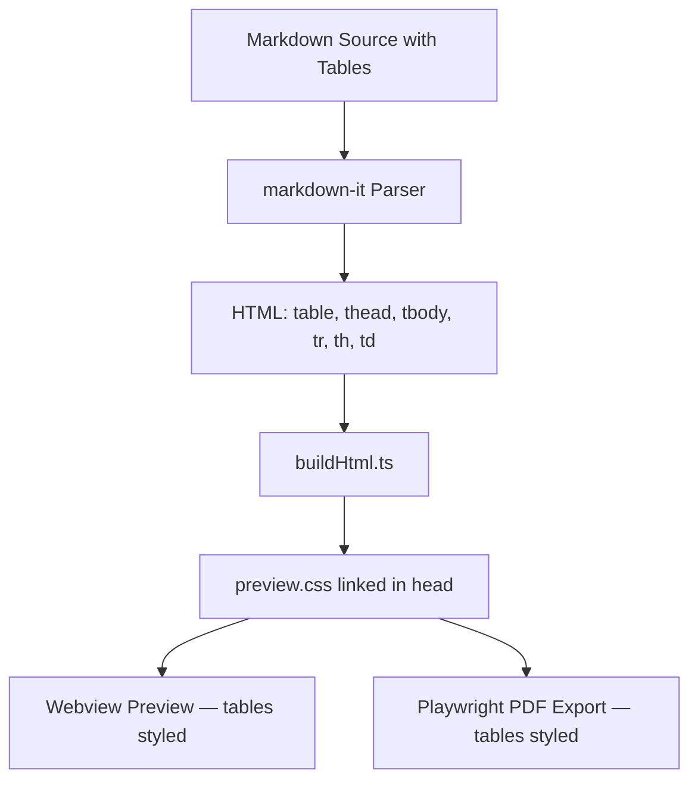
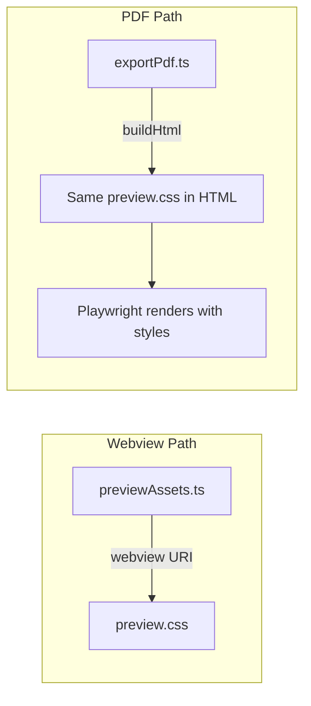
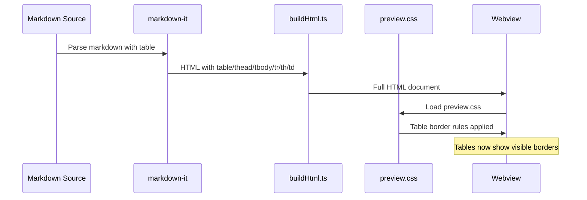
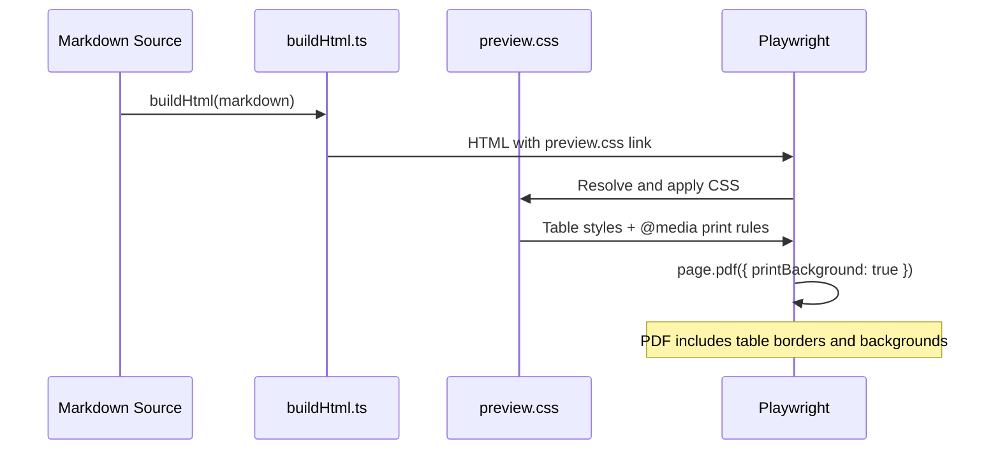

# Design Document: Table Borders

## Overview

Markdown tables rendered by markdown-it produce standard HTML `<table>`, `<thead>`, `<tbody>`, `<tr>`, `<th>`, `<td>` elements, but `media/preview.css` contains no table styling. This means tables appear as unstyled text with no visible gridlines in both the webview preview and PDF export.

This feature adds CSS rules to `media/preview.css` that give tables visible borders, proper cell padding, and theme-aware colors. Since `preview.css` is loaded by both the webview preview (via `previewAssets.ts`) and the PDF export path (via `buildHtml` → Playwright), a single CSS change covers both rendering targets. The PDF export also inlines `preview.css` content through the same HTML pipeline, so table borders will appear in exported PDFs without additional work.

The fix is purely CSS — no TypeScript, HTML template, or markdown-it plugin changes are needed.

## Architecture



The CSS file is already loaded in both rendering paths — no wiring changes needed:



## Components and Interfaces

### Component 1: Table Styles (media/preview.css)

**Purpose**: Provides visible borders, padding, and theme-aware colors for HTML tables generated by markdown-it.

**Interface**:

```css
/* New CSS custom properties for table theming */
:root {
  --table-border: #d0d7de;
  --table-header-bg: #f6f8fa;
  --table-stripe-bg: #f6f8fa80;
}

body.vscode-dark,
body.vscode-high-contrast {
  --table-border: #3d444d;
  --table-header-bg: #2d333b;
  --table-stripe-bg: #2d333b80;
}
```

**Responsibilities**:

- Define CSS custom properties for table border color, header background, and stripe background
- Override properties for dark and high-contrast themes using existing VS Code body classes
- Style `table`, `th`, `td` elements with borders, padding, and alignment
- Add subtle striped rows for readability
- Ensure styles work in both webview preview and PDF export via `@media print`

### Component 2: buildHtml.ts (no changes)

**Purpose**: Already links `preview.css` in the HTML `<head>`. No modifications needed — the new CSS rules are picked up automatically.

### Component 3: exportPdf.ts (no changes)

**Purpose**: Uses the same `buildHtml()` output for Playwright rendering. Since `preview.css` is linked in the HTML, Playwright applies table styles when generating the PDF. The existing `printBackground: true` option ensures background colors (header, stripes) appear in the PDF.

## Data Models

### CSS Custom Properties

| Property | Light Value | Dark Value | Purpose |
|---|---|---|---|
| `--table-border` | `#d0d7de` | `#3d444d` | Border color for table cells |
| `--table-header-bg` | `#f6f8fa` | `#2d333b` | Background color for `<th>` cells |
| `--table-stripe-bg` | `#f6f8fa80` | `#2d333b80` | Background for alternating rows (50% opacity) |

**Validation Rules**:

- Border color must have sufficient contrast against both light and dark backgrounds
- Header background must be visually distinct from regular rows
- Stripe background uses alpha transparency so it works on any base background

## Sequence Diagrams

### Webview Preview Rendering



### PDF Export Rendering



## Key Functions with Formal Specifications

### Function 1: Table Border Styles

```css
table {
  border-collapse: collapse;
  width: 100%;
  margin: 1rem 0;
  overflow-x: auto;
  display: block;
}

th, td {
  border: 1px solid var(--table-border);
  padding: 0.5rem 0.75rem;
  text-align: left;
}

th {
  background: var(--table-header-bg);
  font-weight: 600;
}

tbody tr:nth-child(even) {
  background: var(--table-stripe-bg);
}
```

**Preconditions:**

- HTML contains standard `<table>` elements produced by markdown-it
- CSS custom properties `--table-border`, `--table-header-bg`, `--table-stripe-bg` are defined

**Postconditions:**

- All table cells have a 1px solid border
- Borders collapse (no double borders between adjacent cells)
- Header cells have a distinct background color
- Even rows have a subtle striped background
- Table has vertical margin for spacing from surrounding content

**Loop Invariants:** N/A (CSS, not procedural)

### Function 2: Dark Theme Overrides

```css
body.vscode-dark,
body.vscode-high-contrast {
  --table-border: #3d444d;
  --table-header-bg: #2d333b;
  --table-stripe-bg: #2d333b80;
}
```

**Preconditions:**

- VS Code sets `vscode-dark` or `vscode-high-contrast` class on the webview body element

**Postconditions:**

- Table borders use a lighter gray that is visible against dark backgrounds
- Header background uses a dark gray that is distinct from the page background
- Stripe background uses semi-transparent dark gray

### Function 3: Print Styles

```css
@media print {
  table {
    display: table;
    width: 100%;
  }

  th, td {
    border: 1px solid #999;
  }
}
```

**Preconditions:**

- Playwright renders with `printBackground: true`

**Postconditions:**

- Table uses `display: table` (not `block`) in print to avoid layout issues
- Borders use a fixed gray color suitable for print (no CSS variables in print context)
- Table fills available width

## Example Usage

### Markdown Input

```markdown
| Feature    | Status |
|------------|--------|
| Markdown   | ✅     |
| Mermaid    | ✅     |
| PlantUML   | ✅     |
```

### Rendered HTML (by markdown-it)

```html
<table>
  <thead>
    <tr>
      <th>Feature</th>
      <th>Status</th>
    </tr>
  </thead>
  <tbody>
    <tr>
      <td>Markdown</td>
      <td>✅</td>
    </tr>
    <tr>
      <td>Mermaid</td>
      <td>✅</td>
    </tr>
    <tr>
      <td>PlantUML</td>
      <td>✅</td>
    </tr>
  </tbody>
</table>
```

With the new CSS rules, this table displays with visible borders, padded cells, a shaded header row, and alternating row stripes.

## Correctness Properties

*A property is a characteristic or behavior that should hold true across all valid executions of a system — essentially, a formal statement about what the system should do.*

### Property 1: Pipe tables produce styled HTML elements

*For any* markdown document containing a valid pipe table, rendering through the preview pipeline SHALL produce HTML containing `<table>`, `<th>`, and `<td>` elements that match the CSS selectors defined in Table_Styles, ensuring borders are applied.

**Validates: Requirements 1.1, 4.1**

### Property 2: Theme variables have consistent light and dark definitions

*For any* theme variable (`--table-border`, `--table-header-bg`, `--table-stripe-bg`), the Preview_CSS SHALL define a value in both the `:root` (light) and `body.vscode-dark, body.vscode-high-contrast` (dark) selectors, and the dark value SHALL differ from the light value.

**Validates: Requirements 2.1, 2.2**

### Property 3: All var() references include fallback values

*For any* `var()` call in table-related CSS rules, the call SHALL include a fallback value as the second argument, ensuring borders remain visible even if the custom property is not resolved.

**Validates: Requirement 7.1**

## Error Handling

### Error Scenario 1: Table Overflows Viewport

**Condition**: A table with many columns exceeds the viewport width
**Response**: `display: block` and `overflow-x: auto` on the `<table>` element enable horizontal scrolling
**Recovery**: User can scroll horizontally to see all columns. In PDF, `display: table` is used instead to allow natural page-width layout.

### Error Scenario 2: CSS Variables Not Resolved

**Condition**: Running in an environment where CSS custom properties are not supported (extremely unlikely in modern webview/Chromium)
**Response**: Borders would fall back to the browser's default for `var()` fallback (transparent)
**Recovery**: Add explicit fallback values in the `var()` calls, e.g., `var(--table-border, #d0d7de)`

### Error Scenario 3: Print Background Disabled

**Condition**: Playwright or browser renders PDF without `printBackground: true`
**Response**: Header and stripe backgrounds would not appear, but borders remain visible since they are not background-dependent
**Recovery**: The existing `exportPdf.ts` already sets `printBackground: true`

## Testing Strategy

### Unit Testing Approach

- Verify that `buildHtml()` output for a markdown table contains `<table>`, `<th>`, `<td>` elements (existing parser test coverage)
- Static CSS analysis: verify `preview.css` contains rules targeting `table`, `th`, `td` with `border` properties

### Property-Based Testing Approach

**Property Test Library**: fast-check (already in devDependencies)

- Property: For any markdown string containing a valid pipe table, `renderMarkdownDocument()` produces HTML containing `<table>` with `<th>` and `<td>` elements (ensures CSS selectors have targets)
- Property: The preview.css file contains border declarations for both light and dark theme contexts

### Integration Testing Approach

- Render a markdown document with a table through `buildHtml()` and verify the HTML links to `preview.css`
- Visual inspection: open `examples/demo.md` (which already contains a table) in the preview and confirm borders are visible
- PDF export: export `examples/demo.md` and verify table borders appear in the PDF

## Performance Considerations

- Pure CSS addition — zero runtime cost
- `border-collapse: collapse` is the most efficient border rendering mode
- `display: block` on tables enables overflow scrolling without JavaScript
- No new JavaScript, no DOM manipulation, no event listeners

## Security Considerations

- No changes to CSP — CSS rules are in the already-allowed `preview.css` file
- No inline styles injected — all styling via external stylesheet
- No new attack surface — purely presentational CSS

## Dependencies

- No new dependencies required
- Existing: `media/preview.css` (modified), markdown-it (already generates table HTML)
- VS Code body classes (`vscode-dark`, `vscode-light`, `vscode-high-contrast`) for theme detection (already available)
