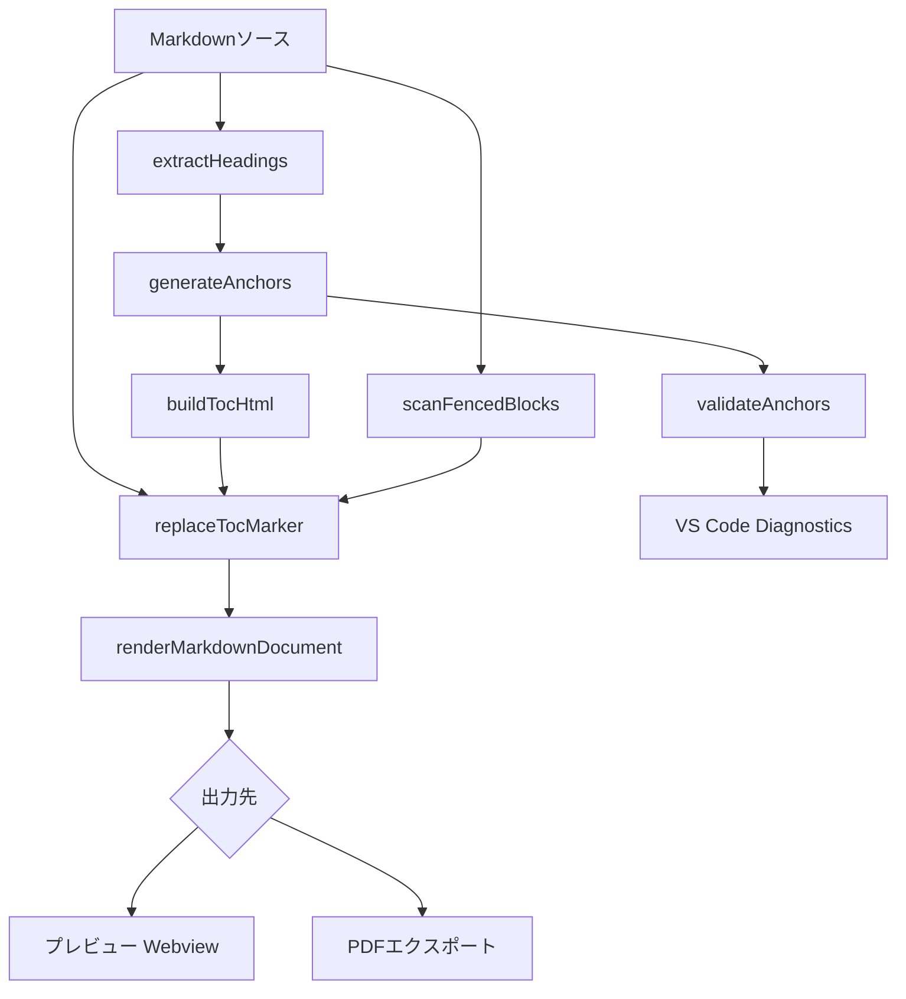

# 設計書: TOC自動生成機能

## 概要

Markdown Studio VS Code拡張機能に、Markdownドキュメントの見出し（h1〜h6）から目次（Table of Contents）を自動生成する機能を追加する。本機能は以下の主要コンポーネントで構成される:

1. **見出し抽出**: markdown-itトークンストリームから見出しを抽出
2. **アンカーID生成**: 見出しテキストからスラッグ化されたアンカーIDを生成
3. **TOC HTML生成**: ネストされたリスト構造のHTMLを生成
4. **TOCマーカー処理**: `[[toc]]`/`[TOC]`マーカーをTOC HTMLに置換
5. **アンカーリンク検証**: 無効なアンカーリンクをVS Code診断として報告
6. **設定管理**: 見出しレベル範囲、リスト種別、改ページの設定

TOC生成は既存のレンダリングパイプライン（`renderMarkdown.ts` → `buildHtml.ts`）に統合され、プレビューとPDFエクスポートの両方で同一のTOC HTMLを使用する。

## アーキテクチャ

### データフロー



### モジュール構成

```
src/
├── toc/
│   ├── extractHeadings.ts    # 見出し抽出（markdown-itトークン解析）
│   ├── anchorResolver.ts     # アンカーID生成（スラッグ化・重複解決）
│   ├── buildToc.ts           # TOC HTML生成
│   ├── tocMarker.ts          # TOCマーカー検出・置換
│   └── tocValidator.ts       # アンカーリンク検証・診断
```

### 既存モジュールとの統合ポイント

| 既存モジュール | 変更内容 |
|---|---|
| `renderMarkdown.ts` | TOCマーカー置換をレンダリングパイプラインに追加 |
| `buildHtml.ts` | TOC用CSSクラスのスタイルブロック追加 |
| `webviewPanel.ts` | TOC再生成を`onDidChangeTextDocument`ハンドラに統合 |
| `exportPdf.ts` | 改ページCSS注入（`pageBreak`設定時） |
| `config.ts` | TOC関連設定の読み取り追加 |
| `models.ts` | TOC関連の型定義追加 |
| `preview.css` | TOCスタイル追加 |
| `preview.js` | TOCリンクのスクロール処理追加 |
| `package.json` | TOC設定項目の追加 |

## コンポーネントとインターフェース

### 1. extractHeadings（見出し抽出）

`src/toc/extractHeadings.ts`

markdown-itのトークンストリームを解析し、見出しトークンを抽出する。既存の`createMarkdownParser()`を再利用し、`parse()`メソッドでトークン列を取得する。

```typescript
import MarkdownIt from 'markdown-it';
import { scanFencedBlocks } from '../parser/scanFencedBlocks';

export interface HeadingEntry {
  level: number;       // 1〜6
  text: string;        // インライン書式除去済みプレーンテキスト
  line: number;        // ソース行番号（0-based）
}

/**
 * markdown-itトークンストリームから見出しを抽出する。
 * コードブロック内の見出し風テキストは除外される（scanFencedBlocksで検出）。
 */
export function extractHeadings(markdown: string, md: MarkdownIt): HeadingEntry[];
```

**設計判断**: markdown-itの`parse()`を使用してトークン列を取得し、`heading_open`/`inline`/`heading_close`のトークンシーケンスを走査する。インライン書式の除去は`inline`トークンの`children`を再帰的に走査し、`text`タイプのトークンのみを結合することで実現する。コードブロック除外は`scanFencedBlocks()`の結果と行番号を照合して行う。

### 2. anchorResolver（アンカーID生成）

`src/toc/anchorResolver.ts`

見出しテキストからHTMLアンカーIDを生成する。GitHub互換のスラッグ化ルールに従い、日本語などの非ASCII文字を保持する。

```typescript
/**
 * 見出しテキストをスラッグ化してアンカーIDを生成する。
 * - 小文字変換
 * - 空白→ハイフン
 * - 英数字・ハイフン・アンダースコア・非ASCII文字以外を除去
 */
export function slugify(text: string): string;

/**
 * 見出しリストに対して一意なアンカーIDを生成する。
 * 重複する場合は連番サフィックス（-1, -2, ...）を付与する。
 */
export function resolveAnchors(headings: HeadingEntry[]): AnchorMapping[];

export interface AnchorMapping {
  heading: HeadingEntry;
  anchorId: string;
}
```

**設計判断**: `slugify()`は純粋関数として実装し、冪等性を保証する。`resolveAnchors()`は見出しリスト全体を受け取り、出現順にカウンターを管理して重複を解決する。非ASCII文字（日本語等）はそのまま保持し、GitHub/GitLabの挙動と互換性を持たせる。

### 3. buildToc（TOC HTML生成）

`src/toc/buildToc.ts`

見出しリストとアンカーマッピングからネストされたHTMLリストを生成する。

```typescript
export interface TocConfig {
  minLevel: number;     // デフォルト: 1
  maxLevel: number;     // デフォルト: 3
  orderedList: boolean; // デフォルト: false
  pageBreak: boolean;   // デフォルト: true
}

/**
 * アンカーマッピングからTOC HTMLを生成する。
 * - <nav class="ms-toc"> コンテナで囲む
 * - 見出しレベルに応じたネストされた <ul>/<ol> + <li> 構造
 * - 各エントリに <a href="#anchor-id"> リンク
 * - pageBreak=true の場合、コンテナにpage-break用CSSクラスを付与
 */
export function buildTocHtml(anchors: AnchorMapping[], config: TocConfig): string;
```

**設計判断**: ネスト構造はスタックベースのアルゴリズムで構築する。現在のレベルを追跡し、レベルが深くなる場合は新しい`<ul>`/`<ol>`を開き、浅くなる場合は閉じる。`pageBreak`が有効な場合は`<nav>`要素に`style="page-break-before: always; page-break-after: always;"`を付与する。

### 4. tocMarker（TOCマーカー処理）

`src/toc/tocMarker.ts`

Markdownソース内のTOCマーカーを検出し、生成されたTOC HTMLに置換する。

```typescript
/**
 * Markdownソース内のTOCマーカーを検出する。
 * コードブロック内のマーカーは除外する。
 * 大文字小文字を区別しない（[[toc]], [[TOC]], [toc], [TOC] 等）。
 * 
 * @returns 最初の有効なマーカーの行番号、見つからない場合は -1
 */
export function findTocMarker(markdown: string, fencedRanges: Array<{startLine: number; endLine: number}>): number;

/**
 * レンダリング済みHTML内のTOCマーカーをTOC HTMLに置換する。
 * 最初のマーカーのみ置換し、残りは除去する。
 */
export function replaceTocMarker(html: string, tocHtml: string): string;
```

**設計判断**: マーカー検出は正規表現 `/\[\[toc\]\]|\[toc\]/gi` を使用する。コードブロック除外は`scanFencedBlocks()`の結果（行範囲）を利用して、マーカーがコードブロック内にあるかを判定する。HTML内での置換は、markdown-itがマーカーテキストをそのまま`<p>`タグ内にレンダリングすることを利用し、レンダリング後のHTMLに対して置換を行う。

### 5. tocValidator（アンカーリンク検証）

`src/toc/tocValidator.ts`

TOC内のアンカーリンクが対応する見出しIDと一致するかを検証し、VS Code診断として報告する。

```typescript
export interface TocDiagnostic {
  line: number;           // ソース行番号
  anchorId: string;       // 無効なアンカーID
  expectedHeading: string; // 期待される見出しテキスト
  message: string;        // 診断メッセージ
}

/**
 * TOCアンカーリンクと見出しIDの整合性を検証する。
 * @returns 無効なアンカーリンクの診断情報リスト
 */
export function validateAnchors(
  anchors: AnchorMapping[],
  headingIds: Set<string>
): TocDiagnostic[];

/**
 * VS Code DiagnosticCollectionに診断を発行する。
 * すべてのアンカーが有効な場合は既存の診断をクリアする。
 */
export function publishDiagnostics(
  diagnostics: TocDiagnostic[],
  documentUri: vscode.Uri,
  collection: vscode.DiagnosticCollection
): void;
```

**設計判断**: 検証ロジック（`validateAnchors`）は純粋関数として実装し、VS Code API依存の診断発行（`publishDiagnostics`）と分離する。これによりテスタビリティを確保する。診断のクリアは空の診断リストを`set()`することで実現する。

### 6. 設定拡張

`src/infra/config.ts` に以下を追加:

```typescript
// MarkdownStudioConfig に追加
export interface TocConfig {
  levels: { min: number; max: number };  // デフォルト: { min: 1, max: 3 }
  orderedList: boolean;                   // デフォルト: false
  pageBreak: boolean;                     // デフォルト: true
}
```

`package.json` の `contributes.configuration.properties` に以下を追加:

```json
{
  "markdownStudio.toc.levels": {
    "type": "string",
    "default": "1-3",
    "description": "TOCに含める見出しレベルの範囲（例: '1-3', '2-4'）"
  },
  "markdownStudio.toc.orderedList": {
    "type": "boolean",
    "default": false,
    "description": "TOCを番号付きリスト（ol）で生成する"
  },
  "markdownStudio.toc.pageBreak": {
    "type": "boolean",
    "default": true,
    "description": "PDFエクスポート時にTOCの前後に改ページを挿入する"
  }
}
```

## データモデル

`src/types/models.ts` に追加する型定義:

```typescript
/** 抽出された見出しエントリ */
export interface HeadingEntry {
  level: number;       // 1〜6
  text: string;        // プレーンテキスト（インライン書式除去済み）
  line: number;        // ソース行番号（0-based）
}

/** 見出しとアンカーIDのマッピング */
export interface AnchorMapping {
  heading: HeadingEntry;
  anchorId: string;
}

/** TOC生成設定 */
export interface TocConfig {
  minLevel: number;
  maxLevel: number;
  orderedList: boolean;
  pageBreak: boolean;
}

/** TOC検証の診断情報 */
export interface TocDiagnostic {
  line: number;
  anchorId: string;
  expectedHeading: string;
  message: string;
}

/** TOC生成結果 */
export interface TocResult {
  html: string;                    // 生成されたTOC HTML
  headings: HeadingEntry[];        // 抽出された見出しリスト
  anchors: AnchorMapping[];        // アンカーマッピング
  diagnostics: TocDiagnostic[];    // 検証診断
}
```

## 正確性プロパティ

*プロパティとは、システムのすべての有効な実行において真であるべき特性や振る舞いのことです。プロパティは、人間が読める仕様と機械で検証可能な正確性保証の橋渡しをします。*


### Property 1: 見出し抽出の完全性とメタデータ保持

*For any* 有効なMarkdownドキュメントにおいて、h1〜h6の見出しを含む場合、`extractHeadings()`はすべての見出しを抽出し、各エントリのレベル（1〜6）、プレーンテキスト、およびソース行番号が元のドキュメントと一致する。

**Validates: Requirements 1.1, 1.2**

### Property 2: インライン書式の除去

*For any* インラインMarkdown書式（太字、イタリック、コード、リンク）を含む見出しテキストにおいて、`extractHeadings()`が返すテキストは書式マーカーを含まないプレーンテキストである。

**Validates: Requirements 1.3**

### Property 3: コードブロック内見出しの除外

*For any* コードブロック（フェンスブロック）内に見出し風テキスト（`# ...`）を含むMarkdownドキュメントにおいて、`extractHeadings()`はコードブロック内のテキストを見出しとして抽出しない。

**Validates: Requirements 1.4**

### Property 4: スラッグ形式の準拠と非ASCII文字の保持

*For any* 見出しテキスト（ASCII・非ASCII混在を含む）において、`slugify()`の出力は小文字であり、空白はハイフンに置換され、英数字・ハイフン・アンダースコア・非ASCII文字のみで構成される。

**Validates: Requirements 2.1, 2.3**

### Property 5: 重複アンカーIDの一意性

*For any* 同一テキストの見出しを複数含む見出しリストにおいて、`resolveAnchors()`が返すすべてのアンカーIDは一意である。

**Validates: Requirements 2.2**

### Property 6: アンカーID生成の冪等性

*For any* 見出しテキストにおいて、`slugify()`を2回独立に適用した結果は同一である。

**Validates: Requirements 2.4**

### Property 7: TOC HTML構造の正確性

*For any* 見出しリストにおいて、`buildTocHtml()`の出力は`<nav class="ms-toc">`コンテナで囲まれ、各エントリは見出しレベルに応じたネストされたリスト構造（`<ul>`/`<ol>` + `<li>`）を持ち、対応するアンカーリンク（`<a href="#anchor-id">`）を含む。

**Validates: Requirements 3.1, 3.2, 3.3**

### Property 8: TOCラウンドトリップ

*For any* 有効な見出しリストにおいて、`buildTocHtml()`で生成されたHTMLを解析してリンクエントリを再抽出した場合、元の見出しリストと同数のエントリが得られる。

**Validates: Requirements 3.5**

### Property 9: TOCマーカー置換（大文字小文字非区別）

*For any* `[[toc]]`または`[toc]`マーカー（大文字小文字の任意の組み合わせ）を含むMarkdownドキュメントにおいて、`replaceTocMarker()`はマーカーを`<nav class="ms-toc">`を含むTOC HTMLに置換する。

**Validates: Requirements 4.1, 4.2**

### Property 10: 複数マーカーの最初のみ置換

*For any* 複数のTOCマーカーを含むドキュメントにおいて、`replaceTocMarker()`は最初のマーカーのみをTOC HTMLに置換し、残りのマーカーを除去する。出力に含まれる`<nav class="ms-toc">`は1つのみである。

**Validates: Requirements 4.3**

### Property 11: マーカー不在・コードブロック内マーカーの除外

*For any* TOCマーカーを含まないドキュメント、またはTOCマーカーがコードブロック内にのみ存在するドキュメントにおいて、出力に`<nav class="ms-toc">`は含まれない。

**Validates: Requirements 4.4, 4.5**

### Property 12: プレビューとPDFで同一のTOC HTML

*For any* TOCマーカーを含むMarkdownドキュメントにおいて、プレビュー用とPDFエクスポート用に生成されるTOC HTMLは同一である。

**Validates: Requirements 6.3**

### Property 13: 改ページCSS注入のトグル

*For any* TOCを含むHTMLにおいて、`pageBreak`設定が有効な場合はTOCコンテナに`page-break-before`および`page-break-after`のCSSが付与され、無効な場合は付与されない。

**Validates: Requirements 6.4, 9.3**

### Property 14: アンカー検証の正確性

*For any* 見出しリストとアンカーマッピングにおいて、`validateAnchors()`は対応する見出しIDが存在しないアンカーリンクのみを無効として検出し、各診断メッセージには無効なアンカーIDと期待される見出しテキストが含まれる。

**Validates: Requirements 8.1, 8.2, 8.4**

### Property 15: 見出しレベルフィルタリング

*For any* 見出しリストとレベル範囲設定（minLevel〜maxLevel）において、`buildTocHtml()`の出力には設定範囲外のレベルの見出しエントリが含まれない。

**Validates: Requirements 9.1**

### Property 16: 順序付き/順序なしリストの切り替え

*For any* 見出しリストにおいて、`orderedList=true`の場合は`buildTocHtml()`の出力に`<ol>`が使用され`<ul>`は使用されない。`orderedList=false`の場合はその逆である。

**Validates: Requirements 9.2**

## エラーハンドリング

| シナリオ | 対応 |
|---|---|
| 見出しが存在しないドキュメント | 空の`<nav class="ms-toc"></nav>`を生成（要件3.4） |
| TOCマーカーが存在しない | TOCを挿入しない。エラーは発生しない |
| 不正な見出しレベル範囲設定 | デフォルト値（1〜3）にフォールバック |
| markdown-itパース失敗 | 既存のエラーハンドリングに委譲（`renderMarkdownDocument`のtry/catch） |
| 無効なアンカーリンク検出 | VS Code診断（Warning severity）として報告。ドキュメント修正時に自動クリア |
| 非常に大きなドキュメント | 既存のインクリメンタル更新パイプラインのデバウンス機構を利用 |

## テスト戦略

### プロパティベーステスト（fast-check）

プロジェクトで既に使用されている`fast-check`ライブラリを使用する。各プロパティテストは最低100回のイテレーションで実行する。

**対象モジュール:**
- `extractHeadings.ts` — Property 1, 2, 3
- `anchorResolver.ts` — Property 4, 5, 6
- `buildToc.ts` — Property 7, 8, 15, 16
- `tocMarker.ts` — Property 9, 10, 11
- `tocValidator.ts` — Property 14

**テストファイル命名規則:** 既存パターンに従い `test/unit/{module}.property.test.ts`

各テストには以下のタグコメントを付与:
```
Feature: toc-auto-generation, Property {number}: {property_text}
```

### ユニットテスト（example-based）

- 空の見出しリストでの空TOCコンテナ生成（要件3.4）
- 特定のプリセット（github, academic等）でのTOCスタイル適用確認（要件5.3）
- `[TOC]`マーカーが存在しないドキュメントでのTOC非挿入（要件4.4）

### インテグレーションテスト

- プレビューWebviewでのTOCリンククリック→スクロール動作（要件5.1, 5.2）
- PDFエクスポートでのTOC含有確認（要件6.1, 6.2）
- ドキュメント編集時のTOC自動更新（要件7.1, 7.2, 7.3）
- VS Code診断パネルへの警告表示・クリア（要件8.3, 8.5）
- 改ページCSS注入のPDF出力確認（要件6.4）
