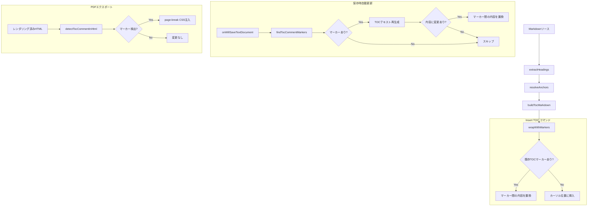

# 設計書: TOCコマンド生成機能

## 概要

Markdown Studio VS Code拡張機能に、VS Codeコマンド「Markdown Studio: Insert TOC」を追加する。本コマンドは、Markdownドキュメントの見出し（h1〜h6）から標準的なMarkdownリスト形式の目次テキストを生成し、ソースファイルに直接挿入する。

既存のTOC自動生成機能（`toc-auto-generation`）は `[[toc]]`/`[TOC]` マーカーをレンダリング時にHTMLに展開するアプローチだが、本機能はTOCを実際のMarkdownテキスト（例: `- [Heading](#anchor)`）としてソースファイルに書き込む。これにより:

- GitHub・GitLab等のプラットフォームでもTOCがそのまま表示される
- TOCセクションは `<!-- TOC -->` ... `<!-- /TOC -->` コメントマーカーで囲まれ、自動更新が可能
- 保存時にマーカー間のTOCテキストを最新の見出し構造で自動再生成する

既存の `src/toc/` モジュール群（`extractHeadings`, `anchorResolver`, `tocValidator`）を再利用し、新たに Markdown テキスト形式の TOC ビルダーとコメントマーカーパーサーを追加する。

## アーキテクチャ

### データフロー



### モジュール構成

```text
src/
├── toc/
│   ├── extractHeadings.ts      # 既存: 見出し抽出
│   ├── anchorResolver.ts       # 既存: アンカーID生成
│   ├── buildToc.ts             # 既存: TOC HTML生成（プレビュー用）
│   ├── buildTocMarkdown.ts     # 新規: TOC Markdownテキスト生成
│   ├── tocMarker.ts            # 既存: [[toc]]マーカー処理
│   ├── tocCommentMarker.ts     # 新規: <!-- TOC -->コメントマーカー処理
│   └── tocValidator.ts         # 既存: アンカーリンク検証
├── commands/
│   └── insertToc.ts            # 新規: Insert TOCコマンド
```

### 既存モジュールとの統合ポイント

| 既存モジュール | 変更内容 |
| --- | --- |
| `src/extension.ts` | `markdownStudio.insertToc` コマンド登録、`onWillSaveTextDocument` リスナー登録 |
| `src/export/pdfHeaderFooter.ts` | TOCコメントマーカー検出に基づくpage-break CSS注入関数を追加 |
| `package.json` | `markdownStudio.insertToc` コマンド定義を追加 |

## コンポーネントとインターフェース

### 1. buildTocMarkdown（TOC Markdownテキスト生成）

`src/toc/buildTocMarkdown.ts` — 新規作成

見出しリストとアンカーマッピングから、標準的なMarkdownリスト形式のTOCテキストを生成する。

```typescript
import type { AnchorMapping, TocConfig } from '../types/models';

/**
 * アンカーマッピングからMarkdownリスト形式のTOCテキストを生成する。
 *
 * 出力例（orderedList=false, minLevel=1, maxLevel=3）:
 *   - [Introduction](#introduction)
 *     - [Getting Started](#getting-started)
 *       - [Installation](#installation)
 *   - [Usage](#usage)
 *
 * - 見出しレベルに応じたインデント（レベルごとに2スペース）
 * - orderedList=true の場合は `1. [text](#anchor)` 形式
 * - minLevel〜maxLevel 範囲外の見出しはフィルタリング
 * - 見出しが空の場合は空文字列を返す
 */
export function buildTocMarkdown(
  anchors: AnchorMapping[],
  config: TocConfig
): string;

/**
 * TOC Markdownテキストからリンクエントリを解析する。
 * ラウンドトリップ検証用のユーティリティ。
 *
 * @returns 解析されたリンクエントリの配列 [{text, anchor}]
 */
export function parseTocLinks(
  tocText: string
): Array<{ text: string; anchor: string }>;
```

設計判断:
- 既存の `buildTocHtml()` はHTML形式のTOCを生成するが、本モジュールはMarkdownテキスト形式を生成する
- インデントは最小レベルからの相対深度で計算（例: minLevel=2 の場合、h2 がインデント0、h3 がインデント1）
- `parseTocLinks()` はラウンドトリップテスト用に公開するが、プロダクションコードでは使用しない

### 2. tocCommentMarker（コメントマーカー処理）

`src/toc/tocCommentMarker.ts` — 新規作成

`<!-- TOC -->` / `<!-- /TOC -->` コメントマーカーの検出・解析・置換を行う。

```typescript
/** TOCコメントマーカーの検出結果 */
export interface TocMarkerRange {
  /** 開始マーカー行（0-based） */
  startLine: number;
  /** 終了マーカー行（0-based） */
  endLine: number;
  /** マーカー間のTOCテキスト（開始・終了マーカー行を含まない） */
  content: string;
}

/**
 * Markdownソース内の <!-- TOC --> / <!-- /TOC --> マーカーを検出する。
 * コードブロック内のマーカーは除外する。
 *
 * @returns マーカー範囲、見つからない場合は undefined
 */
export function findTocCommentMarkers(
  markdown: string,
  fencedRanges?: Array<{ startLine: number; endLine: number }>
): TocMarkerRange | undefined;

/**
 * TOCテキストをコメントマーカーで囲む。
 *
 * @returns `<!-- TOC -->\n{tocText}\n<!-- /TOC -->`
 */
export function wrapWithMarkers(tocText: string): string;

/**
 * ドキュメント内の既存TOCセクション（マーカー間の内容）を新しいTOCテキストで置換する。
 * マーカーの位置は維持される。
 *
 * @returns 置換後のドキュメント全体テキスト
 */
export function replaceTocContent(
  markdown: string,
  markerRange: TocMarkerRange,
  newTocText: string
): string;
```

設計判断:
- 開始マーカーは `<!-- TOC -->` に完全一致（前後の空白は許容）
- 終了マーカーは `<!-- /TOC -->` に完全一致（前後の空白は許容）
- コードブロック除外は既存の `scanFencedBlocks()` を再利用
- `wrapWithMarkers()` と `findTocCommentMarkers()` + content抽出はラウンドトリップ関係にある

### 3. insertToc（Insert TOCコマンド）

`src/commands/insertToc.ts` — 新規作成

VS Codeコマンド「Markdown Studio: Insert TOC」の実装。

```typescript
import * as vscode from 'vscode';

/**
 * Insert TOC コマンドのハンドラ。
 *
 * 1. アクティブエディタがMarkdownファイルでなければ何もしない
 * 2. ドキュメントから見出しを抽出
 * 3. TOC Markdownテキストを生成
 * 4. 既存のTOCマーカーがあれば内容を置換、なければカーソル位置に挿入
 */
export async function insertTocCommand(): Promise<void>;
```

設計判断:
- コマンドは `vscode.window.activeTextEditor` を使用してアクティブエディタを取得
- Markdownファイル判定は `document.languageId === 'markdown'` で行う
- 既存TOCマーカーの検出は `findTocCommentMarkers()` を使用
- 挿入/置換は `editor.edit()` API を使用してアンドゥ可能な編集として実行

### 4. TOC自動更新（保存時）

`src/extension.ts` に統合

```typescript
/**
 * onWillSaveTextDocument リスナーで、TOCコメントマーカーを含む
 * Markdownドキュメントの保存時にTOCを自動更新する。
 *
 * - マーカーが存在しない場合はスキップ
 * - TOC内容に変更がない場合はスキップ（不要な編集を回避）
 * - waitUntil() でテキスト編集を返し、保存操作をブロックしない
 */
```

設計判断:
- `vscode.workspace.onWillSaveTextDocument` を使用し、`waitUntil()` でテキスト編集を返す
- これにより保存操作と同期的にTOCが更新され、保存後のファイルには常に最新のTOCが含まれる
- 変更がない場合は空の編集配列を返してスキップ

### 5. PDF改ページCSS注入（コメントマーカーベース）

`src/export/pdfHeaderFooter.ts` に追加

```typescript
/**
 * レンダリング済みHTML内の <!-- TOC --> / <!-- /TOC --> コメントを検出し、
 * その間のコンテンツを <div> で囲んで page-break CSS を適用する。
 *
 * markdown-it は HTML コメントをそのまま出力するため、
 * レンダリング後のHTMLにもコメントマーカーが残る。
 * これを利用してTOCセクションを特定し、CSSを注入する。
 */
export function injectTocPageBreakCss(html: string): string;
```

設計判断:
- markdown-it は `html: true` 設定で HTML コメントをそのまま出力する
- レンダリング後のHTMLで `<!-- TOC -->` ... `<!-- /TOC -->` を検出し、間のコンテンツを `<div style="page-break-before: always; page-break-after: always;">` で囲む
- 既存の `injectPageBreakCss()` とは独立した関数として実装（既存関数は `[style*="page-break"]` 属性ベース）

## データモデル

既存の `src/types/models.ts` の型を再利用する。新規の型定義:

```typescript
/** TOCコメントマーカーの検出結果（tocCommentMarker.ts で定義） */
export interface TocMarkerRange {
  startLine: number;
  endLine: number;
  content: string;
}
```

既存の型（変更なし）:
- `HeadingEntry` — 見出しエントリ
- `AnchorMapping` — アンカーマッピング
- `TocConfig` — TOC設定（minLevel, maxLevel, orderedList, pageBreak）
- `TocDiagnostic` — TOC検証診断

## 正確性プロパティ

*プロパティとは、システムのすべての有効な実行において真であるべき特性や振る舞いのことです。プロパティは、人間が読める仕様と機械で検証可能な正確性保証の橋渡しをします。*


### Property 1: TOC Markdownテキストのフォーマット正確性

*For any* 有効な見出しリストとTOC設定において、`buildTocMarkdown()` が生成するTOCテキストは以下を満たす:
- `orderedList=false` の場合、各エントリは `- [テキスト](#anchor-id)` 形式である
- `orderedList=true` の場合、各エントリは `1. [テキスト](#anchor-id)` 形式である
- 各エントリは見出しレベルに応じた2スペースインデントでネストされる
- `minLevel`〜`maxLevel` 範囲外の見出しは含まれない

**Validates: Requirements 1.4, 2.1, 2.2**

### Property 2: TOCテキストのラウンドトリップ

*For any* 有効な見出しリスト（設定範囲内）において、`buildTocMarkdown()` で生成したTOCテキストから `parseTocLinks()` でリンクエントリを再抽出した場合、元の見出しリスト（フィルタ後）と同数のエントリが得られ、各エントリのテキストとアンカーIDが一致する。

**Validates: Requirements 2.5**

### Property 3: コメントマーカーのラウンドトリップ

*For any* 有効なTOCテキストにおいて、`wrapWithMarkers()` でコメントマーカーを付与した後、`findTocCommentMarkers()` で解析して `content` を取得した場合、元のTOCテキストと同一の内容が得られる。

**Validates: Requirements 9.5**

### Property 4: コメントマーカー解析の正確性

*For any* `<!-- TOC -->` と `<!-- /TOC -->` マーカーを含むMarkdownドキュメントにおいて、`findTocCommentMarkers()` は開始マーカーと終了マーカーの間の内容のみをTOCセクションとして返す。コードブロック内のマーカーは無視される。

**Validates: Requirements 9.3, 9.4**

### Property 5: TOC更新時のマーカー位置保持と内容置換

*For any* TOCコメントマーカーを含むドキュメントと新しい見出し構造において、`replaceTocContent()` はマーカーの行位置を維持し、マーカー間の内容のみを新しいTOCテキストで置換する。マーカー外のドキュメント内容は変更されない。

**Validates: Requirements 1.5, 4.2**

### Property 6: 無変更時のTOC更新スキップ

*For any* TOCコメントマーカーを含むドキュメントにおいて、現在のTOCテキストと再生成したTOCテキストが同一の場合、自動更新は編集を適用しない。

**Validates: Requirements 4.4**

### Property 7: PDF改ページCSS注入のトグル

*For any* TOCコメントマーカーを含むレンダリング済みHTMLにおいて、`pageBreak` 設定が有効な場合は `injectTocPageBreakCss()` がTOCセクションに `page-break-before` および `page-break-after` CSSを適用し、無効な場合は適用しない。

**Validates: Requirements 6.3, 6.4, 10.1, 10.2**

### Property 8: 順序付き/順序なしリストの切り替え

*For any* 見出しリストにおいて、`orderedList=true` の場合は `buildTocMarkdown()` の出力に `1. [` プレフィックスが使用され `- [` は使用されない。`orderedList=false` の場合はその逆である。

**Validates: Requirements 2.1, 8.2**

## エラーハンドリング

| シナリオ | 対応 |
| --- | --- |
| 見出しが存在しないドキュメント | 空のTOCセクション（マーカーのみ）を挿入（要件1.7） |
| アクティブエディタがMarkdownでない | コマンドを無視、エラー表示なし（要件1.6） |
| TOCマーカーが存在しない（保存時） | 自動更新をスキップ（要件4.3） |
| 不正な見出しレベル範囲設定 | デフォルト値（1〜3）にフォールバック（既存の `parseLevels()` ） |
| コードブロック内のマーカー | マーカーとして認識しない（要件9.4） |
| 終了マーカーが欠落 | マーカーなしとして扱い、TOC操作をスキップ |
| 自動更新でTOC内容に変更なし | 編集をスキップ（要件4.4） |

## テスト戦略

### プロパティベーステスト（fast-check）

プロジェクトで既に使用されている `fast-check` ライブラリを使用する。各プロパティテストは最低100回のイテレーションで実行する。

対象モジュールとプロパティの対応:

- `buildTocMarkdown.ts` — Property 1, 2, 8
- `tocCommentMarker.ts` — Property 3, 4, 5, 6
- `pdfHeaderFooter.ts` — Property 7

テストファイル命名規則: 既存パターンに従い `test/unit/{module}.property.test.ts`

各テストには以下のタグコメントを付与:

```text
Feature: toc-command-generation, Property {number}: {property_text}
```

### ユニットテスト（example-based）

- `buildTocMarkdown`: 空の見出しリスト、単一見出し、深いネスト、日本語見出し
- `tocCommentMarker`: マーカー不在、コードブロック内マーカー、終了マーカー欠落
- `insertToc`: 非Markdownファイルでのコマンド無視、既存TOC更新

### インテグレーションテスト

- Insert TOCコマンドの実行→ドキュメント内容の検証
- 保存時自動更新のエンドツーエンドフロー
- PDFエクスポートでのTOC改ページ確認
- プレビューでのTOCリンクスクロール動作

### 既存テストとの関係

既存の `toc-auto-generation` のプロパティテスト（Property 1〜16）は引き続き有効。本機能のテストは既存テストと独立して動作し、既存の `extractHeadings`, `anchorResolver`, `tocValidator` のテストカバレッジを再利用する。
