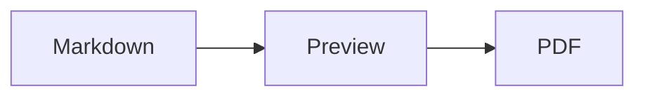
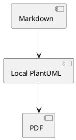

# Getting Started

Markdown Studio is for technical Markdown documents that need a local preview and a repeatable PDF export from the same VS Code workflow.

Use this page as the first stop after installing the extension. For every setting, see [configuration.md](./configuration.md). For dependency issues, see [troubleshooting.md](./troubleshooting.md).

## Best Fit

Markdown Studio is a good fit when your Markdown includes:

- Mermaid, PlantUML, WaveDrom, SVG, or KaTeX math.
- Local images and other workspace assets.
- Long technical documents that need TOCs, cover pages, page breaks, page numbers, or PDF bookmarks.
- Documents that should render without a remote diagram service.

If you only need a quick Markdown preview, VS Code's built-in preview may be enough. Use Markdown Studio when the preview needs to match the exported PDF, especially for diagrams and document navigation.

## First Preview

1. Open a Markdown file.
2. Run `Markdown Studio: Preview: Open Beside`.
3. Edit the Markdown file and keep the preview open.
4. Double-click rendered content in the preview to jump back to the source line.

Preview rendering runs locally. Mermaid and WaveDrom render inside the webview. PlantUML uses the bundled PlantUML JAR and a local Java runtime.

## Export A PDF

1. Open the Markdown file.
2. Run `Markdown Studio: PDF: Export`.
3. Choose the output location.

The PDF export uses the same rendering stack as Preview, so diagrams, math, syntax highlighting, local assets, TOCs, and custom CSS stay consistent between the preview and the exported PDF.

PDF-specific features include:

- PDF index pages with page numbers.
- PDF bookmarks from document headings.
- Optional Markdown cover pages prepended before the body PDF.
- Headers, footers, page formats, margins, and page breaks.
- Output filename templates.

## Diagram Examples

Mermaid:

````markdown

````

PlantUML:

````markdown

````

WaveDrom:

````markdown
```wavedrom
{ signal: [
  { name: "clk",  wave: "p...." },
  { name: "data", wave: "x.3.x" }
]}
```
````

KaTeX:

```markdown
Inline math: $E = mc^2$

Display math:

$$
\int_0^1 x^2 dx
$$
```

## Local-First Settings

Core rendering is local. External images and links inside Markdown are controlled by `markdownStudio.security.externalResources.mode`:

| Mode | Use When |
| ---- | -------- |
| `whitelist` | Default. Keep local rendering while allowing common GitHub-hosted README assets. |
| `block-all` | Strict LocalOnly documents, offline reviews, or confidential specs. |
| `allow-all` | You explicitly trust remote resources in the document. |

For strict local-only work, set:

```jsonc
"markdownStudio.security.externalResources.mode": "block-all"
```

## Dependency Setup

Run `Markdown Studio: Tools: Setup Dependencies` if prompted. The setup installs managed local dependencies used by Markdown Studio:

- Amazon Corretto JDK for PlantUML.
- Playwright Chromium for PDF export.

For proxy, custom CA, or offline setup notes, see [troubleshooting.md](./troubleshooting.md).

## Common Workflows

### Technical README

1. Write Mermaid, PlantUML, WaveDrom, math, tables, and code in Markdown.
2. Open `Markdown Studio: Preview: Open Beside`.
3. Check the rendered diagrams and math locally.
4. Export a PDF when the document is ready.

### Strict LocalOnly Review

1. Set `markdownStudio.security.externalResources.mode` to `block-all`.
2. Open the document with `Markdown Studio: Preview: Open Beside`.
3. Confirm blocked remote resources are visible as blocked-resource notices.
4. Export the PDF from the same document.

### Polished PDF Handout

1. Add headings for PDF bookmarks.
2. Add a TOC with `Markdown Studio: Edit: Insert TOC` if needed.
3. Use CSS page breaks where the document needs section boundaries.
4. If the PDF needs a cover, create `cover.md` next to the body file and set `markdownStudio.export.cover.enabled` to `true`.
5. Export PDF and inspect the cover, index, bookmarks, headers, footers, and page breaks.
