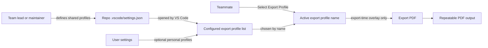
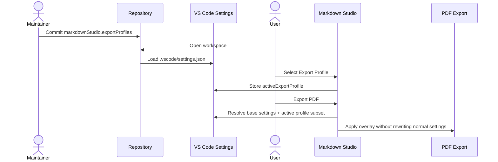
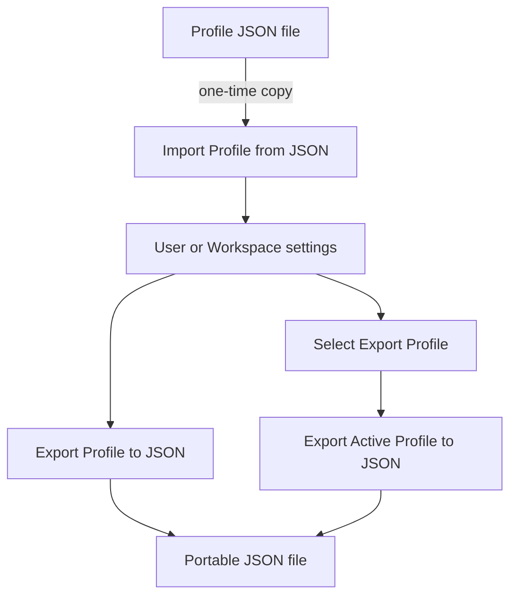
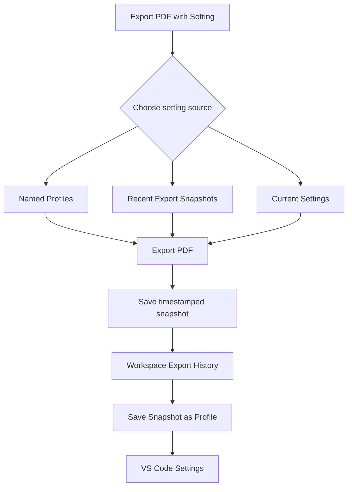

# Export Profiles Plan

This document defines the implementation shape for Markdown Studio export profiles.

## Goals

- Let teams define named PDF export profiles in VS Code configuration.
- Treat each profile as a small, versioned subset of existing Markdown Studio settings.
- Let users select an active profile from a list.
- Apply the active profile only as an export-time configuration overlay.
- Support JSON import/export for moving profiles between users, repositories, and teams.
- Document team sharing through `.vscode/settings.json`.
- Preserve backward compatibility as profile fields evolve.

## Non-Goals

- Do not replace existing `markdownStudio.*` settings.
- Do not write profile values back into unrelated settings when exporting a PDF.
- Do not introduce a profile file that is watched or referenced continuously by path.
- Do not add a custom settings UI in the first iteration.
- Do not include every Markdown Studio setting in the initial profile schema.

## User Model

Profiles are stored in VS Code settings:

```json
{
  "markdownStudio.exportProfiles": [
    {
      "schemaVersion": 1,
      "name": "Company Spec A4",
      "pageFormat": "A4",
      "stylePreset": "github",
      "securityMode": "block-all",
      "includeBookmarks": true,
      "includePdfIndex": true
    }
  ],
  "markdownStudio.activeExportProfile": "Company Spec A4"
}
```

Recommended usage:

- Team profiles live in workspace settings, usually `.vscode/settings.json`.
- Personal profiles live in user settings.
- Imported JSON profiles are copied into VS Code settings instead of remaining external references.
- Exported JSON files are portable artifacts for sharing, backup, and review.

## Use Case Visualization

The primary use case is settings-first team sharing. JSON import/export exists as a
transfer and backup mechanism, not as the runtime source of truth.



The expected team workflow is:



JSON import/export should be understood as a side path:



This means files do not scatter at runtime: after import, the configured list in
VS Code settings is the source of truth. Exported JSON is just an artifact that can
be reviewed, attached to an issue, sent to another user, or copied into a repository.

## Configuration Schema

Add settings:

- `markdownStudio.exportProfiles`
  - Type: array
  - Default: `[]`
  - Items: export profile objects
- `markdownStudio.activeExportProfile`
  - Type: string
  - Default: `""`
  - Empty string means no active profile.

Profile v1 fields:

| Field | Type | Required | Maps to |
|---|---|---:|---|
| `schemaVersion` | number | no | Profile parser only; missing means `1` |
| `name` | string | yes | Profile identity and QuickPick label |
| `pageFormat` | string | no | `markdownStudio.export.pageFormat` |
| `stylePreset` | string | no | `markdownStudio.style.preset` |
| `securityMode` | string | no | `markdownStudio.security.externalResources.mode` |
| `includeBookmarks` | boolean | no | `markdownStudio.export.pdfBookmarks.enabled` |
| `includePdfIndex` | boolean | no | `markdownStudio.export.pdfIndex.enabled` |

Allowed enum values:

- `pageFormat`: `A3`, `A4`, `A5`, `Letter`, `Legal`, `Tabloid`
- `stylePreset`: `markdown-pdf`, `github`, `minimal`, `academic`, `custom`
- `securityMode`: `block-all`, `whitelist`, `allow-all`

Unknown fields should be preserved when possible during import/export but ignored by the v1 resolver.

## Precedence

The active profile is an export-time overlay:

```text
defaults
< VS Code settings
< active export profile subset
```

This keeps profile selection reversible and avoids writing derived values back into normal settings during PDF export.

The active profile affects:

- `Markdown Studio: Export PDF`

It should not affect:

- Preview rendering in v1
- TOC auto-update on save
- Environment validation
- Dependency setup

Preview support can be considered later if users expect a "preview active export profile" mode.

## Commands

Add user-facing commands:

- `Markdown Studio: Select Export Profile`
  - Shows a QuickPick list from merged VS Code configuration.
  - Includes an item for "No Active Export Profile".
  - Saves selection to `markdownStudio.activeExportProfile`.
- `Markdown Studio: Export Profile to JSON`
  - Lets the user pick one configured profile.
  - Saves a `.json` file through `showSaveDialog`.
  - Writes a single profile object, not the entire settings document.
- `Markdown Studio: Export Active Profile to JSON`
  - Saves the active profile directly when one is configured.
  - Skips the profile picker when the active profile is valid.
  - Falls back to the profile picker when no active profile is configured or the configured name is missing.
- `Markdown Studio: Import Profile from JSON`
  - Opens a `.json` file through `showOpenDialog`.
  - Validates and normalizes the profile.
  - Lets the user choose the target scope: Workspace when available, otherwise User.
  - Adds or replaces a profile in `markdownStudio.exportProfiles`.

## Import Behavior

Import accepts:

- A single profile object.
- Optionally, a future wrapper object:

```json
{
  "profiles": [
    {
      "schemaVersion": 1,
      "name": "Company Spec A4"
    }
  ]
}
```

MVP can implement single-object import first, but parser tests should reserve room for the wrapper shape.

Conflict behavior:

- If the imported name does not exist, append it.
- If the imported name exists, ask whether to replace it.
- Replacement should preserve array order.
- Cancel leaves settings unchanged.

Validation behavior:

- Missing `schemaVersion` means version 1.
- Missing or blank `name` is fatal.
- Unknown `schemaVersion` is fatal unless a migration exists.
- Unknown fields are ignored by the resolver.
- Invalid enum or type values are dropped with a warning.
- If all subset fields are invalid but `name` is valid, import is allowed with a warning.

## Export Behavior

Export writes normalized JSON:

```json
{
  "schemaVersion": 1,
  "name": "Company Spec A4",
  "pageFormat": "A4",
  "stylePreset": "github",
  "securityMode": "block-all",
  "includeBookmarks": true,
  "includePdfIndex": true
}
```

Formatting:

- Two-space indentation.
- Trailing newline.
- UTF-8.

No secrets should be included in v1 profile fields.

## Implementation Plan

### 1. Types And Registry

Files:

- `src/types/models.ts`
- `src/infra/configurationRegistry.ts`
- `package.json`
- `package.nls.json`
- `package.nls.ja.json`

Changes:

- Add `ExportProfile` and supporting string union types.
- Add `CONFIG_KEYS.exportProfiles`.
- Add `CONFIG_KEYS.activeExportProfile`.
- Add defaults.
- Add configuration contributions and localized descriptions.
- Add command contributions and localized command titles.

### 2. Profile Resolver

Files:

- `src/infra/exportProfiles.ts`
- `test/unit/exportProfiles.test.ts`
- `test/unit/exportProfiles.property.test.ts` if property coverage is useful

Responsibilities:

- Parse raw profile objects.
- Normalize schema version.
- Validate and sanitize profile fields.
- Resolve active profile by name.
- Build a partial config overlay.
- Provide the active profile to the export-time configuration resolver without mutating VS Code settings.

Recommended API shape:

```ts
export function normalizeExportProfile(input: unknown): ExportProfileValidationResult;
export function resolveActiveExportProfile(cfg: vscode.WorkspaceConfiguration): ExportProfileResolution;
```

Keep VS Code UI code out of this module so it remains easy to unit test.

### 3. Config Integration

Files:

- `src/infra/config.ts`
- `src/export/exportPdf.ts`

Preferred approach:

- Keep `getConfig()` as the normal settings resolver.
- Add `getExportConfig()` or `getConfig({ includeExportProfile: true })`.
- Use the profiled resolver only in PDF export.

Recommended shape:

```ts
export function getConfig(): MarkdownStudioConfig;
export function getExportConfig(): MarkdownStudioConfig;
```

`getExportConfig()` resolves the same base settings as `getConfig()`, then applies active profile values while preserving normal individual overrides such as font family, font size, line height, and margin.

### 4. Commands

Files:

- `src/commands/selectExportProfile.ts`
- `src/commands/importExportProfile.ts`
- `src/commands/exportProfileToJson.ts`
- `src/extension.ts`
- `src/infra/messages.ts`

Changes:

- Register the four new commands.
- Use QuickPick for selection.
- Use Open/Save dialogs for JSON import/export.
- Use `WorkspaceConfiguration.update` with explicit target scope.
- Show concise success, warning, and failure messages.

Target scope choice:

- If a workspace is open, default to Workspace.
- If no workspace is open, use User.
- For import, present User and Workspace choices when both are available.
- For active profile selection, use the same target scope as the profile source where possible; otherwise default to Workspace when available.

### 5. README And Docs

Files:

- `README.md`
- `docs/configuration.md`

Add:

- Team sharing example using `.vscode/settings.json`.
- Explanation that profiles are subsets, not separate full settings.
- Note that active profile overlays export only.
- JSON import/export examples.
- Compatibility note for `schemaVersion`.

Example section:

```json
{
  "markdownStudio.exportProfiles": [
    {
      "schemaVersion": 1,
      "name": "Company Spec A4",
      "pageFormat": "A4",
      "stylePreset": "github",
      "securityMode": "block-all",
      "includeBookmarks": true,
      "includePdfIndex": true
    }
  ],
  "markdownStudio.activeExportProfile": "Company Spec A4"
}
```

### 6. Tests

Unit tests:

- Missing `schemaVersion` resolves as version 1.
- Unknown fields do not affect overlay.
- Invalid enum values are ignored with diagnostics.
- Missing `name` fails validation.
- Active profile not found returns no overlay.
- Duplicate names are deterministic and warn.
- Overlay updates only the mapped subset fields.
- `getConfig()` remains unaffected by active profiles.
- `getExportConfig()` applies the active profile.

Command tests:

- Select profile updates `activeExportProfile`.
- Select "No Active Export Profile" clears it.
- Import appends a new profile.
- Import replacement preserves array order.
- Export writes normalized JSON.
- Export active profile writes normalized JSON without showing a profile picker.
- Export active profile falls back to the picker when no active profile is configured.

Integration or E2E smoke:

- Configure a workspace profile.
- Run Export PDF.
- Verify the resolved PDF config uses profile values.

## Backward Compatibility

Rules:

- Profile objects without `schemaVersion` are treated as v1.
- Unknown fields are ignored by v1 resolution.
- Unknown future schema versions fail with an actionable message.
- Deprecated fields should be migrated in the parser instead of being handled throughout the app.
- Existing users with no profile settings see no behavior change.

Potential future migration example:

```ts
function migrateProfile(input: unknown): ExportProfile {
  // v1 -> v2 migration goes here when needed.
}
```

## Risks And Mitigations

Risk: active profile name collisions across user and workspace settings.

Mitigation: show source information in QuickPick labels/descriptions where VS Code exposes it, and resolve deterministically from the merged configuration.

Risk: users expect Preview to match the active export profile.

Mitigation: document v1 as export-only. Add a future preview-profile mode only if there is demand.

Risk: import/export JSON creates scattered files.

Mitigation: JSON files are one-time transfer artifacts. Import copies profiles into VS Code settings; runtime does not reference external files.

Risk: applying profiles by writing normal settings creates noisy workspace diffs.

Mitigation: use export-time overlay for PDF export.

## Implementation Order

- [x] Add schema/types/configuration contributions.
- [x] Add pure profile parser, validator, migration, and overlay helpers.
- [x] Add `getExportConfig()` and switch PDF export to it.
- [x] Add Select Export Profile command.
- [x] Add Import Profile from JSON command.
- [x] Add Export Profile to JSON command.
- [x] Add Export Active Profile to JSON command.
- [x] Add localized messages and command titles.
- [x] Add README and configuration docs.
- [x] Add unit tests for parser, resolver, overlay, and commands.
- [x] Run lint, unit tests, integration tests, and a PDF export smoke test.

## Acceptance Criteria

- A repository can commit `.vscode/settings.json` with `markdownStudio.exportProfiles`.
- Users can pick a profile from a list.
- Export PDF uses the active profile without rewriting normal export settings.
- Users can import a profile JSON file into settings.
- Users can export a configured profile to JSON.
- Users can export the active profile to JSON without a profile picker.
- Users can still export a profile to JSON when no active profile is configured by choosing from the configured list.
- Profiles with no `schemaVersion` continue to work as v1.
- Existing PDF export behavior is unchanged when no active profile is configured.

## Validation

- `npm run lint`
- `npm run test:unit`
- `npm run test:integration`

## Next Phase: Export PDF With Setting And Snapshots

The v1 profile implementation covers named, settings-backed presets. The next
phase should make the user workflow more explicit by adding a command that asks
which setting source to use at export time.

### Next Phase Goals

- Add `Markdown Studio: Export PDF with Setting`.
- Let users choose from three clearly separated sources:
  - Named export profiles.
  - Recent timestamped export snapshots.
  - Current settings without a profile.
- Automatically save a timestamped snapshot after each successful PDF export.
- Let users reuse a snapshot for a later PDF export.
- Let users promote a snapshot into a named profile when it becomes a decision record.
- Keep generated history internal by default so files do not scatter through the workspace.

### Product Model



The distinction should remain crisp:

| Concept | Purpose | Storage | Shared by default |
|---|---|---|---:|
| Profile | Intentional preset | VS Code User/Workspace settings | Workspace profiles yes |
| Snapshot | Actual resolved export record | VS Code workspaceState/globalState | No |
| JSON file | Transfer artifact | User-selected file path | Only if user shares it |
| Current settings | One-off export source | Existing `markdownStudio.*` settings | Existing setting rules |

### UX Shape

`Markdown Studio: Export PDF` remains the fast path:

- If `markdownStudio.activeExportProfile` is set, use it.
- Otherwise use current Markdown Studio settings.
- After successful export, save a snapshot.

`Markdown Studio: Export PDF with Setting` becomes the explicit path:

```text
Profiles
  Company Spec A4        A4 / github / block-all
  Internal Review A5     A5 / minimal / whitelist

Recent Export Snapshots
  2026-05-24 10:31  demo.md  A4 / github / block-all
  2026-05-23 18:12  spec.md  Letter / minimal / whitelist

Other
  Current Settings
```

Selecting an item exports immediately with that setting source. It should not
rewrite `markdownStudio.activeExportProfile`; this command is an explicit
one-time export choice.

### Snapshot Schema

Snapshots should store the resolved subset needed to reproduce export intent,
not the entire internal `MarkdownStudioConfig` object.

```json
{
  "schemaVersion": 1,
  "id": "2026-05-24T10:31:22.000+09:00",
  "createdAt": "2026-05-24T10:31:22.000+09:00",
  "sourceFile": "docs/spec.md",
  "outputFile": "docs/spec.pdf",
  "source": {
    "kind": "profile",
    "profileName": "Company Spec A4"
  },
  "settings": {
    "pageFormat": "A4",
    "stylePreset": "github",
    "securityMode": "block-all",
    "includeBookmarks": true,
    "includePdfIndex": true
  }
}
```

Snapshot v1 fields:

| Field | Type | Required | Notes |
|---|---|---:|---|
| `schemaVersion` | number | yes | Snapshot schema version |
| `id` | string | yes | Stable timestamp-derived id |
| `createdAt` | string | yes | ISO-like timestamp for display/sort |
| `sourceFile` | string | yes | Workspace-relative when possible |
| `outputFile` | string | no | Workspace-relative when possible |
| `source.kind` | string | yes | `profile`, `snapshot`, or `current` |
| `source.profileName` | string | no | Present when source was a profile |
| `source.snapshotId` | string | no | Present when source was another snapshot |
| `settings` | object | yes | Export profile subset used for replay |

### Storage

Use VS Code memento storage, not workspace files:

- `context.workspaceState` for workspace-specific export history.
- `context.globalState` only if no workspace is open.
- Keep a bounded list, default latest 20 snapshots.
- Add a setting later only if users ask for retention control.

Do not store full Markdown content in snapshots. Store paths and resolved export
settings only.

### Internal API Shape

Add an explicit export setting source and normalize everything into the same
overlay shape before calling PDF export.

```ts
export type ExportSettingSource =
  | { kind: 'current' }
  | { kind: 'profile'; profileName: string }
  | { kind: 'snapshot'; snapshotId: string };

export interface ExportConfigOverlay {
  pageFormat?: PageFormat;
  stylePreset?: PresetName;
  securityMode?: ExternalResourceMode;
  includeBookmarks?: boolean;
  includePdfIndex?: boolean;
}
```

Recommended command-facing flow:

```ts
const source = await pickExportSettingSource(context);
const overlay = await resolveExportSettingSource(source, context);
await exportToPdf({ overlay, snapshotSource: source });
```

`Markdown Studio: Export PDF` can continue using the active profile, but should
also save a snapshot after success.

### Implementation Plan

#### 1. Snapshot Types And Storage

Files:

- `src/types/models.ts`
- `src/infra/exportSnapshots.ts`
- `test/unit/exportSnapshots.test.ts`

Tasks:

- Add `ExportSnapshot`, `ExportSettingSource`, and `ExportConfigOverlay`.
- Add snapshot parser and migration boundary.
- Add `loadExportSnapshots(context)` and `saveExportSnapshot(context, snapshot)`.
- Keep snapshots sorted newest first.
- Trim to latest 20 records.
- Store workspace-relative paths where possible.

#### 2. Overlay Resolver

Files:

- `src/infra/config.ts`
- `src/infra/exportProfiles.ts`
- `src/infra/exportSnapshots.ts`
- `test/unit/exportConfig.test.ts`

Tasks:

- Refactor profile overlay logic into a reusable overlay resolver.
- Add `getExportConfig(overlay?: ExportConfigOverlay)`.
- Preserve existing `getConfig()` behavior.
- Preserve `Markdown Studio: Export PDF` behavior when no source is supplied.
- Make snapshot replay use the same subset fields as profiles.

#### 3. Export PDF With Setting Command

Files:

- `src/commands/exportPdfWithSetting.ts`
- `src/commands/exportPdf.ts`
- `src/extension.ts`
- `src/infra/messages.ts`
- `package.json`
- `package.nls.json`
- `package.nls.ja.json`

Tasks:

- Add `markdownStudio.exportPdfWithSetting`.
- Build a QuickPick with separators:
  - Profiles
  - Recent Export Snapshots
  - Other
- Include `Current Settings`.
- Export immediately with the selected setting source.
- Do not change `activeExportProfile`.
- Show empty states clearly when no profiles or snapshots exist.

#### 4. Snapshot Creation After Export

Files:

- `src/export/exportPdf.ts`
- `src/commands/exportPdf.ts`
- `src/commands/exportPdfWithSetting.ts`
- `test/unit/exportSnapshotCreation.test.ts`

Tasks:

- Save a snapshot only after successful PDF generation.
- Capture source file, output file, source kind, and resolved subset settings.
- Avoid saving snapshots for failed or cancelled exports.
- Avoid duplicate snapshots if a command retries internally.

#### 5. Promote Snapshot To Profile

Files:

- `src/commands/saveSnapshotAsProfile.ts`
- `src/infra/exportProfiles.ts`
- `src/extension.ts`
- `src/infra/messages.ts`

Tasks:

- Add `Markdown Studio: Save Export Snapshot as Profile`.
- Let the user pick a snapshot.
- Prompt for a profile name, prefilled from timestamp or source file.
- Save the profile into Workspace or User settings.
- Use existing profile replacement behavior for name conflicts.

#### 6. Docs

Files:

- `README.md`
- `docs/configuration.md`
- `docs/plans/export-profiles-plan.md`

Tasks:

- Document the difference between Profile and Snapshot.
- Show the explicit `Export PDF with Setting` workflow.
- Explain that snapshots are internal history, not committed files.
- Add a short "reproduce a previous PDF export" example.

#### 7. Tests And E2E

Unit tests:

- Snapshot storage sorts newest first.
- Snapshot storage trims to latest 20.
- Snapshot replay produces the same overlay.
- `getConfig()` remains unaffected.
- `getExportConfig(overlay)` applies one-time overlay.
- `Export PDF with Setting` does not mutate `activeExportProfile`.
- Snapshot promotion creates a profile.

Integration tests:

- Successful PDF export saves one snapshot.
- Failed PDF export does not save a snapshot.

E2E tests:

- Configure a workspace profile.
- Run `Export PDF with Setting`.
- Choose the profile.
- Verify generated PDF reflects the profile page format.
- Run a second export from the timestamped snapshot.
- Verify generated PDF reflects the snapshot page format.

### Acceptance Criteria

- Users can run `Markdown Studio: Export PDF with Setting` and choose a profile,
  a recent snapshot, or current settings.
- `Markdown Studio: Export PDF` still works as the fast path.
- Successful PDF exports create timestamped snapshots automatically.
- Snapshots are stored internally and bounded.
- Snapshot replay does not mutate normal settings or `activeExportProfile`.
- Users can promote a snapshot into a named profile.
- Existing users with no profiles and no snapshots see no behavior change.

### Open Questions

- Should snapshot history be workspace-only, or should no-workspace exports use
  global history?
- Should retention be fixed at 20 in v1, or configurable from the start?
- Should snapshots include output filename template settings once those become
  part of the profile subset?
- Should `Export PDF with Setting` become the recommended command in README, or
  remain an advanced/reproducibility command?

## Growth Ideas Backlog

This section is a memo only. The current branch should finish the export profile
and configuration workflow first; these ideas are candidates for later planning.

### Current Signal

- v1.0.1 acquisition is showing early organic pull, so the next bets should make
  the extension easier to recommend in public posts and easier to adopt in teams.
- Large existing Markdown/PDF extensions already cover basic export, rich
  preview, and broad format conversion. Markdown Studio should avoid competing
  only on "exports PDF" and instead lean into local, reproducible, secure,
  team-shareable output.
- Marketplace pages and issue trackers suggest common demand clusters:
  reproducible exports, CSS/theme control, Mermaid/math/diagram support,
  multi-file workflows, archival/compliance PDFs, and less setup friction.

References checked:

- `yzane.markdown-pdf`: <https://marketplace.visualstudio.com/items?itemName=yzane.markdown-pdf>
- `shd101wyy.markdown-preview-enhanced`: <https://marketplace.visualstudio.com/items?itemName=shd101wyy.markdown-preview-enhanced>
- `tomoki1207.pdf`: <https://marketplace.visualstudio.com/items?itemName=tomoki1207.pdf>
- `goessner.mdmath`: <https://marketplace.visualstudio.com/items?itemName=goessner.mdmath>
- `JimKuipers.makespdf`: <https://marketplace.visualstudio.com/items?itemName=JimKuipers.makespdf>
- `ChrisChinchilla.vscode-pandoc`: <https://marketplace.visualstudio.com/items?itemName=ChrisChinchilla.vscode-pandoc>
- `L-Zhou.markdown-merger`: <https://marketplace.visualstudio.com/items?itemName=L-Zhou.markdown-merger>

### Highest-Leverage Feature Bets

1. One-click "Team PDF Spec" onboarding
   - Package profile import, export, and selection into a README-friendly team
     flow: commit `markdown-studio.profiles.json`, import it, pick a profile,
     export.
   - Buzz angle: "Make every teammate generate the exact same PDF from the same
     Markdown."
   - Fits current branch because profiles are intentionally subset overlays.

2. Export provenance and reproducibility receipt
   - Add an optional sidecar JSON or embedded PDF metadata with profile name,
     profile schema version, extension version, timestamp, source hash, and key
     export settings.
   - Buzz angle: "PDFs you can audit and reproduce."
   - Especially useful for specs, internal docs, regulated teams, and release
     notes.

3. Secure local export badge and diagnostics
   - Add a command that summarizes whether the current export is fully local,
     whether remote resources are blocked, and which local assets were used.
   - Buzz angle: "Know exactly what your Markdown PDF exporter can access."
   - This differentiates from cloud/remote or opaque export workflows.

4. Multi-file document bundle
   - Support a simple manifest that exports multiple Markdown files into one
     PDF with a generated cover, TOC, bookmarks, and stable ordering.
   - Buzz angle: "Turn a docs folder into a clean PDF package."
   - Demand likely overlaps with specs, proposals, runbooks, and project docs.

5. Preset gallery for real work
   - Ship practical presets: GitHub README, Company Spec A4, Academic A4,
     Proposal Letter, Runbook, Release Notes.
   - Buzz angle: screenshots and short demos become much easier to understand
     than raw configuration.
   - Keep presets transparent by expressing them as profiles, not hidden logic.

6. Export quality checks
   - Before export, warn about broken local images, missing Mermaid render,
     remote resources blocked by the selected security mode, and headings that
     create empty bookmark titles.
   - Buzz angle: "Catch PDF problems before sending the file."
   - This turns the extension from an exporter into a production workflow.

7. "Last good export" recovery
   - Extend snapshots so users can re-run or promote a known-good export when a
     document has drifted.
   - Buzz angle: "Regenerate the exact PDF setting that worked yesterday."
   - This is adjacent to the current snapshot work and should remain internal
     history unless promoted to a profile.

### Lower-Priority Or Riskier Ideas

- Cloud or sharing service: likely conflicts with the local/security promise.
- Full Pandoc replacement: broad surface area and crowded positioning.
- Heavy template marketplace: attractive but expensive to maintain.
- AI rewriting or summarization: buzzworthy, but not core to trustworthy PDF
  generation and may dilute the product story.

### Recommended Narrative

Position Markdown Studio as:

> Local, reproducible Markdown-to-PDF for teams that care about security and
> consistent output.

Short-term release framing after this branch:

- v1.0.2: Team-shareable export profiles and repeatable PDF settings.
- Next: Provenance receipts, secure export diagnostics, and multi-file PDF
  bundles.
