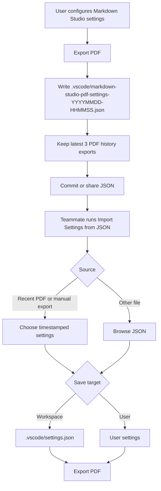

# Portable Export Settings Plan

## Current Decision

The first implementation should stay small and predictable:

- Export the current Markdown Studio PDF-related settings to timestamped JSON
  automatically after successful PDF export.
- Store workspace exports under `.vscode/`.
- Keep automatic PDF export history and manual settings exports in separate
  latest-three retention buckets.
- Import from recent workspace exports first, or browse to a selected JSON file,
  then apply it to User or Workspace settings.
- Keep normal `Markdown Studio: Export PDF` as the only PDF export path.
- Do not expose profile selection, active profile state, export snapshots, or
  "export with setting" commands in this branch.

This replaces the earlier named-profile/list/snapshot direction. The previous
idea was useful for exploring team workflows, but the Command Palette became too
busy and the first-run experience was unclear when no profiles were configured.

## User Workflow



## JSON Shape

```json
{
  "schemaVersion": 1,
  "name": "Company Spec A4",
  "pageFormat": "A4",
  "stylePreset": "github",
  "securityMode": "block-all",
  "includeBookmarks": true,
  "includePdfIndex": true
}
```

The JSON remains a versioned subset so future versions can add fields without
requiring teams to share every Markdown Studio setting.

## Field Mapping

| JSON field | Applies to |
| ---------- | ---------- |
| `pageFormat` | `markdownStudio.export.pageFormat` |
| `stylePreset` | `markdownStudio.style.preset` |
| `securityMode` | `markdownStudio.security.externalResources.mode` |
| `includeBookmarks` | `markdownStudio.export.pdfBookmarks.enabled` |
| `includePdfIndex` | `markdownStudio.export.pdfIndex.enabled` |

## Commands

Keep only two configuration commands:

- `Markdown Studio: Export Current Settings to JSON`
- `Markdown Studio: Import Settings from JSON`

Export behavior:

- Successful `Markdown Studio: Export PDF` writes the current portable settings
  automatically.
- Workspace open: PDF export writes
  `.vscode/markdown-studio-pdf-settings-YYYYMMDD-HHMMSS.json`.
- Manual export writes
  `.vscode/markdown-studio-settings-YYYYMMDD-HHMMSS.json`.
- Keep at most the latest three matching files per bucket.
- Show a localized notification after writing the settings file.
- Manual `Export Current Settings to JSON` uses the same timestamped storage
  rules, but the manual filename prefix and retention bucket stay separate.
- No workspace: the manual command falls back to a save dialog; PDF export does
  not open an extra settings save dialog.

Import behavior:

- Workspace exports exist: show recent PDF history and manual settings files
  plus a "Choose JSON File..." option.
- No workspace exports: open the JSON file picker directly.
- Apply selected JSON to real User or Workspace settings.

Retired from this branch:

- `Markdown Studio: Select Export Profile`
- `Markdown Studio: Export Active Profile to JSON`
- `Markdown Studio: Export PDF with Setting`
- `Markdown Studio: Save Export Snapshot as Profile`

## Acceptance Criteria

- A user with no prior profile setup can export current settings immediately.
- Workspace exports are timestamped and capped to the latest three files per
  automatic/manual bucket.
- Importing JSON applies real VS Code settings rather than creating a separate
  profile list.
- `Markdown Studio: Export PDF` uses the normal current settings.
- Command Palette remains easy to understand.
- JSON import/export supports schema version 1 and ignores invalid optional
  fields with warnings.
- Export completion is surfaced with localized English/Japanese notifications.
- The docs explain team sharing through a portable JSON file.

## Growth Ideas Backlog

This section is a memo only. The current branch should finish the portable
configuration workflow first; these ideas are candidates for later planning.

### Current Signal

- v1.0.1 acquisition is showing early organic pull, so the next bets should make
  the extension easier to recommend in public posts and easier to adopt in teams.
- Large existing Markdown/PDF extensions already cover basic export, rich
  preview, and broad format conversion. Markdown Studio should avoid competing
  only on "exports PDF" and instead lean into local, reproducible, secure,
  team-shareable output.
- Marketplace pages and issue trackers suggest common demand clusters:
  reproducible exports, CSS/theme control, Mermaid/math/diagram support,
  multi-file workflows, archival/compliance PDFs, and less setup friction.

References checked:

- `yzane.markdown-pdf`: <https://marketplace.visualstudio.com/items?itemName=yzane.markdown-pdf>
- `shd101wyy.markdown-preview-enhanced`: <https://marketplace.visualstudio.com/items?itemName=shd101wyy.markdown-preview-enhanced>
- `tomoki1207.pdf`: <https://marketplace.visualstudio.com/items?itemName=tomoki1207.pdf>
- `goessner.mdmath`: <https://marketplace.visualstudio.com/items?itemName=goessner.mdmath>
- `JimKuipers.makespdf`: <https://marketplace.visualstudio.com/items?itemName=JimKuipers.makespdf>
- `ChrisChinchilla.vscode-pandoc`: <https://marketplace.visualstudio.com/items?itemName=ChrisChinchilla.vscode-pandoc>
- `L-Zhou.markdown-merger`: <https://marketplace.visualstudio.com/items?itemName=L-Zhou.markdown-merger>

### Highest-Leverage Feature Bets

1. One-click "Team PDF Spec" onboarding
   - Package settings export/import into a README-friendly team flow: commit
     `markdown-studio-settings.json`, import it, export.
   - Buzz angle: "Make every teammate generate the exact same PDF from the same
     Markdown."

2. Export provenance and reproducibility receipt
   - Add an optional sidecar JSON or embedded PDF metadata with settings name,
     schema version, extension version, timestamp, source hash, and key export
     settings.
   - Buzz angle: "PDFs you can audit and reproduce."

3. Secure local export badge and diagnostics
   - Add a command that summarizes whether the current export is fully local,
     whether remote resources are blocked, and which local assets were used.
   - Buzz angle: "Know exactly what your Markdown PDF exporter can access."

4. Multi-file document bundle
   - Support a simple manifest that exports multiple Markdown files into one
     PDF with a generated cover, TOC, bookmarks, and stable ordering.
   - Buzz angle: "Turn a docs folder into a clean PDF package."

5. Preset gallery for real work
   - Ship practical presets: GitHub README, Company Spec A4, Academic A4,
     Proposal Letter, Runbook, Release Notes.
   - Buzz angle: screenshots and short demos become easier to understand than
     raw configuration.

6. Export quality checks
   - Before export, warn about broken local images, missing Mermaid render,
     remote resources blocked by the selected security mode, and headings that
     create empty bookmark titles.
   - Buzz angle: "Catch PDF problems before sending the file."

7. Last good export recovery
   - Consider a later, quieter history feature only after the simple JSON import
     and export workflow is proven useful.
   - Buzz angle: "Regenerate the exact PDF setting that worked yesterday."

### Lower-Priority Or Riskier Ideas

- Cloud or sharing service: likely conflicts with the local/security promise.
- Full Pandoc replacement: broad surface area and crowded positioning.
- Heavy template marketplace: attractive but expensive to maintain.
- AI rewriting or summarization: buzzworthy, but not core to trustworthy PDF
  generation and may dilute the product story.

### Recommended Narrative

Position Markdown Studio as:

> Local, reproducible Markdown-to-PDF for teams that care about security and
> consistent output.

Short-term release framing after this branch:

- v1.0.2: Portable JSON settings for repeatable team PDF output.
- Next: Provenance receipts, secure export diagnostics, and multi-file PDF
  bundles.
