# Markdown Studio — Feature Demo

Open this file and run **Markdown Studio: Preview** (`Cmd+Shift+P`).

<!-- TOC -->
- [Markdown Studio — Feature Demo](#markdown-studio-feature-demo)
  - [1. Markdown Rendering](#1-markdown-rendering)
    - [日本語タイトル](#日本語タイトル)
    - [Task Lists](#task-lists)
    - [Footnotes](#footnotes)
    - [Emoji](#emoji)
    - [Math (KaTeX)](#math-katex)
    - [Definition Lists](#definition-lists)
    - [Superscript / Subscript](#superscript-subscript)
  - [2. Mermaid Diagrams](#2-mermaid-diagrams)
    - [Markdown Studio Architecture](#markdown-studio-architecture)
    - [Extension Activation Flow](#extension-activation-flow)
  - [3. PlantUML Diagrams](#3-plantuml-diagrams)
    - [Extension Component Diagram](#extension-component-diagram)
    - [Document Processing Sequence](#document-processing-sequence)
  - [4. Inline SVG (Sanitized)](#4-inline-svg-sanitized)
  - [5. Syntax Highlighting](#5-syntax-highlighting)
  - [6. Images and Security](#6-images-and-security)
    - [✅ Local image (relative path — works)](#-local-image-relative-path-works)
    - [✅ Local image (absolute path — works)](#-local-image-absolute-path-works)
    - [❌ External image (blocked by policy)](#-external-image-blocked-by-policy)
    - [❌ External link (blocked by policy)](#-external-link-blocked-by-policy)
    - [How to allow external resources](#how-to-allow-external-resources)
    - [Security Summary](#security-summary)
  - [7. Theme Adaptability](#7-theme-adaptability)
  - [8. Diagram Type Catalog](#8-diagram-type-catalog)
  - [9. Custom CSS](#9-custom-css)
    - [Bundled Themes](#bundled-themes)
    - [Setup](#setup)
    - [How It Works](#how-it-works)
  - [10. PDF Export](#10-pdf-export)
<!-- /TOC -->

---

<!-- DEMO:RENDERING -->
## 1. Markdown Rendering

**Bold**, *italic*, ~~strikethrough~~, `inline code`

> Blockquotes work too.

| Feature    | Status |
|------------|--------|
| Markdown   | ✅     |
| Mermaid    | ✅     |
| PlantUML   | ✅     |
| SVG        | ✅     |
| PDF Export | ✅     |

1. Ordered list item
2. Another item
3. Third item

- Unordered item
- Another item

* Item

- 日本語
  - 2byte文字テスト

### 日本語タイトル

- `hogehoge` あいうえお

### Task Lists

- [x] Markdown rendering
- [x] Mermaid diagrams
- [x] PlantUML diagrams
- [x] LaTeX math
- [x] Footnotes
- [ ] No check

### Footnotes

This sentence has a footnote[^1] and another one[^2].

[^1]: This is the first footnote content.
[^2]: This is the second footnote with **bold** text.

### Emoji

:smile: :rocket: :thumbsup: :warning: :heart: :star: :fire: :coffee:

### Math (KaTeX)

Inline math: $E = mc^2$ and $\sum_{i=1}^{n} i = \frac{n(n+1)}{2}$

Display math:

$$
\int_{-\infty}^{\infty} e^{-x^2} dx = \sqrt{\pi}
$$

$$
f(x) = \frac{1}{\sigma\sqrt{2\pi}} e^{-\frac{(x-\mu)^2}{2\sigma^2}}
$$

### Definition Lists

Markdown
:   A lightweight markup language for creating formatted text.

PlantUML
:   A tool for creating UML diagrams from plain text.
:   Uses Smetana layout engine (no Graphviz needed).

### Superscript / Subscript

- Water: H~2~O
- Einstein: E = mc^2^
- 19^th^ century

---

<!-- DEMO:MERMAID -->
## 2. Mermaid Diagrams

### Markdown Studio Architecture

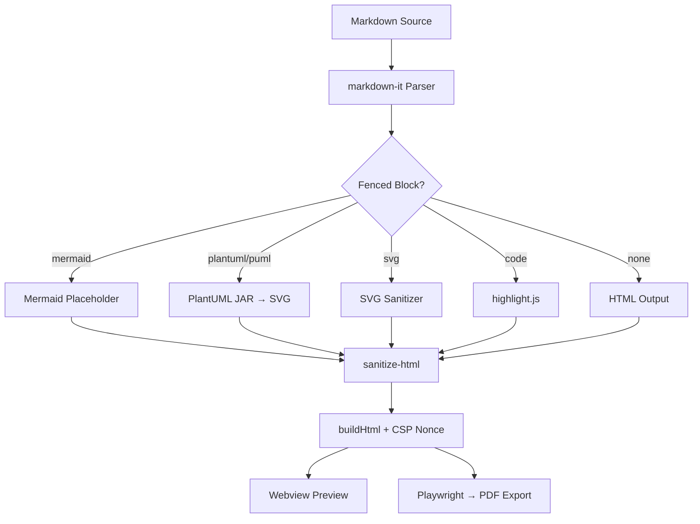

### Extension Activation Flow

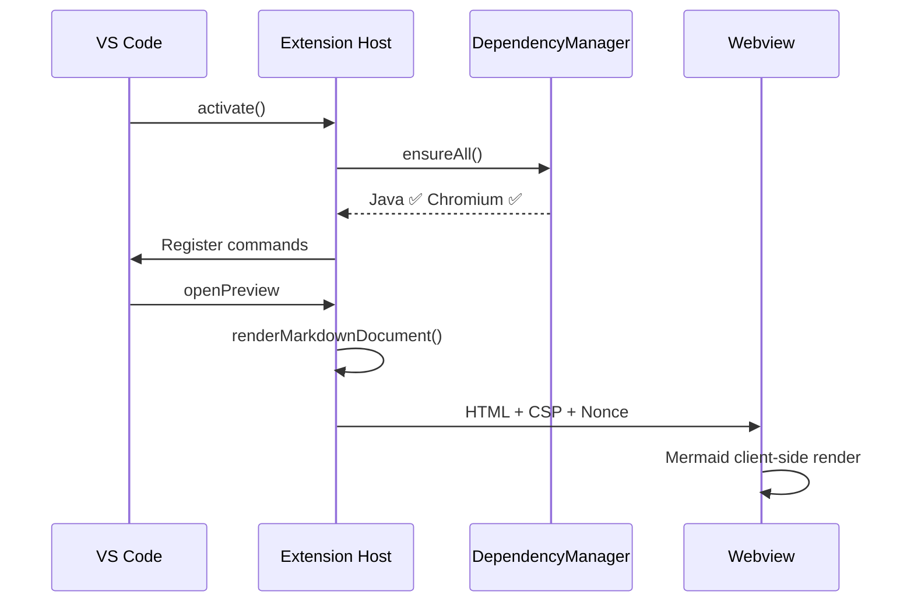

---

<!-- DEMO:PLANTUML -->
## 3. PlantUML Diagrams

Rendered locally via bundled JAR. No remote server.

### Extension Component Diagram

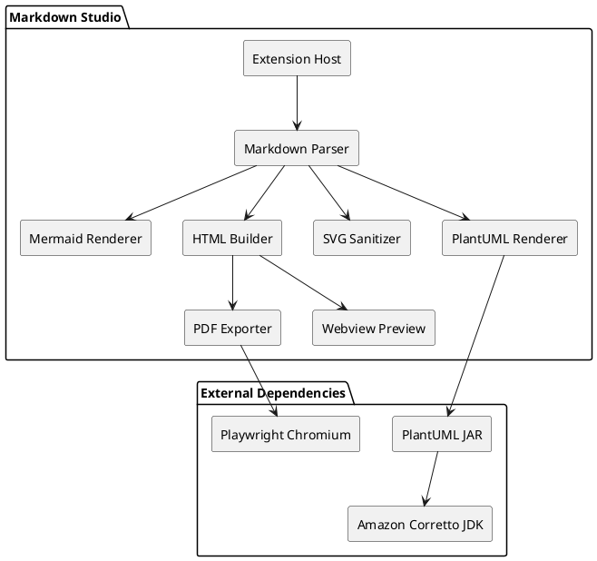

### Document Processing Sequence

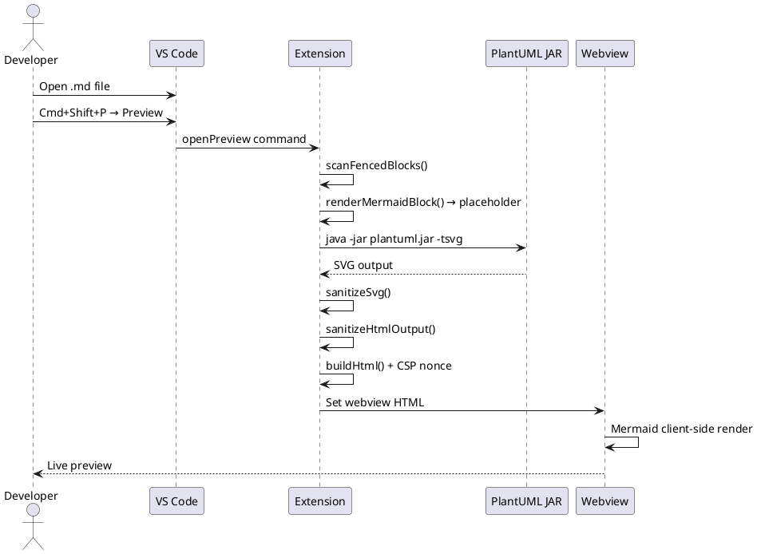

---

## 4. Inline SVG (Sanitized)

Dangerous elements (`<script>`, `<foreignObject>`, event handlers) are stripped automatically.

```svg
<svg viewBox="0 0 600 200" xmlns="http://www.w3.org/2000/svg" width="100%">
  <!-- Parse stage -->
  <rect x="30" y="20" width="160" height="70" rx="12" fill="#4CAF50"/>
  <text x="110" y="55" text-anchor="middle" fill="white" font-size="15" font-weight="bold">Parse</text>
  <text x="110" y="75" text-anchor="middle" fill="white" font-size="11">markdown-it + scanner</text>

  <!-- Arrow -->
  <polygon points="195,55 215,47 215,63" fill="#888"/>

  <!-- Render stage -->
  <rect x="220" y="20" width="160" height="70" rx="12" fill="#2196F3"/>
  <text x="300" y="55" text-anchor="middle" fill="white" font-size="15" font-weight="bold">Render</text>
  <text x="300" y="75" text-anchor="middle" fill="white" font-size="11">Mermaid · PlantUML · SVG</text>

  <!-- Arrow -->
  <polygon points="385,55 405,47 405,63" fill="#888"/>

  <!-- Export stage -->
  <rect x="410" y="20" width="160" height="70" rx="12" fill="#FF9800"/>
  <text x="490" y="55" text-anchor="middle" fill="white" font-size="15" font-weight="bold">Export</text>
  <text x="490" y="75" text-anchor="middle" fill="white" font-size="11">Playwright → PDF</text>

  <!-- Security icons -->
  <circle cx="110" cy="140" r="25" fill="#4CAF50" opacity="0.2" stroke="#4CAF50" stroke-width="2"/>
  <text x="110" y="145" text-anchor="middle" fill="#4CAF50" font-size="16">🔒</text>
  <text x="110" y="175" text-anchor="middle" fill="#4CAF50" font-size="9">CSP + Nonce</text>

  <circle cx="300" cy="140" r="25" fill="#2196F3" opacity="0.2" stroke="#2196F3" stroke-width="2"/>
  <text x="300" y="145" text-anchor="middle" fill="#2196F3" font-size="16">🛡️</text>
  <text x="300" y="175" text-anchor="middle" fill="#2196F3" font-size="9">HTML Sanitize</text>

  <circle cx="490" cy="140" r="25" fill="#FF9800" opacity="0.2" stroke="#FF9800" stroke-width="2"/>
  <text x="490" y="145" text-anchor="middle" fill="#FF9800" font-size="16">💻</text>
  <text x="490" y="175" text-anchor="middle" fill="#FF9800" font-size="9">Local-First</text>

  <!-- Connecting dashed lines -->
  <line x1="110" y1="90" x2="110" y2="115" stroke="#4CAF50" stroke-width="2" stroke-dasharray="4"/>
  <line x1="300" y1="90" x2="300" y2="115" stroke="#2196F3" stroke-width="2" stroke-dasharray="4"/>
  <line x1="490" y1="90" x2="490" y2="115" stroke="#FF9800" stroke-width="2" stroke-dasharray="4"/>
</svg>
```

---

## 5. Syntax Highlighting

```typescript
import * as vscode from 'vscode';

export function activate(context: vscode.ExtensionContext): void {
  const depManager = new DependencyManager();
  const status = await depManager.ensureAll(context);

  context.subscriptions.push(
    vscode.commands.registerCommand('markdownStudio.openPreview', async () => {
      await openPreviewCommand(context);
    }),
    vscode.commands.registerCommand('markdownStudio.exportPdf', async () => {
      await exportPdfCommand(context);
    })
  );
}
```

```json
{
  "markdownStudio.plantuml.mode": "bundled-jar",
  "markdownStudio.java.path": "java",
  "markdownStudio.export.pageFormat": "A4",
  "markdownStudio.security.blockExternalLinks": true
}
```

```python
# PlantUML rendering is also useful for Python projects
from dataclasses import dataclass

@dataclass
class DiagramConfig:
    mode: str = "bundled-jar"
    java_path: str = "java"
    timeout_ms: int = 15000
```

```go
fmt.Println("Hello, World!")
```

```
```

```
plain text without language
```

```rust
fn main() {
    println!("Hello from Rust");
}
```

```sql
SELECT id, name FROM users WHERE active = true;
```

```dockerfile
FROM node:20-alpine
WORKDIR /app
COPY . .
RUN npm install
```

---

<!-- DEMO:SECURITY -->
## 6. Images and Security

Markdown Studio is local-first. The default security policy (`blockExternalLinks = true`) blocks external resources while allowing local files.

### ✅ Local image (relative path — works)

- local svg
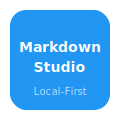

- icon.png


- icon.svg


Relative paths from the Markdown file are resolved and displayed correctly.

### ✅ Local image (absolute path — works)

Images with absolute file paths also work in the preview.

### ❌ External image (blocked by policy)


External URLs (`https://...`) are blocked by default. The image above shows a policy notice instead.

### ❌ External link (blocked by policy)

[External link](https://example.com) — blocked by default ✋

External links are replaced with a blocked notice in the preview.

### How to allow external resources

Set `markdownStudio.security.blockExternalLinks` to `false` in VS Code settings to allow external images and links. This is not recommended for corporate/secure environments.

### Security Summary

| Resource Type | Default | Configurable |
|--------------|---------|-------------|
| Local images (relative path) | ✅ Allowed | — |
| Local images (absolute path) | ✅ Allowed | — |
| External images (https://) | ❌ Blocked | `blockExternalLinks: false` |
| External links (https://) | ❌ Blocked | `blockExternalLinks: false` |
| Inline SVG | ✅ Allowed | — |
| Mermaid diagrams | ✅ Allowed | — |
| PlantUML diagrams | ✅ Allowed | — |

---

## 7. Theme Adaptability

Switch between **light** and **dark** mode in VS Code (`Cmd+K Cmd+T`) to see how the preview adapts:

- Mermaid diagrams automatically switch between light and dark themes
- SVG elements use colors chosen for visibility in both themes
- Code blocks use theme-aware syntax highlighting
- PlantUML output receives CSS overrides for dark mode

---

## 8. Diagram Type Catalog

All diagram types below are verified to render correctly with the bundled PlantUML + Smetana engine (no Graphviz required).

<details>
<summary>Class Diagram</summary>

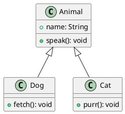

</details>

<details>
<summary>Activity Diagram</summary>

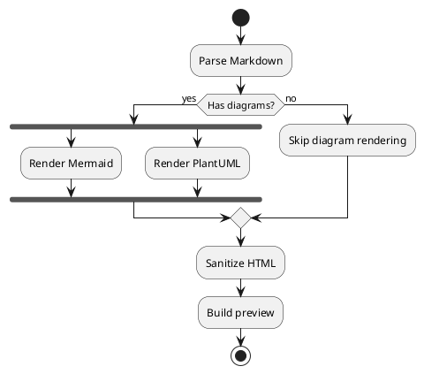

</details>

<details>
<summary>State Diagram</summary>

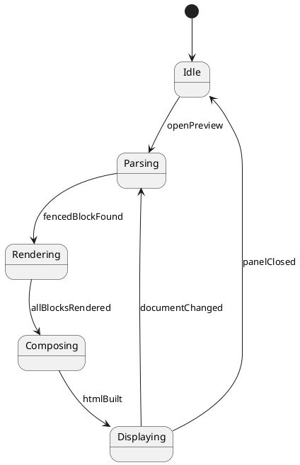

</details>

<details>
<summary>Use Case Diagram</summary>

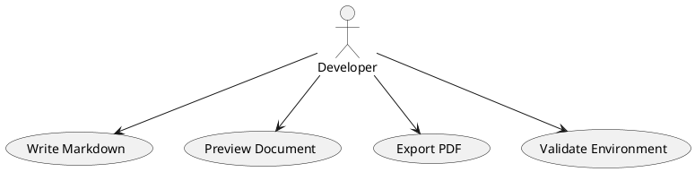

</details>

<details>
<summary>Timing Diagram</summary>

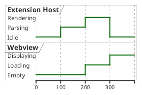

</details>

<details>
<summary>Mind Map</summary>

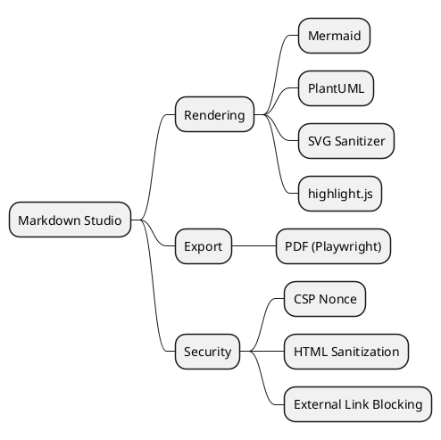

</details>

<details>
<summary>Gantt Chart</summary>

```plantuml
@startgantt
[Parse Markdown] lasts 1 day
[Render Diagrams] starts at [Parse Markdown]'s end and lasts 2 days
[Sanitize HTML] starts at [Render Diagrams]'s end and lasts 1 day
[Build Preview] starts at [Sanitize HTML]'s end and lasts 1 day
@endgantt
```

</details>

<details>
<summary>Object Diagram</summary>

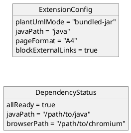

</details>

<details>
<summary>Mermaid: Pie Chart</summary>

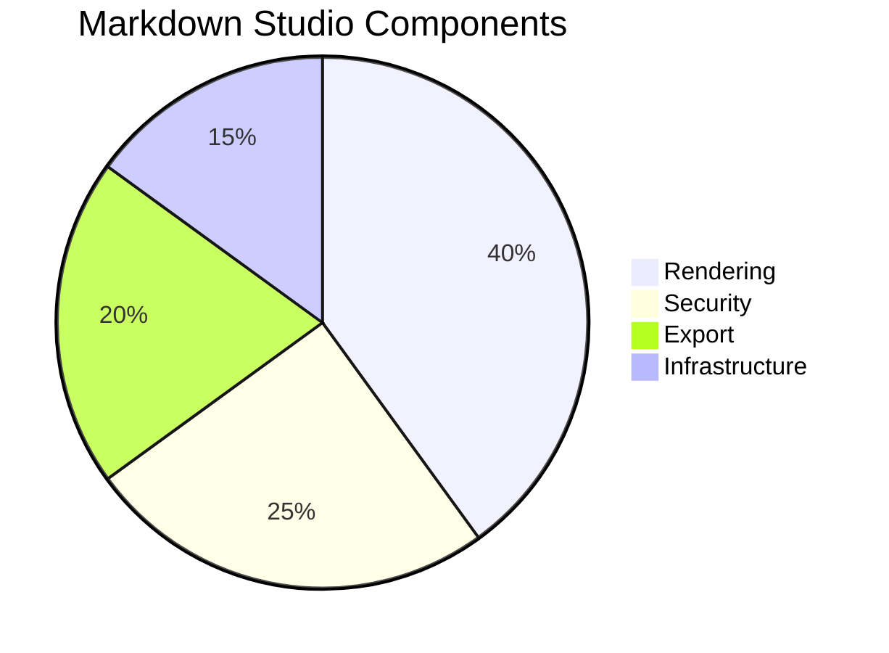

</details>

<details>
<summary>Mermaid: Git Graph</summary>

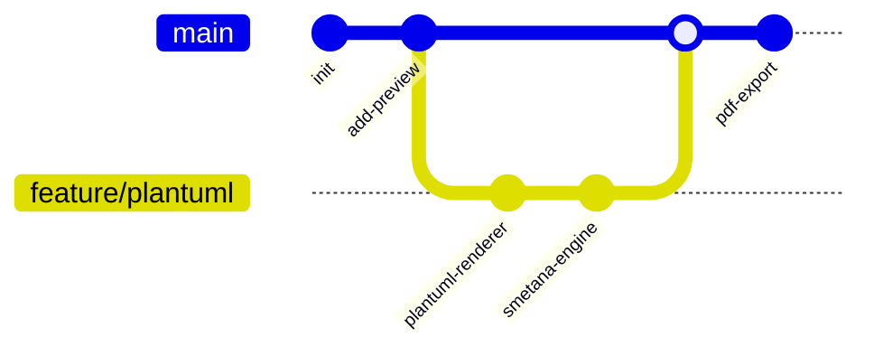

</details>

<details>
<summary>Mermaid: XY Chart</summary>

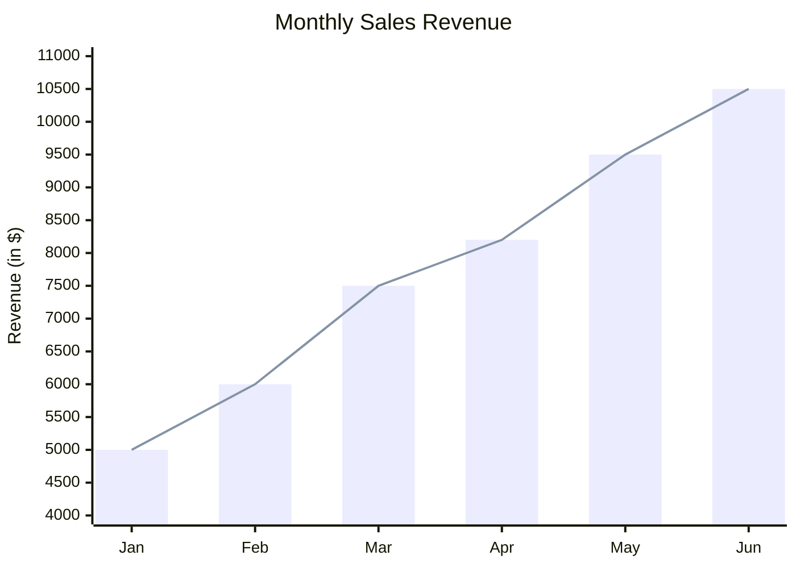

</details>

<details>
<summary>SVG: Basic Shapes</summary>

```svg
<svg viewBox="0 0 500 120" xmlns="http://www.w3.org/2000/svg" width="100%">
  <rect x="10" y="10" width="100" height="80" rx="8" fill="#4CAF50"/>
  <circle cx="180" cy="50" r="40" fill="#2196F3"/>
  <ellipse cx="290" cy="50" rx="50" ry="30" fill="#FF9800"/>
  <polygon points="400,10 440,90 360,90" fill="#9C27B0"/>
  <text x="50" y="115" text-anchor="middle" fill="#888" font-size="10">rect</text>
  <text x="180" y="115" text-anchor="middle" fill="#888" font-size="10">circle</text>
  <text x="290" y="115" text-anchor="middle" fill="#888" font-size="10">ellipse</text>
  <text x="400" y="115" text-anchor="middle" fill="#888" font-size="10">polygon</text>
</svg>
```

</details>

<details>
<summary>SVG: Lines and Paths</summary>

```svg
<svg viewBox="0 0 500 120" xmlns="http://www.w3.org/2000/svg" width="100%">
  <line x1="20" y1="20" x2="120" y2="100" stroke="#E91E63" stroke-width="3"/>
  <polyline points="150,100 180,20 210,80 240,30 270,100" fill="none" stroke="#00BCD4" stroke-width="2"/>
  <path d="M 300 80 Q 350 10 400 80 T 500 80" fill="none" stroke="#FF5722" stroke-width="2"/>
  <text x="70" y="115" text-anchor="middle" fill="#888" font-size="10">line</text>
  <text x="210" y="115" text-anchor="middle" fill="#888" font-size="10">polyline</text>
  <text x="400" y="115" text-anchor="middle" fill="#888" font-size="10">path (curve)</text>
</svg>
```

</details>

<details>
<summary>SVG: Text and Styling</summary>

```svg
<svg viewBox="0 0 500 100" xmlns="http://www.w3.org/2000/svg" width="100%">
  <text x="20" y="30" font-size="24" font-weight="bold" fill="#333">Bold Title</text>
  <text x="20" y="55" font-size="14" fill="#666">Regular body text with <tspan fill="#E91E63" font-weight="bold">colored</tspan> spans</text>
  <text x="20" y="80" font-size="12" font-family="monospace" fill="#4CAF50">monospace: const x = 42;</text>
  <rect x="300" y="10" width="180" height="70" rx="6" fill="none" stroke="#2196F3" stroke-width="2" stroke-dasharray="6,3"/>
  <text x="390" y="50" text-anchor="middle" fill="#2196F3" font-size="12">dashed border</text>
</svg>
```

</details>

<details>
<summary>SVG: Dashboard Layout</summary>

```svg
<svg viewBox="0 0 500 180" xmlns="http://www.w3.org/2000/svg" width="100%">
  <!-- Card 1 -->
  <rect x="10" y="10" width="150" height="80" rx="8" fill="#E8F5E9" stroke="#4CAF50" stroke-width="2"/>
  <text x="85" y="40" text-anchor="middle" fill="#2E7D32" font-size="24" font-weight="bold">263</text>
  <text x="85" y="60" text-anchor="middle" fill="#4CAF50" font-size="11">Unit Tests</text>
  <text x="85" y="80" text-anchor="middle" fill="#66BB6A" font-size="10">✅ All Passing</text>

  <!-- Card 2 -->
  <rect x="175" y="10" width="150" height="80" rx="8" fill="#E3F2FD" stroke="#2196F3" stroke-width="2"/>
  <text x="250" y="40" text-anchor="middle" fill="#1565C0" font-size="24" font-weight="bold">15</text>
  <text x="250" y="60" text-anchor="middle" fill="#2196F3" font-size="11">Integration Tests</text>
  <text x="250" y="80" text-anchor="middle" fill="#42A5F5" font-size="10">✅ All Passing</text>

  <!-- Card 3 -->
  <rect x="340" y="10" width="150" height="80" rx="8" fill="#FFF3E0" stroke="#FF9800" stroke-width="2"/>
  <text x="415" y="40" text-anchor="middle" fill="#E65100" font-size="24" font-weight="bold">8</text>
  <text x="415" y="60" text-anchor="middle" fill="#FF9800" font-size="11">E2E Tests</text>
  <text x="415" y="80" text-anchor="middle" fill="#FFA726" font-size="10">✅ All Passing</text>

  <!-- Bar chart -->
  <rect x="10" y="110" width="480" height="60" rx="6" fill="none" stroke="#ddd" stroke-width="1"/>
  <rect x="20" y="125" width="300" height="15" rx="3" fill="#4CAF50"/>
  <text x="330" y="137" fill="#4CAF50" font-size="10">Rendering 60%</text>
  <rect x="20" y="145" width="150" height="15" rx="3" fill="#2196F3"/>
  <text x="180" y="157" fill="#2196F3" font-size="10">Security 30%</text>
</svg>
```

</details>

---

## 9. Custom CSS

Markdown Studio supports built-in themes and inline CSS customization.

### Bundled Themes

Select a theme from the settings dropdown (`markdownStudio.style.theme`):

| Theme | Description |
|-------|-------------|
| `default` | No extra styling — uses the selected preset only |
| `modern` | Indigo accents, soft shadows, refined typography |
| `markdown-pdf` | Classic look matching the popular Markdown PDF extension |
| `minimal` | Bare-bones, clean starting point |

All themes include dark mode support and print-optimized styles.

### Setup

```jsonc
// Pick a theme from the dropdown
"markdownStudio.style.theme": "modern"

// Optionally add your own CSS on top
"markdownStudio.style.customCss": "h1 { color: navy; } blockquote { border-left: 3px solid orange; }"
```

### How It Works

- Theme CSS is injected **after** the preset styles, so theme rules take priority
- `customCss` is applied **after** the theme, so your inline rules override everything
- The same CSS applies to both preview and PDF export for consistent output
- Copy any bundled theme and customize it to create your own

---

<!-- DEMO:EXPORT -->
## 10. PDF Export

This entire document can be exported to PDF:

1. Open this file in VS Code
2. `Cmd+Shift+P` → **Markdown Studio: Export PDF**
3. A `demo.pdf` will be generated next to this file

The PDF uses the same HTML pipeline as the preview.

---

*Markdown Studio v0.7.0*
