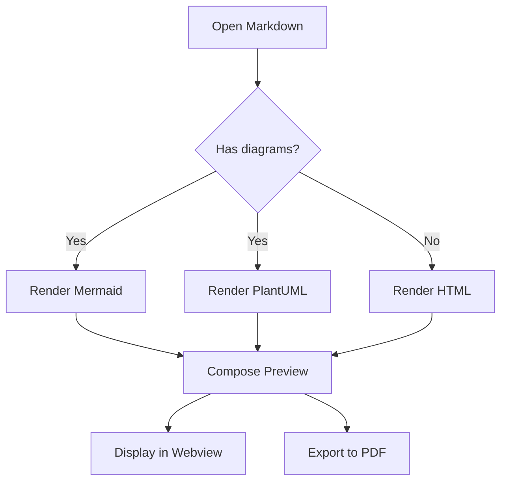
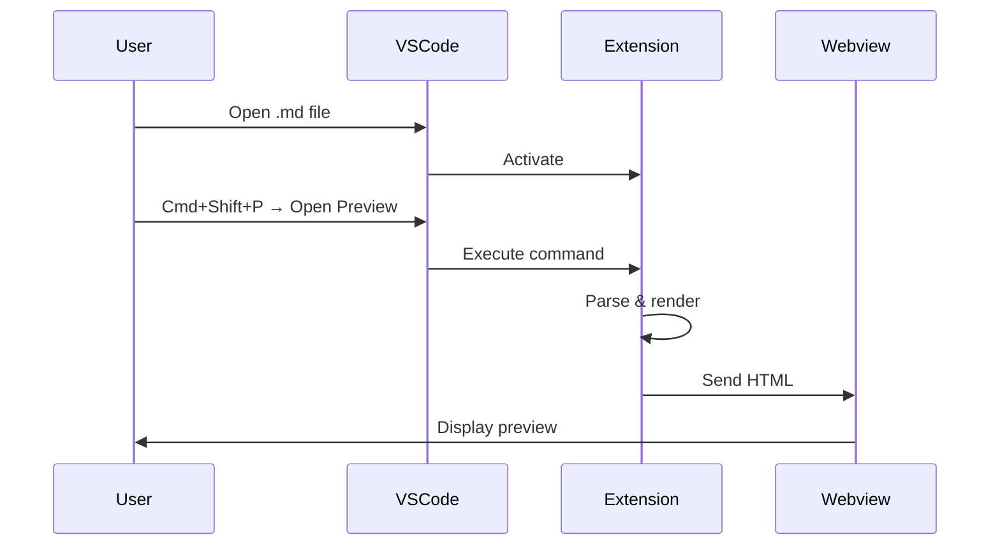
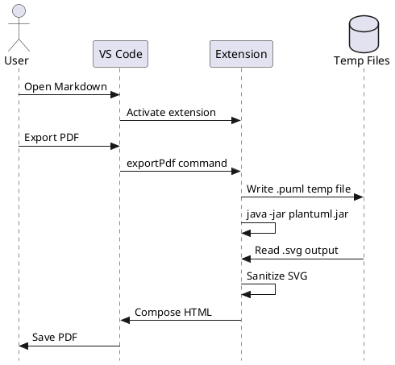
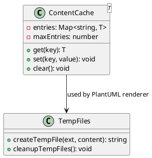

# Markdown Studio — Feature Demo

This single file showcases every feature of Markdown Studio.
Open it in VS Code and run **Markdown Studio: Open Secure Preview** (`Cmd+Shift+P`).

---

## 1. Standard Markdown Rendering

Regular Markdown elements are rendered with full fidelity:

- **Bold**, *italic*, ~~strikethrough~~, `inline code`
- [Internal link](#5-security-model) works fine
- [External link](https://example.com) — blocked by default policy ✋

> Blockquotes are supported too.

### Ordered List

1. First item
2. Second item
3. Third item

### Table

| Feature         | Status |
|-----------------|--------|
| Markdown        | ✅      |
| Mermaid         | ✅      |
| PlantUML        | ✅      |
| SVG             | ✅      |
| PDF Export      | ✅      |
| Security        | ✅      |

---

## 2. Mermaid Diagram (Local Rendering)

Mermaid diagrams are rendered client-side in the webview — no external service.



### Sequence Diagram



---

## 3. PlantUML Diagram (Local JAR)

PlantUML is rendered locally via the bundled JAR — no remote server.
Requires Java to be installed (`markdownStudio.java.path`).



### Also supports `puml` fence



---

## 4. Inline SVG (Sanitized)

Raw SVG in fenced blocks is sanitized — `<script>`, `<foreignObject>`,
event handlers, and `javascript:` URIs are all stripped.

```svg
<svg viewBox="0 0 200 100" xmlns="http://www.w3.org/2000/svg">
  <rect x="10" y="10" width="80" height="80" rx="10" fill="#4CAF50" />
  <text x="50" y="55" text-anchor="middle" fill="white" font-size="14">Safe</text>
  <circle cx="150" cy="50" r="40" fill="#2196F3" />
  <text x="150" y="55" text-anchor="middle" fill="white" font-size="14">SVG</text>
</svg>
```

The following dangerous elements are automatically removed:

```svg
<svg viewBox="0 0 200 50" xmlns="http://www.w3.org/2000/svg">
  <script>alert('XSS')</script>
  <rect width="200" height="50" fill="#f44336" onclick="alert('hack')" />
  <text x="100" y="30" text-anchor="middle" fill="white">Dangerous tags stripped</text>
  <foreignObject><div>blocked</div></foreignObject>
</svg>
```

---

## 5. Security Model

Markdown Studio is **safe by design**:

- ✅ No external API calls
- ✅ No SaaS dependency or CDN assets
- ✅ Restrictive Content Security Policy with random nonce
- ✅ HTML sanitization before rendering
- ✅ SVG sanitization strips scripts, event handlers, foreign objects
- ✅ External links and images blocked by default

### External image (blocked by policy)


The image above is replaced with a policy notice in the preview.

---

## 6. Code Blocks

Standard fenced code blocks render normally:

```typescript
import * as vscode from 'vscode';

export function activate(context: vscode.ExtensionContext): void {
  context.subscriptions.push(
    vscode.commands.registerCommand('markdownStudio.openPreview', async () => {
      // Open secure preview
    })
  );
}
```

```json
{
  "markdownStudio.plantuml.mode": "bundled-jar",
  "markdownStudio.java.path": "java",
  "markdownStudio.export.pageFormat": "A4",
  "markdownStudio.security.blockExternalLinks": true
}
```

---

## 7. PDF Export

This entire document can be exported to PDF:

1. Open this file in VS Code
2. `Cmd+Shift+P` → **Markdown Studio: Export PDF**
3. A `demo.pdf` will be generated next to this file

The PDF uses the same HTML pipeline as the preview — what you see is what you get.

---

## 8. Environment Validation

Run **Markdown Studio: Validate Local Environment** to check:

- ✅ Java detected
- ✅ Bundled PlantUML jar found
- ✅ Temp directory writable

---

*Generated for Markdown Studio v0.1.0*
