# Markdown Studio — Feature Demo

Open this file and run **Markdown Studio: Open Secure Preview** (`Cmd+Shift+P`).

---

## 1. Markdown Rendering

**Bold**, *italic*, ~~strikethrough~~, `inline code`

> Blockquotes work too.

| Feature    | Status |
|------------|--------|
| Markdown   | ✅     |
| Mermaid    | ✅     |
| PlantUML   | ✅     |
| SVG        | ✅     |
| PDF Export | ✅     |

1. Ordered list item
2. Another item
3. Third item

- Unordered item
- Another item

---

## 2. Mermaid Diagrams

### Markdown Studio Architecture

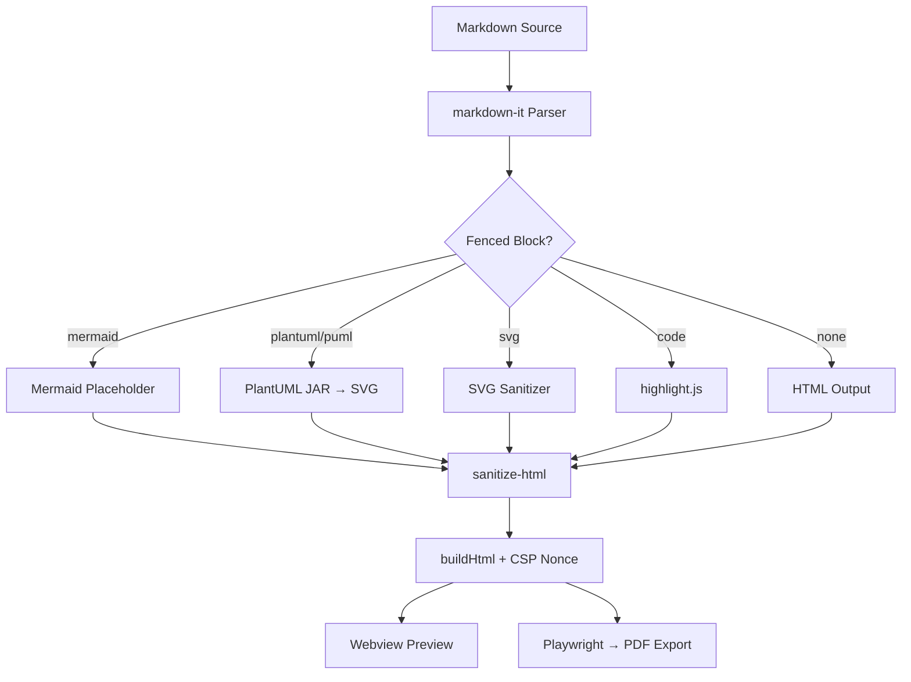

### Extension Activation Flow

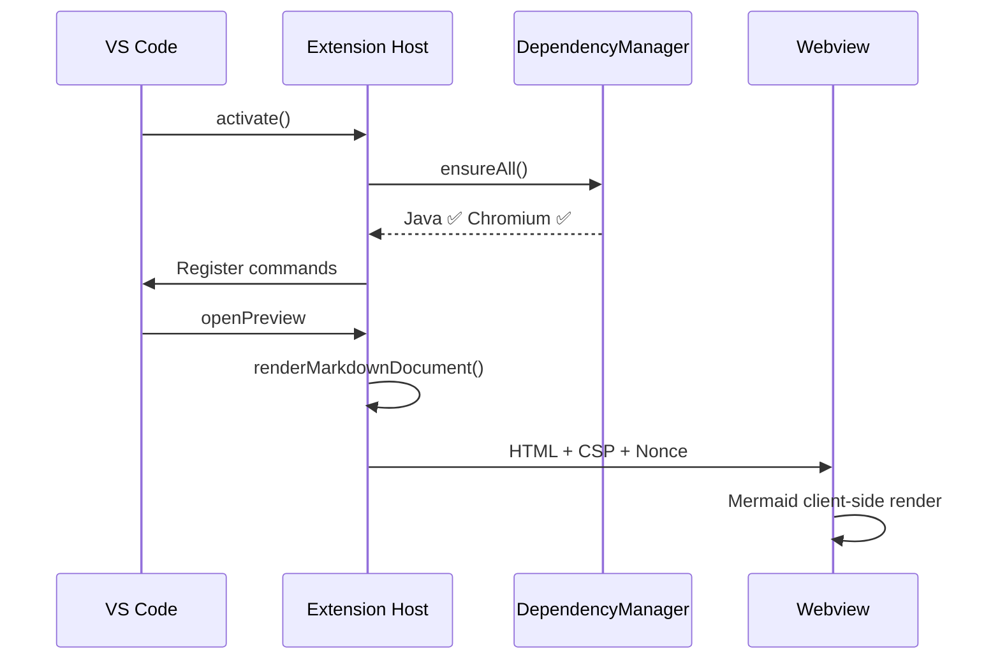

---

## 3. PlantUML Diagrams

Rendered locally via bundled JAR. No remote server.

### Extension Component Diagram

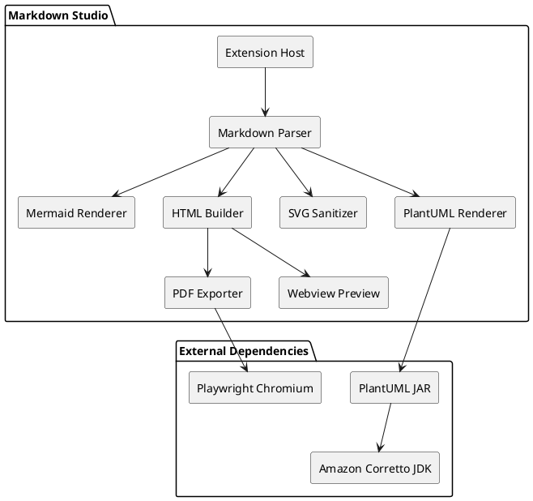

### Document Processing Sequence

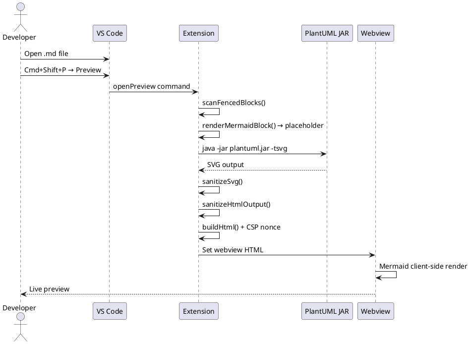

---

## 4. Inline SVG (Sanitized)

Dangerous elements (`<script>`, `<foreignObject>`, event handlers) are stripped automatically.

```svg
<svg viewBox="0 0 360 80" xmlns="http://www.w3.org/2000/svg">
  <rect x="5" y="5" width="110" height="70" rx="10" fill="#4CAF50" />
  <text x="60" y="48" text-anchor="middle" fill="white" font-size="18" font-weight="bold">Parse</text>
  <rect x="125" y="5" width="110" height="70" rx="10" fill="#2196F3" />
  <text x="180" y="48" text-anchor="middle" fill="white" font-size="18" font-weight="bold">Render</text>
  <rect x="245" y="5" width="110" height="70" rx="10" fill="#FF9800" />
  <text x="300" y="48" text-anchor="middle" fill="white" font-size="18" font-weight="bold">Export</text>
</svg>
```

---

## 5. Syntax Highlighting

```typescript
import * as vscode from 'vscode';

export function activate(context: vscode.ExtensionContext): void {
  const depManager = new DependencyManager();
  const status = await depManager.ensureAll(context);

  context.subscriptions.push(
    vscode.commands.registerCommand('markdownStudio.openPreview', async () => {
      await openPreviewCommand(context);
    }),
    vscode.commands.registerCommand('markdownStudio.exportPdf', async () => {
      await exportPdfCommand(context);
    })
  );
}
```

```json
{
  "markdownStudio.plantuml.mode": "bundled-jar",
  "markdownStudio.java.path": "java",
  "markdownStudio.export.pageFormat": "A4",
  "markdownStudio.security.blockExternalLinks": true
}
```

```python
# PlantUML rendering is also useful for Python projects
from dataclasses import dataclass

@dataclass
class DiagramConfig:
    mode: str = "bundled-jar"
    java_path: str = "java"
    timeout_ms: int = 15000
```

---

## 6. Security Model

- ✅ No external API calls
- ✅ No SaaS dependency or CDN assets
- ✅ Restrictive CSP with random nonce
- ✅ HTML sanitization before rendering
- ✅ SVG sanitization strips scripts, event handlers, foreign objects
- ✅ External links and images blocked by default

### External image (blocked by policy)


The image above is replaced with a policy notice in the preview.

### External link (blocked by policy)

[External link](https://example.com) — blocked by default ✋

---

## 7. Theme Adaptability

Switch between **light** and **dark** mode in VS Code (`Cmd+K Cmd+T`) to see how the preview adapts:

- Mermaid diagrams automatically switch between light and dark themes
- SVG elements use colors chosen for visibility in both themes
- Code blocks use theme-aware syntax highlighting
- PlantUML output receives CSS overrides for dark mode

---

## 8. Diagram Type Catalog

All diagram types below are verified to render correctly with the bundled PlantUML + Smetana engine (no Graphviz required).

<details>
<summary>Class Diagram</summary>

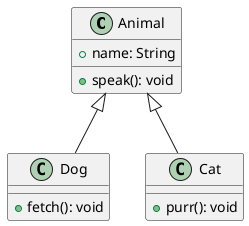

</details>

<details>
<summary>Activity Diagram</summary>

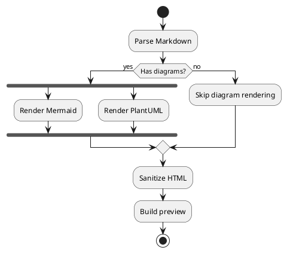

</details>

<details>
<summary>State Diagram</summary>

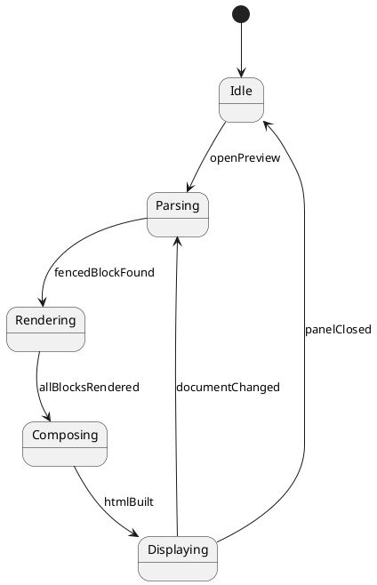

</details>

<details>
<summary>Use Case Diagram</summary>

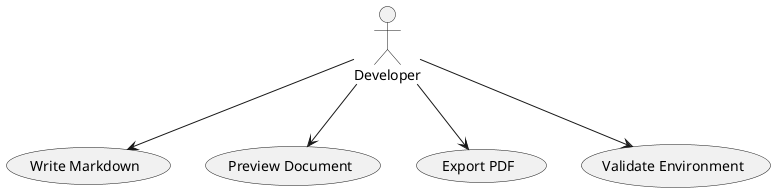

</details>

<details>
<summary>Timing Diagram</summary>

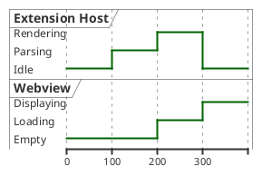

</details>

<details>
<summary>Mind Map</summary>

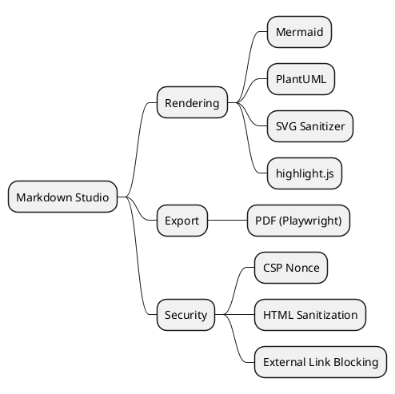

</details>

<details>
<summary>Gantt Chart</summary>

```plantuml
@startgantt
[Parse Markdown] lasts 1 day
[Render Diagrams] starts at [Parse Markdown]'s end and lasts 2 days
[Sanitize HTML] starts at [Render Diagrams]'s end and lasts 1 day
[Build Preview] starts at [Sanitize HTML]'s end and lasts 1 day
@endgantt
```

</details>

<details>
<summary>Object Diagram</summary>

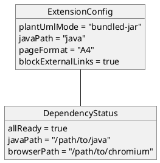

</details>

<details>
<summary>Mermaid: Pie Chart</summary>

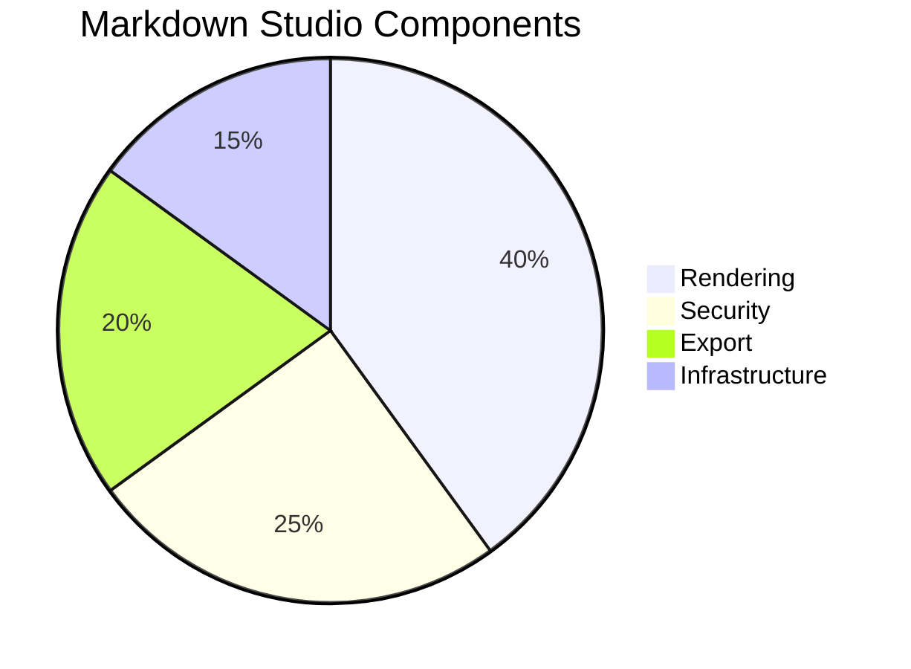

</details>

<details>
<summary>Mermaid: Git Graph</summary>

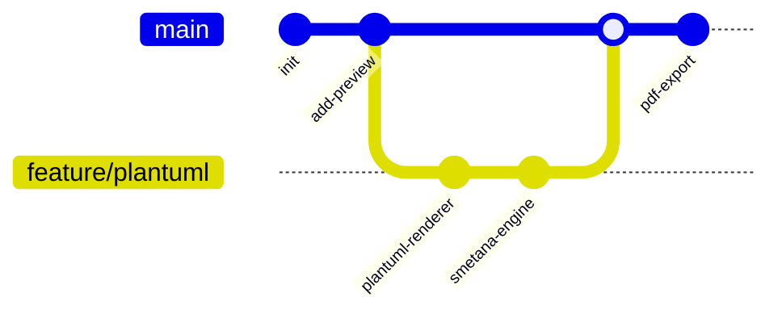

</details>

---

## 9. PDF Export

This entire document can be exported to PDF:

1. Open this file in VS Code
2. `Cmd+Shift+P` → **Markdown Studio: Export PDF**
3. A `demo.pdf` will be generated next to this file

The PDF uses the same HTML pipeline as the preview.

---

*Markdown Studio v0.1.0*
