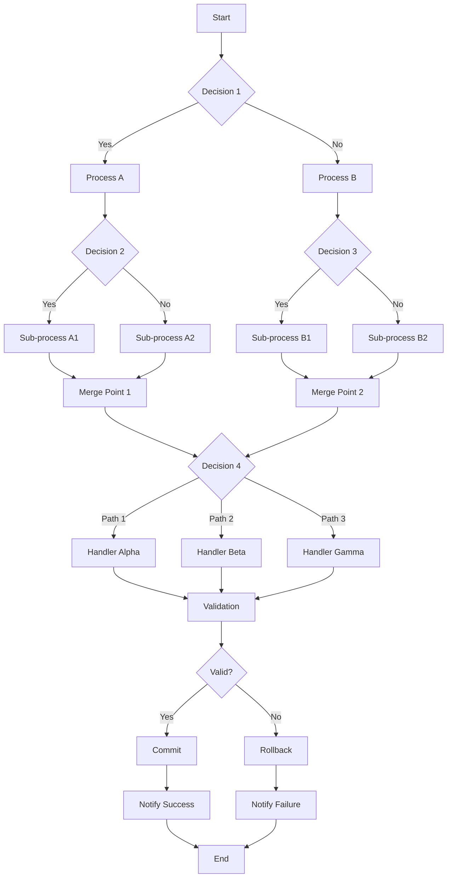
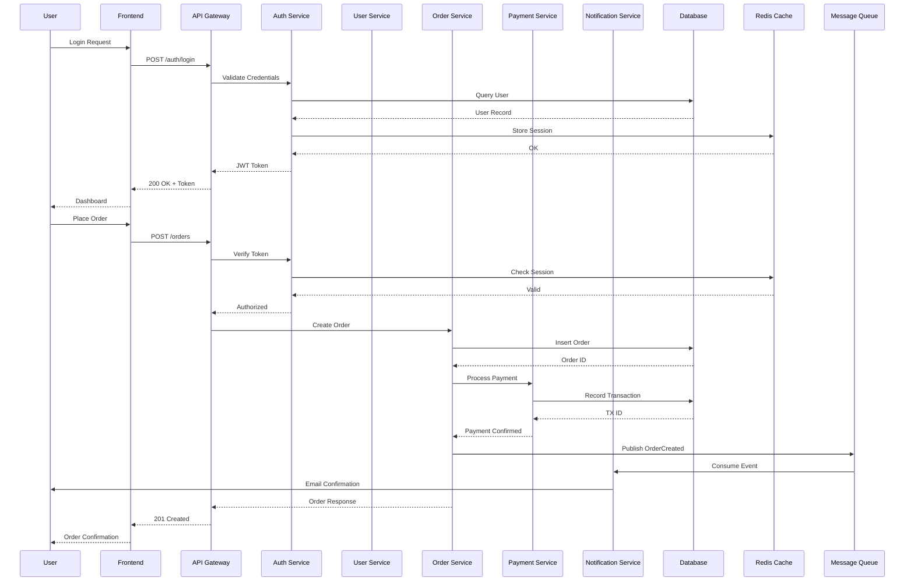
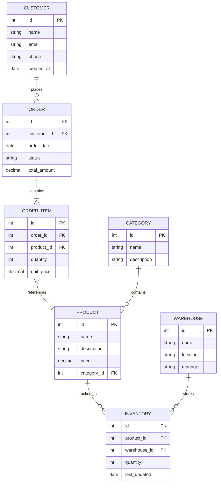
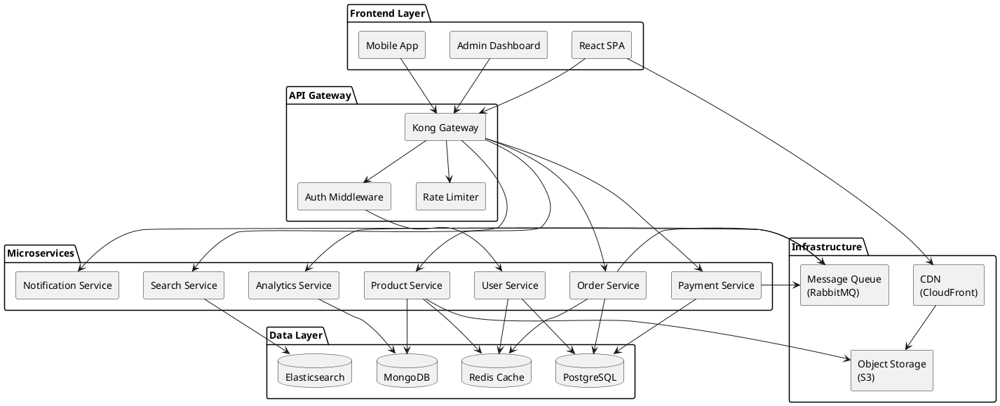
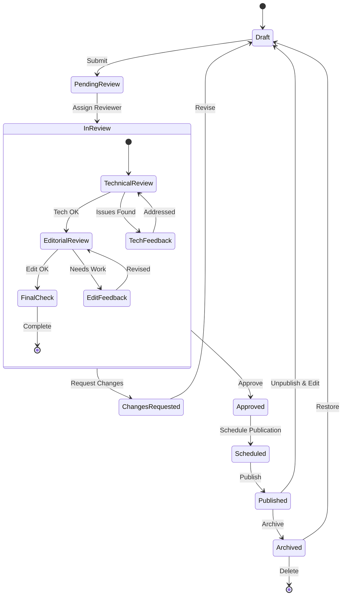
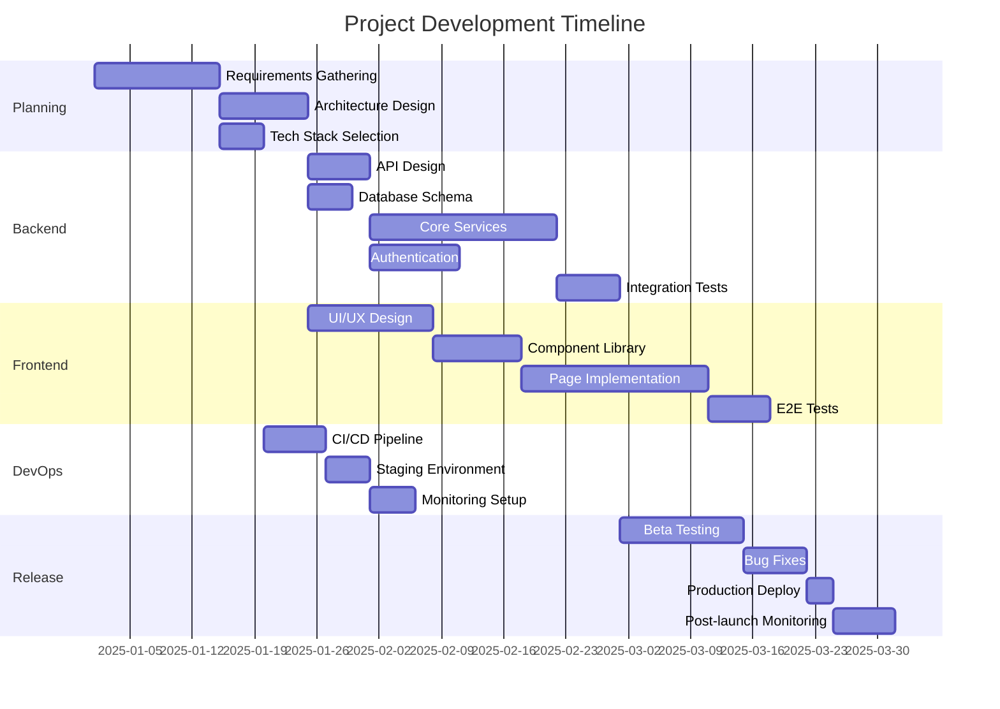

# Markdown Studio — Load Test

This file contains complex diagrams to test rendering performance on low-spec machines.

## 1. Large Mermaid Flowchart

## 2. Complex Sequence Diagram

## 3. Entity Relationship Diagram

## 4. Complex PlantUML Component Diagram

## 5. Mermaid State Diagram

## 6. Mermaid Gantt Chart

