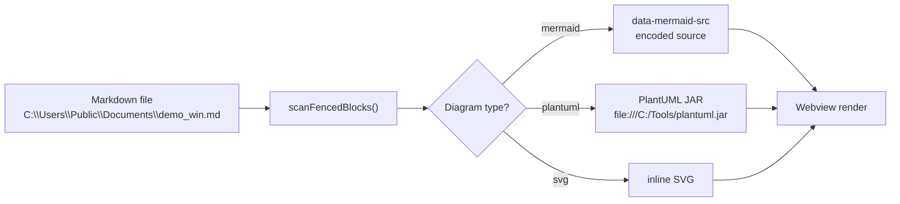
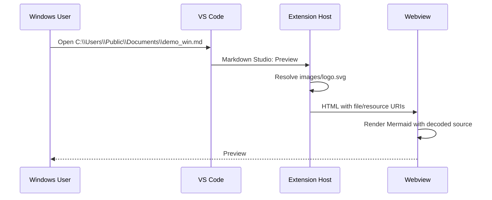
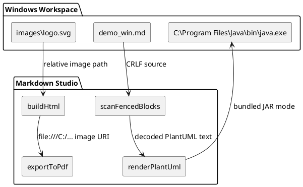
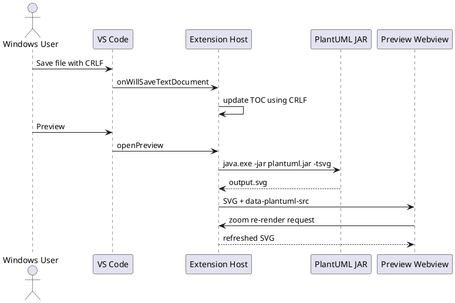

# Markdown Studio - Windows Compatibility Demo

Open this file on Windows and run **Markdown Studio: Preview** from the command palette.

This demo is based on `examples/demo.md`, but focuses on items that often expose Windows-specific bugs:

- CRLF line endings and TOC auto-update
- Windows paths with backslashes, spaces, drive letters, and file URIs
- Mermaid, PlantUML, and inline SVG fenced blocks
- PowerShell, cmd/batch, JSON, and INI syntax highlighting
- Local image resolution for preview and PDF export

For the strongest check, save this file with **CRLF** line endings before previewing and exporting.

<!-- TOC -->
- [Markdown Studio - Windows Compatibility Demo](#markdown-studio---windows-compatibility-demo)
  - [1. Windows Path Samples](#1-windows-path-samples)
  - [2. Local Images and File URIs](#2-local-images-and-file-uris)
  - [3. Mermaid Diagrams](#3-mermaid-diagrams)
  - [4. PlantUML Diagrams](#4-plantuml-diagrams)
  - [5. Inline SVG](#5-inline-svg)
  - [6. Windows Shell Highlighting](#6-windows-shell-highlighting)
  - [7. Tables, Lists, and Anchors](#7-tables-lists-and-anchors)
  - [8. PDF Export Checklist](#8-pdf-export-checklist)
<!-- /TOC -->

---

## 1. Windows Path Samples

These strings are intentionally Windows-shaped. They should render as plain text unless they are explicitly inside a Markdown link or image.

| Case | Sample |
|------|--------|
| Drive path | `C:\Users\Public\Documents\Markdown Studio\demo_win.md` |
| Program Files | `C:\Program Files\Markdown Studio\bin\markdown-studio.exe` |
| OneDrive path | `C:\Users\demo\OneDrive - Example Corp\Docs\report.md` |
| UNC path | `\\fileserver\teams\docs\weekly-report.md` |
| Temp path | `%TEMP%\markdown-studio\diagram-output.svg` |
| File URI | `file:///C:/Users/Public/Documents/Markdown%20Studio/logo.svg` |

Visible file URI link target:

<a href="file:///C:/Users/Public/Documents/Markdown%20Studio/demo_win.md"><code>file:///C:/Users/Public/Documents/Markdown%20Studio/demo_win.md</code></a>

Plain URL-like text should not damage surrounding content:

`file:///C:/Users/Public/Documents/Markdown%20Studio/diagram.svg`

---

## 2. Local Images and File URIs

Relative SVG from this repository:


Parent-relative icon:


Windows-style image paths below are expected to be environment-dependent. They are included as literal path samples, not as guaranteed local images.

```text
Windows file URI: file:///C:/Users/Public/Pictures/Markdown%20Studio/logo.svg
Windows drive path: C:\Users\Public\Pictures\Markdown Studio\logo.svg
UNC path: \\fileserver\shared\images\logo.svg
UNC file URI: file://fileserver/shared/images/logo.svg
```

---

## 3. Mermaid Diagrams

Mermaid source contains Windows paths, backslashes, spaces, and percent-encoded file URI text.





---

## 4. PlantUML Diagrams

PlantUML source includes Windows paths and a file URI. Zooming the diagram should keep re-render working.





---

## 5. Inline SVG

Inline SVG should be replaced as a diagram container even when the document uses CRLF line endings.

```svg
<svg viewBox="0 0 640 180" xmlns="http://www.w3.org/2000/svg" width="100%">
  <rect x="20" y="25" width="180" height="70" rx="8" fill="#2563eb"/>
  <text x="110" y="58" text-anchor="middle" fill="white" font-size="15" font-weight="bold">Windows Path</text>
  <text x="110" y="78" text-anchor="middle" fill="white" font-size="11">C:\Users\Public</text>

  <polygon points="215,60 240,48 240,72" fill="#777"/>

  <rect x="255" y="25" width="180" height="70" rx="8" fill="#0f766e"/>
  <text x="345" y="58" text-anchor="middle" fill="white" font-size="15" font-weight="bold">Markdown Studio</text>
  <text x="345" y="78" text-anchor="middle" fill="white" font-size="11">Preview + PDF</text>

  <polygon points="450,60 475,48 475,72" fill="#777"/>

  <rect x="490" y="25" width="130" height="70" rx="8" fill="#9333ea"/>
  <text x="555" y="58" text-anchor="middle" fill="white" font-size="15" font-weight="bold">Output</text>
  <text x="555" y="78" text-anchor="middle" fill="white" font-size="11">SVG / PDF</text>

  <text x="320" y="135" text-anchor="middle" fill="#444" font-size="12">file:///C:/Users/Public/Documents/Markdown%20Studio/demo_win.md</text>
</svg>
```

---

## 6. Windows Shell Highlighting

PowerShell:

```powershell
$workspace = "C:\Users\Public\Documents\Markdown Studio"
$markdown = Join-Path $workspace "demo_win.md"
$java = "C:\Program Files\Amazon Corretto\jdk21\bin\java.exe"

Write-Host "Previewing $markdown"
& $java -version
```

cmd / batch:

```bat
@echo off
set WORKSPACE=C:\Users\Public\Documents\Markdown Studio
set DEMO=%WORKSPACE%\demo_win.md
echo Exporting "%DEMO%"
if exist "%DEMO%" (
  echo File exists
) else (
  echo Missing demo file
)
```

JSON settings:

```json
{
  "markdownStudio.java.path": "C:\\Program Files\\Amazon Corretto\\jdk21\\bin\\java.exe",
  "markdownStudio.plantuml.mode": "bundled-jar",
  "markdownStudio.export.pageFormat": "A4",
  "markdownStudio.security.externalResources.mode": "whitelist",
  "markdownStudio.security.externalResources.allowedDomains": [
    "github.com",
    "raw.githubusercontent.com"
  ]
}
```

INI-style path data:

```ini
[workspace]
root=C:\Users\Public\Documents\Markdown Studio
markdown=demo_win.md
image=images\logo.svg
pdf=C:\Users\Public\Documents\Markdown Studio\demo_win.pdf
```

---

## 7. Tables, Lists, and Anchors

This section checks heading anchors, TOC generation, Japanese text, and path-heavy table cells.

### 日本語とWindowsパス

- 日本語見出し with path: `C:\Users\Public\ドキュメント\demo_win.md`
- Spaces in path: `C:\Users\Public\My Documents\Markdown Studio\demo win.md`
- Percent encoding: `Markdown%20Studio`

| Item | Expected behavior |
|------|-------------------|
| `C:\Temp\a\b\c.txt` | Stays readable as inline code |
| `\\server\share\file.md` | Stays readable as inline code |
| `file:///C:/Temp/demo.svg` | Stays readable as file URI text |
| `images/logo.svg` | Resolves as a relative local image when used in `img` |

### Task List

- [x] Preview renders this file
- [x] Mermaid renders
- [x] PlantUML renders
- [x] Inline SVG renders
- [ ] Export PDF and inspect local images
- [ ] Save with CRLF and confirm the TOC remains CRLF after save

---

## 8. PDF Export Checklist

When exporting this file on Windows, check:

1. The relative SVG logo appears in the PDF.
2. Mermaid diagrams render before PDF generation finishes.
3. PlantUML diagrams render and keep text labels.
4. Inline SVG appears as a diagram, not as a code block.
5. Paths containing spaces do not break image processing.
6. The TOC does not rewrite the whole document from CRLF to LF.

