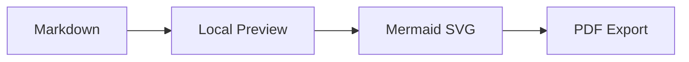
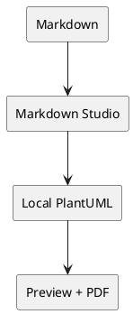

# Markdown Studio Local

## Local Summary

Preview modern Markdown and export polished PDFs without sending document content to remote renderers.

- Local Preview
- Local PDF export
- Mermaid, PlantUML, WaveDrom
- KaTeX math, tables, tasks, code
- TOC and PDF bookmarks

## Mermaid Flow



## PlantUML Components



## WaveDrom Timing

```wavedrom
{ signal: [
  { name: "clk",  wave: "p....." },
  { name: "req",  wave: "01..0." },
  { name: "ack",  wave: "0.1.0." },
  { name: "data", wave: "x.3.x.", data: ["ready"] }
]}
```

## Modern Markdown

- [x] Task lists
- Tables, footnotes, and emoji
- Syntax-highlighted code
- Local images and strict external-resource controls

| Feature | Output |
| --- | --- |
| KaTeX | $$E = mc^2$$ |
| Code | Highlighted blocks |

## PDF Output

Markdown Studio exports the same locally rendered document to PDF:

- Generated table of contents
- PDF bookmarks
- Headers and footers
- Page breaks
- Repeatable local output
