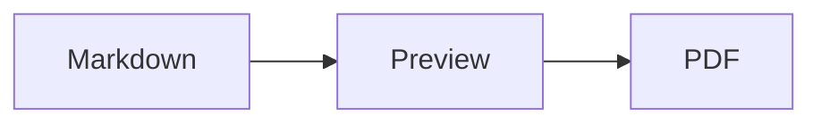
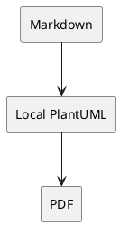

# Markdown Studio Local

## Local Summary

Preview modern Markdown and export polished PDFs without sending document content to remote renderers.

- Local Preview
- Local PDF export
- Mermaid, PlantUML, WaveDrom
- KaTeX math, tables, tasks, code
- TOC and PDF bookmarks

## Mermaid Flow



## PlantUML Components



## WaveDrom Timing

```wavedrom
{ signal: [
  { name: "clk",  wave: "p...." },
  { name: "data", wave: "x.3.x" }
]}
```

## Modern Markdown

- [x] Tasks
- Tables

| Feature | Output |
| --- | --- |
| KaTeX | $$E=mc^2$$ |

## PDF Output

Markdown Studio exports the same locally rendered document to PDF:

- PDF bookmarks
- Page numbers
- Local output
